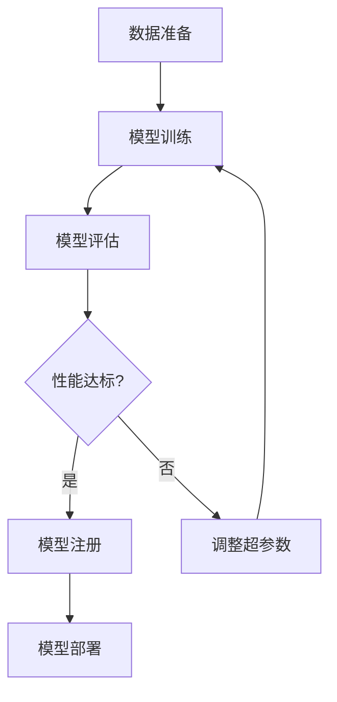

## 前言

随着人工智能和机器学习在各个行业的广泛应用，组织面临着如何高效管理ML模型生命周期的挑战。传统的DevOps实践虽然已经成熟，但如何将其扩展到机器学习领域，构建完整的MLOps(机器学习运维)流程，成为许多团队面临的新课题。

> MLOps是DevOps在机器学习领域的扩展，旨在标准化和自动化ML模型的整个生命周期，从数据准备、模型训练到部署和监控。

在本文中，我将深入探讨如何在DevOps框架中集成机器学习模型管理，构建高效的MLOps实践。

## MLOps概述

### 什么是MLOps？

MLOps(Machine Learning Operations)是将DevOps原则和实践应用于机器学习工作流的学科。它旨在通过自动化和标准化流程，解决机器学习项目中的以下挑战：

- **数据管理**：数据版本控制、数据质量保证
- **实验跟踪**：记录和复现实验结果
- **模型注册**：模型版本控制和元数据管理
- **持续训练**：自动化模型重新训练
- **持续部署**：自动化模型部署和回滚
- **持续监控**：模型性能监控和数据漂移检测

### MLOps与DevOps的关系

MLOps可以看作是DevOps在机器学习领域的扩展，但它有一些独特的挑战：

1. **数据依赖性**：ML模型高度依赖数据质量，数据变化会影响模型性能
2. **实验性**：ML开发通常涉及大量实验，需要灵活的实验管理
3. **模型复杂性**：模型比传统软件更难测试和验证
4. **监控重点**：除了传统监控，还需要监控模型性能和数据分布变化

## MLOps核心组件

### 1. 数据版本控制

在MLOps中，数据版本控制是基础。传统版本控制工具如Git不适合管理大型数据集，因此需要专门的数据版本控制工具。

::: tip
推荐工具：
- DVC (Data Version Control)：基于Git的数据版本控制工具
- Pachyderm：数据版本控制和数据流水线平台
- LakeFS：数据湖版本控制
:::

### 2. 实验跟踪

实验跟踪记录了训练过程中的各种参数、指标和结果，便于复现实验和比较不同模型。

```markdown
| 功能 | 描述 |
|------|------|
| 参数记录 | 记录超参数、配置等 |
| 指标监控 | 记录训练过程中的各种指标 |
| 模型注册 | 保存训练好的模型 |
| 可视化 | 提供实验结果的可视化界面 |
```

::: theorem
实验跟踪工具应支持与CI/CD流水线集成，实现自动化实验记录和模型注册。
:::

### 3. 模型注册

模型注册中心是存储和管理不同版本模型的仓库，类似于代码仓库但针对ML模型设计。

::: right
"模型注册中心是MLOps的'模型Git'，它解决了模型版本控制和元数据管理的核心问题。"
:::

### 4. 持续训练流水线

持续训练流水线自动化模型的训练和评估过程，当新数据可用或性能下降时自动触发重新训练。



### 5. 持续部署流水线

持续部署流水线自动化将模型部署到生产环境的过程，包括蓝绿部署、金丝雀发布等策略。

## MLOps实践指南

### 1. 建立数据流水线

数据是ML模型的基础，建立可靠的数据流水线是MLOps的第一步。

**关键实践**：
- 实施数据质量检查
- 建立数据版本控制
- 自动化数据预处理
- 监控数据分布变化

```bash
# 示例：使用DVC进行数据版本控制
dvc init
dvc add data/raw/
dvc add data/processed/
git add .
git commit -m "Add data versioning with DVC"
```

### 2. 实现实验跟踪

使用实验跟踪工具记录每次训练的详细信息。

**关键实践**：
- 记录所有超参数和配置
- 跟踪训练过程中的指标
- 保存模型和代码快照
- 提供实验比较功能

### 3. 构建模型注册中心

模型注册中心应支持版本控制、元数据管理和访问控制。

**关键实践**：
- 为每个模型版本分配唯一标识
- 记录模型性能指标和训练数据
- 实现模型访问控制
- 支持模型回滚

### 4. 自动化模型部署

实现从模型注册到生产部署的自动化流程。

**关键实践**：
- 使用CI/CD工具实现自动化部署
- 实现蓝绿部署或金丝雀发布
- 建立部署前的模型验证
- 实现部署回滚机制

### 5. 持续监控模型

模型部署后需要持续监控其性能和数据分布。

**关键实践**：
- 监控模型预测准确率
- 检测数据漂移
- 设置性能下降警报
- 定期重新评估模型

## MLOps工具栈

### 开源工具

| 工具类别 | 推荐工具 | 描述 |
|---------|---------|------|
| 数据版本控制 | DVC, Pachyderm | 管理数据集和模型版本 |
| 实验跟踪 | MLflow, Weights & Biases | 记录实验和模型 |
| 模型注册 | MLflow Registry, Seldon Core | 存储和管理模型 |
| 持续训练 | Kubeflow, Argo Workflows | 自动化模型训练 |
| 模型部署 | KServe, Seldon Core, TorchServe | 模型服务部署 |

### 商业工具

| 工具 | 提供商 | 特点 |
|------|--------|------|
| SageMaker | AWS | 全托管MLOps平台 |
| Vertex AI | Google Cloud | 端到端ML平台 |
| Azure ML | Microsoft | 云端ML服务 |
| DataRobot | DataRobot | AutoML平台 |

## MLOps挑战与解决方案

### 1. 数据管理挑战

**挑战**：
- 大规模数据存储和处理
- 数据版本控制困难
- 数据质量保证

**解决方案**：
- 使用数据湖和数据仓库
- 实施DVC等数据版本控制工具
- 建立数据质量检查流水线

### 2. 模型可重复性挑战

**挑战**：
- 环境不一致导致结果差异
- 依赖管理复杂
- 实验记录不完整

**解决方案**：
- 使用容器化技术统一环境
- 实施依赖锁定
- 使用实验跟踪工具记录完整信息

### 3. 模型监控挑战

**挑战**：
- 模型性能随时间下降
- 数据分布变化难以检测
- 监控指标不明确

**解决方案**：
- 实施持续监控和警报
- 使用统计方法检测数据漂移
- 建立全面的监控指标体系

## 结语

MLOps是DevOps在机器学习领域的自然延伸，它通过标准化和自动化流程，解决了机器学习项目中的独特挑战。随着组织越来越多地采用机器学习技术，构建高效的MLOps实践变得至关重要。

> 成功的MLOps实践不仅能提高模型开发和部署的效率，还能确保模型在生产环境中的可靠性和性能。

通过本文介绍的组件和实践，组织可以开始构建自己的MLOps框架，将机器学习从实验阶段转变为可预测、可重复的生产流程。随着技术的不断发展，MLOps将继续演进，为组织释放机器学习的全部潜力。

## 个人建议

对于刚开始实施MLOps的组织，我建议采取渐进式方法：

1. **从小规模试点开始**：选择一个关键ML项目作为试点
2. **优先解决数据管理问题**：数据是ML的基础，确保数据质量
3. **采用现有工具**：不要试图构建所有工具，利用开源和商业工具
4. **注重团队协作**：MLOps需要数据科学家和DevOps团队的紧密合作
5. **持续改进**：MLOps是一个持续演进的过程，不断收集反馈并优化流程

通过这些步骤，组织可以逐步构建成熟、高效的MLOps实践，加速机器学习价值的实现。