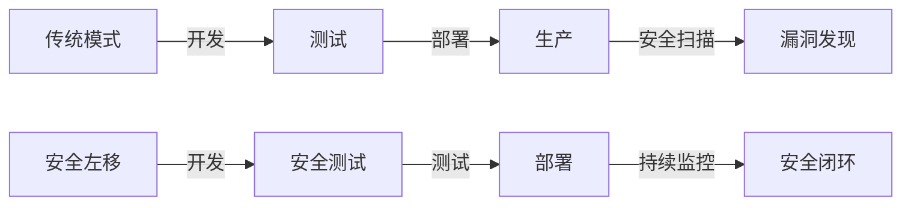

```yaml
---
title: DevOps中的安全左移：从代码到部署的全方位安全实践
date: 2026-02-06
tags: [DevSecOps, 安全左移, CI/CD安全]
---

## 前言

在DevOps的自动化浪潮中，我们常常专注于部署速度和效率，却容易让安全实践成为事后补救的"消防员"。🔥 当安全测试只在生产环境触发时，修复成本可能呈指数级增长。今天，让我们探讨如何将安全实践"左移"到开发周期的最前端，构建"安全即代码"的DevOps新范式。

::: tip
安全左移（Shift Left Security）不是简单的工具堆砌，而是一种文化理念——让每个开发者都成为第一道安全防线。
:::

## 为什么需要安全左移？

传统安全模式存在三大痛点：
1. **修复成本激增**：生产环境修复漏洞的成本是开发阶段的10-100倍
2. **交付延迟**：安全测试后置导致返工，破坏DevOps的快速交付节奏
3. **责任错位**：安全团队成为"拦路虎"，而非赋能者



## 安全左移的核心实践

### 1. 开发阶段：代码级防护

#### 静态应用安全测试（SAST）
```bash
# 示例：使用SonarQube进行SAST扫描
sonar-scanner -Dsonar.projectKey=myapp -Dsonar.projectName=MyApp
```

#### 依赖项扫描
```bash
# 示例：使用Trivy扫描容器镜像漏洞
trivy image --severity HIGH,CRITICAL myapp:latest
```

### 2. 构建阶段：自动化安全门禁

#### CI/CD流水线集成
```yaml
# GitLab CI示例
stages:
  - test
  - security

security_scan:
  stage: security
  script:
    - npm audit
    - bandit -r src/
    - semgrep --config=p/security/ src/
  only:
    - merge_requests
```

### 3. 部署阶段：运行时防护

#### 容器安全策略
```yaml
# Kubernetes Pod安全配置
apiVersion: v1
kind: Pod
metadata:
  name: secure-pod
spec:
  securityContext:
    runAsNonRoot: true
    readOnlyRootFilesystem: true
    allowPrivilegeEscalation: false
```

## 实施路线图

### 阶段一：基础建设（1-3个月）
1. 集成SAST工具（如SonarQube）
2. 建立依赖项扫描流程
3. 设置安全基线

### 阶段二：流程优化（3-6个月）
1. 将安全测试嵌入CI/CD流水线
2. 开发安全培训计划
3. 建立安全指标看板

### 阶段三：文化演进（6-12个月）
1. 推行"安全即代码"理念
2. 建立安全代码评审规范
3. 实施DevSecOps成熟度评估

## 挑战与解决方案

| 挑战 | 应对策略 |
|------|----------|
| 开发者抵触安全检查 | 简化工具链，提供即时反馈 |
| 误报导致效率下降 | 建立误报反馈机制，持续优化规则 |
| 跨团队协作困难 | 建立DevSecOps工作组，统一标准 |

> 安全左移不是增加开发负担，而是通过自动化和早期发现问题，让安全成为DevOps的加速器而非刹车片。

## 结语

安全左移是DevOps从"快速交付"到"安全交付"的关键跃迁。当安全实践像代码一样版本化、自动化和可测试时，我们才能真正实现DevOps的终极目标：在保障安全的前提下加速价值交付。🚀

::: right
"安全不是成本中心，而是质量保障的基石。"  
—— DevOps安全实践指南
:::

```