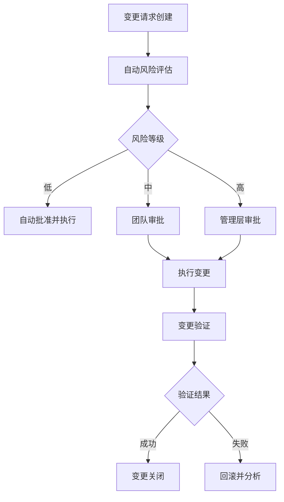

## 前言

在当今快速迭代的软件开发环境中，我们常常追求更快的发布速度和更高的部署频率。然而，随着部署频率的增加，变更带来的风险也随之上升。如何在加速交付的同时确保变更的安全性、可控性和可追溯性，成为DevOps团队面临的核心挑战。

> 变更管理不是DevOps的障碍，而是加速安全交付的赋能工具。它不是减缓速度的刹车，而是确保我们在高速行驶中仍然能够安全转弯的方向盘。

本文将深入探讨DevOps环境下的变更管理实践，帮助构建既高效又安全的软件交付体系。

## 为什么DevOps需要变更管理

传统上，变更管理被视为官僚流程，常常被DevOps实践者视为阻碍快速交付的障碍。然而，在DevOps文化中，变更管理扮演着至关重要的角色：

### 1. 风险控制

频繁的变更增加了系统失效的风险。有效的变更管理可以帮助识别潜在风险，制定缓解措施，减少生产环境事故。

### 2. 合规要求

在金融、医疗、政府等行业，合规性要求严格的变更控制流程。DevOps实践需要在速度与合规之间找到平衡。

### 3. 可追溯性

当问题发生时，清晰的变更记录可以帮助快速定位根因，加速故障恢复。

### 4. 协作与沟通

变更管理流程促进了团队间的沟通与协作，确保所有利益相关者在变更前达成共识。

::: theorem
变更管理的核心目标不是减少变更，而是提高变更的质量和可预测性，从而实现更安全、更可靠的快速交付。
:::

## 传统变更管理的局限性

传统的变更管理方法通常面临以下挑战：

### 1. 流程繁琐

传统的变更管理流程往往涉及大量文档、审批环节，导致变更周期过长，无法适应敏捷开发的需求。

### 2. 手动操作

依赖人工操作的变更管理容易出错，且难以实现大规模、高频率的变更管理。

### 3. 被动应对

传统方法往往是被动应对变更请求，缺乏主动的风险评估和预防措施。

### 4. 工具孤岛

变更管理工具与CI/CD、监控、运维等工具缺乏集成，形成信息孤岛。

## DevOps环境下的变更管理框架

为了适应DevOps的需求，我们需要重新设计变更管理框架：

### 1. 分层变更模型

将变更分为不同层级，实施不同程度的控制：

- **标准变更**：低风险、高频次的变更，可自动执行
- **正常变更**：中等风险变更，需简单审批
- **紧急变更**：高风险或紧急修复，需严格审批和监控

### 2. 变更自动化

将变更管理流程自动化，减少人工干预：



### 3. 持续验证

在变更的每个阶段实施自动化验证，确保变更质量：

- 代码审查自动化
- 变更影响分析
- 自动化测试
- 灰度发布验证
- 生产环境监控

## 自动化变更管理工具与实践

### 1. 变即代码(Change as Code)

将变更请求、审批流程、变更脚本等作为代码进行管理，实现变更的版本控制和可追溯性。

```yaml
# 示例：变更即代码配置
change_request:
  id: "CR-2026-002"
  title: "更新API服务版本至v2.1.0"
  description: "包含性能优化和安全修复"
  requester: "dev-team"
  risk_level: "medium"
  approval_required: true
  approvers: ["platform-team", "security-team"]
  
change_plan:
  pre_checks:
    - "单元测试覆盖率>80%"
    - "安全扫描通过"
    - "性能测试通过"
  
  deployment_steps:
    - "部署到staging环境"
    - "运行集成测试"
    - "灰度发布10%流量"
    - "监控指标检查"
    - "全量发布"
  
  rollback_plan:
    - "回滚至v2.0.3版本"
    - "通知用户"
    - "启动故障调查"
```

### 2. 变更影响分析工具

利用自动化工具分析变更可能带来的影响：

- **依赖关系分析**：识别变更可能影响的系统组件
- **性能影响预测**：评估变更对系统性能的影响
- **风险评估**：基于历史数据预测变更失败概率

### 3. 变即代码(Infrastructure as Code)集成

将IaC与变更管理流程集成，实现基础设施变更的可控性：

```bash
# 示例：使用Terraform进行基础设施变更管理
terraform plan -out=tfplan
# 自动化审批流程
if [ $(risk_assessment tfplan) -le "medium" ]; then
  terraform apply tfplan
else
  require_manual_approval tfplan
fi
```

## 变更风险评估与缓解策略

### 1. 风险评估模型

建立多维度风险评估模型：

| 风险维度 | 评估指标 | 风险等级 |
|---------|---------|---------|
| 技术风险 | 复杂度、依赖性、测试覆盖率 | 低/中/高 |
| 业务风险 | 影响用户数、业务连续性 | 低/中/高 |
| 安全风险 | 漏洞风险、合规要求 | 低/中/高 |
| 运维风险 | 回滚难度、监控覆盖 | 低/中/高 |

### 2. 缓解策略

针对不同风险等级采取相应缓解措施：

- **低风险变更**：自动化执行，事后审计
- **中等风险变更**：自动化执行+关键节点人工审批
- **高风险变更**：全面人工审批+分阶段实施+详细监控

### 3. 变更窗口管理

实施智能变更窗口管理，选择系统负载低、影响小的时段进行变更：

```python
# 示例：变更窗口智能选择算法
def optimal_change_window():
    # 获取历史系统负载数据
    historical_load = get_historical_system_load()
    
    # 获取 upcoming_events（即将到来的重要事件）
    upcoming_events = get_upcoming_events()
    
    # 计算最优变更窗口
    windows = calculate_windows(historical_load, upcoming_events)
    
    # 返回风险最低的窗口
    return min(windows, key=lambda x: x['risk_score'])
```

## 变更管理与CI/CD流水线的集成

将变更管理无缝集成到CI/CD流水线中，实现从代码提交到生产部署的全流程管控：

### 1. 阶门(Stage Gate)模式

在CI/CD流水线中设置多个阶段门，每个阶段门都有明确的准入和准出标准：


### 2. 自动化质量门

实施自动化质量门，只有满足所有质量标准的变更才能进入下一阶段：

```yaml
quality_gates:
  - name: "代码质量"
    checks:
      - "静态分析: 无高危漏洞"
      - "代码复杂度: 圈复杂度<10"
      - "代码覆盖率: >80%"
  
  - name: "性能质量"
    checks:
      - "性能测试: 响应时间<200ms"
      - "负载测试: 1000并发用户通过"
      - "资源使用: CPU<70%, 内存<80%"
  
  - name: "安全质量"
    checks:
      - "安全扫描: 无严重漏洞"
      - "依赖项检查: 无已知漏洞"
      - "合规检查: 通过所有安全策略"
```

### 3. 变即代码(Change as Code)与CI/CD集成

将变更管理流程代码化，并集成到CI/CD工具中：

```yaml
# 示例：GitHub Actions中的变更管理集成
name: DevOps Change Management

on:
  pull_request:
    types: [opened, synchronize]

jobs:
  assess-change:
    runs-on: ubuntu-latest
    steps:
      - name: Checkout code
        uses: actions/checkout@v2
        
      - name: Assess change risk
        id: risk-assessment
        uses: devops/risk-assessment-action@v1
        with:
          change_type: ${{ github.event.pull_request.merged }}
          files_changed: ${{ github.event.pull_request.files }}
          
      - name: Set approval requirement
        if: steps.risk-assessment.outputs.risk_level == 'high'
        run: |
          echo "requires_approval=true" >> $GITHUB_ENV
          
      - name: Request approval
        if: env.requires_approval == 'true'
        uses: devops/approval-action@v1
        with:
          approvers: "platform-team,security-team"
          
  execute-change:
    needs: assess-change
    runs-on: ubuntu-latest
    if: needs.assess-change.outputs.approved == 'true'
    steps:
      - name: Deploy to production
        run: |
          # 执行部署逻辑
```

## 变更管理中的最佳实践

### 1. 变更可视化

实施变更仪表板，实时展示变更状态、风险指标和历史趋势：


### 2. 变更回滚机制

建立快速回滚机制，确保在变更失败时能够迅速恢复：

```bash
# 示例：自动化回滚脚本
rollback() {
  local environment=$1
  local service=$2
  
  echo "开始回滚 $service 在 $environment 环境的变更..."
  
  # 执行回滚操作
  kubectl rollout undo deployment/$service --namespace=$environment
  
  # 验证回滚结果
  if verify_rollback $service $environment; then
    echo "回滚成功完成"
    notify_stakeholders "回滚成功" $service $environment
  else
    echo "回滚失败，需要手动干预"
    notify_oncall "回滚失败" $service $environment
  fi
}
```

### 3. 变更学习与改进

建立变更后评估机制，从每次变更中学习并改进流程：

```yaml
post_change_review:
  checklist:
    - "变更目标达成度"
    - "意外问题及处理"
    - "流程效率评估"
    - "团队协作反馈"
    - "改进建议收集"
  
  metrics:
    - "变更成功率"
    - "平均变更时间"
    - "变更失败率"
    - "回滚频率"
```

## 案例研究：Netflix的变更管理实践

Netflix作为DevOps的先驱，其变更管理实践值得借鉴：

### 1. 混沌工程与变更管理

Netflix将混沌工程与变更管理结合，主动测试变更的弹性：

```python
# 示例：Netflix的Chaos Monkey集成变更管理
def chaos_test_before_change(change_request):
    # 在变更前注入故障
    inject_failure(change_request.affected_components)
    
    # 监控系统响应
    metrics = monitor_system()
    
    # 评估系统弹性
    if evaluate_resilience(metrics):
        approve_change(change_request)
    else:
        reject_change(change_request, "系统无法承受预期故障")
```

### 2. 自动化金丝雀发布

Netflix使用自动化金丝雀发布来控制变更风险：

```yaml
canary_deployment:
  strategy: "渐进式发布"
  steps:
    - "部署到1%流量"
    - "监控关键指标30分钟"
    - "如果指标正常，增加到10%"
    - "再监控30分钟"
    - "如果指标正常，增加到50%"
    - "最终部署到100%"
  
  rollback_trigger:
    "错误率>5% 或 响应时间增加50%"
```

## 未来趋势与挑战

### 1. AI驱动的变更管理

人工智能将在变更管理中发挥越来越重要的作用：

- **智能风险评估**：利用机器学习预测变更风险
- **自动化决策**：基于历史数据自动批准低风险变更
- **根因分析**：AI辅助分析变更失败的根本原因

### 2. GitOps与变更管理

GitOps模式将改变变更管理的实践方式：

- 所有变更通过Git进行管理
- 自动化验证和部署流程
- 声明式基础设施管理

### 3. 多云环境下的变更管理

随着多云环境的普及，变更管理面临新的挑战：

- 跨云平台的一致性变更管理
- 云服务特定变更的处理
- 云成本优化与变更的平衡

## 结语

在DevOps实践中，变更管理不是速度的障碍，而是安全加速的保障。通过构建现代化的变更管理框架，将自动化、智能化的变更控制融入CI/CD流水线，我们可以在保持快速交付的同时，确保变更的安全性和可靠性。

记住，最好的变更管理是看不见的变更管理——它无缝融入开发流程，为团队提供安全保障，而不增加额外负担。随着DevOps实践的不断发展，变更管理也将继续演进，帮助我们构建更加安全、可靠、高效的软件交付体系。

> 在快速迭代的时代，不是"变更或不变更"的问题，而是"如何安全地变更"的问题。优秀的变更管理，让我们能够既拥抱变化，又掌控变化。

---

希望这篇关于DevOps中变更管理的文章能够为您的技术博客增添有价值的内容。变更管理作为DevOps实践中的关键环节，值得深入探讨和实践。