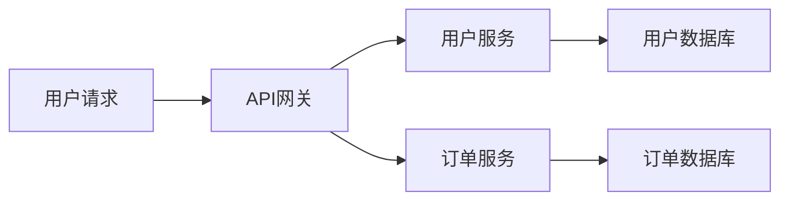

## 前言

最近，我负责的系统从单体架构迁移到了微服务架构，原本运行良好的监控系统突然变得力不从心。🤷‍♂️ 当一个用户请求需要在多个服务间流转时，传统的日志分析方法就像在茫茫大海中捞针一样困难。~~这感觉就像试图在一场大雨中找出哪一滴雨水导致了洪水~~。

分布式系统的复杂性使得传统的监控方法捉襟见肘，而分布式追踪与监控技术应运而生，为我们提供了系统可观测性的强大工具。今天，我想和大家分享我在构建分布式追踪系统过程中的一些实践经验。

## 什么是分布式追踪与监控？

### 分布式追踪的定义

分布式追踪是一种用于分析和监控分布式系统行为的机制。它通过追踪请求在系统各组件间的流转路径，帮助开发者理解系统的行为、定位性能瓶颈和故障原因。

::: tip
分布式追踪的核心思想是：为每个请求分配一个唯一的追踪ID，并在系统各组件间传递这个ID，记录请求在每个组件的处理时间和状态。
:::

### 分布式监控的范畴

分布式监控则更广泛，包括：
- **指标收集**：收集系统的性能数据（如响应时间、吞吐量、错误率等）
- **日志聚合**：集中收集和分析各服务的日志
- **分布式追踪**：追踪请求在系统间的流转路径
- **链路分析**：基于追踪数据进行可视化分析和性能优化

## 分布式追踪的核心概念

### 追踪(Trace)

一个追踪代表一个请求从发起方到接收方的完整执行路径。例如，一个Web请求可能涉及前端、API网关、多个微服务和数据库操作。



### 跨度(Span)

跨度是追踪中的一个基本工作单元，代表系统中的一个操作或步骤。每个跨度包含：
- 操作名称
- 开始时间
- 结束时间
- 关键值对形式的标签
- 事件列表
- 跨度引用（父子关系）

### 追踪上下文

为了将不同服务中的跨度关联起来，需要传递追踪上下文。这通常包含：
- 追踪ID(Trace ID)
- 跨度ID(Span ID)
- 采样标志(Sampling Flags)

## 主流分布式追踪技术对比

| 技术 | 开发者 | 特点 | 适用场景 |
|------|--------|------|----------|
| Jaeger | Uber | 开源，与Zipkin兼容，支持多种后端存储 | 大规模分布式系统 |
| Zipkin | Twitter | 开源，简单易用，UI友好 | 中小型系统，快速集成 |
| SkyWalking | Apache基金会 | 功能丰富，支持APM，自动发现依赖关系 | 复杂微服务架构 |
| Pinpoint | NAVER | 高性能，支持多种插件，丰富的UI功能 | Java应用为主 |
| OpenTelemetry | CNCF | 新一代标准，厂商中立，可插拔架构 | 需要长期维护的系统 |

::: theorem
选择分布式追踪技术时，应考虑团队技术栈、系统规模、性能要求和社区支持等因素。没有绝对的"最佳"方案，只有最适合当前业务场景的选择。
:::

## 构建分布式追踪系统的实践

### 1. 技术选型

在我们的项目中，我选择了OpenTelemetry作为标准，Jaeger作为后端存储和可视化界面。主要原因：

- OpenTelemetry是CNCF的托管项目，未来可期
- 支持多种编程语言，便于多语言系统使用
- 与主流云服务提供商的集成日益完善
- Jaeger提供了成熟的存储和查询能力

### 2. 集成OpenTelemetry

#### 2.1 初始化追踪器

```java
// Java示例
OpenTelemetry openTelemetry = OpenTelemetrySdk.builder()
    .setTracerProvider(tracerProvider)
    .setMeterProvider(meterProvider)
    .build();
```

#### 2.2 创建和传播跨度

```java
// 创建根跨度
Span span = tracer.spanBuilder("process-request")
    .setStartTimestamp(Instant.now())
    .setAttribute("user.id", userId)
    .startSpan();

try (Scope scope = span.makeCurrent()) {
    // 业务逻辑
    processBusinessLogic();
} catch (Exception e) {
    // 记录异常
    span.recordException(e);
    throw e;
} finally {
    span.end();
}
```

### 3. 自定义指标收集

除了追踪，我们还收集了以下关键指标：

```java
// 计量器示例
DoubleCounter requestCounter = meters.counterBuilder("http.requests.total")
    .setDescription("Total number of HTTP requests")
    .setUnit("1")
    .build();

// 直方图示例
DoubleHistogram requestDuration = meters.histogramBuilder("http.request.duration")
    .setDescription("Duration of HTTP requests in milliseconds")
    .setUnit("ms")
    .build();
```

### 4. 日志关联

为了将日志与追踪数据关联，我们采用了以下策略：

1. 在日志中输出追踪ID和跨度ID
2. 使用结构化日志格式（如JSON）
3. 配置日志收集器（如ELK）支持追踪ID过滤

```json
{
  "timestamp": "2023-11-15T10:30:00Z",
  "level": "INFO",
  "message": "Processing user request",
  "traceId": "0af7651916cd43dd8448eb211c80319c",
  "spanId": "b7ad6b7169203331",
  "service": "user-service"
}
```

## 分布式监控的最佳实践

### 1. 建立监控金字塔


::: right
*图片来源: Martin Fowler*
:::

监控金字塔模型告诉我们应该关注不同层次的指标：
- **基础层**：基础设施监控（CPU、内存、网络等）
- **服务层**：服务健康状态、吞吐量、延迟等
- **业务层**：业务指标（如用户增长率、转化率等）

### 2. 设置合理的告警策略

避免告警疲劳的关键是：

- 区分告警级别（紧急、警告、信息）
- 设置合理的阈值和持续时间
- 实施告警抑制和降噪机制
- 确保告警包含足够的上下文信息

### 3. 可视化与仪表盘

良好的可视化能帮助团队快速理解系统状态。我们构建了以下仪表盘：

1. **系统健康概览**：显示整体系统状态和关键指标
2. **服务依赖关系图**：可视化服务间的调用关系
3. **请求流量热力图**：展示不同时间段的请求分布
4. **错误追踪分析**：按错误类型和频率分类展示

## 遇到的挑战与解决方案

### 挑战1：追踪数据量过大

随着系统规模扩大，追踪数据量急剧增长，导致存储成本上升和查询性能下降。

**解决方案**：
- 实施采样策略，对非关键路径的请求进行采样
- 分层存储，热数据使用高性能存储，冷数据归档
- 数据聚合，定期对原始数据进行预聚合

### 挑战2：多语言环境集成困难

我们的系统使用了多种编程语言（Java、Go、Python、Node.js），不同语言库的成熟度和API不一致。

**解决方案**：
- 统一使用OpenTelemetry API，确保跨语言一致性
- 为每种语言建立专门的集成指南和最佳实践
- 创建共享的追踪规范文档，确保所有团队遵循相同标准

### 挑战3：业务逻辑与监控代码耦合

初期，我们将监控代码直接嵌入业务逻辑，导致代码耦合度高，维护困难。

**解决方案**：
- 采用面向切面的编程（AOP）技术，将监控代码与业务逻辑分离
- 使用中间件模式，在请求处理链中自动添加监控
- 建立监控代码规范，明确监控点的选择和指标定义

## 未来展望

随着我们系统的不断演进，分布式追踪与监控也在持续发展：

1. **AI辅助分析**：利用机器学习技术自动识别异常模式和性能瓶颈
2. **实时预测**：基于历史数据预测系统未来可能出现的性能问题
3. **混沌工程集成**：将分布式追踪与混沌工程结合，提高系统韧性
4. **云原生追踪**：更好地适应容器化和Serverless架构

## 结语

分布式追踪与监控是构建可靠分布式系统的基石。通过本文分享的实践经验，希望能够帮助大家在各自的系统中建立有效的可观测性能力。记住，监控不是一次性的项目，而是一个持续演进的过程。随着系统复杂度的增加，我们的监控策略也需要不断调整和优化。

正如我常说的："如果你不能测量它，你就不能改进它。" 📊 在分布式系统的世界里，这句话尤为重要。

> 分布式追踪不是银弹，但它能将不可见的系统行为变得透明，这是构建和维护复杂系统的关键能力。

---

希望这篇分享对你有所帮助！如果你有任何问题或经验交流，欢迎在评论区留言讨论。👇