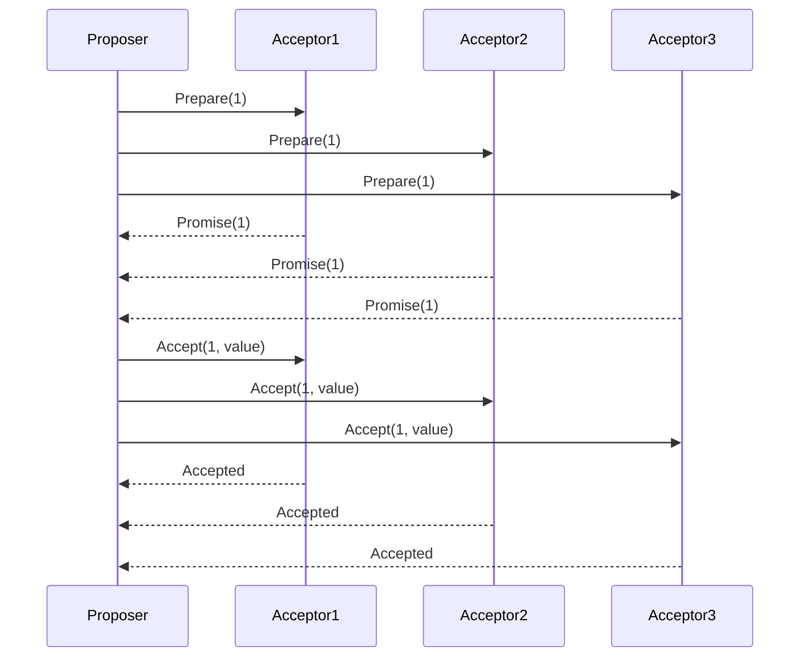
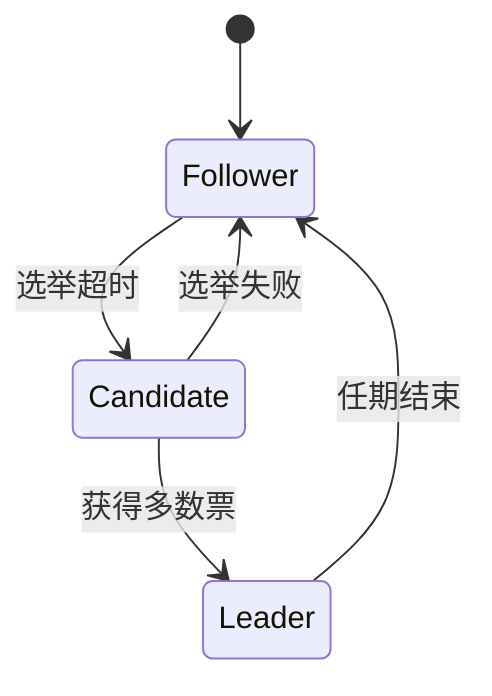

```markdown
---
title: 分布式系统的一致性协议：Paxos与Raft
date: 2023-10-15 14:30:00
permalink: /pages/distributed-systems-consistency-protocols/
categories: 
  - 分布式系统
tags:
  - 一致性协议
  - Paxos
  - Raft
  - 分布式算法
author: 
  name: Jorgen
  link: https://github.com/jorgen-zhao
---

## 前言

在分布式系统的世界里，数据一致性就像"薛定谔的猫"一样令人着迷 🤔。我们之前聊过CAP理论和BASE原则，它们告诉我们"一致性"是多么珍贵又难以捉摸的资源。但理论终究是理论，实际系统中我们到底该如何保证多个节点数据的一致性呢？今天我们就来聊聊分布式系统中的"一致性协议"这个硬核话题！

> 💡 **一致性协议**：分布式系统中用于在多个节点间达成共识的算法集合，是分布式系统的"宪法"。

## 分布式一致性的挑战

想象一个场景：我们有三台数据库服务器，一个用户在上海修改了地址信息，这个变更需要同步到北京和深圳的服务器上。问题来了：

1. **网络分区**：如果北京服务器突然断网怎么办？
2. **节点故障**：如果深圳服务器宕机又重启，数据怎么恢复？
3. **性能瓶颈**：每次修改都要等所有节点确认，用户会不会等得抓狂？

::: tip
分布式一致性协议的核心目标：在"部分节点故障"和"网络延迟"的条件下，保证所有节点的数据最终达成一致。
:::

## Paxos：优雅但复杂的解决方案

### Paxos简介

Paxos算法由Leslie Lamport于1990年提出，是第一个被证明的、能在异步系统中保证安全性的共识算法。它由两个阶段组成：

1. **准备阶段**：Proposer向所有Acceptor发送提案编号
2. **接受阶段**：Acceptor响应并承诺接受编号最大的提案



### Paxos的优缺点

**优点**：
- 数学证明严谨，理论安全性有保障
- 能处理任意数量的节点故障

**缺点**：
- 实现极其复杂，连Lamport自己都说："The part of the protocol that is difficult is not the proof; it is the implementation."
- 效率较低，需要多轮通信
- 难以理解，有"Paxos can live with Byzantine failures"的调侃 😂

::: theorem
Paxos定理：在存在消息丢失、延迟和重复，以及节点故障的异步系统中，只有满足以下条件才能达成共识：
1. 只有被大多数节点接受的值才可能被选择
2. 每个节点最多只能选择一个值
:::

## Raft：让共识算法变得可理解

### Raft简介

2014年，Diego Ongaro和John Ousterhout提出了Raft算法，目标是让共识算法变得"可理解"。它将问题分解为三个核心部分：

1. **领导选举**：选出Leader节点
2. **日志复制**：Leader将日志复制到所有节点
3. **安全性**：保证系统安全性



### Raft的工作流程

1. **选举阶段**：
   - 节点启动为Follower状态
   - 等待Leader心跳，超时后转为Candidate
   - Candidate向其他节点投票请求
   - 获得多数票的节点成为Leader

2. **日志复制阶段**：
   - Leader接收客户端写请求
   - 将日志条目追加到本地日志
   - 通过AppendEntries RPC将日志复制到所有节点
   - 当大多数节点确认后，提交日志

3. **安全性保证**：
   - 选举限制：只有包含已提交日志的节点才能成为Leader
   - 日志匹配：Leader只能向Follower发送自己日志中存在的条目
   - Leader完整性：Leader永远不会覆盖已提交的日志

### Raft的优缺点

**优点**：
- 设计清晰，状态机模型易于理解
- 强Leader简化了日志复制逻辑
- 有丰富的可视化工具（如Raft Visualization）
- 已在多个生产系统中应用（如etcd, Consul）

**缺点**：
- 依赖时间同步（虽然Paxos也依赖）
- 在小集群中性能可能不如Paxos优化方案

## Paxos vs Raft：一场优雅与实用的较量

| 特性         | Paxos                     | Raft                      |
|--------------|---------------------------|---------------------------|
| 设计目标     | 理论严谨性               | 可理解性                 |
| 实现复杂度   | 极高 🤯                   | 中等 📚                   |
| 性能         | 较低                     | 较高                     |
| 应用案例     | Chubby, Google Spanner   | etcd, Consul             |
| 学习曲线     | 陡峭 🧗‍♂️                  | 平缓 🚶‍♂️                  |

> 🤔 **个人观点**：Raft的"可理解性"革命性地降低了分布式系统的开发门槛。就像从汇编语言进化到高级语言，虽然Paxos在理论上更优雅，但Raft让更多人能够构建可靠的分布式系统。

## 结语

分布式一致性协议是分布式系统的基石，Paxos和Raft代表了两种不同的哲学：一个是理论上的完美，另一个是实践中的实用。在云原生时代，我们见证了Raft的崛起——从etcd到Kubernetes，从Consul到TiKV，Raft正在构建着现代分布式世界的基础设施。

::: right
"分布式系统的艺术在于在不可靠的组件上构建可靠的系统" —— Pat Helland
::>

对于开发者来说，理解这些协议不仅是技术能力的提升，更是思维方式的转变：从"追求完美"到"权衡取舍"，从"单机思维"到"分布式思维"。下次当你设计分布式系统时，不妨思考：你的系统需要什么样的"宪法"来保证一致性？

---

**个人建议**：如果正在构建新的分布式系统，建议从Raft入手；如果研究分布式理论，Paxos仍然值得深入学习。毕竟，在分布式世界里，没有银弹，只有最适合的权衡。🏗️