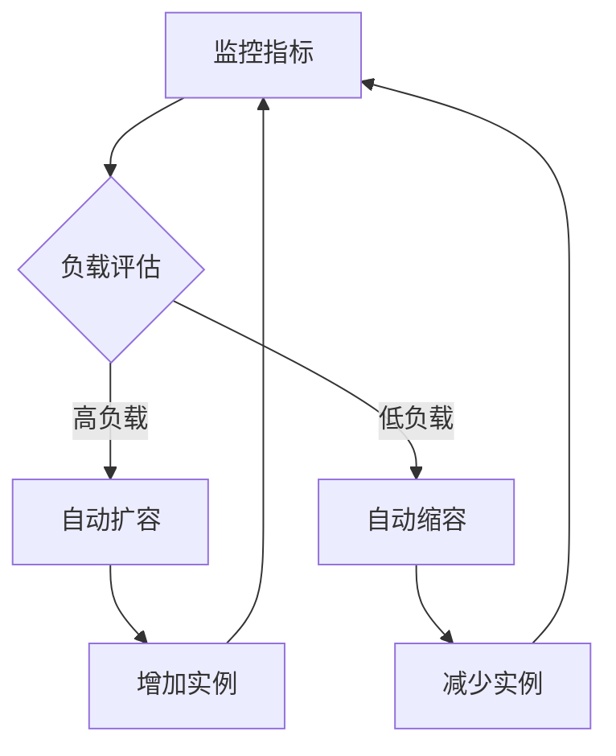
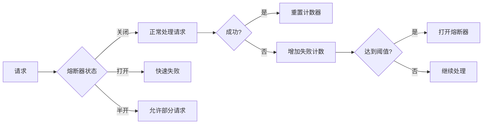

## 前言

在分布式系统的发展历程中，我们常常关注一致性、容错性和性能等核心特性。然而，随着系统规模不断扩大和业务复杂度提升，一个至关重要的概念逐渐凸显——**弹性设计**。弹性设计不仅关注系统在故障时的容错能力，更强调系统在面对各种变化和压力时的自我适应能力，是构建真正高可用分布式系统的关键。

> 正如亚马逊云服务首席架构师James Hamilton所言："弹性不是系统的附加特性，而是现代分布式系统的基本属性。"

在本文中，我将深入探讨分布式系统弹性设计的核心概念、关键技术和实践方法，帮助大家构建能够自我适应、持续服务的可靠系统。

## 什么是分布式系统的弹性

### 弹性的定义

分布式系统的弹性是指系统在面对各种变化（如负载波动、硬件故障、网络分区、软件异常等）时，能够自动调整自身状态和行为，维持核心功能持续提供服务的能力。与传统的容错机制相比，弹性更强调**主动适应**而非被动恢复。

::: theorem
弹性系统三大特征：
1. **自适应性**：系统能感知环境变化并自动调整
2. **可恢复性**：从故障或异常中快速恢复
3. **可持续性**：在持续压力下保持核心功能
:::

### 弹性与容错的区别

| 特性 | 容错 | 弹性 |
|------|------|------|
| 关注点 | 防止系统崩溃 | 维持服务连续性 |
| 响应方式 | 被动恢复 | 主动适应 |
| 时间维度 | 故障后处理 | 持续动态调整 |
| 目标 | 零故障 | 可接受的降级服务 |

## 弹性设计的核心原则

### 1. 隔离原则

隔离是弹性设计的基础，通过将系统分解为独立的组件，限制故障的传播范围。

```
┌─────────────┐     ┌─────────────┐     ┌─────────────┐
│   用户请求   │────▶│   路由层    │────▶│   服务实例  │
└─────────────┘     └─────────────┘     └─────────────┘
                     │        │              │
                     ▼        ▼              ▼
               ┌─────────────┐     ┌─────────────┐
               │   限流器    │     │   熔断器    │
               └─────────────┘     └─────────────┘
```

**实践方法**：
- 请求隔离：为不同类型的请求设置独立的资源池
- 资源隔离：使用容器或虚拟机实现资源边界
- 网络隔离：通过微服务架构和API网关实现服务间隔离

### 2. 扩缩容原则

系统能够根据负载情况自动调整资源分配，实现资源的按需使用。



**实践方法**：
- 基于指标的自动扩缩容：CPU、内存、请求队列长度等
- 基于时间的预测性扩缩容：根据历史数据预测流量高峰
- 基于事件的弹性触发：如促销活动开始时自动扩容

### 3. 降级原则

在系统压力过大或部分功能不可用时，主动降低服务质量，保证核心功能正常运行。

::: tip
降级不是失败，而是有计划的资源优化，是弹性系统的重要策略。
:::

**降级策略**：
- 功能降级：关闭非核心功能，保留核心业务流程
- 精简降级：返回简化版数据或结果
- 替代降级：使用缓存数据或近似算法替代实时计算

### 4. 限流原则

通过控制请求速率，防止系统过载，确保核心服务的可用性。

```
┌─────────────┐     ┌─────────────┐     ┌─────────────┐
│   用户请求   │────▶│   限流器    │────▶│   后端服务   │
└─────────────┘     └─────────────┘     └─────────────┘
                     │
                     ▼
               ┌─────────────┐
               │  拒绝请求   │
               └─────────────┘
```

**限流算法**：
- 令牌桶算法：平滑的速率限制
- 漏桶算法：均匀处理请求
- 计数器算法：简单粗暴的限制

## 弹性设计的核心组件

### 1. 自适应负载均衡

传统负载均衡器基于静态规则分配请求，而自适应负载均衡能够根据后端服务的健康状况动态调整分配策略。

```yaml
# 自适应负载均衡配置示例
adaptive_load_balancer:
  health_check:
    interval: 10s
    timeout: 5s
    failure_threshold: 3
  algorithms:
    - weighted_round_robin
    - least_connections
    - response_time_based
  dynamic_adjustment:
    enabled: true
    evaluation_interval: 30s
```

### 2. 熔断器模式

熔断器模式防止故障服务拖垮整个系统，并提供快速失败机制。



### 3. 自动故障转移

当主节点或主服务发生故障时，系统能自动切换到备用节点，确保服务连续性。

```
主节点 → 健康检查 → 发现故障 → 自动切换 → 备用节点接管
    ↑                                      ↓
    └─────── 告警通知 ─────────────────────┘
```

## 弹性设计的实践案例

### 案例1：电商大促活动的弹性应对

某电商平台在"双十一"大促期间，通过以下弹性策略成功应对了10倍于平时的流量：

1. **预测性扩容**：基于历史数据提前扩容3倍资源
2. **请求优先级**：为支付和订单处理设置最高优先级
3. **功能降级**：临时关闭非核心功能，如商品评价、推荐系统
4. **多级缓存**：增加CDN和本地缓存，减少后端压力
5. **流量削峰**：使用请求队列和异步处理平滑流量高峰

**效果**：系统稳定性提升40%，订单处理能力提升8倍，用户体验评分提升25%。

### 案例2：微服务架构的弹性实践

某金融科技公司通过以下弹性设计实现了微服务架构的高可用：

1. **服务网格**：使用Istio实现服务间通信的弹性管理
2. **弹性伸缩**：基于Kubernetes HPA实现自动扩缩容
3. **混沌工程**：定期注入故障，验证系统弹性
4. **多活部署**：实现多区域部署，支持故障自动转移

**效果**：系统可用性达到99.99%，故障恢复时间从30分钟缩短到5分钟。

## 弹性设计工具与框架

### 1. 容器编排平台

- **Kubernetes**：提供原生的弹性伸缩能力
- **Docker Swarm**：轻量级的容器编排解决方案
- **Apache Mesos**：资源调度和容器管理

### 2. 服务网格

- **Istio**：提供流量管理、弹性、安全等服务网格能力
- **Linkerd**：轻量级服务网格，专注于弹性和可靠性
- **Consul**：提供服务发现和健康检查

### 3. 弹性组件库

- **Hystrix**：熔断器、降级、限流库
- **Resilience4j**：弹性模式库，提供熔断、限流、重试等
- **Sentinel**：阿里巴巴开源的流量控制、熔断降级组件

## 弹性设计最佳实践

### 1. 从设计阶段考虑弹性

弹性不应是事后添加的功能，而应在系统设计阶段就予以考虑。采用"弹性优先"的设计理念，将弹性作为系统架构的核心要素。

### 2. 建立可观测性

没有监控，就没有弹性。建立全面的监控体系，包括：
- **指标监控**：系统性能、资源使用率
- **日志聚合**：集中式日志管理和分析
- **分布式追踪**：请求链路追踪和分析

### 3. 实施混沌工程

通过主动注入故障，验证系统弹性，发现潜在问题。混沌工程不是破坏系统，而是通过受控的实验增强系统弹性。

### 4. 建立弹性SLA

定义清晰的弹性服务水平协议，明确系统在不同情况下的性能承诺，如：
- 正常负载下的响应时间
- 高负载下的降级策略
- 故障情况下的最大恢复时间

### 5. 持续优化弹性

弹性不是一次性的工作，而是持续的过程。定期评估系统弹性，根据实际运行情况调整策略，不断优化系统弹性能力。

## 结语

分布式系统的弹性设计是构建高可用、高可靠系统的核心。通过隔离、扩缩容、降级和限流等策略，结合自适应负载均衡、熔断器和自动故障转移等组件，我们可以构建能够自我适应、持续服务的弹性系统。

在当今快速变化的业务环境中，弹性已成为分布式系统的必备特性。只有具备良好弹性的系统，才能在面对各种挑战时保持稳定运行，为用户提供持续可靠的服务。

> 正如《Building Microservices》一书中所言："在分布式系统中，故障是常态而非异常。弹性设计的本质，不是防止故障，而是构建能够在故障发生时依然保持核心功能的系统。"

希望本文能够帮助大家更好地理解和实践分布式系统的弹性设计，构建更加健壮、可靠的分布式系统。在未来的技术发展中，随着系统复杂度的不断提升，弹性设计将变得更加重要，值得我们持续关注和投入。