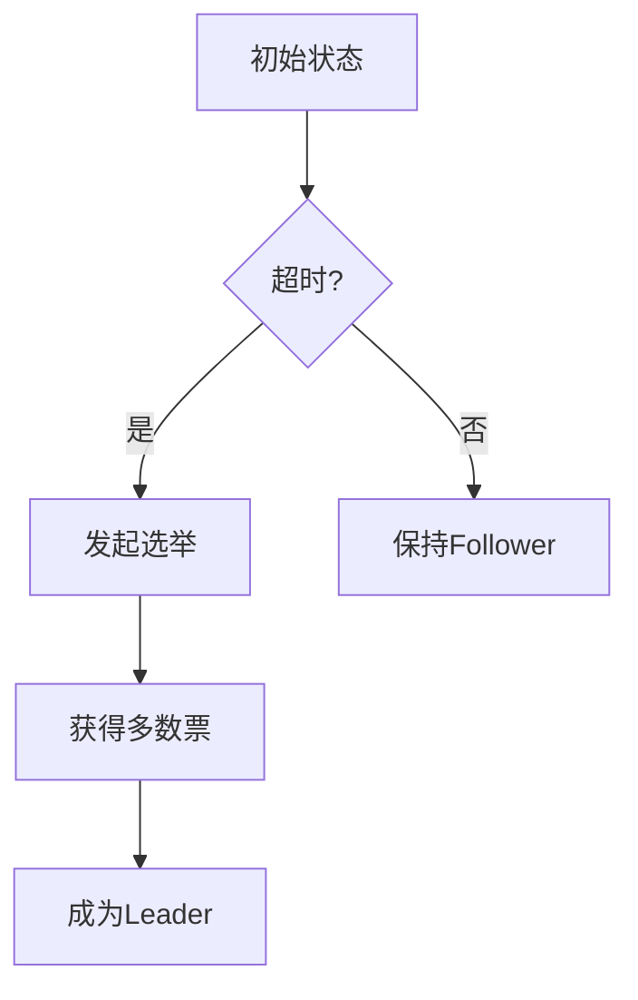

## 前言

在分布式系统领域，我们经常听到CAP理论告诉我们无法同时满足一致性、可用性和分区容错性。但理论归理论，实际系统到底如何实现一致性呢？🤔 CAP理论像一张地图，但真正的"交通工具"其实是各种一致性算法。今天我们就来探索分布式系统中最核心的"导航系统"——一致性算法。

::: tip
"分布式一致性算法就像分布式系统的宪法，定义了系统在极端情况下的行为准则。"
:::

## 分布式一致性的挑战

在单机系统中，数据一致性相对简单。但在分布式系统中，由于节点间的网络延迟、节点故障和消息丢失等问题，保证所有节点数据一致变得异常复杂。

- **网络分区**：节点间通信中断
- **节点故障**：服务器宕机
- **消息乱序**：网络包到达顺序不确定
- **脑裂问题**：多个主节点同时存在

> 这些挑战催生了一批经典的一致性算法，它们试图在不可靠的网络中构建可靠的共识。

## Paxos算法：分布式系统的"珠穆朗玛峰"

### 算法概述

Paxos算法由Leslie Lamport于1990年提出，是第一个被证明的正确性的一致性算法。它由两个阶段组成：

1. **Prepare阶段**：Proposer向所有Acceptor发送提案编号
2. **Accept阶段**：Acceptor接受编号最大的提案

### 核心角色

- **Proposer**：提案发起者
- **Acceptor**：提案接收者
- **Learner**：学习最终结果的节点

### 实际应用

- Google的Chubby锁服务
- AWS的DynamoDB内部一致性机制

### Paxos的困境

尽管Paxos在理论上完美，但实际应用中却困难重重：

- 难以理解和实现
- 活锁问题（多个Proposer互相阻塞）
- 缺乏工程化指导

~~Lamport自己也承认"Paxos是最难理解的算法之一"~~

## Raft算法：让一致性算法变得可理解

### 设计目标

Diego Ongaro和John Ousterhout在2013年提出Raft算法，目标是：

1. 提供足够清晰的理解
2. 便于构建实际的系统
3. 保证安全性

### Raft核心机制

#### 1. 领导者选举

- 所有节点初始为Follower状态
- 超时未收到心跳，发起选举
- 获得多数票的节点成为Leader



#### 2. 日志复制

- Leader处理客户端请求
- 将日志条目复制到所有Follower
- 当大多数节点确认后，提交日志

#### 3. 安全性保证

- 选举限制：只有包含已提交日志的节点才能当选Leader
- 日志匹配：Leader不会覆盖已提交的日志
- 状态机安全：不同节点按相同顺序应用相同日志

### Raft vs Paxos对比

| 特性         | Paxos                  | Raft                     |
|--------------|------------------------|--------------------------|
| 可理解性     | 极低                   | 高                       |
| 实现复杂度   | 极高                   | 中等                     |
| 工程化支持   | 有限                   | 丰富（etcd、Consul等）   |
| 活锁问题     | 存在                   | 通过选举超时避免         |
| 领导者选举   | 未明确规定             | 明确算法                 |

## 实际系统中的Raft

### etcd

- Kubernetes的底层存储
- 基于Raft实现高可用键值存储
- 提供强一致性保证

### Consul

- HashiCorp的服务发现工具
- 使用Raft实现集群一致性
- 提供KV存储和健康检查

### TiDB

- 分布式数据库
- 使用Raft实现分布式事务
- 保证跨节点数据一致性

## 结语

分布式一致性算法是分布式系统的基石，从理论严谨的Paxos到工程友好的Raft，算法的演进反映了理论与实践的平衡。Raft通过将问题分解为领导者选举、日志复制和安全保证三个清晰的部分，大大降低了分布式系统的实现门槛。

::: right
"一致性不是目的，而是手段。真正的目标是构建在不可靠基础设施上仍能可靠运行的系统。"
:::

在实际项目中，我们不必从零实现这些算法。选择成熟的一致性库（如etcd、Consul）往往更明智。但理解这些算法原理，能帮助我们更好地设计分布式系统，在遇到问题时知道如何诊断和解决。

> 分布式系统的魅力在于，它将计算机科学中最深刻的挑战（如拜占庭将军问题）转化为实际可用的解决方案。而一致性算法，正是这些解决方案中最璀璨的明珠之一。

## 个人建议

1. **先理解Raft再尝试Paxos**：Raft的学习曲线更友好
2. **动手实践**：尝试用Raft实现一个简单的KV存储
3. **阅读源码**：etcd的Raft实现是极好的学习材料
4. **关注工程化细节**：日志压缩、快照、成员变更等

分布式一致性算法就像分布式系统的"宪法"，定义了系统在极端情况下的行为准则。掌握它，你就掌握了构建可靠分布式系统的钥匙！🔑
```