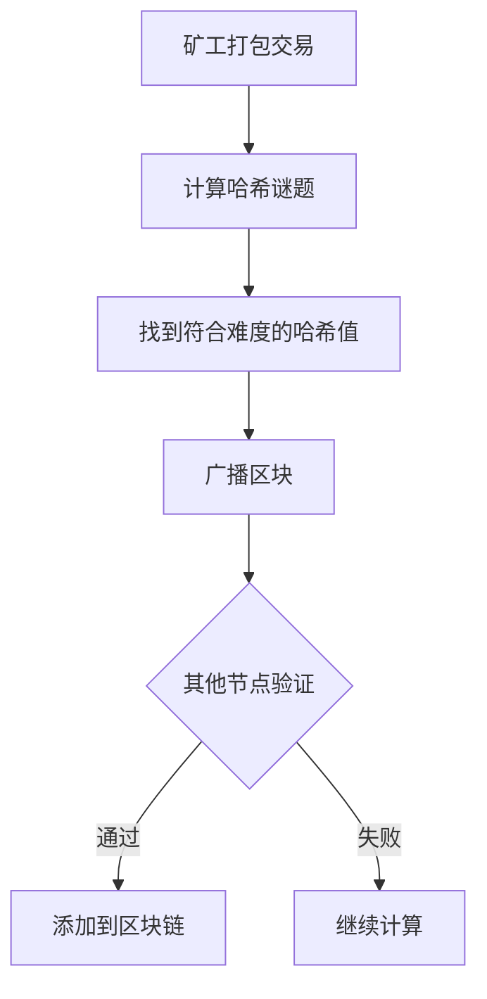

## 前言

区块链技术作为分布式系统最前沿的应用之一，其核心在于如何在没有中心化机构的情况下达成系统共识。在分布式系统领域，我们已经深入研究了Paxos、Raft等经典共识算法，但这些算法在区块链这一特殊场景下面临哪些挑战？又有哪些创新性解决方案？本文将探讨共识算法在区块链中的演进与应用。

::: tip
"区块链的本质是分布式共识在特定场景下的应用，它将抽象的算法转化为可落地的信任机制。"
:::

## 区块链共识的特殊性

区块链环境与传统分布式系统存在显著差异：

| 特性 | 传统分布式系统 | 区块链系统 |
|------|--------------|-----------|
| 网络环境 | 可信网络 | 开放不可信网络 |
| 参与者 | 已知节点 | 匿名动态节点 |
| 共识目标 | 状态一致性 | 交易排序与账本一致性 |
| 安全威胁 | 节点故障 | 恶意节点攻击 |
| 性能要求 | 高吞吐量 | 最终一致性接受 |

这些差异要求共识算法必须具备更强的容错性和安全性，同时适应开放网络环境。

## 从PoW到BFT的演进

### 工作量证明(PoW) 🏗

比特币开创性地采用PoW共识：



**优势**：
- 无需身份验证，实现完全去中心化
- 通过计算成本抵御女巫攻击

**局限性**：
- 能源消耗巨大
- 交易确认时间长（约10-15分钟）
- 算力集中化风险

### 权益证明(PoS) 💡

以太坊2.0转向PoS机制：

```python
# 简化的PoS选择逻辑示例
def select_validator(stake_amount, total_stake):
    # 根据质押金额随机选择验证者
    probability = stake_amount / total_stake
    return random.random() < probability
```

**创新点**：
- 用质押代替算力竞争
- 显著降低能源消耗
- 提升交易处理速度

### 委托权益证明(DPoS) 📡

EOS等链采用的DPoS优化：

```
1. 代币持有者投票选举21个超级节点
2. 超级节点轮流打包区块
3. 每24小时重新投票，确保节点责任
```

**优势**：
- 高性能（可达数千TPS）
- 低延迟确认
- 能源效率极高

### BFT类共识在区块链中的应用

Hyperledger Fabric等联盟链采用PBFT变种：

```
1. 预准备阶段：主节点广播预准备消息
2. 准备阶段：节点收集2f+1准备消息
3. 提交阶段：收集2f+1提交消息后确认
```

**特点**：
- 终止性保证（无需等待确认）
- 容错能力达33%
- 适合许可链场景

## 区块链共识的三大挑战

### 去中心化与性能的三角困境 🤔

区块链系统面临"不可能三角"：
- 去中心化程度
- 安全性
- 可扩展性

不同共识算法在此三角中的位置：
```
          去中心化
             ↑
             |
             |
PoW ←--------●--------→ PoS
             |
             |
           DPoS
             |
             ↓
          可扩展性
```

### 长程攻击(Long-Range Attack)

在PoS系统中，攻击者可能控制旧链：

```
正常链：... → B1 → B2 → B3 → ... → Bn
攻击链：... → B1' → B2' → B3' → ... → Bn'
         ↑
        攻击者从早期开始重新分叉
```

**解决方案**：
- 切换证明(PoH)
- 检查点机制
- 状态历史验证

### 量子计算威胁

未来量子计算机可能破解现有加密基础：

```
当前椭圆曲线签名 → 量子算法Shor → 私钥破解
```

**应对策略**：
- 格基加密(Lattice-based)
- 抗哈希签名
- 后量子密码学集成

## 未来发展趋势

### 分片技术(Sharding) 🌐

以太坊2.0的分片共识：
```
分片1: 共识层1 → 数据层1
分片2: 共识层2 → 数据层2
...
分片N: 共识层N → 数据层N
       ↑
     跨链通信
```

### 混合共识模型

结合多种共识优势的混合方案：
```
PoW/PoS → 选择验证者
PBFT → 快速共识
Gossip → 广播验证
```

### AI辅助共识

利用机器学习优化：
- 网络拓扑预测
- 恶意行为检测
- 共识参数自适应调整

## 结语

区块链共识算法的发展历程，本质上是分布式理论与实际应用不断碰撞融合的过程。从能源密集的PoW到高效的BFT变种，共识算法在保持区块链核心价值的同时，也在不断突破性能瓶颈。未来，随着分片、混合共识等技术的成熟，区块链有望真正实现大规模商业应用，而分布式系统理论也将因此获得新的发展动力。

> "共识算法的演进不是简单的技术迭代，而是对'信任'这一人类基本需求的数字化重构。" —— 区块链领域观察者

---

*本文为分布式系统系列文章，后续将探讨跨链技术、零知识证明等前沿话题。*