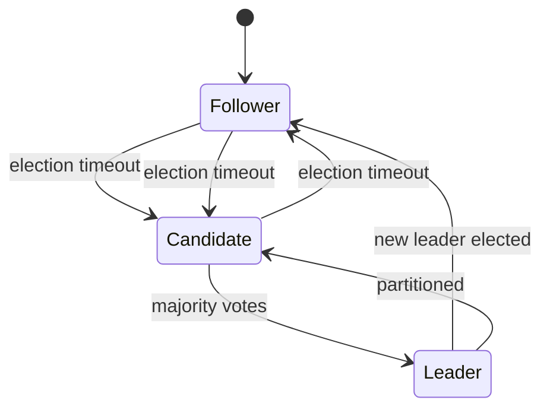

## 前言

在上一篇文章中，我们了解了分布式系统中的CAP定理和BASE理论。这些理论为我们理解分布式系统的基本约束和设计原则提供了框架。然而，仅仅了解这些理论是不够的，我们还需要知道如何在实践中实现分布式一致性。

🤔 那么，如何在分布式系统中实现节点间的共识呢？这就是今天我们要讨论的主题——分布式共识算法，特别是近年来备受推崇的Raft算法。

::: tip
共识算法是分布式系统的核心组件之一，它允许一组机器在存在部分故障的情况下就某个值达成一致。
:::

## 什么是共识算法？

在深入探讨Raft之前，让我们先明确什么是共识算法。

共识算法是分布式系统中用于解决多个节点之间就某个值达成一致问题的算法。在分布式系统中，由于节点可能失败、网络可能分区，或者消息可能延迟或丢失，实现共识是一个具有挑战性的问题。

常见的共识算法包括：
- Paxos
- Raft
- Viewstamped Replication (VR)
- ZAB (Zookeeper Atomic Broadcast)

在这些算法中，Raft因其易于理解和实现而备受青睐，特别适合用于教学和实际应用。

## Raft算法概述

Raft是一种为可理解性而设计的共识算法。它通过将问题分解为 leader 选举、日志复制和安全性等子问题来简化共识过程。

Raft的核心思想是将系统中的节点分为三种角色：
1. **Leader**：处理所有客户端请求，负责日志复制
2. **Follower**：被动接收来自Leader的日志和命令
3. **Candidate**：在Leader选举过程中，由Follower转换而来

::: theorem
Raft算法保证在任意时刻最多只有一个Leader，并且已提交的日志条目最终会在所有存活节点上保持一致。
:::

## Raft的核心机制

### 1. Leader选举

Raft的Leader选举过程如下：

1. 系统启动时，所有节点都是Follower状态
2. 如果一个Follower在一定时间内（election timeout）没有收到Leader的心跳，它会转变为Candidate状态
3. Candidate向其他节点发送请求投票（RequestVote）RPC
4. 如果Candidate获得多数节点的投票，它转变为Leader状态
5. 新的Leader向其他节点发送心跳（AppendEntries）RPC，以确立其领导地位



### 2. 日志复制

一旦Leader被选举出来，它就开始处理客户端请求并将其复制到其他节点：

1. 客户端请求被发送到Leader
2. Leader将请求作为日志条目追加到自己的日志中
3. Leader并行地向所有Follower发送AppendEntries RPC
4. 当日志条目被大多数节点复制后，Leader将该条目标记为已提交（committed）
5. Leader将提交信息通过AppendEntries RPC发送给其他节点
6. 当每个节点应用了已提交的日志条目后，它将执行该日志条目中存储的命令

### 3. 安全性

Raft通过以下机制保证安全性：

1. **选举限制**：只有包含所有已提交日志条目的节点才能被选举为Leader
2. **提交规则**：Leader只有在将日志条目复制到大多数节点后才能提交该条目
3. **日志匹配**：如果两个日志在同一个索引位置的日志条目相同，那么它们前面的所有日志条目也相同
4. **状态机安全**：如果一个节点已经应用了一个特定索引位置的日志条目，那么后续的Leader不会为该索引位置提交不同的日志条目

## Raft的优化与变体

为了提高性能和适应不同场景，Raft算法有多种优化和变体：

### 1. Multi-Raft

Multi-Raft是Raft的扩展，它将一个大集群划分为多个小的Raft组，每个组负责一部分数据。这种架构可以提高系统的可扩展性和吞吐量。

### 2. Lease Read

Lease Read是一种优化技术，允许客户端从Leader以外的节点读取数据，只要Leader能够保证这些节点的数据是最新的。这可以分散读负载，提高读取性能。

### 3. Pre-Vote

Pre-Vote是一种优化技术，用于减少不必要的Leader选举。在正式发起选举前，Candidate先向其他节点询问是否有更新的Leader存在，如果没有才正式发起选举。

## Raft的实际应用

Raft算法已经被许多知名的分布式系统采用：

1. **etcd**：CoreOS开发的分布式键值存储系统，广泛用于Kubernetes等容器编排平台
2. **Consul**：HashiCorp开发的服务发现和配置工具
3. **TiDB**：PingCAP开发的分布式NewSQL数据库
4. **CockroachDB**：分布式SQL数据库
5. **NATS Streaming**：分布式消息系统

## 结语

Raft算法通过将复杂的一致性问题分解为易于理解的子问题，为分布式系统提供了一种可靠且易于实现的共识机制。它的设计目标——可理解性，使得它成为学习和实现分布式系统的理想选择。

在微服务和云原生时代，分布式系统变得越来越普遍，理解像Raft这样的共识算法对于构建可靠、可扩展的系统至关重要。

> "简单性是复杂性的最终形式。" —— 达芬奇

正如这句话所说，Raft算法通过其简洁的设计解决了分布式系统中最复杂的问题之一，这正是它魅力所在。

如果你正在构建分布式系统，或者对分布式一致性感兴趣，我强烈建议你深入了解Raft算法。它不仅会帮助你更好地理解分布式系统的原理，还可能为你的项目提供一种可靠的实现方案。

---

*本文是分布式系统系列文章的一部分，如果你对其他分布式话题感兴趣，欢迎继续关注我的博客！* 😊
```