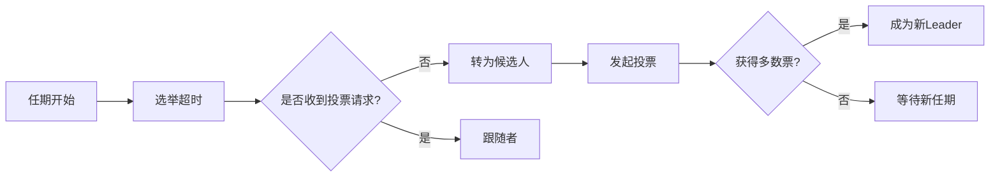

## 前言

在分布式系统领域，CAP理论告诉我们网络分区时必须在一致性和可用性之间做权衡。而BASE理论则为我们提供了最终一致性的解决方案。但当我们真正需要实现强一致性时，就需要具体的一致性协议来支撑。~~Paxos算法虽然经典，但理解门槛太高了~~，今天我们来聊聊更友好的Raft算法！

::: tip
Raft算法由Diego Ongaro和John Ousterhout在2013年提出，其核心目标是"可理解性"。它通过将分布式共识问题分解为领导者选举、日志复制和安全三个部分，大大降低了学习门槛。
:::

## Raft核心概念

### 节点角色
Raft集群中的节点有三种状态：
- **领导者(Leader)**：处理所有客户端请求，负责日志复制
- **跟随者(Follower)**：被动响应，不主动发起请求
- **候选人(Candidate)**：在选举过程中临时存在的状态

### 任期(Term)
Raft将时间划分为连续的任期，每个任期开始时会发起新的选举：


### 日志复制流程
当客户端请求到达领导者时，Raft会：
1. 将操作追加到本地日志
2. 通过`AppendEntries` RPC复制到所有跟随者
3. 当大多数节点确认后，提交日志并应用状态机

::: theorem Raft安全性保证
在任何任期内，最多只能选举出一个有效的领导者
:::

## 关键机制详解

### 领导者选举
当节点检测到选举超时（通常150-300ms随机间隔）时：
1. 增加当前任期号
2. 转换为候选人状态
3. 为自己投票
4. 向其他节点发送`RequestVote` RPC

> **关键点**：候选人需要获得集群中大多数节点的投票才能成为领导者。这确保了即使部分节点分区，也不会出现多个领导者。

### 日志一致性保证
Raft通过以下机制确保日志一致性：
1. **日志匹配原则**：如果两个日志在相同索引位置的日志项和任期号相同，则它们之前的所有日志都相同
2. **领导者唯一性**：领导者永远不会覆盖或删除自己的日志
3. **提交规则**：只有当前任期的日志项被复制到大多数节点后，才会被提交

### 成员变更
Raft使用**两阶段提交**实现安全的成员变更：
1. 配置变更日志先以单节点多数派提交
2. 新配置生效后，以新配置多数派提交后续变更

## 实际应用场景

Raft算法因其可理解性和可靠性，被广泛应用于：
- **etcd**：Kubernetes的底层键值存储
- **Consul**：HashiCorp的服务发现工具
- **TiKV**：分布式事务型键值数据库
- **CockroachDB**：分布式SQL数据库

## 结语

Raft算法通过将复杂的分布式共识问题分解为清晰可理解的部分，大大降低了分布式系统的开发门槛。它不仅提供了强一致性保证，还通过领导者选举、日志复制等机制实现了容错性。

::: right
"Raft的设计目标是可理解性，而不是性能"  
—— Raft论文作者
:::

在分布式系统设计中，理解一致性协议是构建可靠系统的基石。相比CAP理论这种宏观指导，Raft这样的具体实现方案更能帮助我们解决实际问题。希望今天的分享对你有所帮助！

> 记住：在分布式系统中，没有银弹，只有最适合场景的选择。Raft不是万能的，但它绝对是你的工具箱里最趁手的武器之一！
```