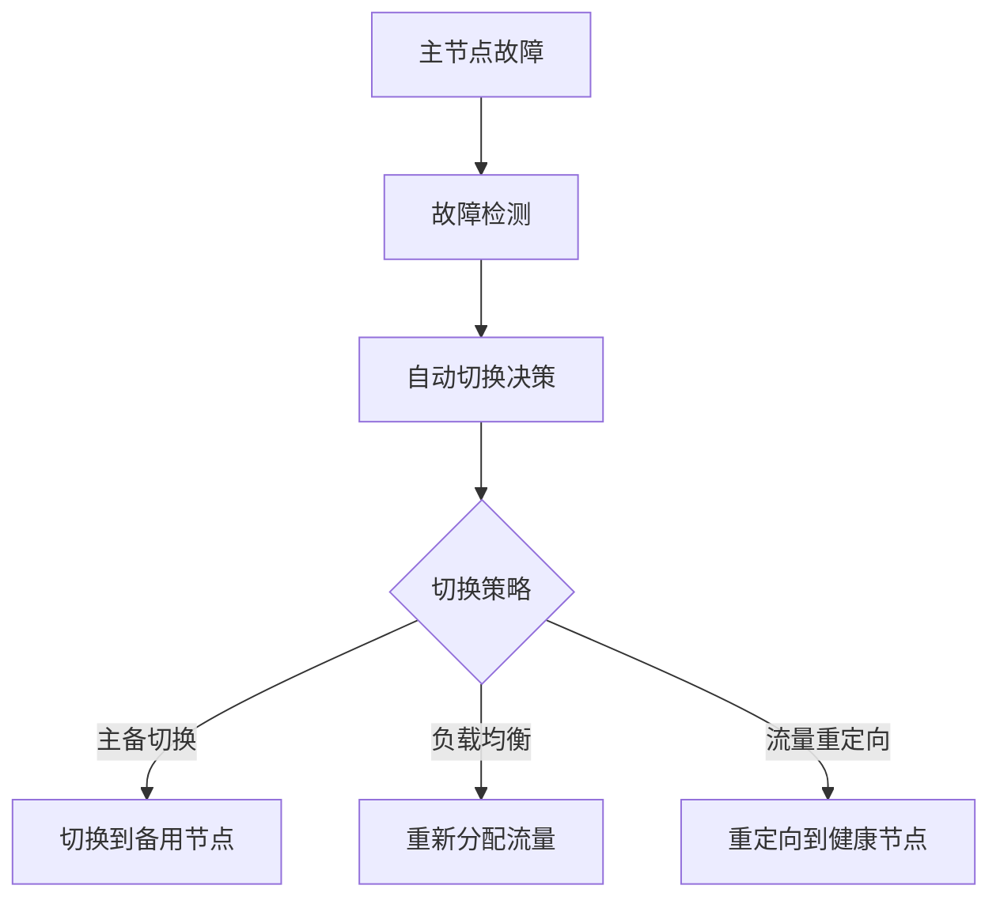

## 前言

作为一个分布式系统开发者，我经常思考一个问题：当灾难来临时，我们的系统如何保持服务不中断？~~说实话，这个问题让我夜不能寐~~。实际上，容灾与灾难恢复是构建高可用分布式系统的关键环节，但往往被忽视或简化处理。

在分布式系统领域，我们经常讨论一致性算法、负载均衡、服务发现等技术细节，但很少深入探讨如何应对真正的灾难场景。今天，我想和大家一起探讨分布式系统中的容灾与灾难恢复策略，这些策略是确保业务连续性的最后防线。

## 什么是容灾与灾难恢复？

::: tip
**容灾 (Disaster Recovery, DR)** 是指在灾难发生前采取措施，确保系统能够在灾难后继续运行或快速恢复的过程。
**灾难恢复 (Business Continuity)** 是指在灾难发生后，恢复业务运营的能力。
::简单来说，容灾是预防性的，而灾难恢复是响应性的。两者相辅相成，共同构成了完整的业务连续性体系。

在分布式系统中，容灾与灾难恢复尤为重要，因为分布式系统本身就面临着更多的复杂性和不确定性。

## 分布式系统容灾的关键策略

### 1. 多活架构设计

多活架构是分布式系统容灾的核心策略之一。与传统的"主从"或"主备"架构不同，多活架构允许多个数据中心同时处理业务请求。

```
[数据中心1] <--> [数据中心2] <--> [数据中心3]
     |              |              |
     v              v              v
 [用户请求]    [用户请求]    [用户请求]
```

**优点**：
- 无单点故障
- 地理分布，可抵御区域性灾难
- 负载分散，提高系统整体性能

**挑战**：
- 数据一致性维护复杂
- 网络延迟影响用户体验
- 成本较高

### 2. 数据复制与同步

在分布式系统中，数据是核心资产，因此数据复制是容灾的基础。

::: theorem
**数据复制定理**：任何分布式系统的容灾能力都取决于数据复制的有效性和一致性保障机制。
:::

常见的复制策略包括：

1. **同步复制**：主节点写入数据后，等待从节点确认写入成功才返回成功响应
   - 优点：数据一致性高
   - 缺点：性能影响大，可用性降低

2. **异步复制**：主节点写入数据后立即返回成功，后台异步同步到从节点
   - 优点：性能好，可用性高
   - 缺点：数据一致性较弱，可能丢失数据

3. **半同步复制**：主节点写入数据后，等待至少一个从节点确认写入成功才返回成功响应
   - 优点：在性能和一致性之间取得平衡
   - 缺点：实现复杂

### 3. 故障检测与自动切换

在分布式系统中，故障是常态而非异常。因此，有效的故障检测和自动切换机制至关重要。

**故障检测**：
- 心跳检测
- 超时机制
- 健康检查端点

**自动切换**：
- 主备切换
- 负载均衡切换
- 流量重定向



### 4. 地理分布与区域隔离

为了抵御区域性灾难（如地震、洪水、电力中断等），系统需要在地理上进行合理分布。

**最佳实践**：
- 至少部署在3个不同的地理区域
- 区域间距离应足够远（通常>500公里）
- 区域间网络连接应冗余设计
- 考虑不同区域的法规和合规要求

### 5. 灾难恢复演练

容灾策略不是一成不变的，需要定期演练和验证。

**演练内容**：
- 数据恢复演练
- 服务切换演练
- 应急响应演练
- 团队协作演练

**演练频率**：
- 关键系统：每季度一次
- 一般系统：每半年一次
- 全系统演练：每年一次

## 分布式系统灾难恢复的实施步骤

### 第一步：风险评估

在制定容灾策略前，首先需要进行全面的风险评估：

1. **识别潜在风险**：
   - 自然灾害（地震、洪水、台风等）
   - 人为事故（火灾、断电、网络攻击等）
   - 技术故障（硬件故障、软件bug、网络中断等）

2. **评估影响**：
   - 业务影响
   - 财务影响
   - 声誉影响

3. **确定恢复目标**：
   - RTO（恢复时间目标）：系统可以容忍的最长恢复时间
   - RPO（恢复点目标）：系统可以容忍的最大数据丢失量

### 第二步：制定容灾策略

根据风险评估结果，制定合适的容灾策略：

1. **备份策略**：
   - 数据备份频率
   - 备份存储位置
   - 备份验证机制

2. **冗余设计**：
   - 硬件冗余
   - 网络冗余
   - 电源冗余

3. **容灾等级**：
   - 第1级：无容灾措施
   - 第2级：数据备份
   - 第3级：备用站点
   - 第4级：热备份站点
   - 第5级：多活架构

### 第三步：技术实现

根据制定的策略，进行技术实现：

1. **基础设施**：
   - 云容灾服务
   - 物理容灾中心
   - 混合容灾方案

2. **数据层**：
   - 数据库复制
   - 文件系统同步
   - 对象存储复制

3. **应用层**：
   - 无状态设计
   - 服务降级机制
   - 熔断与限流

### 第四步：测试与验证

容灾系统建成后，需要经过严格的测试和验证：

1. **功能测试**：
   - 数据恢复测试
   - 服务切换测试
   - 性能测试

2. **压力测试**：
   - 大规模故障模拟
   - 长时间运行测试
   - 极端场景测试

3. **回归测试**：
   - 容灾系统对主系统的影响
   - 容灾系统的维护成本

### 第五步：持续优化

容灾系统不是一成不变的，需要持续优化：

1. **定期评估**：
   - 业务变化评估
   - 技术演进评估
   - 风险变化评估

2. **策略调整**：
   - RTO/RPO调整
   - 容灾等级调整
   - 技术方案调整

3. **文档更新**：
   - 应急响应手册
   - 操作流程文档
   - 最佳实践文档

## 行业案例分析

### 案例一：阿里云的"三地五中心"容灾架构

阿里云采用"三地五中心"的容灾架构，包括：

- 两个主可用区（同城双活）
- 两个备可用区（同城容灾）
- 一个异地容灾中心

这种架构能够：
- 抵御单点故障
- 应对区域性灾难
- 保证业务连续性

### 案例二：Netflix的"混沌工程"实践

Netflix通过"混沌工程"主动注入故障，测试系统的容灾能力：

- 故障注入工具（Chaos Monkey）
- 自动化故障检测
- 快速恢复机制

这种实践帮助Netflix建立了强大的容灾能力，能够在故障发生时快速恢复服务。

## 个人建议

基于我的经验，以下是分布式系统容灾与灾难恢复的一些个人建议：

1. **不要过度设计**：容灾系统需要平衡成本和收益，不是所有系统都需要最高等级的容灾。

2. **自动化是关键**：手动恢复过程容易出错，自动化可以大大提高恢复速度和准确性。

3. **定期演练**：容灾策略不是摆设，需要定期演练才能确保在真实灾难中有效。

4. **关注数据一致性**：在追求高可用的同时，不要忽视数据一致性，这是业务连续性的基础。

5. **团队协作**：容灾不仅是技术问题，还需要业务、运维、开发等团队的紧密协作。

## 未来展望

随着云计算和边缘计算的普及，分布式系统的容灾与灾难恢复将面临新的挑战和机遇：

1. **多云容灾**：利用多家云服务商构建跨云容灾方案，避免厂商锁定风险。

2. **边缘计算容灾**：在边缘节点部署容灾能力，减少中心化依赖。

3. **AI辅助容灾**：利用AI技术预测故障、优化恢复策略。

4. **区块链辅助数据一致性**：利用区块链技术确保分布式系统中数据的一致性和可追溯性。

## 结语

容灾与灾难恢复是分布式系统设计中不可或缺的一部分。它不仅是技术问题，更是业务连续性的保障。在构建分布式系统时，我们应该将容灾与灾难恢复作为核心考量，而不仅仅是事后的补充。

记住，**没有永远的胜利，只有不断的准备**。在分布式系统的世界里，灾难不是会不会发生的问题，而是什么时候发生的问题。只有做好充分的准备，才能在灾难来临时从容应对。

> "在分布式系统中，我们无法避免故障，但我们可以设计系统能够优雅地处理故障。" —— 分布式系统设计哲学

希望这篇文章能帮助大家更好地理解和实施分布式系统的容灾与灾难恢复策略。如果你有任何问题或建议，欢迎在评论区交流讨论！