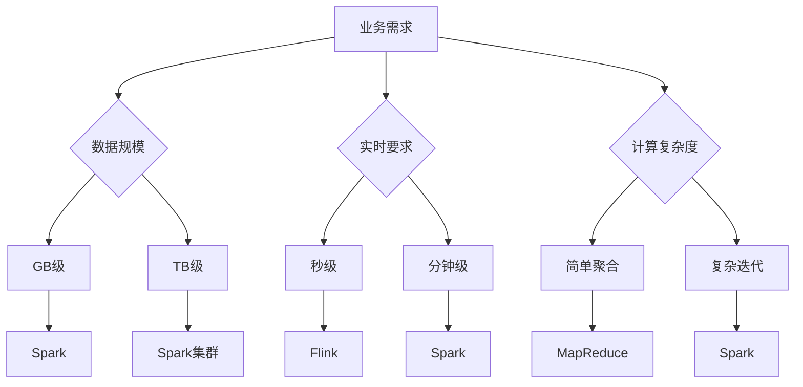

## 前言

在分布式系统的世界里，我们经常讨论一致性协议、分布式存储和消息队列，但有一个核心组件却常常被忽略——**分布式计算模型**。就像一个城市的交通系统需要规划道路网络一样，分布式系统需要高效的计算模型来处理海量数据。今天，我们就来深入探讨这个被低估的关键领域。

::: tip
"计算是分布式系统的灵魂，而计算模型则是灵魂的骨架"
:::

## 分布式计算模型概述

分布式计算模型是解决大规模数据处理的架构范式，它将计算任务分解为多个子任务，在集群中并行执行。根据处理方式的不同，主要分为三类：

- **批处理模型**：处理静态数据集，适合ETL场景
- **流处理模型**：处理实时数据流，适合实时分析
- **迭代计算模型**：支持多轮计算，适合机器学习

## MapReduce：批处理的开山之作

MapReduce是Google提出的分布式计算框架，奠定了现代大数据处理的基础。

### 核心设计原理

MapReduce采用"分而治之"的思想，主要包含两个阶段：

1. **Map阶段**：将输入数据分割成独立的数据块，并行处理
2. **Reduce阶段**：汇总Map阶段的中间结果


### 实际应用场景

- **日志分析**：处理TB级服务器日志
- **倒排索引构建**：搜索引擎索引生成
- **数据清洗**：ETL流程中的数据转换

> 📊 **案例**：某电商平台使用MapReduce每天处理10亿条用户行为数据，生成用户画像特征

### 局限性

~~虽然MapReduce简单易用，但其磁盘中间结果交换导致性能瓶颈~~，无法满足低延迟需求。

## Spark：内存计算的革命

Spark由UC Berkeley AMPLab开发，通过内存计算解决了MapReduce的性能问题。

### 核心创新：RDD与DAG

- **RDD（弹性分布式数据集）**：不可变的分布式对象集合
- **DAG（有向无环图）**：计算任务的逻辑执行计划

```python
# Spark示例代码
text_file = spark.read.text("hdfs://...")
counts = text_file.flatMap(lambda line: line.split(" ")) \
             .map(lambda word: (word, 1)) \
             .reduceByKey(lambda a, b: a + b)
counts.saveAsTextFile("hdfs://...")
```

### 与MapReduce的对比

| 特性 | MapReduce | Spark |
|------|-----------|-------|
| 中间存储 | 磁盘 | 内存 |
| 延迟 | 高（分钟级） | 低（秒级） |
| 迭代计算 | 不支持 | 支持 |
| 实时处理 | 不支持 | 支持流处理 |

### 实际应用案例

- **推荐系统**：Netflix使用Spark MLlib处理用户行为数据
- **实时欺诈检测**：金融行业每秒处理百万级交易
- **基因组分析**：生物信息学中的序列比对计算

## 流处理模型：实时计算的新范式

随着实时需求增长，流处理模型成为必要补充：

### Flink：事件驱动的流处理

- **事件时间处理**：保证乱序数据正确性
- **状态管理**：支持Exactly-Once语义
- **窗口计算**：灵活的窗口策略

### Storm：低延迟流处理

- **微批处理**：毫秒级延迟
- **Tuple模型**：轻量级数据单元
- **容错机制**：基于Ack机制

## 实践选择指南

如何选择合适的计算模型？关键看业务需求：



## 未来趋势

分布式计算模型正在向以下方向发展：

1. **统一计算引擎**：Spark Flink等框架的融合
2. **AI/ML集成**：TensorFlow on Spark等方案
3. **Serverless计算**：无服务器架构下的自动扩展
4. **边缘计算**：分布式计算向边缘设备延伸

## 结语

分布式计算模型是构建高效数据处理系统的核心组件。从MapReduce的批处理革命，到Spark的内存计算突破，再到流处理模型的实时演进，每种模型都有其适用场景。选择正确的计算模型，不仅能提升系统性能，更能为业务创新提供强大支撑。

> 🚀 "在分布式系统的世界里，计算模型不是选择题，而是必答题。"

---

**思考题**：在你的系统中，哪些场景适合使用MapReduce？哪些场景需要Spark的内存计算？欢迎在评论区分享你的实践经验！