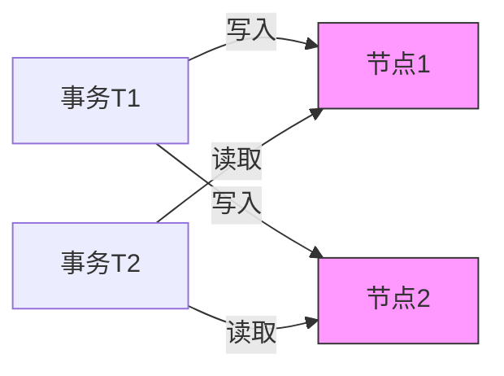
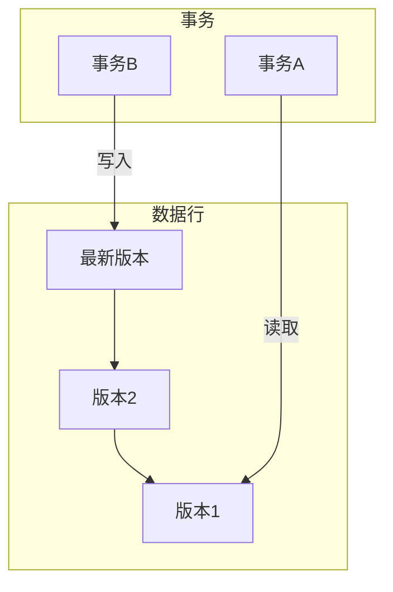

## 前言

在分布式系统中，事务管理是确保数据一致性的核心机制。当我们讨论分布式事务时，大多数人会立即想到两阶段提交（2PC）或Saga模式，但一个至关重要的维度却常常被忽视——**事务隔离级别**。隔离级别定义了并发事务之间的可见性规则，直接影响系统的数据一致性、性能和并发能力。在分布式环境下，由于网络延迟、节点故障和时钟不同步等因素，实现有效的隔离级别比单机环境复杂得多。本文将深入探讨分布式事务隔离级别的理论基础、实现挑战和最佳实践。

## 分布式事务隔离级别的核心概念

### 隔离级别的本质

隔离级别是数据库事务的四个标准属性（ACID）中的"I"（Isolation），它解决了并发执行的事务相互干扰的问题。在分布式系统中，隔离级别尤为重要，因为：
- 事务可能跨越多个独立的数据节点
- 网络分区可能导致部分节点不可见
- 时钟漂移影响时间相关的隔离机制

### 四大标准隔离级别

1. **读未提交（Read Uncommitted）**
   - 允许读取未提交的数据变更
   - 可能导致"脏读"（Dirty Read）
   - 分布式场景下几乎不适用

2. **读已提交（Read Committed）**
   - 只能读取已提交的数据
   - 可能导致"不可重复读"（Non-repeatable Read）
   - 常见于分布式数据库的默认级别

3. **可重复读（Repeatable Read）**
   - 同一事务多次读取相同数据结果一致
   - 可能导致"幻读"（Phantom Read）
   - 需要版本控制或锁机制支持

4. **串行化（Serializable）**
   - 完全串行化执行事务
   - 最高一致性保证，但性能代价最高
   - 分布式环境下实现复杂

## 分布式环境下的隔离级别挑战

### 网络分区与脑裂问题

在分布式系统中，网络分区可能导致：


当节点2与网络隔离时，T2可能看到不一致的数据视图，违反隔离级别保证。

### 时钟同步难题

依赖物理时钟的隔离机制（如快照隔离）面临：
- 时钟漂移导致时间戳混乱
- 不同节点时钟不同步
- NTP同步延迟（通常5-100ms）

### 分布式锁的性能瓶颈

实现可重复读或串行化需要分布式锁：
- 锁协调开销大（ZooKeeper/etcd）
- 死锁检测复杂
- 网络延迟影响吞吐量

## 分布式隔离级别的实现技术

### 多版本并发控制（MVCC）

MVCC是分布式数据库中最常用的隔离机制：


- 每个数据行维护多个版本
- 读取事务基于创建时间戳获取一致性视图
- 典型实现：TiDB、CockroachDB、Cassandra

### 乐观并发控制（OCC）

适用于低冲突场景：
1. 事务执行时不加锁
2. 提交时检查版本冲突
3. 冲突时回滚或重试

**优势**：
- 高并发性能
- 无锁开销

**劣势**：
- 高冲突场景下性能下降
- 需要冲突检测机制

### 两阶段锁（2PL）

严格实现串行化隔离：
1. 第一阶段：获取所有需要的锁
2. 第二阶段：执行操作并释放锁

**分布式实现挑战**：
- 死锁检测（等待图分析）
- 锁管理服务（如Redis分布式锁）
- 锁超时机制

## 实践案例与最佳实践

### TiDB的快照隔离

TiDB采用MVCC+Percolator事务模型：
```go
// 事务开始时创建快照
txn, err := db.Begin()
if err != nil {
    log.Fatal(err)
}

// 读取数据（基于创建时间戳）
row, err := txn.Get("user", "1")
if err != nil {
    log.Fatal(err)
}

// 写入数据（新版本）
err = txn.Set("user", "1", updatedUser)
if err != nil {
    txn.Rollback()
    log.Fatal(err)
}

// 提交时检查版本冲突
err = txn.Commit()
if err != nil {
    // 版本冲突处理
    if errors.Is(err, tikv.ErrTxnRetryable) {
        // 重试逻辑
    }
}
```

### Spanner的TrueTime

Google Spanner使用TrueTime API提供强一致时间：
- GPS原子钟 + 时钟同步服务
- 时间戳保证：[earliest, latest]
- 事务时间戳范围：[earliest, latest]

**优势**：
- 全局有序时间戳
- 精确的快照隔离

**劣势**：
- 硬件依赖性强
- 时间戳等待影响性能

### 隔离级别选择指南

| 场景 | 推荐隔离级别 | 实现方案 |
|------|--------------|----------|
| 高并发OLTP | 读已提交 | MVCC+乐观锁 |
| 金融交易 | 可重复读 | MVCC+版本控制 |
| 强一致性需求 | 串行化 | 2PL或Paxos |
| 最终一致性系统 | 读未提交 | 事件溯源 |

## 结语

分布式事务隔离级别是分布式系统设计中不可忽视的关键维度。随着系统规模的增长和网络环境的复杂性增加，选择合适的隔离级别需要权衡数据一致性、性能和可用性。现代分布式系统通常采用MVCC作为核心机制，结合时间戳服务（如Spanner）或分布式锁（如etcd）来实现不同隔离级别。

> "在分布式系统中，没有完美的隔离级别，只有最适合业务需求的平衡点。"

随着云原生和边缘计算的兴起，隔离级别的实现将继续演化，特别是在低延迟网络和高弹性架构方面。理解隔离级别的本质和挑战，将帮助我们构建更可靠的分布式系统。

---

**延伸阅读**：
- Google Spanner论文《Spanner: Google's Globally-Distributed Database》
- Martin Kleppmann《Designing Data-Intensive Applications》第7章
- TiDB事务模型官方文档