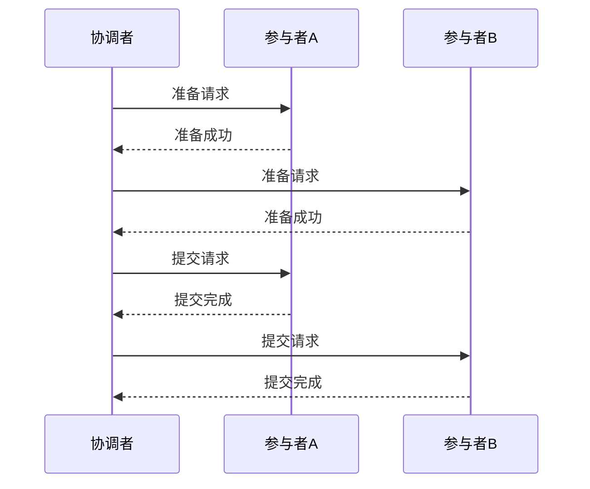
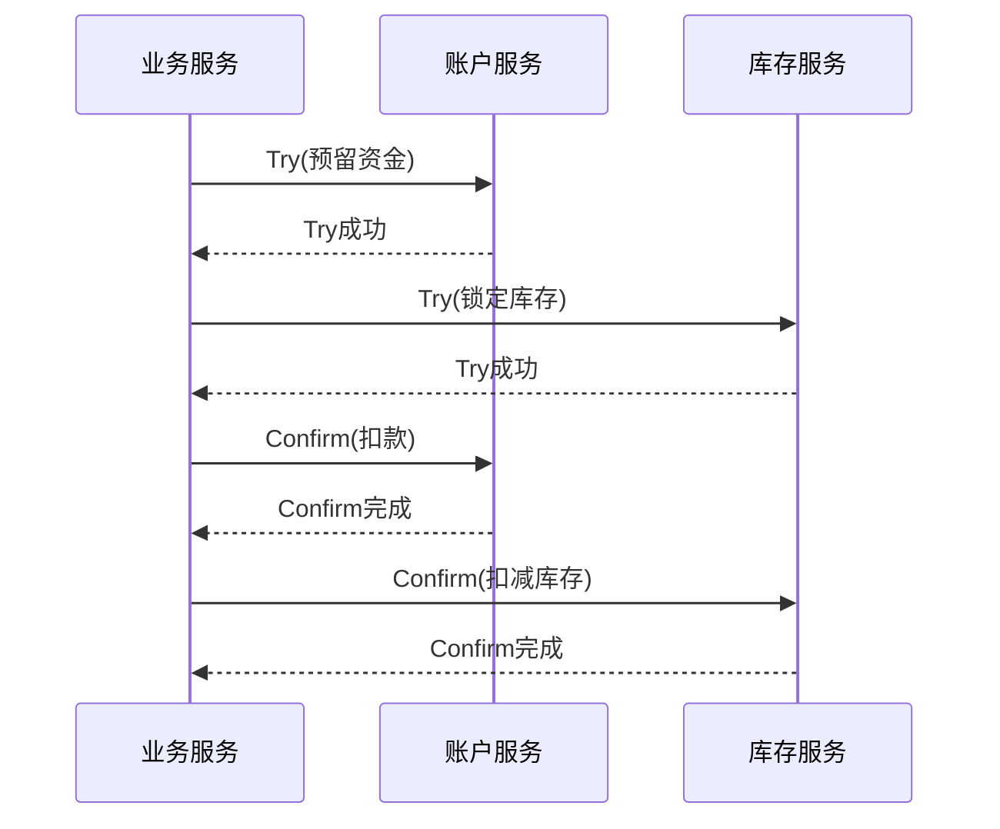
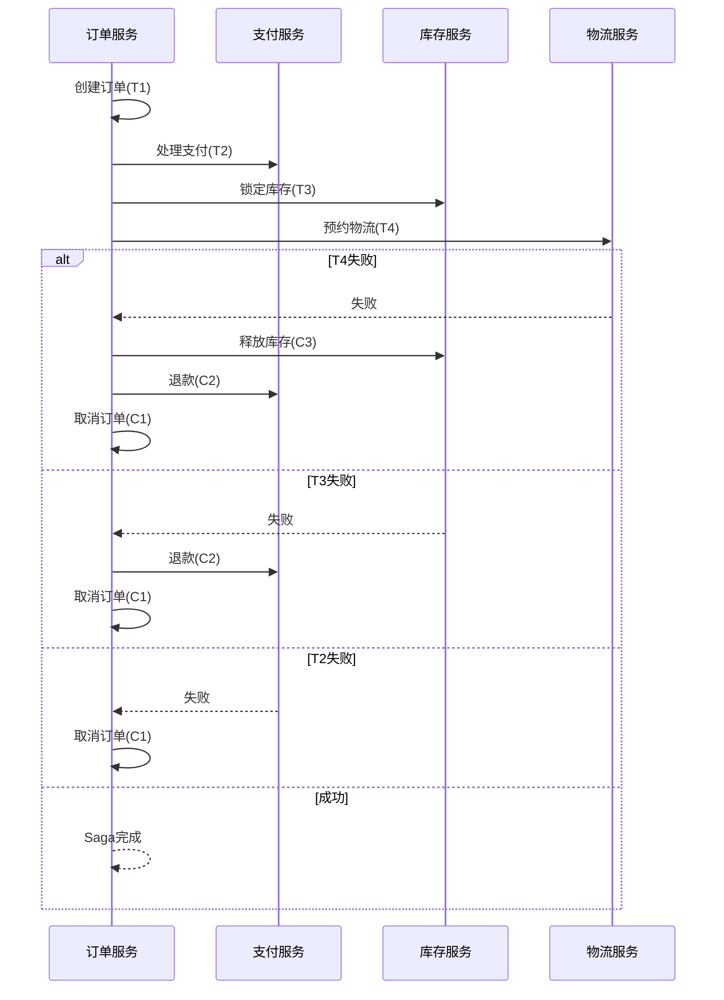
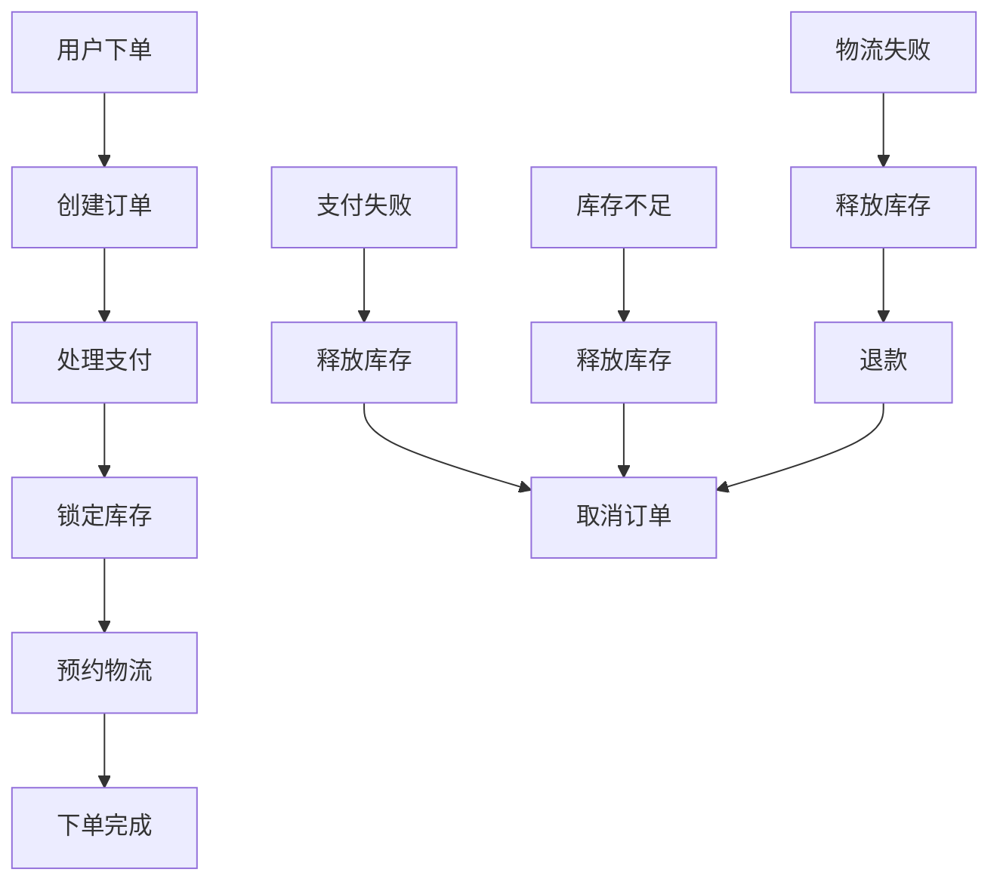

## 前言

在构建分布式系统时，我们常常面临一个经典难题：如何保证跨多个服务或数据源的事务一致性？~~这个问题就像试图让一群猫排成直线一样困难~~ 🐱。随着微服务架构的普及，原本在单体应用中简单的事务操作，现在变成了横跨多个服务的复杂挑战。

本文将深入探讨分布式事务处理的各种模式及其补偿机制，帮助你在构建高可用、高可靠的分布式系统时，能够优雅地处理事务一致性问题。

## 分布式事务的基本概念

在深入探讨分布式事务处理模式之前，让我们先回顾一下分布式事务的基本概念。

::: theorem
分布式事务是指跨越多个独立资源管理器（如数据库、消息队列等）的事务操作。这些资源管理器可能位于不同的服务器上，通过网络进行通信。
:::

### ACID与BASE理论回顾

在分布式环境中，传统的ACID（原子性、一致性、隔离性、持久性）事务模型面临严峻挑战：

- **原子性**：在分布式系统中，很难保证所有操作要么全部成功，要么全部失败。
- **一致性**：由于网络分区、节点故障等原因，系统很难保持全局一致性。
- **隔离性**：分布式环境下的隔离级别实现变得复杂。
- **持久性**：虽然单个节点的持久性可以保证，但跨节点的持久性协调变得困难。

因此，分布式系统常常采用BASE（基本可用、软状态、最终一致性）理论作为指导原则：

- **基本可用**：系统保证基本功能可用，但不保证所有功能都可用。
- **软状态**：系统允许存在中间状态，不要求所有节点在同一时刻保持一致。
- **最终一致性**：系统保证在没有新的更新操作后，所有节点的数据最终会达到一致状态。

## 分布式事务处理模式

针对分布式事务的一致性挑战，业界发展出了多种处理模式，每种模式都有其适用场景和优缺点。

### 两阶段提交(2PC)

两阶段提交（Two-Phase Commit, 2PC）是最经典的分布式事务协议之一。

#### 2PC工作流程

1. **准备阶段**：
   - 事务协调者向所有参与者发送准备请求
   - 参与者执行事务操作，但不提交，并将 undo 和 redo 信息写入日志
   - 参与者向协调者反馈准备结果

2. **提交阶段**：
   - 如果所有参与者都准备成功，协调者发送提交请求
   - 如果有参与者准备失败，协调者发送回滚请求
   - 参与者根据协调者的指令提交或回滚事务



#### 2PC优缺点

**优点**：
- 实现简单，保证了事务的原子性
- 广泛应用于关系数据库中

**缺点**：
- 同步阻塞，性能较差
- 单点故障问题（协调者故障可能导致系统阻塞）
- 参与者故障可能导致数据不一致

### 三阶段提交(3PC)

三阶段提交（Three-Phase Commit, 3PC）是2PC的改进版本，通过引入预提交阶段来减少阻塞情况。

#### 3PC工作流程

1. **CanCommit阶段**：
   - 协调者向所有参与者发送CanCommit请求
   - 参与者判断是否可以提交，反馈结果

2. **PreCommit阶段**：
   - 如果所有参与者都同意，协调者发送PreCommit请求
   - 参与者执行事务操作，但不提交，并将undo和redo信息写入日志
   - 参与者向协调者反馈预提交结果

3. **DoCommit阶段**：
   - 如果所有参与者都预提交成功，协调者发送DoCommit请求
   - 如果有参与者预提交失败，协调者发送Abort请求
   - 参与者根据协调者的指令提交或回滚事务

#### 3PC优缺点

**优点**：
- 非阻塞协议，在协调者故障的情况下，参与者可以自行决定提交或回滚
- 提高了系统的可用性

**缺点**：
- 实现复杂
- 性能开销更大
- 仍然存在数据不一致的可能性

### TCC模式(Try-Confirm-Cancel)

TCC（Try-Confirm-Cancel）是一种业务层面的分布式事务模式，将一个业务操作拆分为三个阶段：

1. **Try阶段**：资源检查和预留
2. **Confirm阶段**：执行业务操作
3. **Cancel阶段**：取消操作，释放资源

#### TCC工作流程



#### TCC优缺点

**优点**：
- 高性能，无锁机制
- 业务侵入性强，可以灵活控制业务逻辑
- 适用于高并发场景

**缺点**：
- 业务侵入性强，需要改造现有业务代码
- 需要设计完善的补偿逻辑
- 确保幂等性要求高

### Saga模式

Saga模式是一种长事务处理模式，将一个长事务拆分为多个本地事务，每个本地事务都有一个对应的补偿事务。

#### Saga工作流程

1. 执行第一个本地事务
2. 如果成功，执行第二个本地事务
3. 如果所有本地事务都成功，则Saga完成
4. 如果有本地事务失败，则按相反顺序执行补偿事务



#### Saga优缺点

**优点**：
- 无锁机制，高性能
- 业务侵入性相对较低
- 支持长事务和复杂业务流程

**缺点**：
- 需要设计完善的补偿逻辑
- 可能出现暂时性数据不一致
- 实现复杂度较高

## 分布式事务补偿机制

无论采用哪种分布式事务处理模式，补偿机制都是确保系统最终一致性的关键。

### 补偿事务设计原则

::: tip
补偿事务设计应遵循以下原则：
1. **幂等性**：补偿操作可以重复执行而不影响系统状态
2. **反向性**：补偿操作应能撤销原操作的效果
3. **隔离性**：补偿操作应独立于原操作执行
4. **可靠性**：补偿操作应保证成功执行
:::

### Saga模式的补偿机制

Saga模式的补偿机制是其核心特点之一。补偿事务的设计需要考虑以下几点：

1. **补偿事务的幂等性**：
   ```java
   // 补偿事务示例 - 释放库存
   @Transactional
   public void releaseStock(Long orderId, Long productId, int quantity) {
       // 使用幂等键确保重复执行不会重复释放
       String idempotencyKey = "release_stock_" + orderId + "_" + productId;
       
       if (idempotencyKeyRepository.exists(idempotencyKey)) {
           return; // 已经处理过，直接返回
       }
       
       // 执行释放库存操作
       inventoryService.releaseStock(productId, quantity);
       
       // 记录幂等键
       idempotencyKeyRepository.save(idempotencyKey);
   }
   ```

2. **补偿事务的可靠性**：
   - 实现重试机制
   - 使用消息队列确保补偿操作最终执行
   - 记录补偿操作日志，便于排查问题

3. **补偿事务的隔离性**：
   - 使用独立的事务上下文执行补偿操作
   - 避免补偿操作与原操作相互影响

### TCC模式的补偿机制

TCC模式的补偿机制主要通过Cancel阶段实现：

1. **Try阶段的资源预留**：
   - 在Try阶段，资源只是被预留，不真正消耗
   - 例如，在订单系统中，Try阶段只是锁定库存和预留资金，不真正扣款和扣减库存

2. **Cancel阶段的资源释放**：
   - 如果事务最终取消，执行Cancel阶段释放所有预留资源
   - 如果事务成功，执行Confirm阶段真正消耗资源

3. **超时处理**：
   - 设置Try阶段超时时间，超时后自动触发Cancel操作
   - 实现定时任务检查长时间未确认的事务

## 实践案例与最佳实践

### 电商订单系统中的分布式事务处理

在电商系统中，下单操作通常涉及多个服务：订单服务、支付服务、库存服务、物流服务等。下面是一个基于Saga模式的电商下单流程：



#### 实现要点

1. **事件驱动架构**：
   - 使用事件驱动架构实现服务间的解耦
   - 每个服务完成操作后发布事件，触发后续服务

2. **状态机管理**：
   - 使用状态机管理订单状态流转
   - 确保状态转换的原子性和一致性

3. **补偿事务实现**：
   - 为每个操作设计对应的补偿事务
   - 实现幂等性保证

### 金融系统中的分布式事务与补偿

在金融系统中，分布式事务处理尤为重要，因为数据一致性问题可能导致严重的资金损失。

#### 金融系统分布式事务特点

1. **高一致性要求**：金融系统通常要求强一致性
2. **审计追踪**：所有操作必须有完整的审计日志
3. **故障恢复**：系统故障后必须能够准确恢复状态

#### 实现策略

1. **使用Saga模式处理长事务**：
   - 将复杂金融操作拆分为多个本地事务
   - 每个本地事务都有对应的补偿事务

2. **实现分布式锁**：
   - 使用Redis等分布式锁机制防止并发问题
   - 确保关键操作的原子性

3. **实现事务日志**：
   - 记录所有事务操作的详细日志
   - 实现事务状态的持久化存储

## 总结与展望

分布式事务处理是构建可靠分布式系统的关键挑战。本文介绍了多种分布式事务处理模式及其补偿机制：

- **2PC和3PC**适用于强一致性要求高的场景，但性能较差
- **TCC模式**适用于高并发场景，但业务侵入性强
- **Saga模式**适用于长事务和复杂业务流程，但需要设计完善的补偿逻辑

> 在选择分布式事务处理模式时，应根据业务场景、性能要求和一致性要求进行权衡。没有一种模式适用于所有场景，最佳实践是根据具体需求组合使用多种模式。

随着云原生和微服务架构的普及，分布式事务处理技术也在不断发展。未来，我们可能会看到更多基于事件溯源和CQRS的分布式事务处理方案，以及更智能的自动补偿机制。

无论技术如何发展，理解分布式事务的基本原理和补偿机制，都是构建可靠分布式系统的基础。希望本文能够帮助你在实际项目中更好地处理分布式事务问题。

---

*如果你对分布式事务处理有任何疑问或建议，欢迎在评论区留言交流！* 🤝