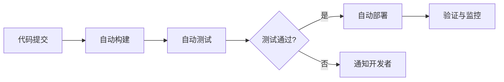

## 前言

在分布式系统的世界里，我们常常陷入一个有趣的悖论：我们花费大量精力设计和实现了复杂的分布式架构，却在部署和运维环节回到了"手动操作"的原始时代。🤦‍♂️ 还记得我第一次负责一个微服务系统时的场景：30多个服务，每次部署都需要登录10多台服务器，执行同样的命令，手动检查日志...那感觉就像是拿着锤子钉螺丝，既费力又容易出错。

随着系统规模的增长，手动部署和运维的噩梦只会越来越严重。今天，我想和大家一起探讨分布式系统的部署与运维自动化，这个看似"基础设施"实则关乎系统成败的关键领域。

## 自动化部署：从手动到自动的演进之路

### 传统部署模式的痛点

在自动化时代之前，我们的部署流程往往是这样的：

1. 开发人员在本地测试代码
2. 将代码打包成可执行文件
3. 通过FTP或SSH上传到服务器
4. 手动停止服务
5. 备份旧版本
6. 部署新版本
7. 手动启动服务
8. 检查日志确认服务正常

这个过程看似简单，但在分布式系统中，每个步骤都可能成为故障点：

- **环境不一致**：开发、测试、生产环境差异导致的问题
- **人为错误**：手动操作不可避免地会出现失误
- **回滚困难**：出现问题后，如何快速回滚到上一个稳定版本
- **发布窗口受限**：只能在低峰期发布，影响业务连续性

### 自动化部署的核心组件

构建一个完善的自动化部署系统，通常包含以下几个核心组件：

#### 1. 持续集成/持续部署(CI/CD)流水线

CI/CD是自动化部署的"心脏"，它将代码提交到仓库到最终部署的整个过程自动化。一个典型的CI/CD流水线包括：

- **代码提交**：开发者将代码推送到版本控制系统
- **自动构建**：系统自动拉取最新代码，编译打包
- **自动测试**：运行单元测试、集成测试、端到端测试
- **自动部署**：将构建产物部署到测试环境或生产环境
- **验证与监控**：部署后自动验证系统状态，监控关键指标

#### 2. 基础设施即代码(IaC)

传统运维中，服务器配置往往通过手动完成，这导致环境不一致和配置漂移问题。基础设施即代码(IaC)解决了这个问题，它使用代码来定义和管理基础设施：

- **Terraform**：多云环境的基础设施编排工具
- **Ansible**：自动化配置管理和应用部署工具
- **CloudFormation**：AWS的IaC服务
- **Pulumi**：使用编程语言定义基础设施

通过IaC，我们可以将服务器配置、网络设置、安全策略等基础设施定义为代码，实现版本控制和自动化部署。

#### 3. 容器化与编排

容器技术是现代分布式系统部署的基础：

- **Docker**：将应用及其依赖打包成轻量级容器
- **Kubernetes**：容器编排平台，自动化部署、扩展和管理容器化应用
- **Docker Compose**：多容器应用的本地编排工具

容器化带来的好处是显而易见的：

- **环境一致性**：开发、测试、生产环境完全一致
- **资源隔离**：应用间互不影响
- **快速部署**：秒级启动和停止
- **弹性伸缩**：根据负载自动调整实例数量

### 自动化部署的最佳实践

在实施自动化部署时，遵循以下最佳实践可以避免许多常见问题：

#### 1. 蓝绿部署与金丝雀发布

**蓝绿部署**是保持系统高可用性的有效策略：

- 维护两个完全相同的生产环境：蓝色和绿色
- 当前流量指向蓝色环境
- 新版本部署到绿色环境
- 测试确认后，将流量从蓝色切换到绿色
- 蓝色环境作为下一个版本的部署目标

**金丝雀发布**则是逐步推出新版本的方式：

- 新版本先部署到少量实例(如5%)
- 监控新版本的性能和错误率
- 逐步增加新版本实例的比例
- 确认稳定后，全面替换旧版本

#### 2. 自动化回滚机制

部署不是一帆风顺的，必须有完善的回滚机制：

- **版本管理**：每个部署版本都有唯一标识
- **健康检查**：部署后自动验证系统健康状态
- **自动回滚**：健康检查失败时自动回滚到上一个稳定版本
- **回滚测试**：定期测试回滚流程的有效性

#### 3. 环境一致性管理

确保所有环境的一致性是自动化部署的关键：

- **容器镜像**：使用相同的镜像构建所有环境
- **配置管理**：通过配置文件或配置中心管理环境差异
- **数据隔离**：测试和生产环境使用不同的数据集
- **访问控制**：不同环境有严格的访问权限控制

## 自动化运维：从被动响应到主动预防

### 自动化监控与告警

传统的运维模式往往是"救火式"的，问题发生后才被动响应。自动化监控和告警改变了这一模式：

#### 1. 全方位监控体系

一个完善的监控系统应该覆盖多个维度：

- **基础设施监控**：CPU、内存、磁盘、网络等资源使用情况
- **应用性能监控(APM)**：响应时间、吞吐量、错误率等
- **业务指标监控**：用户活跃度、转化率、收入等业务指标
- **日志监控**：系统日志、应用日志、错误日志等

#### 2. 智能告警策略

告警不是越多越好，关键在于"精准"：

- **多级告警**：根据严重程度设置不同级别的告警
- **告警抑制**：避免同一问题重复告警
- **告警聚合**：相关联的告警合并通知
- **告警升级**：长时间未响应的告警自动升级

#### 3. 自动化故障恢复

对于常见问题，可以实现自动恢复：

- **自动重启**：检测到服务崩溃时自动重启
- **自动切换**：主节点故障时自动切换到备用节点
- **自动扩容**：负载过高时自动增加实例
- **自动降级**：系统压力过大时自动降级非核心功能

### 自动化测试策略

测试是确保系统质量的关键，自动化测试可以大幅提高效率：

#### 1. 多层次自动化测试

- **单元测试**：验证单个组件或函数的正确性
- **集成测试**：验证多个组件协作的正确性
- **端到端测试**：验证整个业务流程的正确性
- **性能测试**：验证系统在不同负载下的表现
- **安全测试**：验证系统的安全性

#### 2. 测试数据管理

测试数据是自动化测试的挑战之一：

- **数据工厂**：自动生成测试数据
- **数据脱敏**：生产数据脱敏后用于测试
- **数据快照**：定期备份测试数据
- **数据隔离**：不同测试使用不同的数据集

### 自动化文档与知识管理

文档往往是最容易被忽视的部分，但自动化文档可以大大提高团队效率：

- **API文档自动生成**：从代码注释自动生成API文档
- **架构图自动更新**：根据系统变化自动更新架构图
- **运维手册自动化**：将常见操作流程自动化并记录
- **知识库自动整理**：将问题解决方案整理成知识库

## 云原生环境下的自动化实践

云原生环境为分布式系统的自动化部署和运维提供了新的可能性：

### 1. 基于Kubernetes的自动化部署

Kubernetes已经成为容器编排的事实标准，它提供了丰富的自动化能力：

- **声明式配置**：通过YAML文件定义系统状态
- **自动伸缩**：根据CPU使用率或其他指标自动调整实例数量
- **自愈能力**：自动替换故障节点
- **滚动更新**：零停机更新应用
- **服务发现与负载均衡**：自动注册和发现服务

### 2. GitOps工作流

GitOps是一种持续交付的方法，它将Git作为系统事实的唯一来源：

- **基础设施代码化**：所有系统状态都存储在Git中
- **自动化同步**：系统自动将Git中的状态应用到实际环境
- **变更审查**：所有变更都需要通过Pull Request进行审查
- **回滚简单**：回滚到之前的Git提交即可

### 3. 无服务器架构的自动化

无服务器(Serverless)架构进一步简化了部署和运维：

- **函数即服务(FaaS)**：只需编写函数代码，无需管理服务器
- **事件驱动**：基于事件自动触发函数执行
- **自动伸缩**：根据请求量自动调整函数实例
- **按需计费**：只在函数执行时付费

## 自动化工具栈推荐

实现分布式系统的自动化部署和运维，离不开优秀的工具支持。以下是我推荐的一些工具：

### CI/CD工具
- **Jenkins**：开源的自动化服务器，插件丰富
- **GitLab CI/CD**：集成在GitLab中的CI/CD功能
- **GitHub Actions**：GitHub的原生CI/CD功能
- **Argo CD**：基于GitOps的Kubernetes持续交付工具
- **Spinnaker**：多云环境持续交付平台

### 容器与编排
- **Docker**：容器化平台
- **Kubernetes**：容器编排平台
- **Helm**：Kubernetes应用包管理器
- **Istio**：服务网格
- **Prometheus**：监控和告警工具

### 基础设施即代码
- **Terraform**：多云基础设施编排
- **Ansible**：自动化配置管理
- **Packer**：镜像构建工具
- **Chef**：配置管理平台
- **SaltStack**：基础设施自动化工具

### 监控与日志
- **Prometheus**：监控系统和时间序列数据库
- **Grafana**：可视化监控仪表盘
- **ELK Stack(Elasticsearch, Logstash, Kibana)**：日志分析平台
- **Jaeger**：分布式追踪系统
- **Fluentd**：日志收集器

### 测试工具
- **JUnit/TestNG**：Java测试框架
- **Pytest**：Python测试框架
- **Selenium**：Web UI自动化测试
- **JMeter**：性能测试工具
- **Postman**：API测试工具

## 实施自动化部署与运维的挑战与解决方案

尽管自动化部署和运维带来了诸多好处，但在实施过程中也会遇到各种挑战：

### 1. 组织文化变革

**挑战**：从手动操作转向自动化需要改变团队的工作方式和思维模式。

**解决方案**：
- 从小处着手，先实现简单的自动化任务
- 培训团队成员，提升自动化技能
- 建立自动化最佳实践文档
- 鼓励创新和尝试，容忍失败

### 2. 技术债务

**挑战**：现有系统可能没有为自动化做好准备，需要进行重构。

**解决方案**：
- 制定技术债务偿还计划
- 优先改造关键路径
- 采用渐进式重构策略
- 在新功能开发中融入自动化实践

### 3. 安全与合规

**挑战**：自动化流程可能引入新的安全风险。

**解决方案**：
- 实施严格的访问控制
- 自动化安全扫描和测试
- 定期进行安全审计
- 遵循行业标准和法规要求

### 4. 成本控制

**挑战**：自动化工具和云服务可能带来额外的成本。

**解决方案**：
- 优化资源使用，避免过度配置
- 使用开源工具替代商业工具
- 实施资源监控和告警
- 定期审查和优化成本结构

## 结语

自动化部署和运维不是一蹴而就的过程，而是一个持续改进的旅程。从手动操作的痛苦中解放出来，拥抱自动化，不仅能提高效率，还能显著提升系统的可靠性和稳定性。

正如我的一位导师所说："在分布式系统中，自动化不是奢侈品，而是必需品。"随着系统规模的增长，手动操作的代价会呈指数级增长，而自动化的价值也会随之提升。

未来，随着AIOps的发展，我们将看到更多智能化的运维实践，从自动化走向智能化。但无论技术如何演进，自动化部署和运维的核心思想始终不变：让机器做机器擅长的事，让人做更有创造性的事。

希望这篇文章能为你构建高效的分布式系统提供一些思路和启发。记住，自动化不是终点，而是起点，它让我们能够将更多精力投入到解决真正有价值的业务问题上。

> "自动化不是消除人的工作，而是将人从重复性劳动中解放出来，去做更有创造性的工作。" — DevOps实践者格言