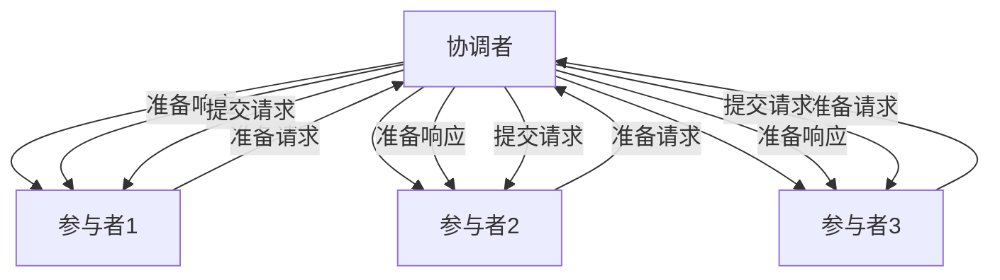
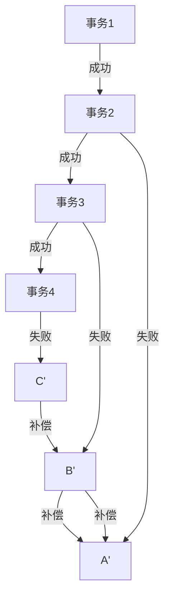

## 前言

在当今的软件开发领域，微服务架构已经成为构建大型分布式系统的主流选择。它通过将系统拆分为一系列小型、独立的服务，带来了更好的可扩展性、灵活性和团队自治性。然而，随着系统复杂度的增加，特别是在处理跨多个服务的业务流程时，分布式事务问题变得尤为突出。

作为一名在分布式系统领域摸爬滚打多年的开发者，我深刻体会到分布式事务在微服务架构中的复杂性和挑战。今天，我想和大家分享一些我在实践中总结的经验和思考，希望能帮助大家更好地理解和解决微服务架构中的分布式事务问题。

## 微服务架构与分布式事务的碰撞

微服务架构的核心思想是将单体应用拆分为多个独立部署、独立运行的服务。每个服务都有自己的数据库，遵循单一数据源原则。这种设计虽然带来了很多好处，但也引入了分布式事务的挑战。

::: tip
在微服务架构中，一个业务操作通常需要跨多个服务完成，这就不可避免地需要处理分布式事务问题。
:::

### 为什么微服务架构需要关注分布式事务？

在单体应用中，事务管理相对简单，因为所有操作都在同一个数据库中，可以使用本地事务保证ACID特性。但在微服务架构中，情况变得复杂：

1. **数据隔离**：每个服务都有自己的数据库，无法使用传统的本地事务。
2. **网络不可靠**：服务间通信依赖网络，网络故障可能导致数据不一致。
3. **服务独立性**：每个服务可以独立部署和扩展，增加了事务管理的复杂性。

## 分布式事务的挑战

在微服务架构中处理分布式事务，我们面临着几个核心挑战：

### 1. ACID特性的保证

传统的ACID（原子性、一致性、隔离性、持久性）在分布式环境中难以完全保证：

- **原子性**：如何确保所有服务的操作要么全部成功，要么全部失败？
- **一致性**：如何确保所有服务的数据保持一致状态？
- **隔离性**：在并发访问的情况下，如何避免脏读、不可重复读和幻读？
- **持久性**：如何确保数据一旦提交就不会丢失？

### 2. 性能与可用性的权衡

分布式事务往往会牺牲系统的性能和可用性：

- **性能开销**：分布式事务需要额外的协调和通信，增加了延迟。
- **可用性降低**：为了保证一致性，系统可能需要牺牲部分可用性（如CAP理论中的C）。

### 3. 故障处理的复杂性

分布式系统中的故障处理比单体应用复杂得多：

- **网络分区**：网络分区可能导致服务间通信中断。
- **部分失败**：某些服务可能成功而其他服务失败，导致数据不一致。
- **超时与重试**：如何正确处理超时和重试，避免重复执行导致的问题？

## 分布式事务解决方案

面对这些挑战，业界提出了多种分布式事务解决方案，每种方案都有其适用场景和优缺点。

### 1. 两阶段提交（2PC）

两阶段提交是一种经典的分布式事务协议，分为准备阶段和提交阶段：



**优点**：
- 保证强一致性
- 实现相对简单

**缺点**：
- 同步阻塞，性能较差
- 单点故障风险
- 协调者故障可能导致参与者资源锁定

::: theorem
2PC适用于对一致性要求高、性能要求不高的场景，如金融交易系统。
:::

### 2. 三阶段提交（3PC）

三阶段提交是2PC的改进版，增加了预提交阶段，减少了阻塞时间：

**优点**：
- 比2PC更可靠，减少了阻塞时间
- 在协调者故障时，参与者可以自主决定提交或中止

**缺点**：
- 实现更复杂
- 性能开销更大
- 仍然存在单点故障问题

### 3. TCC（Try-Confirm-Cancel）

TCC是一种业务层面的分布式事务解决方案，将一个业务操作分为三个阶段：

- **Try**：资源检查和预留
- **Confirm**：执行业务操作
- **Cancel**：取消操作，释放资源

**示例**：转账操作
- Try：检查账户余额，预留转账金额
- Confirm：实际执行转账操作
- Cancel：取消转账，释放预留金额

**优点**：
- 高性能，非阻塞
- 可以根据业务定制补偿逻辑
- 适用于高并发场景

**缺点**：
- 业务侵入性强，需要修改业务代码
- 实现复杂，需要考虑各种异常情况
- 可能存在资源预留时间过长的问题

### 4. Saga模式

Saga模式将一个长事务拆分为一系列本地事务，每个本地事务都有一个对应的补偿事务：



**优点**：
- 无需长时间锁定资源
- 可以实现最终一致性
- 适用于长事务和业务流程

**缺点**：
- 不保证强一致性
- 补偿逻辑实现复杂
- 可能出现"脏回滚"问题

### 5. 本地消息表（Local Message Table）

本地消息表是一种基于可靠消息的解决方案，通过本地消息表和外部消息队列实现分布式事务：

**实现步骤**：
1. 在本地数据库中创建消息表
2. 执行本地事务，同时将操作记录到消息表
3. 将消息发送到消息队列
4. 消费者从消息队列获取消息并执行相应操作
5. 更新消息状态为已处理

**优点**：
- 实现相对简单
- 可以保证最终一致性
- 适用于异步场景

**缺点**：
- 需要额外的消息队列组件
- 存在消息重复处理的风险
- 可能出现数据不一致的情况

## 微服务架构中的分布式事务实践

在实际的微服务架构中，我们需要根据业务场景选择合适的分布式事务解决方案。以下是一些实践经验和最佳实践：

### 1. 根据业务场景选择合适的方案

不同的业务场景对一致性、性能和可用性的要求不同，需要选择合适的解决方案：

| 业务场景 | 一致性要求 | 性能要求 | 推荐方案 |
|---------|-----------|---------|---------|
| 金融交易 | 强一致性 | 中等 | 2PC、TCC |
| 电商订单 | 最终一致性 | 高 | Saga、本地消息表 |
| 数据同步 | 最终一致性 | 高 | 本地消息表 |
| 库存管理 | 强一致性 | 中等 | TCC |

### 2. 混合使用多种方案

在实际项目中，往往需要混合使用多种分布式事务解决方案：

- 对于核心业务流程，使用TCC保证强一致性
- 对于非核心业务流程，使用Saga模式保证最终一致性
- 对于系统间数据同步，使用本地消息表

### 3. 设计补偿机制

无论使用哪种分布式事务解决方案，都需要设计合理的补偿机制：

- **幂等设计**：确保操作可以重复执行而不会产生副作用
- **重试机制**：对于临时性故障，设计合理的重试策略
- **超时控制**：设置合理的超时时间，避免长时间阻塞
- **异常处理**：设计完善的异常处理机制，确保系统稳定性

### 4. 监控与告警

分布式事务的监控和告警至关重要：

- **事务状态监控**：实时监控事务的执行状态
- **异常告警**：对异常情况及时告警
- **性能指标**：监控事务执行的性能指标
- **数据一致性检查**：定期检查数据一致性，发现潜在问题

## 微服务架构中的分布式事务优化

在微服务架构中，除了选择合适的分布式事务解决方案外，还可以通过以下方式优化分布式事务：

### 1. 服务拆分优化

合理的服务拆分可以减少分布式事务的复杂性：

- **高内聚低耦合**：确保服务内部功能高度相关，服务间耦合度低
- **避免长事务**：避免跨多个服务的长事务
- **考虑业务边界**：根据业务边界进行服务拆分，减少跨服务事务

### 2. 数据一致性策略

根据业务需求选择合适的数据一致性策略：

- **强一致性**：对于核心业务数据，使用强一致性策略
- **最终一致性**：对于非核心业务数据，使用最终一致性策略
- **因果一致性**：对于有因果关系的操作，使用因果一致性

### 3. 缓存策略

合理的缓存策略可以减少分布式事务的复杂性：

- **缓存一致性**：确保缓存与数据库的一致性
- **缓存更新策略**：选择合适的缓存更新策略（如写穿透、写回、写失效）
- **缓存穿透保护**：防止缓存穿透导致数据库压力过大

### 4. 异步化处理

通过异步化处理减少分布式事务的阻塞：

- **事件驱动架构**：使用事件驱动架构实现服务间解耦
- **消息队列**：使用消息队列实现异步通信
- **补偿机制**：设计合理的补偿机制处理异步操作失败的情况

## 案例分析：电商平台订单系统

让我们通过一个电商平台的订单系统案例，看看如何在实际应用中处理分布式事务。

### 业务场景

电商平台订单系统涉及多个微服务：
- 订单服务：创建订单、查询订单
- 支付服务：处理支付
- 库存服务：管理商品库存
- 物流服务：处理订单发货

### 分布式事务挑战

创建订单时需要：
1. 创建订单记录
2. 扣减库存
3. 处理支付
4. 更新订单状态

这些操作涉及多个微服务，需要保证操作的原子性。

### 解决方案

我们采用混合的分布式事务解决方案：

1. **订单创建阶段**：使用TCC模式
   - Try：创建订单记录，预留库存
   - Confirm：确认订单，扣减实际库存
   - Cancel：取消订单，释放预留库存

2. **支付处理阶段**：使用本地消息表
   - 订单服务将支付请求发送到消息队列
   - 支付服务从消息队列获取请求并处理
   - 支付结果更新订单状态

3. **发货处理阶段**：使用Saga模式
   - 创建发货单
   - 更新库存
   - 发送物流信息
   - 如果某个步骤失败，执行补偿操作

### 实现细节

```java
// 订单服务 - Try阶段
@Transactional
public Order createOrder(OrderDTO orderDTO) {
    // 1. 创建订单
    Order order = orderRepository.save(orderDTO.toOrder());
    
    // 2. 预留库存
    inventoryService.reserveInventory(orderDTO.getItems());
    
    // 3. 发送支付请求到消息队列
    messageQueue.send("payment_queue", new PaymentRequest(order.getId(), order.getTotalAmount()));
    
    return order;
}

// 支付服务 - 处理支付
@RabbitListener(queues = "payment_queue")
public void processPayment(PaymentRequest request) {
    try {
        // 处理支付逻辑
        Payment payment = paymentService.processPayment(request);
        
        // 更新订单状态
        orderService.updateOrderStatus(request.getOrderId(), OrderStatus.PAID);
        
    } catch (Exception e) {
        // 处理支付失败
        orderService.updateOrderStatus(request.getOrderId(), OrderStatus.PAYMENT_FAILED);
        throw e;
    }
}

// 库存服务 - Confirm阶段
@Transactional
public void confirmInventoryReserve(String orderId) {
    // 确认库存预留，实际扣减库存
    inventoryRepository.confirmReserve(orderId);
}

// 库存服务 - Cancel阶段
@Transactional
public void cancelInventoryReserve(String orderId) {
    // 取消库存预留，释放库存
    inventoryRepository.cancelReserve(orderId);
}
```

## 结语

在微服务架构中处理分布式事务是一个复杂但重要的话题。没有一种通用的解决方案适用于所有场景，我们需要根据具体的业务需求、性能要求和一致性要求，选择合适的分布式事务解决方案。

通过合理的服务拆分、混合使用多种分布式事务解决方案、设计合理的补偿机制和监控告警，我们可以在保证数据一致性的同时，提供良好的性能和可用性。

作为一名分布式系统开发者，我认为在微服务架构中处理分布式事务，关键在于平衡一致性、性能和可用性，并根据业务场景做出合理的选择。随着技术的不断发展，我们也会看到更多创新的分布式事务解决方案出现。

希望这篇文章能对大家在微服务架构中处理分布式事务有所帮助。如果有任何问题或建议，欢迎在评论区留言讨论！

> "在分布式系统中，没有银弹，只有适合特定场景的解决方案。" —— 分布式系统设计原则