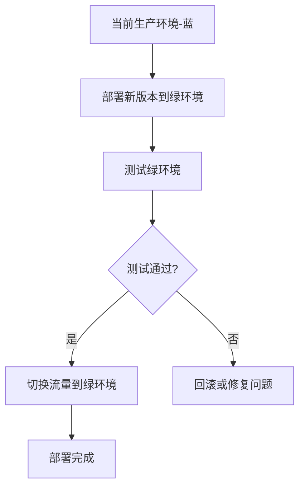
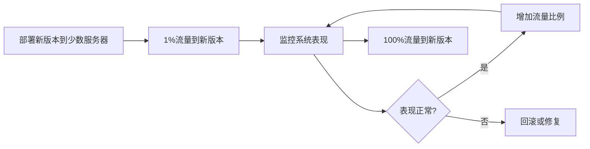
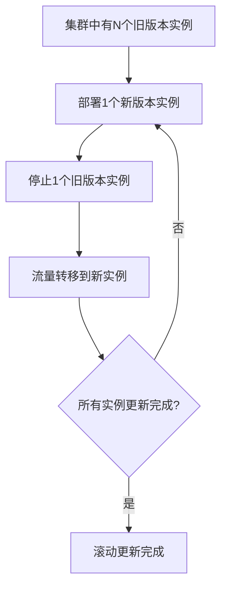

## 前言

在分布式系统的演进过程中，版本更新是家常便饭。然而，一次不当的发布可能导致整个系统服务中断，造成不可估量的业务损失。想象一下，如果你的电商系统在双十一期间进行全面更新，却因为一个未发现的bug导致交易系统崩溃，那将是多么灾难性的场景。

灰度发布（Gray Release）和渐进式部署（Progressive Deployment）正是解决这一难题的关键技术。它们允许我们像品尝新菜一样，先让一小部分用户尝试新版本，观察系统表现，确认无误后再逐步扩大范围，最终完成全量发布。本文将深入探讨分布式系统中的灰度发布与渐进式部署策略，帮助你在系统迭代中保持稳定与可靠。

## 为什么需要灰度发布

在分布式系统中，灰度发布的重要性不言而喻：

1. **风险控制**：通过小范围测试，提前发现潜在问题，避免全量发布带来的系统性风险
2. **业务连续性**：确保核心业务在任何情况下都能正常运行
3. **用户影响最小化**：即使新版本有问题，也只会影响一小部分用户
4. **数据验证**：真实环境下的性能数据和用户反馈，比测试环境更具参考价值

::: theorem
灰度发布的核心思想是"控制变量"，通过逐步扩大影响范围，将一次大规模变更分解为多个小规模变更，从而降低单次变更的风险。
:::

## 灰度发布的核心策略

### 1. 基于用户特征的灰度

这是最常见的灰度发布方式，根据用户的不同特征进行分流：

- **用户ID哈希**：根据用户ID的哈希值决定是否进入灰度
- **用户标签**：根据用户属性（如VIP、普通用户）进行分流
- **地理位置**：按区域逐步发布，如先一线城市，再二三线城市
- **设备类型**：先在特定设备上发布，验证兼容性

```javascript
// 基于用户ID哈希的灰度策略示例
function isInGrayRelease(userId, grayPercentage) {
  const hash = hashFunction(userId);
  return hash % 100 < grayPercentage;
}
```

### 2. 基于流量比例的灰度

通过API网关或服务网格控制流量分配：

- **百分比分流**：如10%流量走新版本，90%走旧版本
- **按请求特征分流**：根据请求的API路径、参数等特征进行分流
- **金丝雀发布**：随机选择特定比例的请求进入新版本

```yaml
# 基于Kubernetes的灰度发布配置示例
apiVersion: networking.istio.io/v1alpha3
kind: VirtualService
metadata:
  name: product-service
spec:
  hosts:
  - product-service
  http:
  - route:
    - destination:
        host: product-service
        subset: v1
      weight: 90
    - destination:
        host: product-service
        subset: v2
      weight: 10
```

### 3. 基于时间的灰度

按时间阶段逐步扩大发布范围：

- **初始阶段**：仅内部测试环境
- **小范围阶段**：1%-5%用户
- **中等范围阶段**：10%-30%用户
- **大规模阶段**：50%-80%用户
- **全量阶段**：100%用户

## 渐进式部署的实现方式

### 1. 蓝绿部署

蓝绿部署是一种简单的渐进式部署方式，维护两套完全相同的生产环境：

- **蓝环境**：当前正在运行的生产环境
- **绿环境**：新版本部署环境

部署流程：
1. 在绿环境部署新版本
2. 对绿环境进行全面测试
3. 测试通过后，将流量从蓝环境切换到绿环境
4. 切换完成后，蓝环境可作为下次部署的绿环境



**优点**：
- 切换快速，只需修改路由配置
- 回滚简单，只需切回蓝环境
- 无需停机维护

**缺点**：
- 需要双倍资源
- 数据同步复杂

### 2. 金丝雀发布

金丝雀发布是更精细的灰度发布方式：

1. 部署新版本到一小部分服务器（如1-2台）
2. 将少量流量（如1%）路由到新版本
3. 监控新版本的性能和错误率
4. 逐步增加流量比例，同时密切监控系统表现
5. 达到预期目标后，完成全量发布



### 3. 滚动更新

滚动更新逐步替换旧版本实例：

1. 部署新版本的一个实例
2. 停止一个旧版本实例
3. 将流量转移到新实例
4. 重复上述步骤直到所有实例更新完成



**优点**：
- 资源利用率高，无需额外环境
- 平滑过渡，用户无感知

**缺点**：
- 更新过程较长
- 需要完善的监控和回滚机制

## 灰度发布的关键技术组件

### 1. 流量控制

流量控制是灰度发布的核心，常见实现方式：

- **API网关**：如Kong, Nginx, Spring Cloud Gateway
- **服务网格**：如Istio, Linkerd
- **自定义路由**：基于业务需求实现的分流逻辑

### 2. 监控系统

完善的监控系统是灰度发布的保障：

- **性能指标**：响应时间、吞吐量、错误率
- **业务指标**：关键业务数据、用户行为
- **系统指标**：CPU、内存、磁盘使用率

### 3. 自动化回滚机制

当检测到问题时，自动触发回滚：

- **基于指标阈值**：当错误率超过阈值时自动回滚
- **基于人工触发**：运维人员手动触发回滚
- **定时回滚**：设定最大灰度时间，超时自动回滚

```yaml
# 基于Prometheus的自动回滚规则示例
groups:
- name: gray-release-rules
  rules:
  - alert: HighErrorRate
    expr: rate(http_requests_total{status=~"5.."}[5m]) / rate(http_requests_total[5m]) > 0.05
    for: 2m
    labels:
      severity: critical
    annotations:
      summary: "High error rate detected in gray release"
      description: "Error rate is above 5% for more than 2 minutes"
```

### 4. 配置中心

灰度发布需要动态配置支持：

- **集中式配置管理**：如Apollo, Nacos, Spring Cloud Config
- **动态配置更新**：无需重启即可更新分流策略
- **版本化管理**：配置变更历史可追溯

## 灰度发布最佳实践

### 1. 制定明确的发布策略

在发布前明确以下内容：

- 灰度范围和比例
- 监控指标和阈值
- 回滚条件和流程
- 发布时间窗口

### 2. 完善监控告警

建立全方位的监控体系：

- **技术指标监控**：系统性能、资源使用
- **业务指标监控**：核心业务数据、用户转化率
- **用户体验监控**：页面加载时间、错误反馈

### 3. 建立发布检查清单

制定标准化的发布流程：

- 代码质量检查
- 自动化测试通过
- 预发布环境验证
- 灰度环境准备
- 监控告警配置
- 回滚方案准备

### 4. 团队协作与沟通

确保所有相关人员了解发布计划：

- 提前通知业务团队
- 建立应急响应机制
- 准备用户沟通预案
- 发布后及时总结复盘

## 案例分析

### 某电商平台灰度发布实践

某大型电商平台在"双十一"前的一次重要功能发布采用了灰度发布策略：

1. **准备阶段**：
   - 在预发布环境完成功能测试
   - 配置监控系统，设置关键指标阈值
   - 准备回滚方案和应急响应流程

2. **灰度发布阶段**：
   - 第1天：内部员工测试（1%流量）
   - 第2天：VIP用户测试（5%流量）
   - 第3-5天：逐步扩大到10%、30%、50%流量
   - 每个阶段密切监控系统表现

3. **监控指标**：
   - 核心API响应时间
   - 订单创建成功率
   - 支付成功率
   - 用户投诉量

4. **结果**：
   - 发现并修复了3个潜在问题
   - 用户反馈积极
   - 成功完成全量发布，系统稳定运行

## 未来展望

随着云原生和微服务架构的普及，灰度发布技术也在不断发展：

1. **智能化灰度发布**：基于机器学习自动判断最佳发布策略
2. **多云环境灰度**：跨云服务商的灰度发布与流量调度
3. **边缘计算环境灰度**：适应边缘计算场景的轻量级灰度方案
4. **DevSecOps集成**：将安全检查纳入灰度发布流程

## 结语

灰度发布与渐进式部署是分布式系统稳定性的重要保障。通过合理的灰度策略、完善的监控体系和自动化的回滚机制，我们可以在系统迭代中平衡创新与稳定，为用户提供持续优质的服务。

记住，技术只是手段，业务价值才是目标。灰度发布不是阻碍创新的绊脚石，而是保障创新安全落地的护航舰。在实际应用中，我们需要根据业务特点和系统架构，选择最适合的灰度发布策略，并在实践中不断优化完善。

> "在分布式系统中，没有完美的发布策略，只有最适合当前场景的发布方式。"

希望本文能为你构建稳定可靠的分布式系统提供一些思路和启发。如果你有任何灰度发布实践经验或问题，欢迎在评论区交流讨论！