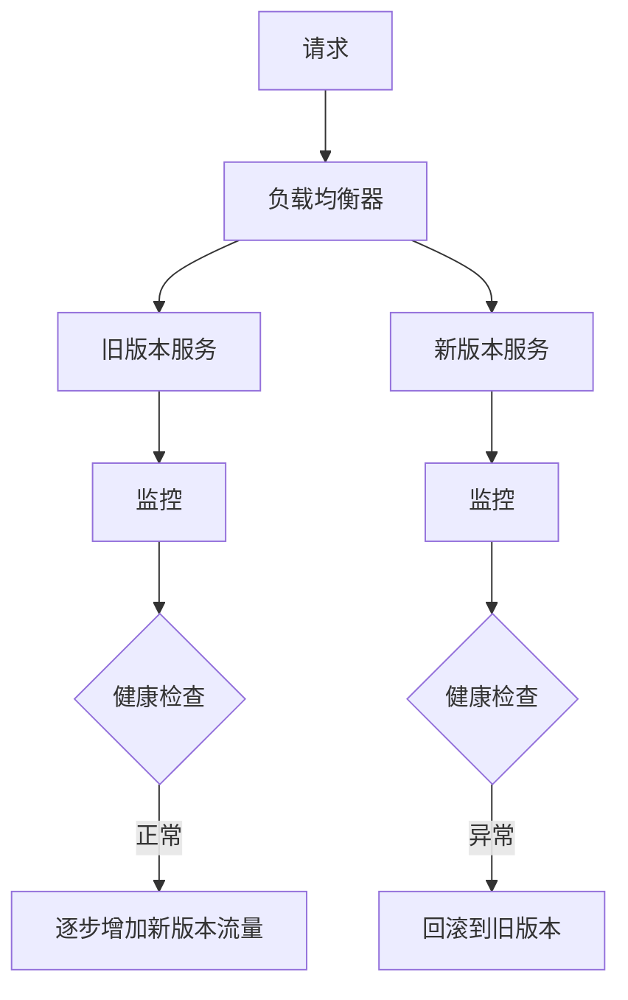
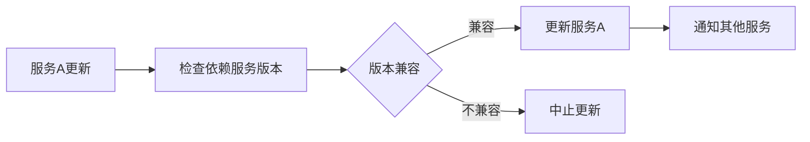

## 前言

在构建和维护分布式系统的过程中，我们常常将注意力集中在一致性、可用性和分区容错性等核心原则上。然而，一个同样重要但经常被忽视的方面是**版本控制**。随着系统规模的扩大和组件数量的增加，如何有效管理不同服务、配置和数据之间的版本关系，成为确保系统稳定演进的关键挑战。

::: tip
"在分布式系统中，版本控制不仅仅是代码管理，更是系统演进的导航仪。"
:::

## 分布式版本控制的挑战

### 1. 服务版本管理的复杂性

在微服务架构中，每个服务可能独立演进，导致系统同时存在多个版本的服务实例。这种复杂性带来了几个关键挑战：

- **服务间兼容性**：不同版本的服务如何正确通信
- **依赖管理**：服务如何处理对其他服务的依赖关系
- **流量控制**：如何将请求正确路由到适当版本的服务

### 2. 配置版本管理的难题

配置是分布式系统中的另一个关键元素，其版本管理面临独特挑战：

- **配置一致性**：如何确保所有节点使用一致的配置版本
- **动态更新**：如何在不停机的情况下更新配置
- **回滚能力**：如何快速回滚到之前的配置版本

### 3. 数据版本控制的挑战

数据是分布式系统的核心资产，数据版本的复杂性包括：

- **数据迁移**：如何在不同版本的数据模型间安全迁移
- **数据兼容性**：如何处理新旧数据格式的兼容问题
- **数据一致性**：如何确保数据变更的原子性和一致性

## 分布式版本控制策略

### 1. 服务版本管理策略

#### 语义化版本控制

采用语义化版本控制（Semantic Versioning）规范，为每个服务分配主版本号.次版本号.修订号的版本标识：

```
主版本号：不兼容的API修改
次版本号：向下兼容的功能性新增
修订号：向下兼容的问题修正
```

#### 蓝绿部署与金丝雀发布

- **蓝绿部署**：维护两套完整的生产环境，通过流量切换实现零停机部署
- **金丝雀发布**：逐步将流量引导到新版本，监控性能和稳定性



### 2. 配置版本管理策略

#### 配置即代码

将配置纳入版本控制系统，与代码一同管理：

```yaml
# service-config.yaml
version: 1.2.0
services:
  user-service:
    endpoints:
      - /api/users
    database:
      host: db.example.com
      port: 5432
```

#### 配置中心与动态更新

使用专门的配置中心管理配置版本，支持动态更新：

```
配置中心 → 配置版本库 → 配置变更通知 → 服务实例
```

### 3. 数据版本控制策略

#### 数据迁移脚本管理

为数据模型变更编写可重复执行的迁移脚本：

```sql
-- migration_001_create_users_table.sql
CREATE TABLE users (
    id SERIAL PRIMARY KEY,
    username VARCHAR(50) NOT NULL,
    email VARCHAR(100) NOT NULL,
    created_at TIMESTAMP DEFAULT CURRENT_TIMESTAMP
);
```

#### 数据兼容性层

实现数据兼容性层，处理新旧数据格式的转换：

```javascript
// data-compatibility.js
function convertUserData(oldFormat) {
    return {
        id: oldFormat.id,
        username: oldFormat.name,
        email: oldFormat.email,
        createdAt: oldFormat.created_at
    };
}
```

## 分布式版本控制最佳实践

### 1. 版本一致性保证

#### 事务性更新

确保相关组件的版本更新是原子性的：



#### 版本协商机制

实现服务间的版本协商机制，自动选择兼容的通信协议：

```go
// version negotiation example
func negotiateVersion(clientVersion, serverVersion string) string {
    if isCompatible(clientVersion, serverVersion) {
        return serverVersion
    }
    return findCompatibleVersion(clientVersion)
}
```

### 2. 版本监控与回滚

#### 版本健康监控

建立全面的版本健康监控系统：

- **性能指标**：响应时间、吞吐量、错误率
- **兼容性指标**：版本冲突、协议不兼容
- **业务指标**：用户反馈、业务成功率

#### 自动化回滚机制

实现基于阈值的自动回滚机制：

```python
# automated rollback example
def check_version_health(version_metrics):
    if version_metrics.error_rate > threshold:
        trigger_rollback(version)
    elif version_metrics.response_time > threshold:
        alert_team(version)
```

### 3. 版本兼容性测试

#### 兼容性矩阵测试

建立服务版本兼容性矩阵，确保所有组合都经过测试：

| 服务版本 | 依赖版本A | 依赖版本B | 依赖版本C |
|---------|---------|---------|---------|
| 1.0.0   | ✓       | ✓       | ✓       |
| 1.1.0   | ✓       | ✓       | ✗       |
| 1.2.0   | ✗       | ✓       | ✓       |

#### 混沌测试

实施版本相关的混沌测试，验证系统在版本不一致情况下的弹性：

```yaml
# chaos test example
chaos_tests:
  - name: "版本不一致测试"
    scenario: "部分节点使用旧版本"
    duration: "30分钟"
    metrics:
      - "错误率"
      - "响应时间"
      - "成功率"
```

## 实际案例分析

### 案例1：电商平台的服务版本管理

某大型电商平台采用多版本服务管理策略，通过以下方式解决版本控制问题：

1. **服务网格**：使用Istio管理服务间通信，自动处理版本路由
2. **版本标签**：为每个服务实例添加版本标签，实现精细流量控制
3. **渐进式发布**：通过金丝雀发布策略，逐步验证新版本稳定性

### 案例2：金融系统的配置版本管理

某金融系统采用以下配置版本管理实践：

1. **配置即代码**：所有配置纳入Git仓库管理
2. **配置审批流程**：实施严格的配置变更审批机制
3. **配置快照**：定期配置快照，支持快速回滚

## 未来展望

随着分布式系统规模的不断扩大和复杂性的增加，版本控制将面临新的挑战和机遇：

1. **AI辅助版本管理**：利用机器学习预测版本兼容性风险
2. **自动化版本迁移**：实现数据模型和API的自动迁移
3. **区块链版本证明**：使用区块链技术提供版本变更的不可篡改记录

> 在分布式系统的演进过程中，版本控制如同系统的"免疫系统"，确保各个组件能够和谐共存、协同工作。建立完善的版本控制策略，是构建可维护、可演进分布式系统的关键一步。

## 结语

分布式系统中的版本控制是一个复杂但至关重要的主题。通过采用语义化版本控制、蓝绿部署、配置即代码等策略，结合完善的监控和回滚机制，我们可以有效管理分布式系统中的版本复杂性。随着技术的不断发展，版本控制策略也需要持续演进，以适应日益复杂的分布式环境。

在构建和维护分布式系统时，请记住：**良好的版本控制不仅是技术问题，更是工程文化和团队协作的体现**。