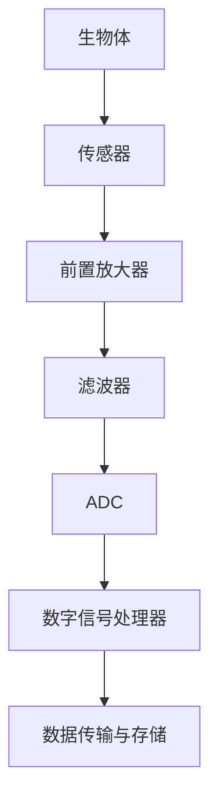

## 前言

在电子工程的世界里，我们常常关注的是如何构建更高效、更强大的电子系统，如何提高信号处理的精度，如何设计更可靠的电路。然而，当电子技术遇见生命科学，一个充满无限可能的交叉领域诞生了——生物医学电子学。这个领域不仅融合了电子工程的技术优势，更承载着改善人类健康、提升生活质量的使命。

> "医学的未来在于将电子技术与生物医学深度融合，创造出能够理解、监测甚至干预生命过程的智能系统。"

## 生物医学电子学概述

生物医学电子学是电子工程与生物医学工程交叉融合的学科，主要研究电子技术在生物医学领域的应用。这个领域的发展不仅推动了医疗技术的革新，也为电子工程开辟了新的研究方向和应用场景。

生物医学电子学的核心在于将电子技术应用于生物医学领域，包括：

- 生物信号的采集、处理与分析
- 医疗电子设备的设计与实现
- 生物医学成像技术
- 可穿戴健康监测系统
- 医疗机器人与辅助系统
- 远程医疗与医疗物联网

## 生物信号采集与处理

### 生物信号的特点

生物信号是生物体在生命活动中产生的各种电、化学、物理信号。与工程信号相比，生物信号具有以下特点：

- **幅度微弱**：通常在微伏(mV)到毫伏(mV)级别
- **频率范围广**：从直流到数kHz不等
- **噪声干扰大**：易受工频干扰、肌电干扰等影响
- **个体差异大**：不同个体间信号特征差异明显
- **非平稳性**：信号特征随时间变化

### 常见生物信号类型

1. **心电信号(ECG/ECG)**：反映心脏电活动，用于心律失常诊断、心脏功能评估等。
2. **脑电信号(EEG)**：反映大脑神经元活动，用于脑功能研究、癫痫检测等。
3. **肌电信号(EMG)**：反映肌肉电活动，用于肌肉功能评估、假肢控制等。
4. **眼电信号(EOG)**：反映眼球运动，用于眼动研究、睡眠分析等。
5. **胃电信号(EGG)**：反映胃部电活动，用于胃肠功能评估等。

### 生物信号采集系统设计

一个典型的生物信号采集系统包括：

1. **传感器**：将生物信号转换为电信号
2. **前置放大器**：放大微弱信号，提高信噪比
3. **滤波器**：去除噪声和干扰
4. **模数转换器(ADC)**：将模拟信号转换为数字信号
5. **数字信号处理器**：对数字信号进行处理和分析
6. **数据传输与存储**：将处理后的数据传输到上位机或云端

## 医疗电子设备

### 诊断类医疗设备

1. **心电图机(ECG)**：记录心脏电活动，用于心脏疾病诊断。
2. **脑电图仪(EEG)**：记录大脑电活动，用于神经系统疾病诊断。
3. **肌电图仪(EMG)**：记录肌肉电活动，用于肌肉疾病诊断。
4. **内窥镜系统**：用于体内器官的直观检查。
5. **超声成像系统**：利用超声波进行无创成像。

### 治疗类医疗设备

1. **心脏起搏器**：通过电刺激调节心脏节律。
2. **除颤器**：通过电击治疗心律失常。
3. **神经刺激器**：用于治疗帕金森病、癫痫等神经系统疾病。
4. **人工耳蜗**：帮助听力受损者恢复听觉。
5. **激光手术设备**：利用激光进行精确手术。

### 监护类医疗设备

1. **患者监护仪**：实时监测患者生命体征。
2. **胎儿监护仪**：监测胎儿健康状况。
3. **呼吸机**：辅助或替代患者呼吸功能。
4. **透析设备**：替代肾脏功能，清除体内毒素。

## 医学成像技术

### X射线成像

X射线成像是最早的医学成像技术之一，利用X射线穿透人体不同组织后的吸收差异形成图像。

**技术特点**：
- 高空间分辨率
- 对骨骼等高密度组织显像效果好
- 存在辐射风险
- 发展方向：低剂量成像、三维重建

### 超声成像

超声成像利用超声波在人体组织中的反射和散射形成图像。

**技术特点**：
- 无辐射
- 实时成像
- 对软组织显像效果好
- 成本相对较低
- 发展方向：高分辨率成像、弹性成像、多普勒血流成像

### 磁共振成像(MRI)

MRI利用强磁场和射频脉冲，探测人体组织中氢原子核的共振信号，形成高对比度图像。

**技术特点**：
- 无电离辐射
- 软组织对比度高
- 多参数成像
- 成本高、扫描时间长
- 发展方向：快速成像、功能成像、分子成像

## 可穿戴健康监测系统

### 可穿戴设备概述

可穿戴健康监测系统是将传感器、电子电路和数据处理算法集成在可穿戴设备中，实现对用户健康状态的实时监测和评估。

### 常见可穿戴健康监测设备

1. **智能手表/手环**：监测心率、血氧、运动状态等。
2. **智能服装**：集成柔性传感器，监测生理参数和运动姿态。
3. **智能眼镜**：监测眼动、眨眼频率等，用于健康评估和辅助功能。
4. **智能鞋垫**：监测步态、足底压力等，用于运动分析和康复评估。
5. **智能贴片**：贴在皮肤上，监测体温、心电等生理参数。

### 可穿戴健康监测系统关键技术

1. **微型化传感器技术**：低功耗、高精度、小型化传感器。
2. **低功耗电路设计**：延长电池续航时间。
3. **柔性电子技术**：实现可弯曲、可拉伸的电子设备。
4. **无线通信技术**：实现数据实时传输。
5. **边缘计算技术**：在设备端进行数据处理，减少数据传输量。
6. **人工智能算法**：实现健康数据的智能分析和异常检测。

## 医疗机器人与辅助系统

### 手术机器人

手术机器人能够辅助医生进行精确、微创的手术操作，提高手术精度和安全性。

**典型案例**：
- 达芬奇手术系统：通过机械臂辅助医生进行微创手术
- ROSA手术机器人：神经外科和骨科手术辅助系统

### 康复机器人

康复机器人帮助患者进行康复训练，提高康复效果。

**应用场景**：
- 上肢康复训练
- 下肢康复训练
- 手部功能康复
- 认知功能康复

### 辅助生活机器人

辅助生活机器人帮助老年人或残障人士提高生活质量。

**功能特点**：
- 行走辅助
- 生活照料
- 情感陪伴
- 紧急呼叫

## 远程医疗与医疗物联网

### 远程医疗概述

远程医疗利用通信技术，实现医生与患者之间的远程诊疗、监测和管理。

### 医疗物联网架构

医疗物联网(MIoT)是物联网技术在医疗领域的应用，主要包括：

1. **感知层**：各类医疗传感器和设备
2. **网络层**：通信网络，包括有线和无线通信
3. **平台层**：数据存储、处理和分析平台
4. **应用层**：面向用户的应用服务

### 远程医疗应用场景

1. **远程诊断**：通过远程影像诊断、远程会诊等方式
2. **远程监护**：对患者生命体征的远程监测
3. **远程手术**：专家远程指导手术操作
4. **远程康复**：患者在家中接受康复指导
5. **健康管理**：个性化健康管理和干预

## 生物医学电子学的发展趋势

### 智能化与精准化

人工智能技术在生物医学电子学中的应用，将使医疗设备更加智能化，实现精准诊断和治疗。

**应用方向**：
- 智能诊断：基于AI的医学影像分析
- 个性化治疗：根据患者特点定制治疗方案
- 预测性医疗：预测疾病发展趋势和风险

### 微型化与可穿戴化

随着微电子技术和柔性电子技术的发展，医疗设备将更加微型化、可穿戴化，实现无创、连续监测。

**技术挑战**：
- 低功耗设计
- 信号质量保证
- 用户体验优化
- 数据安全与隐私保护

### 网络化与云端化

医疗设备将更加网络化，实现数据共享和远程访问，云端计算将为医疗大数据分析提供支持。

**发展方向**：
- 医疗数据标准化
- 数据安全与隐私保护
- 跨平台数据共享
- 全球医疗协作

## 结语

生物医学电子学作为电子工程与生命科学的交叉领域，正在深刻改变医疗健康领域。从诊断设备到治疗系统，从监护设备到康复辅助，生物医学电子技术正在为人类健康保驾护航。

> "电子工程与生物医学的融合，不仅是技术的跨界，更是对生命的关怀与尊重。"

作为电子工程师，我们不仅需要掌握电子技术，还需要了解生物医学知识，理解医疗需求，才能设计出真正有价值的医疗电子设备。未来，随着人工智能、物联网、柔性电子等技术的发展，生物医学电子学将迎来更加广阔的发展空间，为人类健康事业做出更大贡献。