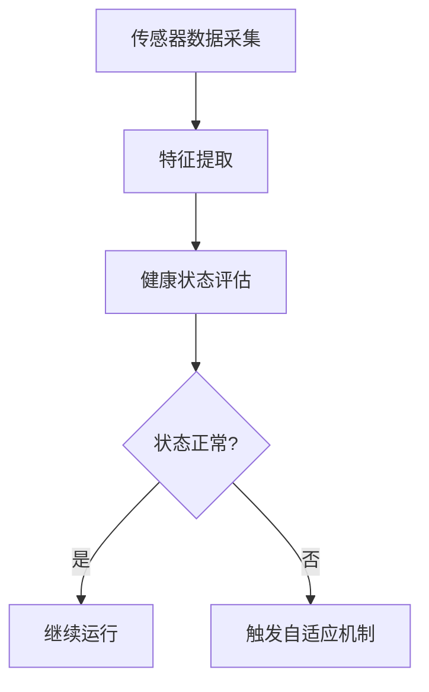

## 前言

在当今高度依赖电子系统的世界中，系统的可靠性和稳定性变得至关重要。无论是航空航天设备、医疗仪器还是工业控制系统，任何故障都可能导致灾难性后果。传统的电子系统设计主要依赖于冗余备份和定期维护，但这些方法往往成本高昂且无法应对所有可能的故障场景。

🤔 **想象一下**：如果电子系统能够像生物体一样，自我监测健康状况、诊断问题并主动修复，那将彻底改变我们对系统可靠性的认知。这就是自适应与自修复电子系统的核心思想——构建能够感知自身状态、适应环境变化并在出现故障时自我恢复的智能电子系统。

> "自适应与自修复技术代表了电子系统设计的范式转变，从被动应对故障到主动预防与修复，这将开启电子工程的新纪元。"

## 自适应技术基础

自适应电子系统是指能够根据内部状态和外部环境变化自动调整其参数和行为的系统。这种能力基于以下几个关键机制：

### 1. 自我监测与诊断

自适应系统首先需要能够实时监测自身的健康状态。这包括：

- **参数监测**：电压、电流、温度、频率等关键参数的实时监控
- **性能评估**：系统响应时间、吞吐量、错误率等性能指标的持续跟踪
- **异常检测**：通过机器学习算法识别偏离正常模式的行为

### 2. 自适应控制策略

当系统检测到异常或环境变化时，自适应系统会采取相应的调整策略：

- **参数调整**：动态调整工作电压、时钟频率、功耗等参数
- **资源重新分配**：根据负载情况重新分配计算资源、内存带宽等
- **行为模式切换**：从高能效模式切换到高性能模式，或反之

::: theorem
自适应系统的数学基础
自适应系统通常基于反馈控制理论，其基本形式可以表示为：
u(t) = K(e(t))
其中u(t)是控制信号，e(t)是误差信号，K是控制算法。
:::

## 自修复技术原理

自修复技术更进一步，不仅能够适应变化，还能主动修复已发生的故障。自修复可以分为硬件层面和软件层面。

### 1. 硬件自修复技术

硬件自修复主要关注物理层面的故障恢复：

#### 动态冗余配置

- **模块级冗余**：关键模块配备备用模块，主模块故障时自动切换
- **芯片级冗余**：在芯片设计中预留冗余单元，如冗余晶体管、冗余连线
- **系统级冗余**：整个系统配备备份，主系统故障时无缝切换

#### 自修复材料与结构

- **自愈合材料**：能够自动修复微小裂纹的材料，应用于PCB、连接器等
- **可重构硬件**：如FPGA，能够重新配置逻辑单元绕过故障部分
- **纳米级自修复**：利用纳米技术实现电路级别的自修复

### 2. 软件自修复技术

软件层面的自修复更加灵活，主要策略包括：

#### 故障检测与恢复

- **心跳检测**：定期检查关键进程或服务是否正常运行
- **超时机制**：对关键操作设置超时，超时后自动重试或切换备用方案
- **状态回滚**：检测到异常后，将系统状态回滚到上一个稳定点

#### 自适应软件架构

- **微服务架构**：将系统拆分为独立服务，单个服务故障不影响整体
- **容器化与编排**：使用容器技术实现服务的自动重启和迁移
- **智能重路由**：网络流量能够自动绕过故障节点

::: tip
自适应与自修复系统的核心在于"感知-分析-决策-执行"的闭环控制，类似于生物体的应激反应机制。
:::

## 关键技术挑战

尽管自适应与自修复技术前景广阔，但在实际应用中仍面临诸多挑战：

### 1. 复杂性与可靠性悖论

增加自适应和自修复功能会提高系统复杂度，可能引入新的故障点。如何确保这些增强功能本身不会成为系统的弱点是一个关键挑战。

### 2. 实时性与性能开销

自适应和自修复过程需要时间和计算资源，如何在保证实时性的同时最小化性能开销是一个难题。

### 3. 安全与隐私风险

自适应系统可能面临被恶意攻击的风险，攻击者可能通过操纵传感器数据或控制信号来误导系统决策。

### 4. 验证与测试困难

具有自适应和自修复能力的系统难以进行传统意义上的测试和验证，因为其行为取决于运行环境和历史状态。

### 5. 成本与效益平衡

实现高度自适应和自修复功能的系统通常成本较高，需要在成本、性能和可靠性之间找到平衡点。

## 应用案例

自适应与自修复技术已经在多个领域展现出巨大价值：

### 1. 航空航天电子系统

现代飞机和航天器采用自适应电子系统，能够：

- 实时监测飞行控制系统的健康状况
- 在传感器故障时自动切换到备用传感器
- 根据飞行条件调整控制参数，优化性能和燃油效率

**案例**：NASA的深空探测器采用自修复计算系统，能够在远离地球的太空中自主诊断并修复软件故障，无需人工干预。

### 2. 医疗电子设备

医疗设备对可靠性和安全性要求极高，自适应与自修复技术可以：

- 监测设备性能参数，提前预警潜在故障
- 在关键部件老化时自动调整工作参数延长使用寿命
- 出现故障时自动切换到安全模式或备用系统

**案例**：心脏起搏器采用自适应算法，能够根据患者活动水平和心率变化自动调整起搏频率，同时在检测到异常时发出警报。

### 3. 工业控制系统

工业控制系统采用自适应与自修复技术可以实现：

- 实时监测生产线设备状态，预测性维护
- 在传感器故障时自动调整控制策略
- 系统重构以适应产品变化或生产需求变化

**案例**：智能制造工厂中的自适应控制系统，能够根据生产负载和设备健康状况动态调整生产参数，最大化生产效率同时最小化能耗。

### 4. 通信基础设施

通信网络采用自修复技术可以实现：

- 自动检测网络故障并重新路由流量
- 动态调整网络参数以适应流量变化
- 自适应功率控制以延长网络设备寿命

**案例**：5G基站采用自适应天线阵列，能够根据用户分布和信号环境自动调整波束方向和功率分配。

## 未来发展趋势

自适应与自修复技术正处于快速发展阶段，未来可能出现以下趋势：

### 1. 人工智能驱动的自适应

将深度学习和强化学习引入自适应系统，使系统能够从历史数据中学习，预测潜在故障并采取最优修复策略。

### 2. 生物启发设计

进一步借鉴生物系统的自适应和自修复机制，如免疫系统、神经系统的容错能力，设计更先进的电子系统。

### 3. 边缘计算与分布式自修复

随着边缘计算的发展，自修复技术将从中心化向分布式演进，每个边缘节点都具备一定的自适应和自修复能力。

### 4. 数字孪生与虚拟验证

利用数字孪生技术创建系统的虚拟副本，在虚拟环境中测试和验证自适应策略，减少实际系统中的风险。

### 5. 跨学科融合

自适应与自修复技术将与材料科学、生物学、量子计算等学科深度融合，催生新的技术突破。

## 结语

自适应与自修复技术正在重新定义电子系统的可靠性和安全性边界。从简单的参数调整到复杂的系统重构，从硬件冗余到软件重构，这些技术正在使电子系统变得更加智能、可靠和自主。

🏗 **构建自适应与自修复电子系统**不仅是对传统电子工程范式的挑战，更是对未来电子系统设计理念的革新。随着技术的不断进步，我们可以期待看到更多"永不失效"的电子系统出现在我们的生活中，为人类提供更安全、更可靠的技术支持。

> "在电子系统日益复杂的今天，自适应与自修复技术不再是奢侈品，而是必需品。它代表着电子工程从'被动防御'到'主动免疫'的进化，将引领我们进入一个更加可靠、智能的电子系统新时代。"