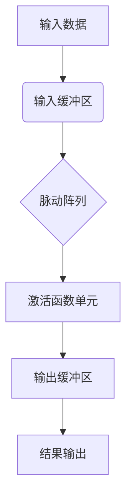

## 前言

作为电子工程师，我们正处在一个AI技术爆炸式发展的时代。从智能手机中的语音助手，到自动驾驶汽车的环境感知，再到医疗影像的智能分析，AI已经渗透到我们生活的方方面面。然而，这些AI应用的背后，离不开一个默默无闻的英雄——**AI芯片与专用加速器**。🚀

当我第一次在项目中使用神经网络处理传感器数据时，很快便遇到了计算瓶颈。普通的微控制器无法满足实时性要求，而通用的GPU又过于耗能。这时，我才发现专用AI芯片的重要性。今天，我想和大家一起探讨这个既前沿又实用的技术领域。

## AI芯片的崛起：从通用到专用

### 传统计算架构的局限性

在AI芯片普及之前，我们主要依赖通用处理器（CPU）和图形处理器（GPU）来运行AI算法。然而，这些通用架构在处理AI任务时存在明显的局限性：

- **能效比低**：通用处理器设计为处理多种任务，因此在特定AI任务上能效比不高
- **延迟问题**：复杂神经网络推理难以满足实时应用的需求
- **功耗挑战**：移动设备和边缘设备对功耗有严格限制

> "AI不是软件问题，而是硬件问题。没有合适的硬件，再好的算法也无法发挥其潜力。" —— 某AI芯片架构师

### 专用AI芯片的优势

专用AI芯片针对特定AI算法和负载进行优化，具有以下优势：

- **高并行性**：专为矩阵运算和深度学习设计的并行计算单元
- **低功耗**：通过硬件优化和专用指令集大幅降低能耗
- **低延迟**：硬件级加速实现实时推理
- **高能效比**：在相同性能下，功耗仅为通用处理器的几分之一

## 主流AI芯片架构分析

### 神经处理单元（NPU）

NPU是专为神经网络计算设计的处理器架构，其核心特点是：

- **脉动阵列（Systolic Array）**：高效实现矩阵乘法运算
- **量化计算**：支持INT8/INT4等低精度计算，提升能效
- **片上存储**：减少数据访问延迟，提高计算效率

### 张量处理单元（TPU）

Google的TPU是数据中心AI训练和推理的专用芯片：

- **脉动阵列架构**：支持高精度矩阵运算
- **统一内存架构**：简化编程模型
- **高带宽内存**：支持大规模参数存储

### 现场可编程门阵列（FPGA）加速器

FPGA提供了灵活的硬件加速方案：

- **可重构性**：可根据算法需求重新配置硬件结构
- **并行处理**：支持大规模并行计算
- **低延迟**：硬件级实现算法逻辑

## AI芯片在电子系统中的应用

### 边缘设备中的AI加速

在物联网和边缘计算场景中，AI芯片扮演着关键角色：

- **智能传感器**：在传感器端实现实时数据处理
- **智能家居**：本地化语音识别和图像处理
- **工业自动化**：设备故障预测和异常检测

| 应用场景 | 推理要求 | 功耗限制 | 典型AI芯片 |
|---------|---------|---------|-----------|
| 智能手机 | 低延迟 | <5W | Apple Neural Engine, Qualcomm Hexagon |
| 智能家居 | 中等延迟 | <1W | Google Edge TPU, MediaTek APU |
| 工业设备 | 高可靠性 | <10W | Intel Movidius, Xilinx Kria |
| 自动驾驶 | 实时性 | <100W | NVIDIA Orin, Tesla FSD |

### 嵌入式系统中的AI集成

在嵌入式系统中集成AI芯片需要考虑以下因素：

1. **接口兼容性**：与主处理器的通信接口（如PCIe, MIPI）
2. **软件栈支持**：驱动程序、运行时和开发工具
3. **热设计**：高密度计算带来的散热挑战
4. **电源管理**：动态调整工作模式以平衡性能和功耗

## AI芯片设计的关键技术

### 量化与压缩技术

为了在资源受限的设备上部署AI模型，量化与压缩技术至关重要：

- **权重量化**：将32位浮点数转换为8位或4位整数
- **模型剪枝**：移除冗余神经元和连接
- **知识蒸馏**：用大模型指导小模型训练

### 硬件-软件协同设计

高效的AI芯片需要硬件和软件的紧密协同：

- **编译器优化**：将高级AI框架映射到硬件指令集
- **算子库**：预优化的计算内核实现
- **自动调优**：根据硬件特性自动调整算法参数

## 未来发展趋势

### 存算一体架构

传统冯·诺依曼架构中，存储和计算分离导致"内存墙"问题。存算一体架构通过以下方式突破这一限制：

- **计算内存**：在存储单元中直接进行计算
- **近存计算**：将计算单元靠近存储单元
- **3D堆叠**：通过垂直集成缩短数据路径

### 神经形态计算

受大脑启发的神经形态计算正在兴起：

- **脉冲神经网络**：更接近生物神经元的计算模型
- **事件驱动计算**：仅在有数据变化时进行计算
- **异步处理**：无需全局时钟，降低功耗

### 可重构AI加速器

未来的AI芯片将更加灵活和可适应：

- **动态重构**：根据任务需求重新配置硬件
- **多核异构**：集成多种计算单元处理不同任务
- **自适应精度**：根据性能需求动态调整计算精度

## 个人建议

作为一名电子工程师，我认为在项目中采用AI芯片时应该：

1. **明确需求**：首先确定AI应用的性能、功耗和成本要求
2. **评估方案**：比较不同AI芯片的能效比和开发难度
3. **考虑生态系统**：选择有完善工具链和社区支持的芯片
4. **从小规模开始**：先在简单应用中验证，再逐步扩展复杂度
5. **关注长期维护**：考虑芯片的长期供货和技术支持

## 结语

AI芯片与专用加速器正在重塑电子系统的计算范式。从边缘设备到数据中心，这些专用芯片正在使AI应用变得更加高效、普及和实用。🌟

作为电子工程师，我们需要理解这些芯片的工作原理和应用场景，才能在未来的项目中充分发挥AI技术的潜力。随着技术的不断进步，我相信AI芯片将继续发展，为我们带来更多可能。

> "未来不是被预测的，而是被创造的。而AI芯片，正是创造未来的工具之一。" —— 不知名的未来学家

---

希望这篇文章能够帮助大家更好地理解AI芯片在电子系统中的重要作用。如果你有任何问题或想法，欢迎在评论区分享！😊