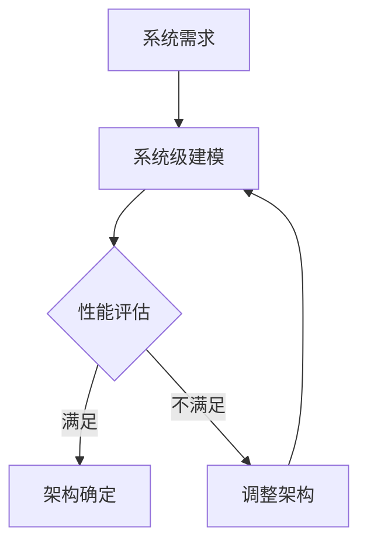

## 前言

在当今电子系统日益复杂的背景下，单纯依靠硬件或软件优化已难以满足性能、功耗和成本的多重约束。~~记得我刚入行时，硬件工程师和软件工程师就像两个平行宇宙的人，各自为战，常常导致项目延期和性能不达标~~。软硬件协同设计(System Software Co-design)应运而生，成为连接硬件与软件的桥梁，让系统设计从"串行开发"走向"协同优化"。

> "软硬件协同设计不是简单的硬件和软件的叠加，而是从系统层面进行统一规划和优化的方法论。" —— 计算机体系结构先驱 David A. Patterson

## 1. 软硬件协同设计的概念与意义

### 1.1 什么是软硬件协同设计

软硬件协同设计是一种系统设计方法论，它要求硬件和软件设计在系统规划阶段就紧密结合，共同参与系统的架构设计、功能划分和性能优化。这种方法打破了传统硬件和软件串行开发的模式，实现了从"设计-实现-验证"的线性流程向"协同设计-协同优化-协同验证"的迭代流程转变。

### 1.2 为什么需要软硬件协同设计

现代电子系统面临三大挑战：
- **性能需求激增**：从自动驾驶到5G通信，对计算能力的需求呈指数级增长
- **功耗限制严格**：移动设备和物联网设备对电池寿命要求极高
- **上市时间缩短**：市场竞争要求产品快速迭代，设计周期不断压缩

传统设计方法已无法应对这些挑战，而软硬件协同设计能够：
- 🚀 提升系统整体性能
- 🔋 优化功耗和面积
- ⏱ 缩短设计周期
- 💰 降低开发成本

## 2. 软硬件协同设计的关键技术

### 2.1 系统级建模与仿真

系统级建模是协同设计的基础，它允许设计人员在早期阶段评估不同架构方案。



常用工具：
- SystemC：系统级建模标准
- Simulink：基于模型的系统设计
- TLM-2.0：事务级建模标准

### 2.2 硬件软件划分

硬件软件划分是协同设计的核心决策，它决定了哪些功能由硬件实现，哪些由软件实现。

**划分策略**：
1. **计算密集型任务** → 硬件加速
2. **灵活性要求高** → 软件实现
3. **实时性要求高** → 硬件实现
4. **频繁变更需求** → 软件实现

**划分方法**：
- 基于启发式算法的快速划分
- 基于整数线性规划的精确划分
- 基于机器学习的智能划分

### 2.3 异构计算架构设计

现代电子系统普遍采用异构架构，结合多种处理单元：

- CPU：通用处理
- GPU：并行计算
- FPGA：可重构计算
- ASIC：专用加速
- NPU：神经网络处理

**设计挑战**：
- 如何选择合适的处理单元组合
- 如何设计高效的数据交换机制
- 如何实现负载均衡

### 2.4 动态电压与频率调节(DVFS)

DVFS是协同设计中重要的功耗优化技术，它允许系统根据负载动态调整电压和频率。

**实现方式**：
- 硬件层面：支持多电压域的电源管理单元
- 软件层面：操作系统级的任务调度算法
- 协同层面：硬件性能计数器与软件DVFS控制器的联动

## 3. 软硬件协同设计流程

### 3.1 传统设计流程 vs 协同设计流程

**传统设计流程**：
```
需求分析 → 硬件设计 → 软件设计 → 系统集成 → 测试验证
```

**协同设计流程**：
```
需求分析 → 系统建模 → 软硬件划分 → 并行开发 → 协同优化 → 集成验证
```

### 3.2 协同设计的关键阶段

1. **需求分析与规格定义**
   - 明确系统功能、性能、功耗、成本等约束
   - 定义软硬件接口规范

2. **系统级建模与评估**
   - 构建系统级模型
   - 评估不同架构方案
   - 确定最优硬件软件划分

3. **并行开发与协同优化**
   - 硬件和软件团队并行开发
   - 通过协同优化调整设计参数
   - 迭代优化系统性能

4. **集成验证与调试**
   - 硬件软件协同验证
   - 性能瓶颈分析与优化
   - 系统级测试与调试

## 4. 软硬件协同设计的应用案例

### 4.1 汽车电子系统

现代汽车电子系统包含数百个ECU，通过CAN/LIN总线互联。采用软硬件协同设计：

- **硬件层面**：异构SoC，包含CPU、GPU、AI加速器
- **软件层面**：AUTOSAR架构，分层设计
- **协同优化**：关键安全功能硬件加速，非关键功能软件实现

### 4.2 5G基站处理

5G基站需要极高的实时处理能力：

- **硬件层面**：FPGA+ASIC异构架构
- **软件层面**：实时操作系统与信号处理库
- **协同设计**：物理层功能硬件加速，高层协议软件实现

### 4.3 边缘AI计算

边缘设备需要在有限资源下实现AI推理：

- **硬件层面**：NPU+CPU异构架构
- **软件层面**：AI推理框架与模型优化
- **协同优化**：模型量化与硬件特性匹配，实现最佳性能功耗比

## 5. 软硬件协同设计的挑战与未来

### 5.1 当前面临的挑战

1. **设计复杂性**：系统规模和复杂度持续增加
2. **工具链不完善**：缺乏统一的协同设计平台
3. **人才缺口**：需要既懂硬件又懂软件的复合型人才
4. **验证困难**：系统级验证的复杂度呈指数增长

### 5.2 未来发展趋势

1. **AI辅助的协同设计**：利用机器学习自动优化硬件软件划分
2. **云边协同设计**：利用云计算资源加速复杂系统设计
3. **开源协同设计工具**：降低协同设计门槛
4. **量子-经典协同计算**：探索量子计算与传统电子系统的协同设计

## 结语

软硬件协同设计已成为现代电子系统设计的必然选择。它不仅是技术方法的革新，更是设计理念的转变——从"各自为战"到"协同共赢"。随着异构计算、边缘AI等技术的发展，软硬件协同设计的重要性将进一步提升。

作为电子工程师，我们需要打破硬件和软件的界限，培养系统思维，掌握协同设计方法，才能在日益复杂的电子系统设计挑战中游刃有余。

> "未来的电子系统设计，将不再有纯粹的硬件工程师或软件工程师，只有系统架构师。" —— 电子系统设计专家

---

*本文参考了IEEE Transactions on Computer-Aided Design of Integrated Circuits and Systems的相关研究，并结合了行业实践经验。*