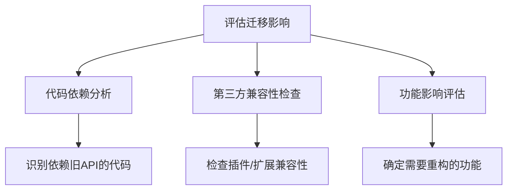

## 前言

作为一名长期从事框架开发的技术人员，我经常遇到这样的场景：~~客户说"我们正在使用5年前的框架版本，现在想升级到最新版，但听说有很多破坏性变更，怎么办？"~~ 😅

框架的持续演进是技术发展的必然，但如何确保应用在框架升级过程中平稳过渡，却是一个让许多开发者头疼的问题。今天，我想和大家聊聊框架迁移与升级策略，分享一些实践经验，帮助大家在技术演进的道路上走得更稳。

## 为什么框架迁移如此重要？

::: tip
框架升级不仅是获取新功能，更是修复安全漏洞、提升性能、保持技术栈活力的关键举措。
:::

在我们的日常开发中，框架迁移的重要性体现在以下几个方面：

1. **安全性与稳定性**：旧版本的框架可能存在已知的安全漏洞，升级是保障应用安全的基础。
2. **性能优化**：新版本通常包含性能改进，能够提升应用的响应速度和资源利用率。
3. **新功能支持**：框架的新版本往往带来开发者期待已久的新特性，提升开发效率。
4. **生态系统兼容性**：随着周边工具和库的更新，旧版框架可能逐渐失去兼容性。
5. **技术债务控制**：长期不升级会导致技术债务累积，未来迁移成本会更高。

## 框架迁移前的准备工作

在开始任何框架迁移之前，充分的准备工作是成功的关键。🏗

### 1. 评估迁移影响范围



### 2. 建立迁移测试环境

> "永远在生产环境之外进行迁移测试" —— 这是铁律！

建议创建一个与生产环境尽可能一致的测试环境，包括：
- 相同的操作系统和版本
- 相同的依赖库和版本
- 相同的硬件资源配置
- 相同的数据集（或脱敏后的生产数据）

### 3. 制定迁移计划

一个好的迁移计划应该包含：

| 阶段 | 任务 | 负责人 | 时间 | 风险点 |
|------|------|--------|------|--------|
| 准备 | 代码审计与依赖分析 | 开发团队 | 1周 | 遗漏依赖项 |
| 测试 | 单元测试更新与补充 | QA团队 | 2周 | 测试覆盖不足 |
| 实施 | 分模块迁移 | 开发团队 | 3周 | 回滚困难 |
| 验证 | 性能与功能测试 | QA团队 | 1周 | 性能下降 |
| 上线 | 灰度发布与监控 | 运维团队 | 1周 | 生产环境问题 |

## 框架迁移策略与最佳实践

### 1. 渐进式迁移方法

对于大型应用，我推荐采用渐进式迁移策略，而不是一次性升级所有内容：

```python
# 伪代码示例：渐进式迁移实现
class ProgressiveMigration:
    def __init__(self, old_framework, new_framework):
        self.old_framework = old_framework
        self.new_framework = new_framework
        self.migrated_modules = []
    
    def migrate_module(self, module_name):
        # 1. 创建模块的兼容层
        compatibility_layer = self.create_compatibility_layer(module_name)
        
        # 2. 在新框架中重写模块
        new_module = self.rewrite_module(module_name)
        
        # 3. 验证功能一致性
        if self.validate_functionality(module_name):
            self.migrated_modules.append(module_name)
            return True
        return False
    
    def create_compatibility_layer(self, module_name):
        # 创建适配层，使新模块能调用旧API
        pass
```

### 2. 处理破坏性变更

框架升级中最常见的问题是破坏性变更（Breaking Changes）。以下是处理策略：

1. **识别破坏性变更**：阅读框架的升级指南，重点关注标记为破坏性的变更。
2. **优先处理高风险变更**：如API签名变更、配置格式变更等。
3. **使用适配器模式**：为不兼容的API创建适配层，逐步替换。

### 3. 自动化迁移工具

::: theorem
自动化迁移工具可以大幅提高迁移效率和准确性，减少人为错误。
:::

许多现代框架提供了迁移辅助工具：

- **React**: `react-codemod` 用于自动迁移API
- **Angular**: `Angular Update Guide` 和 `ng update` 命令
- **Vue**: `vue-migration-helper` 插件
- **Spring Boot**: `spring-boot-maven-plugin` 的依赖升级功能

这些工具通常能自动处理大部分标准化的迁移工作，但仍需要人工审查和调整。

## 框架迁移的实战案例

让我们通过一个实际案例来理解框架迁移的全过程。

### 背景

某电商平台使用Angular 8构建，现需要升级到Angular 14以获得更好的性能和新特性。系统包含50+个模块，日均访问量100万+。

### 迁移过程

#### 1. 评估阶段

- 识别出使用已废弃API的模块15个
- 第三方依赖中有8个需要更新或替换
- 估计工作量约3人月

#### 2. 分阶段迁移

将系统按业务域划分为5个主要部分，依次迁移：

```
用户中心 → 商品管理 → 订单处理 → 支付系统 → 数据分析
```

每个阶段包含：
- 创建新版本模块
- 数据迁移脚本
- 兼容层实现
- 功能测试
- 性能测试

#### 3. 关键挑战与解决方案

**挑战1：RxJS API变更**
- **问题**：Angular 14升级要求使用新的RxJS 7 API
- **解决方案**：创建RxJS适配器，逐步替换订阅模式

```typescript
// 旧代码
this.dataService.getData().subscribe(data => {
  this.userData = data;
});

// 新代码（使用pipe和操作符）
this.dataService.getData().pipe(
  map(data => data.user),
  catchError(error => of(null))
).subscribe(userData => {
  this.userData = userData;
});
```

**挑战2：ivy渲染引擎兼容性**
- **问题**：某些组件在ivy引擎下表现异常
- **解决方案**：使用`@angular/compiler-cli`的兼容性检查工具，修复模板表达式

#### 4. 验证与上线

- 功能回归测试：100%通过
- 性能测试：首屏加载时间提升30%
- 灰度发布：先向10%用户开放，逐步扩大到100%
- 监控：建立专门的迁移监控看板，跟踪错误率和性能指标

## 框架迁移的常见陷阱与规避方法

### 1. 低估迁移复杂度

**陷阱**：仅关注框架本身的变更，忽略依赖库和配置文件的兼容性。

**规避方法**：
- 创建完整的依赖关系图
- 建立自动化测试套件覆盖所有功能
- 进行小规模试点迁移

### 2. 忽视数据迁移

**陷阱**：只关注代码迁移，而忽略数据结构和存储格式的变更。

**规避方法**：
- 提前设计数据迁移脚本
- 在测试环境完整演练数据迁移过程
- 建立数据回滚机制

### 3. 缺乏回滚计划

**陷阱**：假设迁移一定会成功，没有准备回滚方案。

**规避方法**：
- 维护旧版本环境，确保随时可回滚
- 记录每次迁移的变更点
- 建立快速回滚流程

## 结语

框架迁移是一项系统工程，需要周密的计划、充分的测试和谨慎的实施。🎯

通过本文分享的策略和实践，希望能够帮助大家更好地应对框架升级挑战。记住，技术演进是不可逆的，但我们可以通过合理的迁移策略，让这个过程变得平滑可控。

最后，我想分享一句我一直以来的信条：

> "拥抱变化，但不要被变化牵着鼻子走。"

在技术道路上，既要保持开放的心态接受新事物，也要有足够的准备和规划来应对变化带来的挑战。

---

*如果你有框架迁移的经验或问题，欢迎在评论区分享。让我们一起探讨，共同成长！* 😊