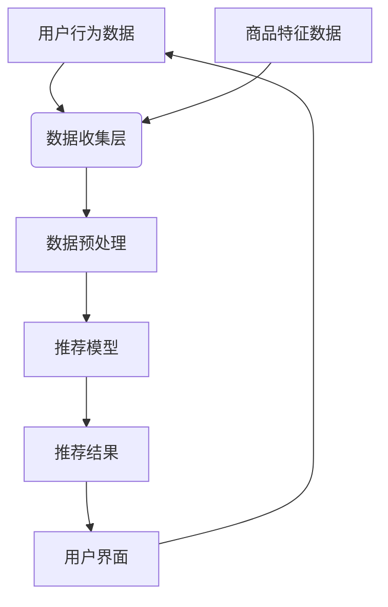

## 前言

作为一名框架开发者，我一直对现代框架如何拥抱AI和机器学习技术充满兴趣。最近，我注意到许多优秀的框架都在努力集成AI能力，让开发者能够更轻松地在应用中添加智能功能。然而，在深入研究现有框架的AI集成方案后，我发现这个主题在技术博客中往往被忽视或过于简略。

今天，我想和大家一起探讨框架的AI集成与智能功能支持这个话题，看看现代框架是如何将复杂的AI技术变得简单易用的，以及作为开发者，我们应该如何充分利用这些能力来构建真正智能的应用。

## AI集成的重要性

在数字化转型的浪潮下，AI已经从实验室走向了实际应用。无论是推荐系统、自然语言处理，还是计算机视觉，AI技术正在重塑我们构建软件的方式。作为应用开发的基石，框架的AI集成能力变得越来越重要。

::: tip
AI集成不仅仅是添加几个API调用那么简单，它需要深入理解AI/ML的工作原理，并将其无缝融入到框架的生命周期中。
:::

## 现有框架的AI集成模式

目前，主流框架在AI集成方面主要有以下几种模式：

### 1. 插件式AI集成

许多框架采用插件式架构，将AI功能作为可选模块提供。这种模式的优点是灵活性高，可以根据项目需求选择所需的AI功能。

```javascript
// 示例：在框架中添加AI预测插件
app.use('ai-prediction', {
  model: 'sentiment-analysis',
  endpoint: '/api/ai/predict'
});
```

### 2. 内置AI能力

一些现代框架选择将AI能力直接集成到核心功能中，让开发者无需额外配置即可使用AI功能。

```javascript
// 示例：框架内置的智能路由
app.route('/api/users', {
  aiOptimized: true,  // 启用AI优化
  strategy: 'load-balancing'  // AI负载均衡策略
});
```

### 3. AI原生设计

最前沿的框架采用AI原生设计，从架构层面就考虑AI需求，使AI成为框架的核心组成部分。

```javascript
// 示例：AI原生设计的框架组件
const smartComponent = new AIBasedComponent({
  learning: true,  // 启用持续学习
  adaptability: 'high'  // 高适应性
});
```

## 框架AI集成的关键技术点

### 1. 模型管理

框架需要提供统一的模型管理机制，包括模型加载、版本控制、热更新等功能。

```javascript
// 模型管理示例
const modelManager = framework.getModelManager();
modelManager.load('sentiment-v2', {
  source: '/models/sentiment-v2.onnx',
  autoUpdate: true
});
```

### 2. 数据预处理

AI模型对输入数据有特定要求，框架需要提供便捷的数据预处理工具。

```javascript
// 数据预处理示例
const preprocessor = framework.getPreprocessor('text');
const processedData = preprocessor(rawData, {
  normalization: true,
  tokenization: true,
  vectorization: 'tfidf'
});
```

### 3. 推理优化

为了提高AI推理性能，框架需要提供各种优化手段。

```javascript
// 推理优化示例
const optimizedInference = framework.optimizeInference(model, {
  batchProcessing: true,
  quantization: 'int8',
  hardwareAcceleration: 'gpu'
});
```

### 4. 持续学习

框架应支持模型的持续学习机制，使应用能够从新数据中不断改进。

```javascript
// 持续学习示例
framework.enableLearning('recommendation-model', {
  feedbackChannel: 'user-ratings',
  learningRate: 0.01,
  updateInterval: 'daily'
});
```

## 实战案例：构建智能推荐系统

让我们通过一个实际案例，看看如何利用框架的AI集成能力构建一个智能推荐系统。

### 需求分析

我们需要为电商网站构建一个智能推荐系统，能够根据用户行为和商品特征提供个性化推荐。

### 架构设计



### 实现步骤

1. **数据收集**：使用框架的事件收集机制捕获用户行为数据。

```javascript
// 捕获用户行为
app.track('user-interaction', {
  userId: 'user123',
  itemId: 'item456',
  action: 'view',
  timestamp: Date.now()
});
```

2. **特征工程**：利用框架的特征工程工具处理原始数据。

```javascript
// 特征提取
const features = framework.extractFeatures(userBehavior, {
  userFeatures: ['age', 'gender', 'location'],
  itemFeatures: ['category', 'price', 'rating'],
  contextFeatures: ['timeOfDay', 'deviceType']
});
```

3. **模型训练**：使用框架的内置训练工具训练推荐模型。

```javascript
// 模型训练
const model = framework.train('recommendation', {
  algorithm: 'collaborative-filtering',
  hyperparameters: {
    factors: 100,
    regularization: 0.01,
    iterations: 50
  }
});
```

4. **推荐生成**：利用训练好的模型生成个性化推荐。

```javascript
// 生成推荐
const recommendations = framework.recommend('user123', {
  model: 'recommendation',
  count: 10,
  diversity: 0.8,
  novelty: 0.5
});
```

## 挑战与解决方案

在框架AI集成过程中，我们面临以下几个主要挑战：

### 1. 性能优化

**挑战**：AI模型通常计算密集，可能影响应用性能。

**解决方案**：
- 使用模型量化减少计算量
- 实现异步推理避免阻塞主线程
- 利用硬件加速（GPU/TPU）提高性能

```javascript
// 性能优化示例
const optimizedModel = framework.optimize(model, {
  quantization: 'int8',
  async: true,
  hardware: 'auto'
});
```

### 2. 模型更新

**挑战**：如何在不中断服务的情况下更新AI模型。

**解决方案**：
- 实现模型热更新机制
- 使用A/B测试验证新模型效果
- 建立回滚机制应对异常情况

```javascript
// 模型更新示例
framework.updateModel('recommendation', 'new-model', {
  strategy: 'rolling-update',
  validation: 'ab-test',
  fallback: 'old-model'
});
```

### 3. 隐私保护

**挑战**：AI模型可能涉及用户隐私数据。

**解决方案**：
- 实现联邦学习保护数据隐私
- 使用差分隐私技术
- 建立数据访问控制机制

```javascript
// 隐私保护示例
const privacyConfig = {
  learning: 'federated',
  privacy: {
    differential: true,
    epsilon: 1.0,
    noise: 'gaussian'
  },
  access: {
    role: 'admin',
  }
};
```

## 未来展望

随着AI技术的不断发展，框架的AI集成能力也将迎来新的机遇和挑战：

### 1. 多模态AI支持

未来框架将更好地支持多模态AI，能够同时处理文本、图像、音频等多种数据类型。

```javascript
// 多模态处理示例
const multimodalAI = framework.createMultimodalAI({
  text: true,
  image: true,
  audio: true,
  video: true
});
```

### 2. 自适应学习

框架将支持更高级的自适应学习机制，使应用能够根据环境变化自动调整AI策略。

```javascript
// 自适应学习示例
framework.enableAdaptiveLearning('smart-system', {
  adaptation: 'continuous',
  feedback: 'multi-source',
  optimization: 'auto'
});
```

### 3. 低代码AI集成

为了降低AI使用门槛，框架将提供更多低代码/无代码的AI集成方式。

```javascript
// 低代码AI集成示例
const aiFeature = framework.createAIFeature('smart-search', {
  type: 'template',
  template: 'semantic-search',
  config: {
    dataset: 'products',
    searchType: 'semantic'
  }
});
```

## 结语

框架的AI集成与智能功能支持是构建现代智能应用的关键。通过合理的架构设计和工具支持，框架可以将复杂的AI技术变得简单易用，让开发者能够专注于业务逻辑而非底层实现。

作为开发者，我们应该充分利用框架提供的AI集成能力，同时也要理解AI的基本原理，以便更好地使用和优化这些功能。🚀

未来，随着AI技术的不断进步，框架的AI集成能力也将持续进化。让我们一起期待框架与AI更深度的融合，共同构建更智能、更高效的数字世界！

> 正如Alan Kay所说："The best way to predict the future is to invent it." 框架的AI集成不仅是技术的进步，更是我们创造未来的工具。