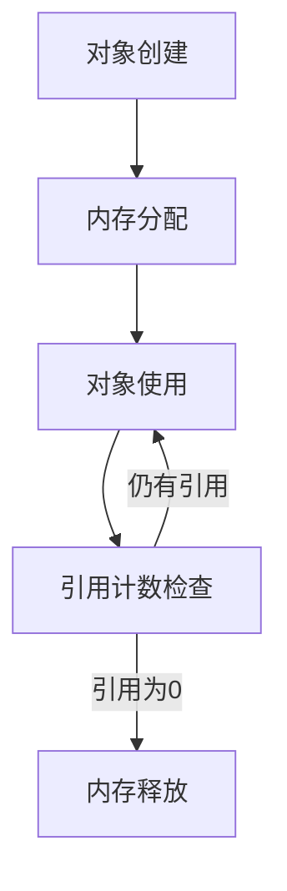

## 前言

在框架开发的浩瀚宇宙中，我们常常聚焦于架构设计、API交互和功能实现，却忽略了一个隐形的性能杀手——内存管理。当应用规模扩大时，不当的内存使用会导致性能断崖式下跌，甚至引发系统崩溃。今天，让我们深入探讨框架内存管理的艺术，为构建高性能应用打下坚实基础。

## 内存管理的重要性

内存管理是框架性能的隐形支柱。想象一下，一个没有合理内存管理的框架就像没有排水系统的城市——即使建筑再华丽，终将被"内存洪水"淹没。🌊

### 内存泄漏的代价

- **性能衰减**：每次GC（垃圾回收）都会导致应用暂停
- **资源耗尽**：长期运行后可能导致OOM（内存溢出）
- **扩展瓶颈**：无法有效利用服务器资源

> 正如Linus Torvalds所言："优秀的程序员不是不犯错，而是懂得如何避免重复犯错。内存管理正是这种避免的艺术。"

## 内存分配策略

### 对象池模式

```javascript
// 对象池实现示例
class ObjectPool {
  constructor(createFn, resetFn) {
    this.pool = [];
    this.createFn = createFn;
    this.resetFn = resetFn;
  }
  
  acquire() {
    return this.pool.length 
      ? this.resetFn(this.pool.pop())
      : this.createFn();
  }
  
  release(obj) {
    this.pool.push(obj);
  }
}
```

**适用场景**：
- 频繁创建销毁的对象（如游戏中的子弹、粒子效果）
- 大量短生命周期对象（如HTTP请求上下文）

### 内存分区策略

将内存划分为不同区域：
1. **常驻区**：存储框架核心对象
2. **缓存区**：临时存储用户数据
3. **临时区**：处理请求过程中的临时对象

## 内存泄漏检测与预防

### 泄漏检测工具

| 工具类型 | 推荐工具 | 特点 |
|---------|---------|------|
| 浏览器 | Chrome DevTools | 可视化内存快照对比 |
| Node.js | heapdump | 生成堆内存快照 |
| 通用 | Valgrind | Linux平台深度分析 |

### 泄漏预防模式

1. **事件监听器管理**
```javascript
// 错误示例：未移除监听器
element.addEventListener('click', handler);

// 正确示例：使用WeakMap管理
const listeners = new WeakMap();
function addListener(element, handler) {
  element.addEventListener('click', handler);
  listeners.set(element, handler);
}
```

2. **闭包陷阱**
```javascript
// 危险闭包：引用外部变量
function createLeak() {
  const largeData = new Array(1000000);
  return function() {
    return largeData; // 即使函数结束，largeData也无法被回收
  }
}

// 安全闭包：使用WeakMap
const cache = new WeakMap();
function safeGet(key) {
  if (!cache.has(key)) {
    cache.set(key, computeExpensiveValue(key));
  }
  return cache.get(key);
}
```

## 内存池技术

### 池化设计原则

1. **固定大小池**：适用于对象大小固定场景
2. **可变大小池**：适用于对象大小差异场景
3. **分层池**：根据对象生命周期分层管理

### 实现案例：HTTP请求池

```javascript
class RequestPool {
  constructor(maxSize) {
    this.pool = [];
    this.maxSize = maxSize;
    this.inUse = 0;
  }
  
  acquire() {
    if (this.pool.length > 0) {
      return this.pool.pop();
    }
    if (this.inUse < this.maxSize) {
      this.inUse++;
      return new HttpRequest();
    }
    throw new Error('Pool exhausted');
  }
  
  release(request) {
    request.reset(); // 重置请求状态
    this.pool.push(request);
  }
}
```

## 内存管理最佳实践

### 1. 生命周期管理



### 2. 智能引用技术

- **弱引用**：允许对象被GC回收，同时保留引用能力
- **软引用**：内存不足时才回收
- **幻引用**：仅用于跟踪对象回收

### 3. 性能监控指标

| 指标 | 健康范围 | 警告阈值 |
|------|---------|---------|
| GC频率 | < 1分钟/次 | > 5分钟/次 |
| 内存增长率 | < 10%/小时 | > 20%/小时 |
| 对象存活率 | < 30% | > 50% |

## 结语

框架内存管理不是简单的技术实现，而是关乎应用生命线的系统工程。通过合理采用对象池、智能引用和分层管理，我们可以构建出既高效又稳定的框架基础。记住，优秀的框架不仅要功能强大，更要懂得如何优雅地管理自己的"内存足迹"。

正如Bjarne Stroustrup所言："C++的设计哲学是：你不需要为你不使用的特性付出代价。"同样，优秀的框架应该让开发者专注于业务逻辑，而非陷入内存管理的泥潭。🚀

> 内存管理就像呼吸——当你意识到它的存在时，往往已经出现了问题。最好的框架是让内存管理如呼吸般自然，无需开发者刻意关注。