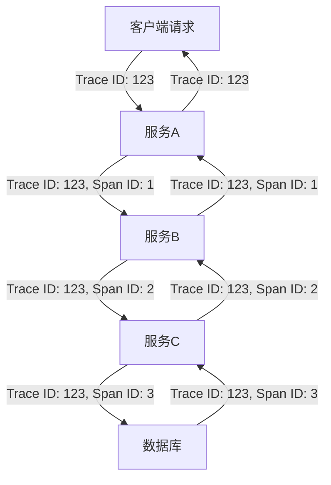
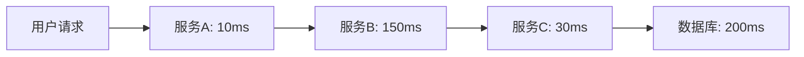

## 前言

在当今复杂的分布式系统中，一个简单的用户请求可能需要跨越多个服务、多个实例，甚至多个数据中心。当系统出现性能瓶颈或错误时，如何快速定位问题所在，成为了每个开发者面临的挑战。🤔

传统的日志记录和监控手段已经难以满足现代分布式系统的需求，我们需要一种能够追踪请求在整个系统中完整流转路径的技术。这就是分布式追踪与全链路监控的价值所在。

::: tip
分布式追踪是一种用于分析和监控分布式系统的技术，它通过追踪请求在系统中的完整路径，帮助开发者理解系统的行为和性能瓶颈。
:::

本文将深入探讨框架如何实现分布式追踪与全链路监控，以及如何利用这些技术构建更加健壮和高效的系统。

## 分布式追踪的基本概念

### 什么是分布式追踪？

分布式追踪是一种用于分析和监控分布式系统的技术，它通过追踪请求在系统中的完整路径，帮助开发者理解系统的行为和性能瓶颈。简单来说，它就像是给系统中的每个请求贴上一个"身份证"，记录它从产生到结束的全过程。

### 分布式追踪的核心组件

一个完整的分布式追踪系统通常包含以下几个核心组件：

1. **追踪ID (Trace ID)**：唯一标识一个完整的请求链路
2. **跨度ID (Span ID)**：标识链路中的某个具体操作
3. **上下文传递**：在服务间传递追踪信息
4. **数据收集与存储**：收集和存储追踪数据
5. **可视化展示**：以图形化方式展示追踪结果



### 分布式追踪的标准协议

目前，分布式追踪领域有几个主流的标准协议：

- **OpenTracing**：由CNCF托管的开放标准，定义了跨平台的API和语义
- **OpenTelemetry**：CNCF的新一代标准，整合了OpenTracing和OpenCensus
- **Jaeger**：Uber开源的分布式追踪系统，兼容OpenTracing标准
- **Zipkin**：Twitter开源的分布式追踪系统

## 框架中实现分布式追踪的技术方案

### 中间件模式

大多数框架采用中间件模式来实现分布式追踪，即在请求处理流程中插入追踪逻辑。以Express框架为例：

```javascript
const express = require('express');
const { trace } = require('@opentelemetry/api');

const app = express();

// 追踪中间件
app.use((req, res, next) => {
  const span = trace.getTracer('my-service').startSpan(`HTTP ${req.method} ${req.path}`);
  
  // 将span附加到请求对象
  req.span = span;
  
  // 监听响应完成事件
  res.on('finish', () => {
    span.setAttribute('http.status_code', res.statusCode);
    span.end();
  });
  
  next();
});

// 业务路由
app.get('/api/users', (req, res) => {
  // 业务逻辑...
  res.json({ users: [] });
});
```

### 自动注入追踪信息

现代框架通常支持自动注入追踪信息，开发者无需手动在每个地方添加追踪代码。例如，在Spring Boot中：

```java
@RestController
@RequestMapping("/api")
public class UserController {
    
    @Autowired
    private UserService userService;
    
    @GetMapping("/users")
    public List<User> getUsers() {
        // 自动追踪方法调用
        return userService.getAllUsers();
    }
}
```

### 跨服务追踪的实现

在微服务架构中，跨服务追踪尤为重要。框架通常通过以下方式实现：

1. **HTTP头传递**：在HTTP请求头中传递追踪信息
2. **消息队列集成**：在消息传递中嵌入追踪信息
3. **上下文传播**：使用上下文传播机制保持追踪连续性

```javascript
// HTTP头传递追踪信息
const axios = require('axios');

async function callServiceB() {
  const span = trace.getActiveSpan();
  const headers = {
    'X-Trace-Id': span.spanContext().traceId,
    'X-Span-Id': span.spanContext().spanId
  };
  
  return axios.get('http://service-b/api', { headers });
}
```

## 全链路监控的实践应用

### 性能瓶颈分析

全链路监控可以帮助开发者快速定位系统中的性能瓶颈。通过分析追踪数据，我们可以：

1. 识别慢速服务或操作
2. 分析服务间的依赖关系
3. 发现异常的调用链路
4. 评估系统整体性能



从上面的追踪图中，我们可以明显看到数据库操作是整个请求链路中最耗时的部分，这应该是优化的重点。

### 错误追踪与定位

当系统出现错误时，全链路监控可以提供完整的错误上下文，帮助开发者快速定位问题：

```
[ERROR] /api/users (Trace ID: 123456)
  - 服务A: 处理请求
  - 服务B: 调用服务C失败 (HTTP 500)
    - 服务C: 数据库连接超时
```

### 容量规划与资源优化

通过分析全链路监控数据，可以进行更准确的容量规划和资源优化：

1. 识别系统中的关键路径
2. 评估各服务的资源需求
3. 优化资源分配策略
4. 预测系统增长趋势

## 框架集成最佳实践

### 选择合适的追踪工具

框架支持多种追踪工具，选择时应考虑：

1. **社区支持**：工具的活跃度和社区支持
2. **集成难度**：与现有框架的集成复杂度
3. **性能影响**：追踪对系统性能的影响
4. **功能完整性**：是否满足业务需求

### 追踪数据的采样策略

在高流量系统中，记录所有追踪数据可能会对系统性能造成影响。因此，合理的采样策略非常重要：

```javascript
// 基于比率的采样
const sampler = new RatioBasedSampler({
  ratio: 0.1 // 采样10%的请求
});

// 基于优先级的采样
const prioritySampler = new PrioritySampler({
  // 对错误请求100%采样
  // 对慢速请求50%采样
  // 对普通请求10%采样
});
```

### 追踪数据的存储与查询

追踪数据通常是海量且时效性强的，因此需要合理的存储和查询策略：

1. **数据分层存储**：热数据存储在快速存储中，冷数据存储在低成本存储中
2. **数据保留策略**：根据业务需求设置不同的数据保留期限
3. **索引优化**：为常用查询条件建立索引
4. **数据聚合**：对长期数据进行聚合分析

## 实际应用案例

### 电商平台的订单处理系统

某大型电商平台使用分布式追踪优化其订单处理系统：

1. **问题背景**：订单处理延迟，用户体验差
2. **追踪实施**：在订单处理流程中部署分布式追踪
3. **发现问题**：支付服务调用第三方支付接口超时
4. **优化措施**：
   - 增加支付接口超时重试机制
   - 优化数据库查询
   - 引入缓存减少重复查询
5. **效果**：订单处理时间从平均2秒减少到300毫秒

### 金融交易系统的监控优化

某金融科技公司通过全链路监控优化其交易系统：

1. **问题背景**：交易失败率高，难以定位问题
2. **追踪实施**：在交易处理全流程中部署分布式追踪
3. **发现问题**：风控系统响应慢导致超时
4. **优化措施**：
   - 优化风控算法
   - 增加风控系统实例
   - 实现异步处理机制
5. **效果**：交易失败率从5%降低到0.5%

## 未来展望

### 智能化追踪分析

随着AI技术的发展，未来的分布式追踪系统将更加智能化：

1. **自动异常检测**：基于机器学习自动发现异常模式
2. **根因分析**：自动定位问题的根本原因
3. **预测性分析**：预测系统可能出现的性能问题
4. **自愈建议**：提供自动化的系统优化建议

### 云原生环境下的追踪优化

在云原生环境下，分布式追踪将面临新的挑战和机遇：

1. **Serverless追踪**：适应无服务器架构的追踪需求
2. **Kubernetes集成**：与容器编排系统的深度集成
3. **服务网格支持**：与服务网格技术的无缝集成
4. **多云环境追踪**：支持跨云环境的追踪需求

### 隐私保护与合规性

随着数据隐私法规的日益严格，分布式追踪系统也需要考虑隐私保护：

1. **数据脱敏**：自动识别和脱敏敏感信息
2. **访问控制**：精细化的追踪数据访问控制
3. **合规性报告**：自动生成合规性报告
4. **数据生命周期管理**：符合法规要求的数据保留和删除策略

## 结语

分布式追踪与全链路监控是现代框架不可或缺的功能，它为开发者提供了洞察系统行为的"X光机"。通过合理设计和实现分布式追踪系统，我们可以构建更加健壮、高效和可维护的分布式系统。

> 正如一位资深架构师所说："在没有分布式追踪的系统里，问题就像是黑夜中的迷宫；而在有了分布式追踪的系统里，问题就像是白天里的地图。"

希望本文能够帮助您更好地理解和实现框架中的分布式追踪与全链路监控技术，为您的系统带来更强大的可观测性。如果您有任何问题或建议，欢迎在评论区交流讨论！🚀