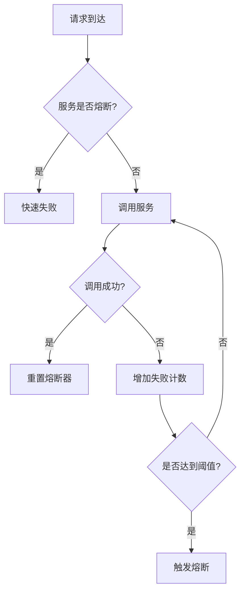
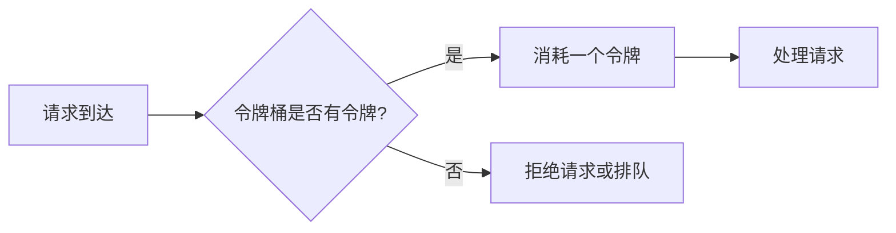
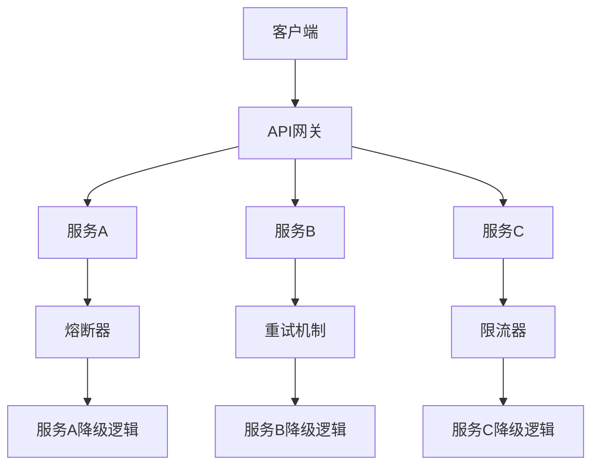
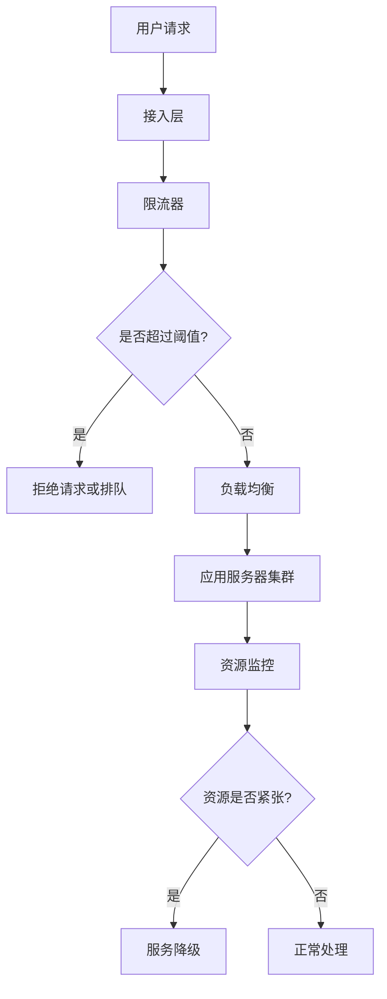

## 前言

在当今复杂的应用环境中，系统故障几乎不可避免。无论是硬件故障、网络问题、软件缺陷还是流量峰值，都可能影响系统的正常运行。作为框架设计者，我们的责任不仅仅是构建功能完备的系统，更要确保系统在面对各种异常情况时能够优雅降级、自动恢复，从而提供稳定可靠的服务。

本文将深入探讨框架容错机制与故障恢复的设计原则、核心策略和最佳实践，帮助开发者构建更具弹性的应用系统。

::: tip
"容错不是消除故障，而是在故障发生时保持系统核心功能的能力。" — 分布式系统设计原则
:::

## 容错机制的核心概念

容错机制是指系统在部分组件失效时，仍能继续执行关键功能的能力。在框架设计中，容错机制不仅仅是简单的错误捕获和处理，而是一套完整的防御体系。

### 容错与高可用

容错和高可用是两个密切相关但又有区别的概念：

- **容错**：系统在部分组件失效时仍能继续提供服务的能力。
- **高可用**：系统在长时间内保持持续可用的能力。

高可用通常通过冗余和容错机制来实现。一个高可用系统必然是容错的，但一个容错系统不一定能达到高可用的标准。

### 容错设计的基本原则

在设计框架容错机制时，应遵循以下基本原则：

1. **故障隔离**：限制故障的影响范围，防止级联故障。
2. **优雅降级**：在系统压力过大或组件失效时，保留核心功能，放弃非关键功能。
3. **快速检测**：及时发现故障，减少故障对系统的影响。
4. **自动恢复**：在可能的情况下，自动从故障中恢复，减少人工干预。
5. **透明性**：容错机制对上层应用尽可能透明，简化开发者的使用复杂度。

## 核心容错机制

### 服务降级

服务降级是一种主动的资源保护策略，当系统负载过高或依赖服务不可用时，暂时关闭或简化某些功能，以保证核心功能的正常运行。

```javascript
// 伪代码示例：服务降级实现
function handleRequest(request) {
  // 检查系统负载
  if (systemLoad > threshold) {
    // 执行服务降级逻辑
    return degradeService(request);
  }
  
  // 正常处理请求
  return normalService(request);
}
```

在框架中，服务降级可以通过以下方式实现：

- **功能开关**：通过配置动态开启或关闭某些功能。
- **降级策略**：定义不同级别的降级方案，如完全关闭、简化实现、返回默认值等。
- **降级条件**：基于系统指标（CPU、内存、响应时间等）或业务指标（错误率、队列长度等）触发降级。

### 熔断机制

熔断模式是一种防止级联故障的保护机制，当某个服务连续失败达到一定阈值时，暂时停止对该服务的调用，避免资源浪费和进一步恶化。



熔断器的三种状态：

1. **关闭状态**：所有请求正常通过，当失败次数达到阈值时，切换到打开状态。
2. **打开状态**：所有请求快速失败，不执行实际调用，经过一段时间后，切换到半开状态。
3. **半开状态**：允许部分请求通过，如果请求成功，切换到关闭状态；如果失败，切换回打开状态。

### 重试策略

重试机制是处理暂时性故障的有效手段，但不当的重试可能导致问题恶化。框架应提供灵活的重试策略：

- **固定间隔重试**：每次失败后等待固定时间再重试。
- **指数退避重试**：每次重试的等待时间呈指数增长。
- **随机抖动**：在重试间隔中添加随机性，避免多个客户端同时重试导致的"惊群效应"。
- **最大重试次数**：限制重试次数，避免无限重试。

```javascript
// 伪代码示例：带指数退避的重试策略
async function withRetry(fn, maxRetries = 3, baseDelay = 100) {
  let retries = 0;
  
  while (retries < maxRetries) {
    try {
      return await fn();
    } catch (error) {
      retries++;
      if (retries >= maxRetries) {
        throw error;
      }
      
      // 指数退避 + 随机抖动
      const delay = baseDelay * Math.pow(2, retries) * (1 + Math.random());
      await new Promise(resolve => setTimeout(resolve, delay));
    }
  }
}
```

### 超时控制

超时控制是防止系统资源被长时间占用的重要机制，适用于各种远程调用、资源等待等场景。

框架应提供：

- **连接超时**：建立连接的最长时间。
- **读取超时**：等待数据返回的最长时间。
- **总体超时**：整个操作的最长允许时间。
- **可配置的超时策略**：根据不同场景和业务需求调整超时时间。

### 限流措施

限流是保护系统免受流量冲击的重要手段，常见的限流算法包括：

- **令牌桶算法**：以固定速率生成令牌，请求需要消耗令牌才能通过。
- **漏桶算法**：请求以任意速率进入，以固定速率流出。
- **计数器限流**：在固定时间窗口内限制请求数量。



## 故障恢复策略

### 故障转移

故障转移是指当主服务或节点失效时，自动切换到备用服务或节点的机制。在分布式系统中，故障转移可以确保服务的连续性。

框架应支持：

- **主备切换**：主节点失效时，自动切换到备用节点。
- **负载均衡切换**：从失效节点移除流量，分配到健康节点。
- **多活切换**：在多个数据中心间实现故障转移。

### 优雅降级

优雅降级是指系统在部分功能不可用时，自动切换到简化版本的功能，确保核心业务不受影响。

框架应提供：

- **功能分级**：将功能分为核心、重要、可选等级别。
- **降级触发条件**：基于系统状态或业务指标触发降级。
- **降级恢复机制**：当系统恢复正常时，自动恢复所有功能。

### 自愈能力

自愈是指系统在检测到故障后，能够自动尝试恢复，无需人工干预的能力。

框架应支持：

- **自动重启**：检测到服务崩溃时，自动重启服务。
- **资源调整**：根据负载情况自动调整资源分配。
- **配置热更新**：在不重启服务的情况下更新配置。

### 容错设计模式

在框架设计中，可以采用以下设计模式增强容错能力：

1. **断路器模式**：如前所述，防止级联故障。
2. **重试模式**：处理暂时性故障。
3. **超时模式**：防止无限等待。
4. **舱壁隔离模式**：限制故障影响范围。
5. **批处理与队列模式**：平滑请求处理，防止系统过载。
6. **缓存模式**：减少对后端服务的依赖。

## 实践案例

### 微服务架构中的容错设计

在微服务架构中，服务间的依赖关系复杂，容错机制尤为重要。以下是一个典型的微服务容错设计：



在这个设计中：

- API网关作为统一的入口，负责路由和基础容错处理。
- 每个服务都配备相应的容错机制（熔断、重试、限流）。
- 当服务不可用时，提供降级逻辑，保证核心功能可用。

### 高并发场景下的容错设计

在高并发场景下，系统面临的挑战主要是流量控制和资源保护。以下是一个高并发场景下的容错设计：



在这个设计中：

- 接入层负责请求的初步过滤和限流。
- 负载均衡将请求分发到不同的应用服务器。
- 资源监控实时检测系统状态，必要时触发服务降级。

## 框架容错机制的最佳实践

### 设计原则

1. **防御性编程**：假设任何组件都可能失败，设计相应的容错机制。
2. **故障隔离**：使用舱壁模式隔离不同模块的故障影响。
3. **优雅降级**：确保核心功能在部分故障时仍可用。
4. **快速检测**：实现健康检查和故障检测机制。
5. **自动恢复**：尽可能实现自动恢复，减少人工干预。

### 实施策略

1. **渐进式容错**：从核心功能开始，逐步扩展容错范围。
2. **配置化容错**：通过配置文件灵活调整容错策略。
3. **监控与告警**：建立完善的监控和告警系统，及时发现故障。
4. **混沌工程**：定期进行故障演练，验证容错机制的有效性。
5. **文档与培训**：提供详细的容错机制文档和使用指南。

### 性能与容错的平衡

容错机制虽然提高了系统的可靠性，但也可能带来额外的性能开销。在框架设计中，需要平衡性能和可靠性：

1. **异步处理**：使用异步机制处理非关键路径的容错逻辑。
2. **资源优化**：合理配置容错机制所需的资源，避免过度消耗。
3. **分级容错**：对不同级别的功能采用不同强度的容错策略。
4. **动态调整**：根据系统负载动态调整容错策略的强度。

## 结语

在当今复杂的应用环境中，容错机制已成为框架设计不可或缺的一部分。通过合理的容错设计和故障恢复策略，我们可以构建出更加健壮、可靠的应用系统，为用户提供稳定的服务。

框架容错机制的设计不是一蹴而就的，而是需要根据实际业务需求和系统特点不断迭代和完善的过程。希望本文的探讨能够为框架设计者在构建高可用系统时提供一些有益的参考。

记住，最好的容错机制是那些你几乎感觉不到存在，但在关键时刻能够保护系统的机制。让我们一起努力，构建更加可靠的软件系统！

> "在分布式系统中，故障不是例外，而是常态。"
> — 分布式系统设计格言