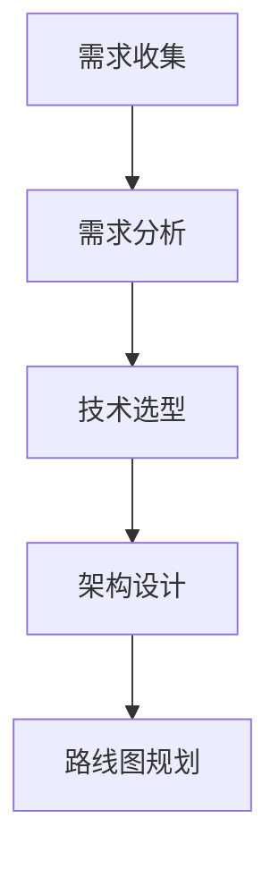
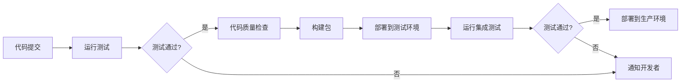

## 前言

在过去的几个月里，我一直在深入研究框架的各个方面，从设计模式到性能优化，从安全性防护到版本管理。~~然而，我发现了一个被我忽略的关键环节：如何高效地开发和维护这些框架本身~~。今天，我想和大家聊聊框架开发流程与工具链这个看似不起眼却至关重要的主题。

::: tip
框架开发流程与工具链就像是电影的幕后制作团队，虽然观众看不到，但它们是确保电影质量的关键。
:::

## 为什么框架开发流程与工具链如此重要？

当我刚开始开发自己的框架时，我犯了一个常见的错误：过于关注框架的功能和API设计，而忽视了开发流程和工具链的建设。结果呢？代码质量参差不齐，发布周期长，bug修复缓慢，开发者体验差。

🤔 你是否也有过类似的经历？花了大量时间设计完美的架构，却在开发过程中遇到各种阻碍？

良好的框架开发流程和工具链能够：

1. **提高代码质量**：通过自动化测试、代码审查和静态分析
2. **加速开发周期**：通过CI/CD、自动化构建和部署
3. **改善开发者体验**：通过完善的开发环境和工具支持
4. **确保框架稳定性**：通过持续集成和自动化测试

## 框架开发流程的核心环节

### 1. 需求分析与规划

在开始编码之前，明确框架的目标和范围至关重要。我通常使用以下方法：



::: theorem
框架开发的第一步不是写代码，而是明确"为什么"要开发这个框架，以及它要解决什么问题。
:::

### 2. 开发环境搭建

一个好的开发环境能够显著提高开发效率。我的框架开发环境通常包括：

- **IDE/编辑器**：VS Code + 特定框架的插件
- **代码格式化工具**：Prettier + ESLint
- **Git工作流**：Git Flow或GitHub Flow
- **本地开发服务器**：热重载、实时预览

### 3. 编码规范与最佳实践

保持一致的编码风格是团队协作的基础。我建议的框架编码规范包括：

```javascript
// 好的示例：清晰的函数命名和注释
/**
 * 初始化框架核心组件
 * @param {Object} config - 配置对象
 * @returns {Framework} 初始化后的框架实例
 */
function initFramework(config) {
  // 验证配置
  validateConfig(config);
  
  // 初始化核心模块
  const coreModule = new CoreModule(config);
  
  // 返回框架实例
  return new Framework(coreModule);
}
```

### 4. 测试策略

框架的测试策略应该包括：

| 测试类型 | 描述 | 工具示例 |
|---------|------|---------|
| 单元测试 | 测试单个函数或组件 | Jest, Mocha |
| 集成测试 | 测试模块间的交互 | Supertest, Cypress |
| 端到端测试 | 测试完整的功能流程 | Selenium, Puppeteer |
| 性能测试 | 测试框架的性能表现 | K6, Artillery |

::: right
"测试不是用来证明你没有bug，而是用来证明你还有bug。"
:::

### 5. 文档开发

框架文档应该与代码同步开发，我采用以下策略：

- 使用自动化文档生成工具（如JSDoc, TypeDoc）
- 为每个API提供示例代码
- 维护一个示例项目展示框架用法
- 建立FAQ和常见问题解答

## 框架开发工具链详解

### CI/CD流水线

一个典型的框架CI/CD流水线包括：



我常用的CI/CD工具：

- **GitHub Actions**：自动化工作流程
- **Jenkins**：持续集成服务器
- **Docker**：容器化部署
- **Semantic Versioning**：版本管理

### 代码质量工具

保持代码质量的关键工具：

- **ESLint**：JavaScript代码检查
- **Prettier**：代码格式化
- **SonarQube**：代码质量分析
- **Coveralls**：测试覆盖率报告

### 自动化测试工具

我推荐的前端框架测试工具组合：

- **Jest**：单元测试
- **React Testing Library**：React组件测试
- **Cypress**：端到端测试
- **Storybook**：组件开发和测试

## 实战案例：我的框架开发工具链

让我分享一个实际的例子，我最近开发的一个微前端框架的开发工具链：

### 1. 项目结构

```
framework/
├── src/                 # 源代码
├── tests/               # 测试文件
├── docs/                # 文档
├── examples/            # 示例项目
├── scripts/             # 构建脚本
├── .github/             # GitHub Actions配置
└── package.json         # 项目配置
```

### 2. 开发工作流

1. 创建功能分支：`git checkout -b feature/new-feature`
2. 编写代码并运行测试：`npm test`
3. 提交代码：`git commit -m "feat: add new feature"`
4. 推送到远程仓库：`git push origin feature/new-feature`
5. 创建Pull Request
6. 代码审查和CI/CD自动测试
7. 合并到主分支

### 3. 发布流程

1. 更新版本号：`npm version patch/minor/major`
2. 自动构建和打包：`npm run build`
3. 生成变更日志：`npm run changelog`
4. 发布到npm：`npm publish`
5. 创建GitHub Release

## 结语

回顾我的框架开发历程，我深刻体会到：**好的框架开发流程和工具链是成功框架的基石**。它们不仅能够提高开发效率，还能确保框架的质量和稳定性。

如果你正在开发自己的框架，我强烈建议你从一开始就重视开发流程和工具链的建设。它们可能会增加一些前期投入，但长期来看，它们会为你节省大量的时间和精力。

> 记住，框架不仅是给用户使用的，也是给开发者维护的。良好的开发体验会让维护工作事半功倍。

希望这篇文章能够帮助你构建更好的框架开发流程和工具链。如果你有任何问题或建议，欢迎在评论区留言讨论！

Happy coding! 🚀