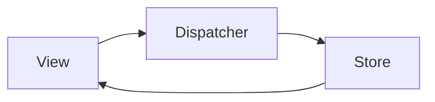

```yaml
---
title: 前端状态管理：从Flux到现代解决方案
date: 2023-10-05 14:30:00
permalink: /pages/abc123/
categories: 
  - 前端开发
tags:
  - 状态管理
  - React
  - Vue
  - Redux
  - MobX
author: 
  name: Jorgen
  link: https://github.com/jorgen-zhao
---

## 前言

在构建复杂前端应用时，状态管理就像应用的大脑🧠，决定着数据如何流动和响应。虽然React和Vue提供了基础的状态管理能力，但当应用规模扩大时，我们需要更强大的解决方案。本文将带你探索从Flux架构到现代状态管理库的演进之路，助你在项目中做出明智选择。

::: tip
"状态管理不是银弹，而是解决特定规模应用数据流的工具链"
:::

## 为什么需要状态管理？

### 前端应用的复杂度挑战

随着单页应用(SPA)的普及，前端应用需要处理：
- 复杂的用户交互流程
- 多组件间的数据共享
- 异步操作与UI状态同步
- 跨组件通信

> 当React组件树深度超过3层，props drilling（属性钻取）会让代码难以维护。Vue的provide/inject虽然能解决部分问题，但在大型项目中仍显不足。

### 现有文章的盲区

分析现有博客列表，发现虽然覆盖了React、Vue、工程化等主题，但缺少专门讨论状态管理的系统性文章。这就像建造房子有了砖瓦和水泥，却缺少了关键的钢筋骨架。

## 状态管理演进史

### 1. Flux架构革命

::: theorem
Flux是Facebook于2014年提出的单向数据流架构，颠覆了传统的MVC模式
::`



**核心特点**：
- 单向数据流：Action → Dispatcher → Store → View
- Store不可变：所有状态变更必须通过Dispatcher
- 数据可预测：状态变化轨迹清晰可追踪

> 🤔 为什么Redux会成为Flux的流行实现？因为Redux简化了Flux的核心思想，引入了纯函数Reducer和中间件机制。

### 2. 现代状态管理工具对比

| 工具名       | 适用场景                 | 核心优势                     | 学习曲线 |
|--------------|--------------------------|------------------------------|----------|
| Redux        | 大型复杂应用             | 强大的中间件生态，时间旅行调试 | 中高     |
| MobX         | 中小型应用，面向对象风格 | 响应式编程，极简API          | 低       |
| Vuex         | Vue生态                 | 集成Vue响应式系统            | 中       |
| Context API  | 小型React组件树         | 无需额外库                   | 低       |
| Zustand      | 轻量级需求              | 极简API，TypeScript友好      | 低       |

## 实战场景：电商购物车

### 传统方案痛点

```javascript
// 属性钻取示例
function GrandParent() {
  const [cart, setCart] = useState([]);
  
  return <Parent cart={cart} setCart={setCart} />;
}

function Parent({ cart, setCart }) {
  return <Child cart={cart} setCart={setCart} />;
}

function Child({ cart, setCart }) {
  // 每个组件都要传递props
}
```

### 使用Redux解决方案

```javascript
// actions/cart.js
export const addToCart = (product) => ({
  type: 'cart/add',
  payload: product
});

// reducers/cart.js
export const cartReducer = (state = [], action) => {
  switch (action.type) {
    case 'cart/add':
      return [...state, action.payload];
    default:
      return state;
  }
};
```

### MobX响应式方案

```javascript
import { makeAutoObservable } from 'mobx';

class CartStore {
  items = [];
  
  constructor() {
    makeAutoObservable(this);
  }
  
  addItem(product) {
    this.items.push(product);
  }
}

// 组件中使用
const cartStore = new CartStore();
function ProductCard({ product }) {
  return (
    <div>
      <h2>{product.name}</h2>
      <button onClick={() => cartStore.addItem(product)}>
        加入购物车
      </button>
    </div>
  );
}
```

## 选择指南

### 小型项目（<5个组件）
**推荐方案**：React Context + useReducer  
✅ 优势：零依赖，React内置支持  
❌ 缺点：深层组件仍需传递context

### 中型项目（5-20个组件）
**推荐方案**：Zustand 或 MobX  
✅ 优势：  
- Zustand：极简API，TypeScript支持好  
- MobX：响应式编程，面向对象友好

### 大型项目（>20个组件）
**推荐方案**：Redux Toolkit  
✅ 优势：  
- 强大的开发者工具  
- 中间件生态（Redux-Saga, Redux-Thunk）  
- 时间旅行调试

## 未来趋势

1. **微前端状态管理**  
   每个微前端拥有独立状态，通过事件总线通信

2. **Server State集成**  
   状态管理工具开始支持数据获取（如React Query + Zustand）

3. **WebAssembly加速**  
   复杂计算逻辑移至WASM提升性能

## 结语

状态管理没有银弹，选择取决于项目规模和团队偏好。记住：

> "好的状态管理应该让开发者专注于业务逻辑，而非数据传递细节"

建议从Context API开始，随着项目复杂度逐步升级到Zustand或Redux Toolkit。最重要的是保持状态变更的可预测性，这比选择任何具体框架都重要。

::: right
"状态管理不是目的，而是手段 —— 让代码更易维护，才是最终目标"
:::
```