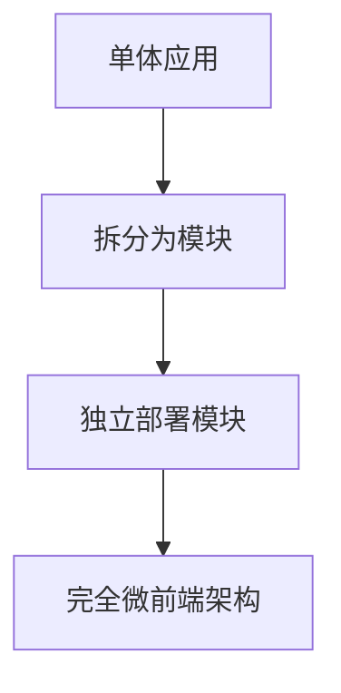

## 前言

大家好，我是Jorgen！👋 在过去的几年里，我一直在处理各种规模的前端项目，从小型个人应用到大型企业级系统。随着项目规模的增长，我遇到了一个常见的问题：**如何让大型前端应用保持可维护性和可扩展性**？

::: tip
微前端架构是一种将前端应用分解为多个独立开发、独立部署的小型应用的方法，类似于微服务架构在后端的应用。
:::

最近，我的团队接手了一个已经运行了5年的大型电商平台，这个项目包含了多个团队开发的模块，代码库庞大，技术栈不一，维护起来简直是一场噩梦！😩 于是，我开始研究微前端架构，希望能找到解决方案。

在这篇文章中，我将分享我对微前端架构的理解，以及如何在实际项目中应用它来构建可扩展的大型前端应用。

## 什么是微前端？

微前端是一种架构风格，它将前端应用分解为多个可以独立开发、独立部署的小型应用。每个微前端应用都可以有自己的技术栈、开发团队和发布周期，但它们共同组成一个整体的用户体验。

### 微前端的核心概念

- **独立性**：每个微前端应用都是独立的，可以有自己的技术栈和开发流程
- **组合性**：多个微前端应用可以组合成一个完整的前端应用
- **自治性**：每个团队负责自己的微前端应用，不需要与其他团队紧密协作
- **技术栈无关**：不同的微前端可以使用不同的技术栈

### 微前端与单体前端的对比

| 特性 | 单体前端 | 微前端 |
|------|---------|--------|
| 应用结构 | 单一代码库 | 多个独立代码库 |
| 部署方式 | 整体部署 | 独立部署 |
| 技术栈 | 统一 | 可混合 |
| 团队协作 | 需要紧密协作 | 团队自治 |
| 扩展性 | 较低 | 高 |
| 维护复杂度 | 随规模增长 | 相对稳定 |

## 微前端架构的实现方式

微前端架构有多种实现方式，下面我将介绍几种主流的方法：

### 1. 基于路由的微前端

这是最简单直接的实现方式，通过路由将不同的微前端应用组合在一起。

```javascript
// React Router示例
const App = () => (
  <Router>
    <Route exact path="/" component={Home} />
    <Route path="/products" component={ProductsApp} />
    <Route path="/user" component={UserApp} />
  </Router>
);
```

**优点**：
- 实现简单，易于理解
- 每个微前端完全独立，没有耦合

**缺点**：
- 用户体验不够流畅，页面切换会有刷新
- 共享功能（如用户认证）需要额外处理

### 2. 基于组件的微前端

通过将微前端打包为组件，然后在主应用中动态加载。

```javascript
// 使用React.lazy实现
const ProductsApp = React.lazy(() => import('./products/ProductsApp'));

function App() {
  return (
    <Suspense fallback={<div>Loading...</div>}>
      <ProductsApp />
    </Suspense>
  );
}
```

**优点**：
- 用户体验更好，无刷新切换
- 可以共享上下文和状态

**缺点**：
- 需要解决样式冲突和样式隔离问题
- 构建配置更复杂

### 3. 基于Web Components的微前端

将每个微前端封装为Web Components，可以在任何框架中使用。

```javascript
// 自定义元素示例
class ProductsApp extends HTMLElement {
  connectedCallback() {
    this.innerHTML = `<div>Products App Content</div>`;
  }
}

customElements.define('products-app', ProductsApp);
```

**优点**：
- 框架无关，可以在任何项目中使用
- 天然的样式隔离

**缺点**：
- 开发体验可能不如原生框架
- 需要额外处理通信机制

### 4. 基于模块联邦的微前端

Webpack 5引入了模块联邦功能，允许不同构建的应用共享模块。

```javascript
// 主应用配置
module.exports = {
  //...
  plugins: [
    new ModuleFederationPlugin({
      name: 'host',
      remotes: {
        products: 'products@http://localhost:3000/remoteEntry.js',
      },
    }),
  ],
};
```

**优点**：
- 共享代码和依赖，减少重复
- 运行时动态加载，无需预构建

**缺点**：
- 配置复杂
- 版本管理需要特别注意

## 微前端架构的挑战与解决方案

虽然微前端架构有很多优势，但在实际应用中也会面临一些挑战：

### 1. 样式隔离

**问题**：不同微前端应用可能使用相同的CSS类名，导致样式冲突。

**解决方案**：
- 使用CSS Modules或CSS-in-JS
- 使用Shadow DOM实现样式隔离
- 采用BEM等命名约定

```css
/* 使用BEM命名约定 */
.products__list {}
.products__item {}
.products__button {}
```

### 2. 状态管理

**问题**：如何在多个微前端之间共享状态？

**解决方案**：
- 使用全局状态管理器（如Redux、Vuex）
- 实现事件总线机制
- 使用共享的本地存储

```javascript
// 使用事件总线
const eventBus = new EventEmitter();

// 微前端A发布事件
eventBus.emit('user-logged-in', userData);

// 微前端B订阅事件
eventBus.on('user-logged-in', (userData) => {
  // 处理用户登录
});
```

### 3. 通信机制

**问题**：微前端之间如何进行通信？

**解决方案**：
- 使用Custom Events
- 使用URL共享状态
- 使用共享的JavaScript全局对象

```javascript
// 使用Custom Events
// 微前端A
const event = new CustomEvent('micro-frontend-event', {
  detail: { message: 'Hello from micro-frontend A' }
});
window.dispatchEvent(event);

// 微前端B
window.addEventListener('micro-frontend-event', (event) => {
  console.log(event.detail.message); // "Hello from micro-frontend A"
});
```

### 4. 共享依赖

**问题**：如何避免重复安装相同的依赖？

**解决方案**：
- 使用Webpack的externals配置
- 实现共享依赖库
- 使用模块联邦

```javascript
// Webpack externals配置
module.exports = {
  //...
  externals: {
    react: 'React',
    'react-dom': 'ReactDOM',
  },
};
```

## 微前端架构的最佳实践

基于我的实践经验，以下是一些微前端架构的最佳实践：

### 1. 选择合适的粒度

微前端的粒度是关键，太细会导致管理开销增加，太粗则无法充分发挥微前端的优势。

::: theorem
微前端应该按照业务领域划分，而不是技术组件。每个微前端应该代表一个完整的业务功能。
:::

### 2. 建立清晰的API边界

每个微前端应该通过明确定义的API与其他微前端通信，避免直接操作DOM或其他微内部的实现细节。

### 3. 统一用户体验

虽然每个微前端可以独立开发，但整体的用户体验应该保持一致，包括设计系统、导航模式、错误处理等。

### 4. 实现渐进式迁移

对于现有项目，可以采用渐进式迁移策略，逐步将单体应用拆分为微前端。



### 5. 建立共享组件库

为了保持UI一致性，应该建立跨微前端共享的组件库，但每个微前端仍然可以有自己的定制化组件。

## 微前端架构的适用场景

微前端架构并不是银弹，它适用于以下场景：

1. **大型应用**：代码库庞大，团队众多
2. **多团队协作**：不同团队使用不同的技术栈
3. **渐进式升级**：需要逐步升级技术栈
4. **独立部署**：需要频繁发布某些功能而不影响整个应用
5. **遗留系统现代化**：将遗留系统逐步现代化

然而，对于小型应用或简单项目，微前端架构可能会增加不必要的复杂度。

## 实际案例：电商平台的微前端改造

让我分享一下我们团队是如何将一个大型电商平台改造为微前端架构的：

### 1. 识别微前端边界

我们首先分析了业务流程，识别出了以下微前端应用：
- 商品展示微前端
- 购物车微前端
- 用户中心微前端
- 订单管理微前端
- 支付微前端

### 2. 技术选型

我们选择了基于模块联邦的微前端架构，因为：
- 我们主要使用React技术栈
- 模块联邦提供了良好的开发体验
- 可以共享公共依赖，减少包大小

### 3. 实施步骤

我们按照以下步骤实施微前端架构：

1. **搭建基础架构**：创建主应用和微前端脚手架
2. **共享依赖**：提取公共依赖到共享库
3. **迁移模块**：将现有模块逐步迁移为微前端
4. **优化体验**：实现加载状态和错误边界
5. **监控与优化**：添加性能监控，持续优化

### 4. 遇到的挑战与解决方案

**挑战1：样式冲突**
我们使用了CSS Modules和共享的设计系统来解决样式冲突问题。

**挑战2：状态共享**
我们实现了基于Redux的全局状态管理，同时允许微前端有自己的局部状态。

**挑战3：部署流程**
我们建立了CI/CD流水线，支持微前端的独立部署和整体部署。

## 结语

微前端架构为我们提供了一种构建可扩展大型前端应用的强大方法。通过将应用分解为独立的微前端，我们可以提高开发效率，降低维护成本，并允许团队使用最适合他们需求的技术栈。

当然，微前端架构也带来了新的挑战，需要我们在设计时仔细考虑。关键是要找到适合自己项目需求的平衡点，不要为了使用微前端而微前端。

::: right
"微前端不是目的，而是手段。真正的目标是构建更好的软件。"
::>

如果你正在处理大型前端应用或面临团队协作的挑战，不妨考虑微前端架构。它可能正是你需要的解决方案！

你对微前端架构有什么看法或经验吗？欢迎在评论区分享！👇

Happy coding! 😄