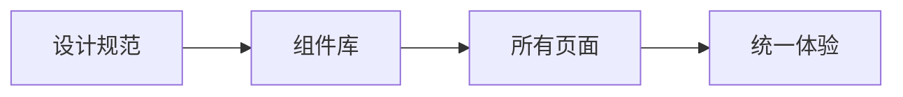

## 前言

在大型项目中，重复造轮子不仅浪费开发资源，还会导致代码风格不一致。🤔 作为前端开发者，我们经常遇到这样的困境：相同的UI元素在不同项目中重复实现，样式和交互逻辑难以统一。今天我想和大家聊聊**组件化开发**这个被低估但极其重要的实践，以及如何构建自己的组件库来提升开发效率。

::: tip
"组件化不是技术，而是思维方式的转变——从页面构建转向乐高式组装"
:::

<!-- more -->

## 为什么组件化如此重要？

### 1. 效率提升
- **开发速度**：复用现成组件比从零开始开发快5-10倍
- **维护成本**：修复一个组件的bug能同时解决所有使用该组件的地方
- **协作效率**：团队成员可以并行开发不同模块

### 2. 一致性保障


### 3. 技术债务控制
~~我见过太多项目因缺乏组件化导致后期重构成本超过重写~~ 😅

## 组件库设计核心原则

### 1. 单一职责原则
每个组件应该只做一件事，比如：
- `Button` 只处理按钮点击
- `Modal` 只管理弹窗显示/隐藏
- `DatePicker` 只负责日期选择

::: theorem
组件粒度测试：如果组件功能超过3个独立职责，就应该拆分
:::

### 2. 可组合性
```javascript
// 好的设计
<Avatar 
  size="large"
  src={user.avatar}
  status={user.online ? 'online' : 'offline'}
/>

// 避免
<LargeOnlineAvatarWithStatus src={...} />
```

### 3. 可扩展性
使用`props`和`slots`实现灵活定制：
```jsx
// 基础按钮
<BaseButton onClick={handleClick}>基础按钮</BaseButton>

// 扩展按钮
<BaseButton 
  variant="primary"
  icon={<Icon />}
  className="custom-btn"
>
  带图标的按钮
</BaseButton>
```

## 构建组件库实战

### 1. 技术选型
| 方案 | 优势 | 适用场景 |
|------|------|----------|
| Storybook | 可视化开发 | 设计驱动型团队 |
| Bit | 跨项目共享 | 微前端架构 |
| Lerna + Monorepo | 版本管理 | 大型项目 |

### 2. 目录结构
```
components/
├── Button/
│   ├── Button.jsx
│   ├── Button.stories.js
│   ├── Button.test.js
│   └── index.js
├── Modal/
│   └── ...
└── utils/
    ├── useDebounce.js
    └── useClickOutside.js
```

### 3. 文档自动化
::: tip
好的文档比代码更重要！使用以下工具：
- **Storybook**：交互式组件展示
- **StyleDocco**：生成样式文档
- **JSDoc**：API文档生成
:::

## 常见陷阱与解决方案

### 1. 过度抽象
**问题**：试图创建"万能组件"
```jsx
// ❌ 错误示范
<UniversalComponent 
  type={type} 
  size={size} 
  color={color} 
  icon={icon} 
  loading={loading}
  disabled={disabled}
/>
```

**解决方案**：组合小而美的组件
```jsx
// ✅ 正确做法
<Button 
  variant={variant} 
  loading={loading}
  disabled={disabled}
>
  {icon && <Icon />}
  {children}
</Button>
```

### 2. 忽视无障碍访问
- 添加ARIA标签
- 支持键盘导航
- 考虑屏幕阅读器兼容性

## 结语

组件化不是一蹴而就的魔法，而是持续优化的旅程。💪 从今天开始，试着将你的常用功能封装成组件，半年后你会感谢现在的自己。记住：

> "优秀的组件库就像乐高积木——简单、通用、能创造无限可能"

下次当你想复制粘贴代码时，停下来问自己：这个功能值得成为组件吗？🤔

---

*本文由Jogen原创，如需转载请注明出处*
```