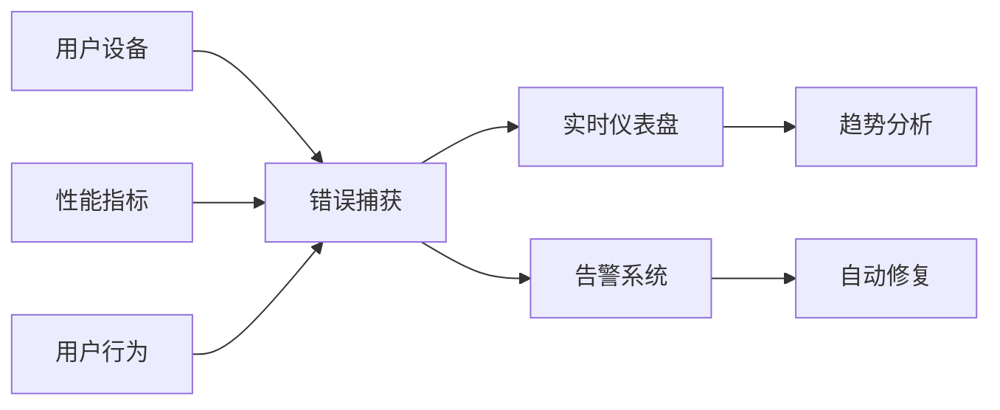

## 前言

作为一名前端开发者，我们常常沉浸在组件设计、状态管理和性能优化的世界里。~~但说实话，有多少人真正关注过用户在使用我们精心构建的页面时，遇到了什么问题？~~ 🤔

随着现代前端应用越来越复杂，用户可能遇到各种未知错误：网络波动、浏览器兼容性问题、第三方库故障，甚至是我们的代码逻辑缺陷。这些错误往往悄无声息地发生，直到用户投诉时我们才被动响应。今天，我想和大家聊聊前端监控与错误追踪这个"幕后英雄"，它如何帮助我们构建真正稳定可靠的用户体验。

## 为什么需要前端监控？

### 1️⃣ 用户视角的盲区

我们开发时使用的环境与用户实际环境差异巨大：
- 浏览器版本与兼容性
- 网络条件（2G/4G/5G/WiFi）
- 设备性能（低端机/旗舰机）
- 地理位置差异

**前端监控**就像一双眼睛，让我们看到用户真实世界的使用场景。没有监控，我们就像在黑暗中开车的司机 🚗💨。

### 2️⃣ 主动发现问题 vs 被动响应

想象一下这两种场景：
- **被动响应**：用户提交工单 → 技术排查 → 临时修复 → 重新部署
- **主动监控**：系统自动捕获错误 → 告警通知 → 开发者立即处理 → 影响最小化

**主动监控**能将平均修复时间(MTTR)从小时级缩短到分钟级，这对用户体验是质的飞跃 🚀。

## 核心监控维度

### 📊 性能监控

用户最关心的是"加载快不快"，性能监控需要关注：

```javascript
// 关键性能指标(CWV)示例
const metrics = {
  LCP: '最大内容绘制时间', // 用户看到主要内容的时间
  FID: '首次输入延迟',     // 用户交互响应速度
  CLS: '累积布局偏移',     // 页面稳定性
  FCP: '首次内容绘制'      // 首次有内容渲染
};
```

**实现方案**：
- 使用 [Performance API](https://developer.mozilla.org/en-US/docs/Web/API/Performance) 原生API
- 集成 [Web Vitals](https://web.dev/vitals/) 库
- 结合 RUM (真实用户监控) 平台

### 🐛 错误捕获

错误捕获是监控的核心，需要覆盖所有可能出错的地方：

```javascript
// 全局错误捕获
window.addEventListener('error', (event) => {
  trackError({
    type: 'JavaScript错误',
    message: event.message,
    stack: event.error?.stack,
    url: event.filename,
    line: event.lineno
  });
});

// Promise未捕获错误
window.addEventListener('unhandledrejection', (event) => {
  trackError({
    type: 'Promise错误',
    message: event.reason?.message || event.reason,
    stack: event.reason?.stack
  });
});
```

**关键点**：
- 区分JS错误、资源加载错误、API请求错误
- 捕获用户操作路径（如点击按钮时出错）
- 记录设备信息（浏览器、系统、分辨率）

### 📈 用户行为分析

知道用户如何与页面交互同样重要：

```javascript
// 点击事件追踪
document.addEventListener('click', (event) => {
  if (event.target.matches('.cta-button')) {
    trackUserAction({
      action: '点击CTA按钮',
      element: event.target.outerHTML,
      timestamp: Date.now()
    });
  }
});
```

## 实践方案

### 1️⃣ 轻量级自建方案

对于中小型项目，可以构建简单监控：

```javascript
// 基础监控SDK示例
class FrontendMonitor {
  constructor() {
    this.errors = [];
    this.metrics = {};
    this.init();
  }

  init() {
    // 错误捕获
    window.addEventListener('error', this.handleError.bind(this));
    // 性能监控
    window.addEventListener('load', this.trackPerformance.bind(this));
  }

  handleError(event) {
    const error = {
      type: 'JS错误',
      message: event.message,
      url: event.filename,
      line: event.lineno,
      timestamp: Date.now()
    };
    this.errors.push(error);
    this.sendToServer(error);
  }

  sendToServer(data) {
    // 使用navigator.sendBeacon确保数据发送
    navigator.sendBeacon('/api/log', JSON.stringify(data));
  }
}

// 初始化
const monitor = new FrontendMonitor();
```

### 2️⃣ 成熟商业方案

当项目规模扩大时，专业工具更合适：

| 工具 | 优势 | 适用场景 |
|------|------|----------|
| Sentry | 强大的错误追踪和聚合 | 中大型项目 |
| New Relic | 全栈性能监控 | 企业级应用 |
| LogRocket | 会话回放 | 复杂交互分析 |
| DataDog | 统一监控平台 | DevOps集成 |

### 3️⃣ 数据可视化

监控数据需要转化为可洞察的信息：



## 最佳实践

### 🔍 分层监控策略

1. **开发阶段**：本地错误捕获 + 构建时静态分析
2. **测试阶段**：自动化测试覆盖率监控 + 性能基准测试
3. **生产阶段**：真实用户监控 + 错误率告警

### 🚦 告警机制设计

**告警不是洪水**，需要智能过滤：

```javascript
// 智能告警示例
function shouldAlert(error) {
  // 忽略特定浏览器已知问题
  if (error.userAgent.includes('IE 11')) return false;
  
  // 忽略偶发错误（5分钟内超过10次）
  const recentErrors = errors.filter(e => 
    e.message === error.message && 
    Date.now() - e.timestamp < 300000
  );
  
  return recentErrors.length > 10;
}
```

### 🛡️ 隐私保护

监控必须尊重用户隐私：

- 敏感信息脱敏（如用户ID、密码）
- GDPR合规性处理
- 提供用户退出选项

## 结语

前端监控不是可有可无的"锦上添花"，而是保障用户体验的"基础设施"。它让我们从"被动救火"转向"主动预防"，从"猜测用户问题"到"看到真实数据"。

> 正如《重构》作者Martin Fowler所说："任何代码，如果没有被监控，就相当于不存在。"

记住，最好的代码是用户永远感觉不到它存在的代码 🌟。而前端监控，就是让我们离这个目标更近一步的隐形守护者。

---

**行动建议**：
1. 从今天开始为你的项目添加至少错误监控
2. 设置关键性能指标(KPI)监控
3. 建立告警阈值和响应流程
4. 定期分析监控数据，优化用户体验

你的用户值得最好的体验，而监控就是通往这个目标的必经之路 🚀。