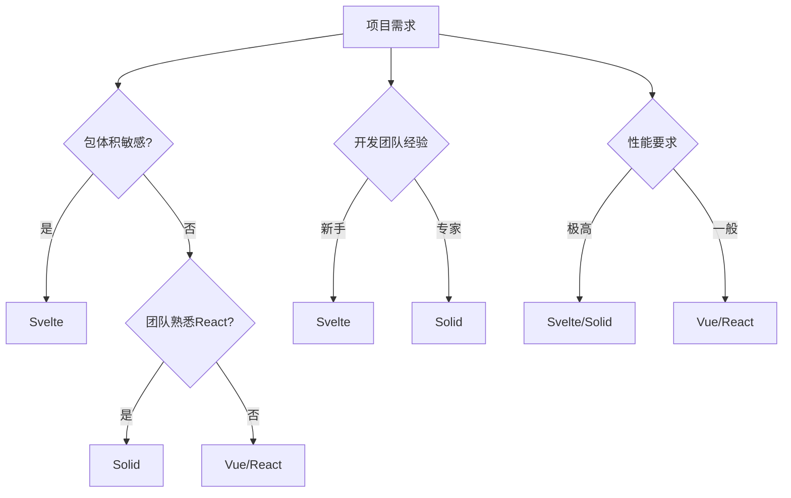

## 前言

在Vue和React主导前端生态的今天，你是否曾好奇：还有哪些创新框架正在悄然改变我们构建用户界面的方式？随着Web应用的复杂度不断提升，开发者对框架性能、开发体验和包体积的要求也越来越高。今天，让我们跳出传统框架的舒适区，探索Svelte、Solid等新兴框架带来的革命性变化。

::: tip
"框架应该消失，就像HTML、CSS和JavaScript一样自然存在" —— Rich Harris (Svelte创始人)
:::

## 为什么需要新兴框架？

传统框架如React和Vue通过虚拟DOM实现高效渲染，但始终存在以下痛点：

1. **运行时开销**：框架代码需要打包到最终产物中
2. **初始加载体积**：即使简单应用也需要引入整个框架
3. **学习曲线**：复杂的API和概念（如Hooks、响应式系统）

新兴框架通过创新方式解决这些问题，让我们看看它们如何重新定义前端开发。

## Svelte：编译时魔法的魅力

### 核心特性

Svelte采用完全不同的思路：**将应用编译成高效的原生JavaScript**。它不在运行时解释组件，而是在构建时生成高度优化的代码。

```html
<!-- Svelte组件示例 -->
<script>
  let count = 0;
  function handleClick() {
    count += 1;
  }
</script>

<button on:click={handleClick}>
  点击次数: {count}
</button>
```

编译后的代码直接操作DOM，没有虚拟DOM层：

```javascript
// 编译后的代码片段
function create_fragment(ctx) {
  let button;
  let t0;
  
  return {
    c() {
      button = element("button");
      t0 = text(`点击次数: ${/* count */ ctx[0]}`);
      // ...更多DOM操作
    },
    m(target, anchor) {
      insert(target, button, anchor);
      append(button, t0);
      // 事件监听直接绑定
      button.addEventListener("click", /* handleClick */ ctx[1]);
    },
    p(changed, ctx) {
      if (changed.count) {
        set_data(t0, `点击次数: ${/* count */ ctx[0]}`);
      }
    },
    d(detaching) {
      if (detaching) detach(button);
    }
  };
}
```

### 优势与适用场景

- **极致性能**：无运行时开销，包体积极小（<1KB）
- **直接DOM操作**：避免虚拟DOM的diff算法开销
- **简单API**：学习曲线平缓，接近原生JavaScript

**适合场景**：
- 高性能要求的单页应用
- 需要极小包体积的嵌入式应用
- 原生应用中的UI组件库

## Solid：响应式的新范式

### 核心特性

Solid.js借鉴了React的部分理念，但通过**细粒度响应式系统**实现了更高效的更新机制。

```jsx
// Solid组件示例
import { createSignal } from "solid-js";

function Counter() {
  const [count, setCount] = createSignal(0);
  
  return (
    <button onClick={() => setCount(count() + 1)}>
      点击次数: {count()}
    </button>
  );
}
```

### 创新机制

1. **细粒度响应**：每个响应式变量都是独立的信号
2. **直接绑定**：编译时确定依赖关系，运行时只更新变化的部分
3. **无虚拟DOM**：直接操作DOM，但通过编译时分析实现高效更新

```javascript
// Solid的响应式原理示例
function createSignal(value) {
  let getter = () => value;
  let setter = (newValue) => {
    value = newValue;
    // 触发依赖更新
    subscribers.forEach(fn => fn());
  };
  
  return [getter, setter];
}
```

### 优势与适用场景

- **React级开发体验**：JSX语法、Hooks理念
- **卓越性能**：只更新真正变化的部分
- **渐进式采用**：可与现有React项目共存

**适合场景**：
- 需要React生态但追求更高性能的项目
- 复杂状态管理应用
- 实时数据密集型界面

## 框架对比与选择

| 特性          | React     | Vue       | Svelte    | Solid     |
|---------------|-----------|-----------|-----------|-----------|
| 运行时        | 虚拟DOM   | 虚拟DOM   | 编译时    | 编译时    |
| 包体积        | ~40KB     | ~30KB     | <1KB      | ~7KB      |
| 学习曲线      | 中等      | 低        | 低        | 中等      |
| 生态系统      | 最完善    | 完善      | 较小      | 较小      |
| 性能          | 良好      | 良好      | 极优      | 极优      |

### 选择建议



## 未来展望

随着WebAssembly的普及和边缘计算的发展，新兴框架将迎来更多机遇：

1. **WebAssembly集成**：Svelte已支持WASM组件，未来可能实现全栈编译
2. **边缘计算优化**：编译时特性使框架天然适合边缘环境
3. **渐进式增强**：与现有框架的互操作性将增强

> "未来的前端框架将更接近编译器而非运行时库" —— Svelte官方文档

## 结语

探索新兴框架不仅是技术趋势，更是思维方式的革新。Svelte和Solid通过编译时优化和响应式创新，为我们提供了超越传统框架的可能性。作为开发者，保持对新技术的开放态度，才能在快速演进的Web生态中立于不败之地。

无论你选择深耕主流框架还是拥抱新生态，理解这些创新背后的设计哲学，都将帮助你做出更明智的技术决策。毕竟，最好的框架永远是适合项目需求的那个。

---

**推荐资源**：
- [Svelte官方教程](https://svelte.dev/tutorial)
- [Solid.js官方文档](https://www.solidjs.com/)
- [Svelte vs React性能对比](https://svelte.dev/blog/svelte-vs-react)