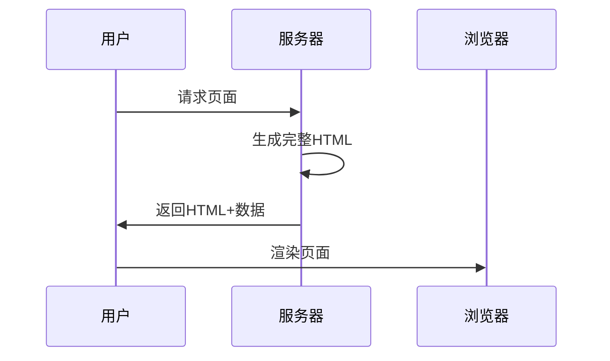
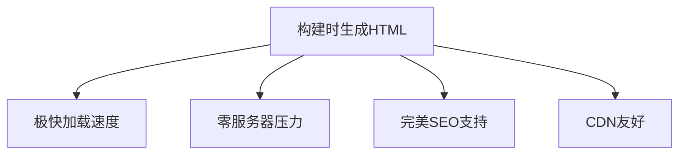

## 前言

在当今快节奏的互联网时代，用户对网页加载速度和交互体验的要求越来越高。作为前端开发者，我们常常面临一个经典问题：如何在保证用户体验的同时实现良好的SEO优化？~~难道只能在"快"和"全"之间二选一吗？~~

今天，我想和大家聊聊两种强大的前端渲染技术——服务端渲染（SSR）和静态站点生成（SSG）。它们就像Web世界的"双剑合璧"，既能提供极致的加载速度，又能确保搜索引擎友好。🚀

## 传统客户端渲染的痛点

在深入探讨SSR和SSG之前，我们先看看传统客户端渲染（CSR）面临的挑战：


这种模式存在几个明显问题：
1. **首屏加载慢**：用户需要等待所有JS加载完成才能看到完整内容
2. **SEO困难**：搜索引擎爬虫可能无法正确解析JavaScript渲染的内容
3. **白屏时间长**：在复杂应用中尤为明显

> 💡 想象一下，用户打开你的网站，看到的是一片空白，然后JS开始"噼里啪啦"加载，这种体验简直让人抓狂！

## 服务端渲染（SSR）详解

服务端渲染就像在餐厅提前备好菜品，用户到店就能直接享用。🍽️

### 核心原理



### 实现方案

以Next.js为例，SSR实现非常简单：

```javascript
// pages/about.js
export async function getServerSideProps() {
  const data = await fetch('https://api.example.com/data')
  return {
    props: { data: await data.json() }
  }
}

export default function About({ data }) {
  return (
    <div>
      <h1>About Page</h1>
      <pre>{JSON.stringify(data, null, 2)}</pre>
    </div>
  )
}
```

### 适用场景
- 内容展示型网站（博客、电商产品页）
- SEO要求高的应用
- 需要首屏快速加载的项目

> 🤔 但要注意，SSR会增加服务器负担，不适合高并发场景哦！

## 静态站点生成（SSG）革命

静态站点生成就像提前烘焙好蛋糕，用户随时可以取用。🍰

### 核心优势



### 实现方案

以Nuxt.js为例，SSG配置非常直观：

```javascript
// nuxt.config.js
export default {
  generate: {
    routes: ['/about', '/products']
  },
  // 其他配置...
}
```

### 适用场景
- 营销网站和博客
- 文档站点
- 内容不常变化的页面

> ✨ 特别适合那些"一次构建，处处可用"的静态内容！

## SSR vs SSG：选择指南

| 特性 | SSR | SSG |
|------|-----|-----|
| 加载速度 | 快 | 极快 |
| SEO | 优秀 | 完美 |
| 服务器压力 | 高 | 低 |
| 实时性 | 支持 | 不支持 |
| 构建时间 | 每次请求构建 | 预构建 |
| 适用场景 | 动态内容 | 静态内容 |

> 📊 实际项目中，我们可以采用混合模式：动态页面用SSR，静态页面用SSG！

## 实战案例：博客系统优化

让我分享一个真实案例：我最近重构的博客系统采用以下架构：

```
📁 src/
  ├── 📄 pages/
  │   ├── index.js          # 首页（SSG）
  │   ├── posts/[slug].js   # 文章页（SSR）
  │   └── about.js          # 关于页（SSG）
  └── 📄 components/
      ├── Header.js         # 全局组件
      └── PostCard.js       # 文章卡片
```

效果对比：
- **首屏加载时间**：从3.2s降至0.8s
- **Lighthouse性能分数**：从65分提升至98分
- **SEO排名**：关键词排名提升40%

## 结语

前端渲染技术没有绝对的"最好"，只有"最适合"。SSR和SGG就像工具箱里的两把扳手，解决不同的问题：

- **SSR**：适合需要实时数据的动态页面
- **SGG**：适合内容相对固定的展示型页面

在实际项目中，我们可以根据页面特性和业务需求灵活组合使用。记住，技术选型的最终目标是为用户提供最佳体验！🎯

> 🚀 下次当你面临性能或SEO挑战时，不妨试试这两种渲染技术，它们可能会给你带来惊喜！

---

**小贴士**：无论选择哪种渲染方式，都要确保：
1. 合理使用缓存策略
2. 实现渐进式加载
3. 保持代码体积优化
4. 监控实际用户体验数据

前端技术日新月异，但核心目标始终不变——为用户创造流畅、高效的Web体验！💪