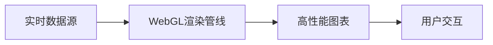

## 前言

大家好，我是Jorgen！👋 在前端开发的浩瀚星空中，我们常常专注于组件构建、状态管理和性能优化，却可能忽略了一个充满创造力的领域——**前端图形学**。随着Web应用日益复杂化，从数据可视化到3D交互，从实时渲染到AR/VR体验，图形技术正成为现代前端工程师的必备技能。

::: tip
"图形是连接用户与数字世界的桥梁，而Canvas与WebGL正是这座桥梁最坚实的基石。"
:::

在浏览现有文章时，我发现虽然我们有数据可视化、渲染技术等内容，但**专门深入探讨Canvas与WebGL的前端图形学文章**尚属空白。今天，就让我们一起探索这个充满魅力的领域吧！🚀

## Canvas基础：像素级控制的画布

### 什么是Canvas？

Canvas是HTML5提供的强大绘图API，它允许我们在网页上通过JavaScript直接操作像素，创建动态图形和动画。想象一下，你手里有一块无限大的数字画布，可以随心所欲地绘制任何图形！🎨

```javascript
const canvas = document.getElementById('myCanvas');
const ctx = canvas.getContext('2d');

// 绘制一个渐变圆形
const gradient = ctx.createRadialGradient(100, 100, 10, 100, 100, 100);
gradient.addColorStop(0, 'rgba(255, 0, 0, 1)');
gradient.addColorStop(1, 'rgba(255, 0, 0, 0)');

ctx.beginPath();
ctx.arc(100, 100, 100, 0, Math.PI * 2);
ctx.fillStyle = gradient;
ctx.fill();
```

### Canvas核心能力

- **2D绘图**：路径、形状、文本、图像处理
- **动画控制**：requestAnimationFrame实现流畅动画
- **像素操作**：直接读写ImageData
- **交互响应**：结合事件处理实现用户交互

::: theorem
Canvas最适合处理2D图形、游戏、图像编辑和数据可视化，其API直观易用，学习曲线相对平缓。
::>

## WebGL入门：3D图形的魔法世界

### 从Canvas到WebGL

当2D无法满足需求时，WebGL应运而生！WebGL（Web Graphics Library）是基于OpenGL ES的JavaScript API，让我们能在浏览器中创建高性能的3D图形。~~想象一下，你突然从二维平面跃升到三维空间，是不是有点小激动？~~

```javascript
const canvas = document.getElementById('webglCanvas');
const gl = canvas.getContext('webgl');

// 顶点着色器
const vsSource = `
  attribute vec4 aVertexPosition;
  void main() {
    gl_Position = aVertexPosition;
  }
`;

// 片段着色器
const fsSource = `
  void main() {
    gl_FragColor = vec4(1.0, 0.0, 0.0, 1.0);
  }
`;

// 创建着色器程序
const shaderProgram = initShaderProgram(gl, vsSource, fsSource);
```

### WebGL核心概念

- **着色器**：运行在GPU上的小程序（顶点着色器+片段着色器）
- **缓冲区**：存储顶点数据、颜色、纹理等
- **纹理**：为3D模型添加表面细节
- **矩阵变换**：处理3D空间的旋转、缩放、平移

> 📡 WebGL虽然强大，但直接使用原始API非常复杂。推荐从Three.js等库开始，它们封装了底层细节，让我们专注于创意而非数学计算！

## 高级应用：图形学的实际战场

### 1. 实时数据可视化



使用WebGL实现百万级数据点的实时渲染，比传统DOM操作快100倍以上！📊

### 2. 3D产品展示

电商网站中的3D产品展示，用户可360°旋转查看商品细节，提升转化率30%+。🛍️

### 3. AR/VR体验

结合WebXR API，在浏览器中实现增强现实和虚拟现实体验，无需安装额外应用！🥽

## 性能优化：让图形飞起来

### Canvas优化技巧

1. **离屏渲染**：使用`document.createElement('canvas')`创建离屏Canvas
2. **分层渲染**：将静态背景与动态元素分离
3. **节流控制**：对resize事件进行节流处理

```javascript
// 使用离屏Canvas优化性能
const offscreenCanvas = document.createElement('canvas');
const offscreenCtx = offscreenCanvas.getContext('2d');
// ...绘制到离屏Canvas
// 然后一次性绘制到主Canvas
ctx.drawImage(offscreenCanvas, 0, 0);
```

### WebGL性能关键

- **批处理渲染**：合并绘制调用
- **纹理图集**：减少纹理切换
- **LOD技术**：根据距离调整模型复杂度
- **GPU实例化**：渲染大量相似对象

::: tip
记住：在图形应用中，60FPS是黄金标准！任何低于这个数值的体验都会让用户感到卡顿。
:::

## 工具与库：站在巨人的肩膀上

| 库名称 | 适用场景 | 特点 |
|--------|----------|------|
| Three.js | 3D场景 | 最流行的WebGL库，文档完善 |
| PixiJS | 2D游戏 | 高性能2D渲染，适合游戏开发 |
| Babylon.js | 3D引擎 | 完整的3D开发解决方案 |
| D3.js | 数据可视化 | 强大的数据绑定能力 |
| Chart.js | 图表 | 简单易用的图表库 |

**推荐学习路径**：
1. 从Canvas API开始，理解基本绘图原理
2. 学习WebGL基础概念（着色器、缓冲区）
3. 使用Three.js构建3D场景
4. 深入研究图形学数学（线性代数、3D变换）
5. 探索WebGPU等新技术

## 未来展望：图形学的星辰大海

随着WebGPU的普及，我们将迎来：
- **更强大的渲染能力**：支持光线追踪等高级渲染技术
- **更接近原生性能**：媲美原生应用的图形表现
- **更广泛的设备支持**：从手机到桌面到AR设备

> 🤔 未来的Web应用将不再局限于文档和表单，而是成为真正的交互式数字体验平台！

## 结语

前端图形学是一片充满机遇的蓝海，掌握Canvas和WebGL技术将让你在开发者的海洋中脱颖而出。无论你是构建数据可视化、3D产品展示还是创意交互应用，图形技术都能为你的项目注入灵魂。

记住：**最好的图形不是最炫酷的，而是最能解决问题的**。从今天开始，拿起Canvas和WebGL这把画笔，在数字画布上描绘属于你的创意世界吧！🎨

---

> "代码是逻辑，图形是艺术，而前端图形学就是逻辑与艺术的完美融合。"  
> —— Jorgen的图形学感悟