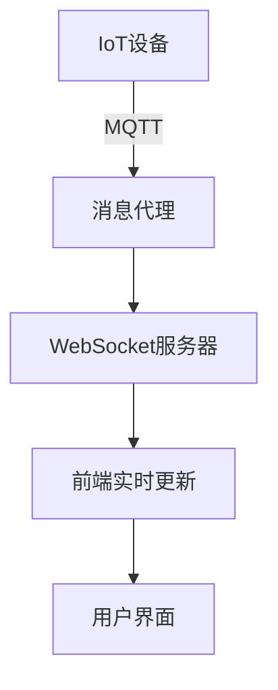

## 前言

最近我在智能家居项目中折腾，突然意识到一个有趣的现象：我们的Web应用正从纯粹的数字世界，逐渐延伸到物理世界。当我通过浏览器控制家中的灯光、温度传感器时，一个全新的技术领域在我眼前展开——前端与物联网（IoT）的集成。这个领域就像一座桥梁，让虚拟界面与实体设备无缝对话，却常常被前端开发者忽视。今天我想和大家聊聊这个充满潜力的交叉领域，以及如何在前端世界中安全高效地连接那些"会呼吸"的设备。

::: tip
物联网（IoT）正以指数级速度增长，预计到2025年全球将有超过750亿台互联设备。而Web作为最普及的访问方式，正成为这些设备的"数字大脑"。
:::

## 物联网前端架构的核心挑战

### 设备异构性与通信协议

物联网世界最大的痛点就是"百家争鸣"——设备厂商各自为政，通信协议五花八门。从MQTT、CoAP到HTTP/2，从WebSocket到蓝牙BLE，每种协议都有其适用场景。作为前端开发者，我们需要一个统一的抽象层来处理这种复杂性。

```javascript
// 设备通信抽象层示例
class IoTDeviceManager {
  constructor() {
    this.protocols = {
      mqtt: new MqttAdapter(),
      http: new HttpAdapter(),
      ble: new BluetoothAdapter()
    };
  }

  async connect(device) {
    const protocol = this.detectProtocol(device);
    return this.protocols[protocol].connect(device);
  }
}
```

### 实时数据流处理

物联网设备产生的是持续不断的数据流，这与传统的"请求-响应"模式完全不同。前端需要高效处理高频数据，同时保持UI的流畅响应。



## 前端与IoT集成的关键技术栈

### 1. 实时通信框架

**WebSocket** 是基础选择，但更专业的场景可能需要 **MQTT.js** 或 **Socket.IO**：

```javascript
// 使用MQTT.js连接智能家居设备
import mqtt from 'mqtt';

const client = mqtt.connect('mqtt://your-broker:1883');

client.on('connect', () => {
  client.subscribe('home/living-room/temperature');
});

client.on('message', (topic, message) => {
  // 更新UI温度显示
  updateTemperatureDisplay(parseFloat(message));
});
```

### 2. 数据可视化库

物联网数据需要直观呈现，**D3.js**、**ECharts** 或 **Plotly.js** 是理想选择：

```javascript
// 使用ECharts展示温度趋势
const chart = echarts.init(document.getElementById('temp-chart'));
chart.setOption({
  title: { text: '客厅温度变化' },
  xAxis: { type: 'time' },
  yAxis: { type: 'value', name: '温度(°C)' },
  series: [{
    type: 'line',
    data: temperatureData
  }]
});
```

### 3. 设备身份认证与安全

这是最容易忽视却至关重要的环节！每个设备都需要唯一身份验证：

```javascript
// JWT设备认证流程
async function authenticateDevice(deviceId) {
  const response = await fetch('/api/auth/device', {
    method: 'POST',
    headers: { 'Content-Type': 'application/json' },
    body: JSON.stringify({ deviceId, cert: deviceCertificate })
  });
  
  return response.json().then(data => {
    localStorage.setItem('deviceToken', data.token);
  });
}
```

## 实战案例：智能家居控制面板

让我们构建一个简单的智能家居控制面板，包含以下功能：
1. 设备状态实时监控
2. 远程控制开关
3. 能耗分析图表

### 组件架构设计

```
IoTDashboard/
├── DeviceMonitor/
│   ├── TemperatureSensor.vue
│   ├── LightControl.vue
│   └── PowerMeter.vue
├── DeviceManager.js
└── RealtimeService.js
```

### 关键实现代码

```vue
<!-- LightControl.vue -->
<template>
  <div class="device-card">
    <h3>{{ device.name }}</h3>
    <div class="status-indicator" :class="{ active: device.isOn }"></div>
    <button @click="togglePower">
      {{ device.isOn ? '关闭' : '开启' }}
    </button>
  </div>
</template>

<script>
export default {
  props: ['device'],
  methods: {
    async togglePower() {
      await this.$iotService.toggleDevice(this.device.id);
      this.device.isOn = !this.device.isOn;
    }
  }
}
</script>
```

## 性能优化策略

物联网应用面临独特的性能挑战：

### 1. 数据降采样与缓存

```javascript
// 实现数据降采样
function downsampleData(rawData, targetPoints) {
  const bucketSize = Math.ceil(rawData.length / targetPoints);
  return rawData.reduce((result, value, index) => {
    if (index % bucketSize === 0) {
      result.push(value);
    }
    return result;
  }, []);
}
```

### 2. 虚拟滚动处理大量设备

```javascript
// 使用vue-virtual-scroller
<RecycleScroller
  :items="devices"
  :item-size="80"
  key-field="id"
  v-slot="{ item }">
  <DeviceCard :device="item" />
</RecycleScroller>
```

## 安全最佳实践

::: theorem 安全红线
物联网安全是"木桶效应"——最薄弱的环节决定了整个系统的安全性。前端作为用户入口，必须建立严格的安全防线。
:::

1. **设备证书管理**：使用X.509证书进行双向认证
2. **数据传输加密**：强制使用TLS 1.3
3. **权限最小化**：前端只展示必要控制权限
4. **审计日志**：记录所有设备操作

```javascript
// 设备操作审计
function logDeviceAction(deviceId, action, user) {
  fetch('/api/audit', {
    method: 'POST',
    body: JSON.stringify({
      timestamp: new Date().toISOString(),
      deviceId,
      action,
      user,
      ip: getUserIP()
    })
  });
}
```

## 未来展望

前端与物联网的融合才刚刚开始，未来我们可能会看到：

1. **WebXR与IoT结合**：通过AR/VR界面控制物理设备
2. **边缘计算前端**：在本地网关运行前端逻辑
3. **AIoT体验**：基于机器学习的自适应设备控制

> 物联网不是科幻概念，而是已经到来的现实。作为前端开发者，我们正站在连接数字世界与物理世界的最前沿。掌握IoT集成技术，不仅能让我们的应用更酷炫，更能真正改变人们的生活。

## 结语

当我第一次通过网页控制家中的智能窗帘时，那种奇妙的感觉至今难忘——虚拟代码正在驱动真实世界的物理变化。前端与物联网的集成，本质上是赋予数字世界"触觉"和"行动能力"的过程。虽然面临安全、性能、协议兼容等诸多挑战，但每当看到自己编写的界面成功控制了现实设备时，那种成就感无与伦比。

希望今天的分享能启发大家探索这个充满可能性的领域。毕竟，未来已来，而Web正是连接未来的最佳入口！🌐💡