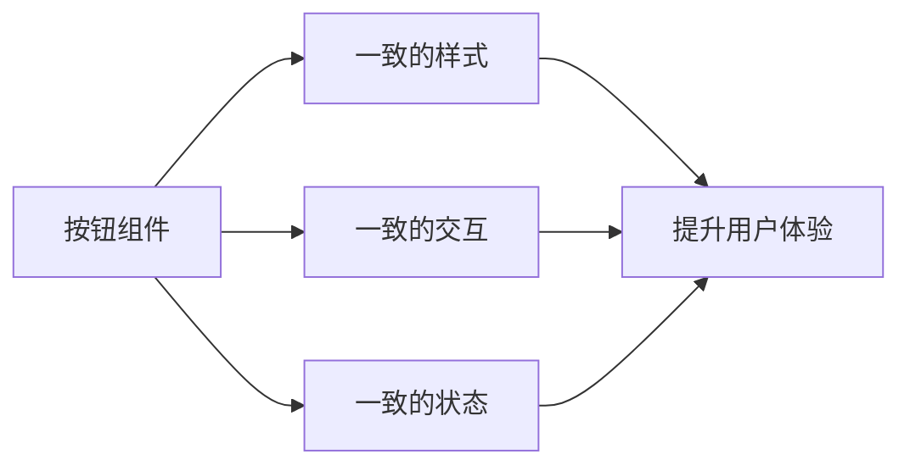

## 前言

在现代前端开发中，随着项目规模不断扩大和团队协作日益频繁，如何保持产品的一致性和提高开发效率成为了一个重要挑战。设计系统(Design System)应运而生，它不仅仅是一套UI组件库，更是一套完整的设计语言、规范和流程，帮助团队构建一致且可扩展的用户体验。

::: tip
设计系统是设计原则、模式、组件和文档的集合，它使团队能够以一致、可扩展的方式构建产品。
:::

尽管组件化开发在前端领域已经得到广泛应用，但大多数团队仍然停留在简单的组件复用层面，缺乏系统性的设计思考和规范。本文将深入探讨前端设计系统的构建方法、最佳实践以及如何将其融入开发流程。

## 设计系统的核心价值

### 一致性体验

设计系统最直接的价值在于确保产品在不同页面、不同功能模块中保持视觉和交互的一致性。用户不需要重新学习界面元素的使用方式，降低了认知负担，提升了整体用户体验。



### 提高开发效率

通过提供经过验证的组件和模式，设计系统显著减少了重复设计和编码的工作。开发者可以直接使用现成的组件，专注于业务逻辑实现，从而提高开发效率。

### 促进团队协作

设计系统为设计师和开发者提供了共同的语言和参考标准，减少了沟通成本，促进了更高效的团队协作。

## 设计系统的核心组成部分

### 设计令牌(Design Tokens)

设计令牌是设计系统的基石，它们是命名的设计值，如颜色、字体、间距、圆角等。使用令牌而不是硬编码的值，使得设计系统更容易维护和更新。

```css
/* 不推荐：硬编码值 */
.button {
  background-color: #1890ff;
  color: white;
  border-radius: 4px;
}

/* 推荐：使用设计令牌 */
.button {
  background-color: ${color-primary};
  color: ${color-white};
  border-radius: ${radius-small};
}
```

### 组件库

组件库是设计系统的具体实现，包括基础组件(按钮、输入框、下拉菜单等)和复合组件(表单、卡片、对话框等)。每个组件都应该有明确的API、使用示例和最佳实践文档。

### 设计模式

设计模式是常见UI交互和布局的解决方案，它们提供了处理复杂交互和布局的标准化方法。例如，模态框模式、表单验证模式、数据表格模式等。

### 文档与指南

完善的文档是设计系统成功的关键。它应该包括组件使用指南、设计原则、最佳实践、常见问题解答等内容，帮助团队成员正确使用设计系统。

## 构建设计系统的步骤

### 1. 研究与分析

在构建设计系统之前，首先需要对现有产品进行深入分析，识别出常用的UI元素、交互模式和设计决策。同时，研究行业最佳实践和竞品设计，为设计系统提供参考。

### 2. 建立设计原则

设计原则是指导设计决策的核心理念，它们应该简洁明了，易于理解和遵循。例如：

- **清晰性**：界面应该清晰易懂，避免歧义。
- **一致性**：保持设计元素和交互方式的一致性。
- **效率**：优化用户流程，减少不必要的操作。
- **包容性**：确保设计对所有用户都友好，包括残障人士。

### 3. 创建设计令牌

基于设计原则和品牌指南，创建一套完整的设计令牌，包括颜色、字体、间距、圆角、阴影等。这些令牌应该有明确的命名规则，便于团队成员理解和使用。

### 4. 构建组件库

从基础组件开始，逐步构建完整的组件库。每个组件都应该：

- 有清晰的API和Props定义
- 提供多种状态和变体
- 包含使用示例和最佳实践
- 确保可访问性支持

### 5. 建立文档和指南

创建全面的文档网站，包括组件库、设计模式、使用指南等内容。文档应该易于导航，搜索功能完善，并提供交互式示例。

### 6. 实施和维护

将设计系统集成到现有的开发流程中，建立维护和更新机制。定期收集用户反馈，持续优化设计系统。

## 设计系统的最佳实践

### 从小开始，逐步扩展

不要试图一次性构建一个完美的设计系统。从一个简单的组件库开始，随着项目发展逐步扩展和完善。这种方法可以降低初始成本，更快地获得价值。

### 组件应该具有灵活性

每个组件都应该能够适应不同的使用场景，而不是针对特定场景进行硬编码。例如，按钮组件应该支持不同的尺寸、颜色和状态，而不是为每种情况创建单独的组件。

### 优先考虑可访问性

设计系统应该遵循WCAG(Web内容可访问性指南)标准，确保所有组件都对残障人士友好。这包括适当的颜色对比度、键盘导航支持、屏幕阅读器兼容性等。

### 建立反馈机制

设计系统不是一成不变的，应该建立收集用户反馈的机制，定期评估和更新设计系统。这可以包括定期的设计审查、用户调研和数据分析。

## 设计系统的工具和框架

### 设计工具

- **Figma**：强大的协作设计工具，支持设计令牌和组件库管理
- **Sketch**：流行的macOS设计工具，有丰富的插件生态系统
- **Adobe XD**：Adobe公司的设计工具，与Creative Cloud无缝集成

### 开发框架

- **Storybook**：用于开发和测试UI组件的开源工具
- **React Styleguidist**：为React组件生成文档的工具
- **Docz**：基于Markdown的文档生成工具
- **VitePress**：VuePress的轻量级替代品，适合构建文档网站

### 代码生成工具

- **Style Dictionary**：将设计令牌转换为不同平台代码的工具
- **Theme UI**：基于设计令牌的React UI库
- **Tailwind CSS**：实用优先的CSS框架，支持设计令牌

## 设计系统的维护和演进

### 版本控制

设计系统应该使用语义化版本控制，明确标记重大变更、新功能和错误修复。这有助于团队了解变更的影响，并做好相应的准备。

### 自动化测试

建立自动化测试流程，确保设计系统的变更不会破坏现有功能。这包括视觉回归测试、可访问性测试和单元测试。

### 持续集成/持续部署(CI/CD)

将设计系统的构建和部署流程自动化，确保团队成员能够始终使用最新版本的设计系统。

### 社区参与

鼓励团队成员参与设计系统的贡献和改进，建立良好的社区文化。这可以包括定期的设计评审会、工作坊和培训。

## 结语

前端设计系统是现代前端开发不可或缺的一部分，它不仅能够提升产品的一致性和用户体验，还能显著提高开发效率和团队协作质量。虽然构建和维护一个设计系统需要投入一定的资源，但长期来看，它将为团队带来巨大的价值。

随着技术的不断发展和用户需求的不断变化，设计系统也需要持续演进和优化。希望本文能够帮助你了解设计系统的重要性和构建方法，并在自己的项目中成功实施设计系统。

> "设计系统不是终点，而是起点。它为我们提供了一个坚实的基础，让我们能够专注于创造真正有价值的用户体验。"

---

未来，随着AI、AR/VR等新技术的发展，设计系统也将面临新的挑战和机遇。保持开放的心态，不断学习和探索，才能构建出真正适应未来需求的优秀设计系统。