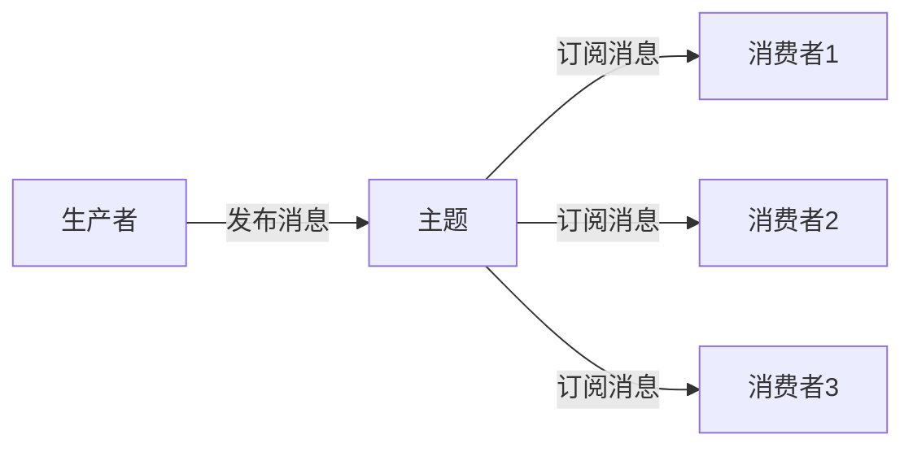
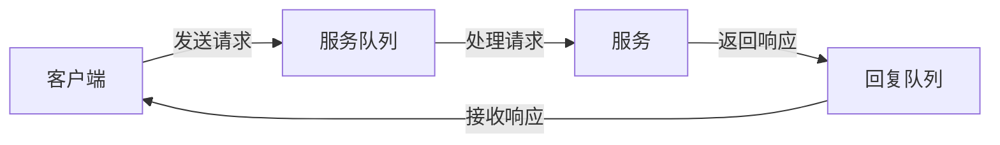
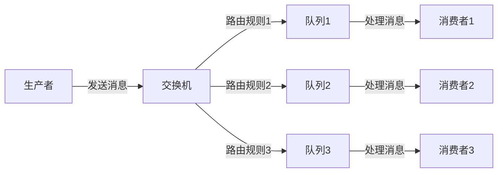
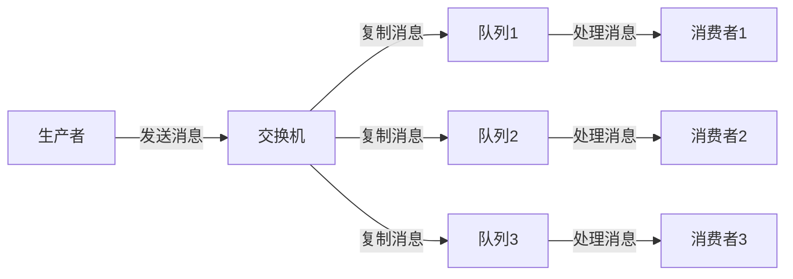
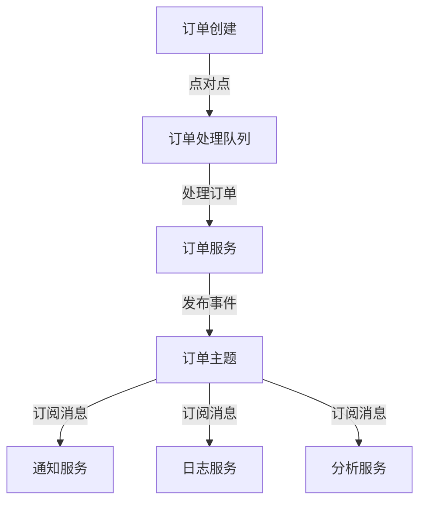
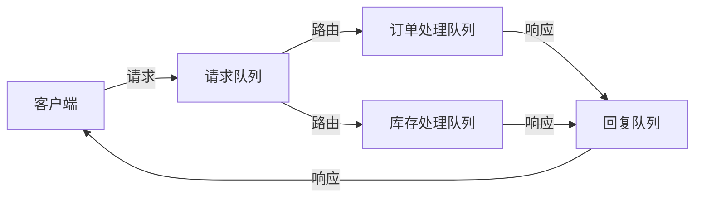

## 前言

在分布式系统开发中，消息队列就像是我们系统之间的"邮政系统"，负责可靠地传递各种"信件"。📡 我之前已经写过不少关于消息队列可靠性和事务处理的文章，但似乎忽略了一个重要方面——架构设计模式。

就像盖房子需要先设计蓝图一样，构建基于消息队列的系统也需要考虑不同的架构模式。今天，我想和大家一起探讨消息队列的几种核心架构设计模式，以及如何根据业务场景选择最合适的模式。

::: tip
架构模式不是银弹，没有放之四海而皆准的解决方案。选择合适的架构模式需要综合考虑业务需求、系统复杂度、团队技术栈等多方面因素。
:::

## 消息队列的核心架构模式

### 1. 点对点模式 (Point-to-Point)

点对点模式是最简单的消息使用方式，就像发送一封私人信件，只有一个接收者能够处理这条消息。

**特点**：
- 一条消息只能被一个消费者处理
- 消费者之间不存在竞争关系
- 消息队列通常称为"队列"

**适用场景**：
- 任务分配系统（如订单处理、报表生成）
- 需要确保任务只被处理一次的场景
- 工作队列模式

**实际应用**：
我曾经在电商系统中使用点对点模式处理订单创建后的流程，每个订单只会被一个订单处理服务处理，确保了订单处理的唯一性和一致性。

### 2. 发布-订阅模式 (Publish-Subscribe)

发布-订阅模式就像广播电台，发布者发送消息后，所有订阅了该主题的消费者都能收到消息。

**特点**：
- 一条消息可以被多个消费者处理
- 消费者之间相互独立
- 消息队列通常称为"主题"(Topic)

**适用场景**：
- 事件通知系统（如用户注册后的欢迎邮件、短信通知）
- 数据分发与同步
- 实时数据处理与分析

**实际应用**：
在我的博客系统中，每当有新文章发布，就会通过发布-订阅模式通知多个服务：搜索引擎索引服务、社交媒体分享服务、邮件订阅服务等。

### 3. 请求-响应模式 (Request-Reply)

请求-响应模式就像打电话，发送请求后等待响应，形成同步通信的假象。

**特点**：
- 发送方等待接收方的响应
- 可以实现同步通信的异步化
- 需要专门的回复队列或回调机制

**适用场景**：
- 需要即时反馈的API调用
- 微服务间的同步调用场景
- 需要结果确认的操作

**实际应用**：
在支付系统中，我们使用请求-响应模式处理支付状态查询。前端发送查询请求后，不需要等待支付处理完成，而是通过消息队列异步获取支付结果，提升了用户体验。

### 4. 路由拓扑模式 (Routing Topology)

路由拓扑模式更像是一个智能邮局，根据消息内容将其路由到不同的处理队列。

**特点**：
- 基于消息内容或属性进行路由
- 支持复杂的消息分发逻辑
- 可以实现消息的过滤和转换

**适用场景**：
- 基于业务规则的消息路由
- 消息内容的过滤与转换
- 多租户系统中的消息隔离

**实际应用**：
在物流系统中，我们使用路由拓扑模式根据订单类型（普通订单、加急订单、国际订单）将消息路由到不同的处理队列，确保不同类型订单得到差异化处理。

### 5. 扇出模式 (Fan-Out)

扇出模式是发布-订阅模式的一种变体，消息会被复制并广播到所有绑定队列。

**特点**：
- 消息被复制到所有队列
- 所有消费者都会收到相同的消息
- 不需要复杂的路由逻辑

**适用场景**：
- 需要将相同消息发送到多个处理流程
- 事件广播场景
- 数据备份与同步

**实际应用**：
在用户行为分析系统中，我们使用扇出模式将用户行为事件同时发送到实时分析队列、离线分析队列和数据存储队列，实现不同粒度的数据处理。

## 架构模式的选择策略

选择合适的消息队列架构模式需要考虑以下因素：

### 1. 业务需求分析

::: theorem
业务需求是架构模式选择的首要依据。不同的业务场景需要不同的通信模式。
:::

**问题清单**：
- 消息是否需要被多个服务处理？
- 是否需要确保消息只被处理一次？
- 是否需要即时响应？
- 消息是否需要根据内容进行路由？

### 2. 系统性能考虑

不同的架构模式对系统性能有不同的影响：

- **点对点模式**：适合高吞吐量场景，但扩展性有限
- **发布-订阅模式**：支持水平扩展，但可能造成资源浪费
- **请求-响应模式**：增加了延迟，但提供了同步通信体验
- **路由拓扑模式**：提供了灵活性，但增加了系统复杂度
- **扇出模式**：简单高效，但可能造成重复处理

### 3. 可靠性与一致性需求

根据我在[《消息队列的可靠性保证》](/pages/xxxxxx/)中的经验，不同架构模式对可靠性的要求也不同：

- **点对点模式**：天然支持消息的可靠投递
- **发布-订阅模式**：需要处理重复消费问题
- **请求-响应模式**：需要处理请求-响应的关联性
- **路由拓扑模式**：需要确保路由过程中的消息不丢失
- **扇出模式**：需要确保消息被正确复制到所有队列

## 混合架构模式

在实际应用中，单一架构模式往往无法满足复杂业务需求，通常需要组合使用多种模式。

### 典型组合方案

**方案一：点对点 + 发布-订阅**

**方案二：请求-响应 + 路由拓扑**

## 实践案例：电商平台的消息架构

在我负责的电商平台中，我们采用了多种架构模式的组合：

### 1. 订单处理流程（点对点模式）

订单创建后，通过点对点模式发送到订单处理队列，确保每个订单只被一个订单服务处理，避免重复下单问题。

### 2. 事件通知系统（发布-订阅模式）

订单状态变更后，通过发布-订阅模式通知多个系统：
- 用户通知系统（发送短信、邮件）
- 库存管理系统（更新库存）
- 物流系统（准备发货）
- 推荐系统（基于购买历史更新推荐）

### 3. 支付处理（请求-响应模式）

用户支付时，前端发送支付请求，通过请求-响应模式异步处理支付，避免长时间等待支付结果。

### 4. 订单路由（路由拓扑模式）

根据订单类型（国内订单、国际订单、团购订单）将订单消息路由到不同的处理队列，实现差异化处理。

## 架构模式演进策略

随着业务发展，消息队列架构也需要不断演进：

### 1. 从简单到复杂

初创阶段可以采用简单的点对点模式，随着业务复杂度增加，逐步引入更复杂的架构模式。

### 2. 性能优化驱动

当系统性能成为瓶颈时，可以考虑引入发布-订阅模式实现并行处理，或使用扇出模式分担负载。

### 3. 业务需求牵引

业务需求的变化是架构演进的主要驱动力。例如，当需要支持多租户时，可能需要引入更复杂的路由拓扑模式。

## 常见陷阱与最佳实践

### 1. 过度使用发布-订阅模式

发布-订阅模式虽然灵活，但过度使用会导致系统耦合度高，难以维护。**建议**：明确区分需要广播和需要独占处理的消息场景。

### 2. 忽略消息顺序问题

在某些架构模式中，消息顺序可能无法保证。**建议**：对于需要顺序处理的场景，可以考虑使用单消费者队列或添加序列号字段。

### 3. 请求-响应模式的超时处理

请求-响应模式中，如果消费者处理失败，可能导致请求方无限等待。**建议**：实现合理的超时机制和重试策略。

### 4. 路由拓扑的性能瓶颈

复杂的路由规则可能成为系统瓶颈。**建议**：定期评估路由规则，避免过度复杂的条件判断。

## 结语

消息队列的架构设计模式是构建高可用分布式系统的关键选择。🏗 没有放之四海而皆准的架构模式，每种模式都有其适用场景和局限性。

在实际项目中，我常常看到团队陷入"银弹思维"，试图找到一种架构模式解决所有问题。~~这就像试图用一把螺丝刀修理所有东西一样，注定会失败~~。正确的做法是根据业务需求、系统特性和团队能力，灵活选择和组合不同的架构模式。

> 架构设计是一门平衡的艺术，需要在简单性、灵活性、性能和可维护性之间找到最佳平衡点。

随着微服务架构的普及，消息队列作为服务间通信的核心组件，其架构设计模式的重要性将更加凸显。希望今天的分享能帮助大家在项目中做出更明智的架构选择。

如果你有关于消息队列架构设计的实践经验或问题，欢迎在评论区交流讨论！🤝

---

*本文是消息队列系列的又一篇文章，如果你对其他相关主题感兴趣，可以查看[《消息队列的可靠性保证》](/pages/xxxxxx/)和[《消息队列的事务消息》](/pages/xxxxxx/)等文章。*