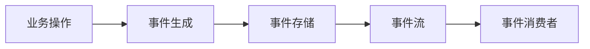

## 前言

在构建现代分布式系统的过程中，消息队列早已不是简单的"生产者-消费者"模式通信工具了。随着Kafka、Pulsar、RabbitMQ Stream等技术的发展，消息队列已经演变成了强大的事件流处理平台。然而，我在翻阅自己的博客文章时，发现了一个明显的知识缺口——关于消息队列流处理能力的探讨。

> 消息队列不再仅仅是消息的"中转站"，而是成为了实时数据流的"高速公路"。

今天，我想和大家聊聊消息队列的流处理能力，以及它如何成为构建事件驱动架构的核心引擎。

## 传统消息队列与流处理的区别

首先，我们需要明确传统消息队列和流处理的区别：

| 特性 | 传统消息队列 | 流处理平台 |
|------|------------|------------|
| 数据模型 | 点对点或发布-订阅 | 持久化的数据流 |
| 数据保留 | 通常被消费后删除 | 持久存储，可回溯 |
| 消费模式 | 消费一次即删除 | 可多次消费，支持偏移量管理 |
| 实时性 | 近实时 | 真正的实时处理 |
| 扩展能力 | 基于队列扩展 | 基于分区扩展，支持水平扩展 |

传统的消息队列主要关注的是**可靠的消息传递**，而流处理平台则更关注**数据的持久化和实时处理能力**。

## 流处理的核心概念

### 📡 数据流与事件溯源

在流处理模型中，数据不再被视为孤立的记录，而是连续的、有序的事件流。这种模型天然支持**事件溯源(Event Sourcing)**模式：



事件溯源的优势在于：
- 完整的业务历史被记录
- 支持时间旅行式查询
- 系统状态可重建
- 审计和合规性支持

### 🔄 状态计算与窗口操作

流处理的另一个核心是**状态计算**。与批处理不同，流处理需要在数据流动过程中维护和更新状态：

```java
// 伪代码示例：窗口计数
stream
  .groupBy(user)
  .window(TumblingEventTimeWindows.of(Time.minutes(5)))
  .count()
  .toStream()
  .print();
```

常见的窗口操作包括：
- 滚动窗口(Tumbling Window)
- 滑动窗口(Hopping Window)
- 会话窗口(Session Window)
- 全局窗口(Global Window)

### 🧩 流处理拓扑与算子

流处理应用通常构建为**有向无环图(DAG)**的形式，其中节点是处理算子，边是数据流：

```
Source -> Transform -> Transform -> Sink
   |         |          |
 Filter  MapFunction  Aggregation
```

常见的流处理算子包括：
- **Source算子**：数据源接入
- **转换算子**：map, filter, flatMap等
- **连接算子**：join, co-group等
- **聚合算子**：reduce, aggregate, window aggregation等
- **Sink算子**：结果输出

## 主流消息队列的流处理能力

### Kafka Streams

Kafka作为最流行的消息队列之一，提供了强大的流处理能力：

```java
// Kafka Streams示例：实时词频统计
KStream<String, String> textLines = builder.stream("TextLinesTopic");
KTable<String, Long> wordCounts = textLines
    .flatMapValues(value -> Arrays.asList(value.toLowerCase().split(" ")))
    .groupBy((key, word) -> word)
    .count();
wordCounts.toStream().to("WordsWithCountsTopic", Produced.with(Serdes.String(), Serdes.Long()));
```

Kafka Streams的优势：
- 无需部署独立集群
- 与Kafka生态无缝集成
- 支持exactly-once语义
- 自动化的状态存储管理

### Apache Pulsar Functions

Pulsar提供了轻量级的函数计算能力：

```yaml
# Pulsar Functions配置示例
name: word-count
className: org.apache.pulsar.functions.api.examples.WordCount
inputs:
  - persistent://my-tenant/my-namespace/input-topic
output: persistent://my-tenant/my-namespace/output-topic
autoAck: true
```

Pulsar Functions的特点：
- 支持多种语言(Java, Python, Go等)
- 内置状态管理
- 自动扩缩容
- 支持复杂的函数链式调用

### RabbitMQ Stream

RabbitMQ引入了流式处理能力：

```erlang
% RabbitMQ Stream示例
%% 创建流
rabbit_stream:create(my_stream, #{}).

%% 发布消息
rabbit_stream:publish(my_stream, <<"message">>, #{}).

%% 消费消息
rabbit_stream:subscribe(my_stream, self(), #{}).
```

RabbitMQ Stream的优势：
- 保持了AMQP协议的兼容性
- 支持消息回溯
- 与RabbitMQ现有生态集成
- 提供流式和队列两种消费模式

## 流处理架构模式

### 🏗 事件驱动架构(EDA)

流处理是构建事件驱动架构的核心：

```
┌─────────────┐     ┌─────────────┐     ┌─────────────┐
│   事件源    │ ──> │  事件总线    │ ──> │  事件处理器  │
│ (数据库/UI) │     │ (消息队列)   │     │ (微服务)    │
└─────────────┘     └─────────────┘     └─────────────┘
```

EDA的优势：
- 系统组件间解耦
- 提高系统的响应速度
- 更好的可扩展性
- 支持复杂的事件处理流程

### 🔄 CQRS模式(命令查询责任分离)

流处理使CQRS模式更加可行：

```
命令端                  查询端
┌─────────┐            ┌─────────┐
│ 用户操作 │ ───────>  │ 事件存储 │
└─────────┘            └─────────┘
                        │
                        ▼
                   ┌─────────┐
                   │ 事件流  │
                   └─────────┘
                        │
                        ▼
                   ┌─────────┐
                   │ 查询模型 │
                   └─────────┘
```

CQRS结合流处理的优势：
- 读写分离，优化性能
- 支持复杂的查询需求
- 更好的可扩展性
- 事件溯源能力

## 流处理的最佳实践

### 💡 状态管理策略

流处理中的状态管理至关重要：

1. **状态存储选择**：
   - 本地状态：低延迟，但可靠性受限
   - 分布式状态：高可靠性，但可能有延迟

2. **状态一致性**：
   - 至少一次处理(At-least-once)
   - 精确一次处理(Exactly-once)
   - 最多一次处理(At-most-once)

3. **状态清理**：
   - 基于时间的TTL
   - 基于大小的限制
   - 手动清理策略

### 🚨 容错与恢复

流处理系统必须具备强大的容错能力：

1. **检查点机制**：
   - 定期保存处理状态
   - 支持从检查点恢复
   - 保证处理语义的一致性

2. **重试策略**：
   - 指数退避重试
   - 死信队列处理
   - 失败事件隔离

3. **监控与告警**：
   - 处理延迟监控
   - 吞吐量监控
   - 错误率监控

## 性能优化技巧

### 📊 批处理与微批处理

在流处理中，合理使用批处理可以显著提高性能：

```java
// 微批处理示例
stream
  .window(TumblingEventTimeWindows.of(Time.seconds(1)))
  .aggregate(
      () -> new AtomicInteger(0),
      (key, value, aggregate) -> {
          aggregate.add(value);
          return aggregate;
      },
      Materialized.as("aggregate-store")
  );
```

### 🔄 并行度与分区策略

合理的并行度设置是性能优化的关键：

1. **分区数量**：
   - 分区太少：并行度受限
   - 分区太多：资源浪费和协调开销

2. **分区键选择**：
   - 相关数据应分配到同一分区
   - 避免数据倾斜
   - 考虑访问模式

### 🧩 算子优化

具体的算子实现也会影响性能：

1. **状态访问优化**：
   - 减少状态访问频率
   - 使用高效的数据结构
   - 批量状态操作

2. **序列化优化**：
   - 高效的序列化格式
   - 避免不必要的序列化/反序列化
   - 使用二进制格式

## 结语

消息队列的流处理能力正在重新定义我们构建分布式系统的方式。从简单的消息传递到强大的事件流处理，这一转变使系统能够更好地响应实时业务需求，支持复杂的事件驱动架构。

> 流处理不仅是技术，更是一种思维方式的转变——从批处理思维转向实时思维。

随着云原生和Serverless架构的兴起，流处理与这些新技术的结合将产生更多创新应用。未来，我将继续探索消息队列在边缘计算、事件网格等新兴领域的应用，敬请期待！

---

*如果你对消息队列的流处理有任何疑问或见解，欢迎在评论区留言交流。也欢迎关注我的GitHub获取更多技术分享。*