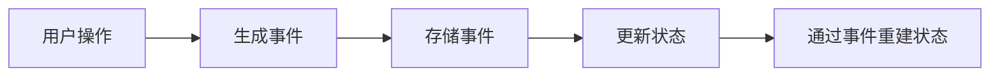
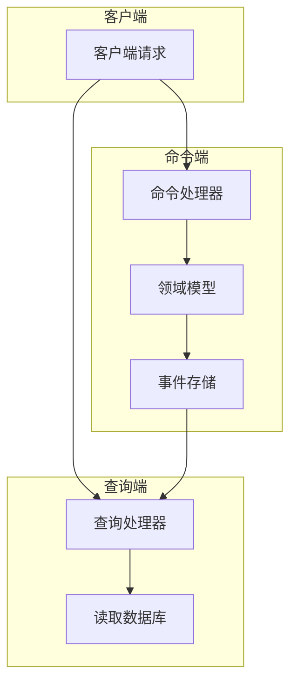
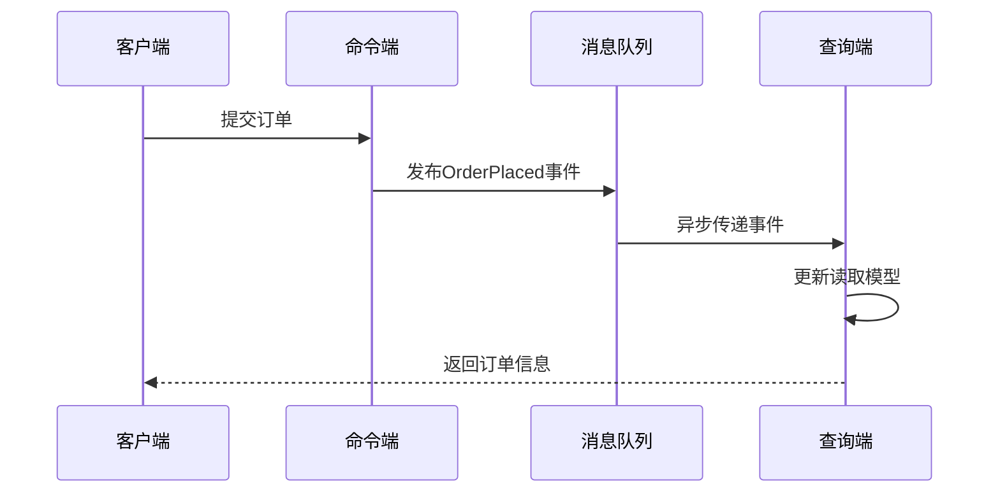
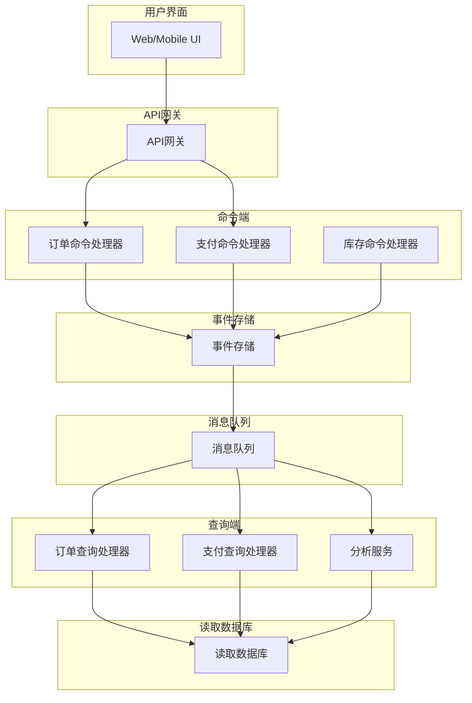

## 前言

在构建现代分布式系统时，我们常常面临如何确保数据一致性、系统可追溯性和性能优化的挑战。传统的CRUD(创建、读取、更新、删除)模型虽然简单直观，但在复杂业务场景下往往显得力不从心。事件溯源(Event Sourcing)与CQRS(Command Query Responsibility Segregation)模式为解决这些问题提供了强大的架构思路，而消息队列则是实现这两种模式的关键组件。

::: tip
事件溯源与CQRS不是银弹，它们增加了系统的复杂性，但在需要高可靠性、审计能力和业务洞察力的场景中，它们的价值不可估量。
:::

## 1. 事件溯源基础

### 1.1 什么是事件溯源？

事件溯源是一种将应用状态变更表示为一系列不可变事件的架构模式。与传统的数据库模型不同，事件溯源不直接存储当前状态，而是存储导致状态变化的一系列事件。



### 1.2 事件溯源的优势

- **完整的审计轨迹**：所有状态变更都被记录为事件，提供完整的历史记录。
- **时间旅行能力**：可以重放任意时间点的事件，重建历史状态。
- **业务洞察力**：事件数据提供了丰富的业务洞察，便于分析和决策。
- **松耦合**：业务逻辑与存储实现分离，提高系统的灵活性。

### 1.3 事件溯源的挑战

- **查询复杂性**：获取当前状态需要重放所有事件，可能影响性能。
- **事件版本控制**：随着业务发展，事件结构可能需要演进。
- **数据一致性**：确保事件处理的幂等性和一致性变得更为复杂。

## 2. CQRS模式详解

### 2.1 CQRS的核心思想

CQRS模式将系统的读写操作分离为两个不同的模型：

- **命令模型(Command Model)**：处理写操作，负责业务逻辑和状态变更。
- **查询模型(Query Model)**：处理读操作，专注于数据检索和展示。



### 2.2 CQRS的优势

- **性能优化**：可以为读写操作分别优化，无需考虑折中。
- **安全性**：可以限制不同用户对命令端和查询端的访问权限。
- **可扩展性**：可以根据负载情况独立扩展命令端和查询端。
- **关注点分离**：使开发团队能够专注于特定领域的开发。

### 2.3 CQRS的适用场景

- **读写比例不平衡**的系统
- **复杂领域模型**的应用
- **需要高性能读取**的场景
- **业务规则复杂且频繁变化**的系统

## 3. 消息队列在事件溯源与CQRS中的作用

### 3.1 事件发布与订阅

在事件溯源架构中，消息队列充当事件总线(Event Bus)的角色：

```java
// 事件发布示例
public class OrderService {
    private final EventStore eventStore;
    private final MessageQueue messageQueue;
    
    public void placeOrder(Order order) {
        // 验证订单
        validateOrder(order);
        
        // 创建事件
        OrderPlacedEvent event = new OrderPlacedEvent(order);
        
        // 存储事件
        eventStore.save(event);
        
        // 发布事件到消息队列
        messageQueue.publish("order-events", event);
    }
}
```

### 3.2 事件处理与投影

消息队列使得事件处理可以异步进行，支持复杂的投影逻辑：

```java
// 事件处理器示例
public class OrderProjectionHandler {
    private final OrderReadRepository readRepository;
    
    @Subscribe("order-events")
    public void handleOrderPlaced(OrderPlacedEvent event) {
        // 更新读取模型
        OrderReadModel readModel = new OrderReadModel(
            event.getOrderId(),
            event.getCustomerId(),
            event.getItems(),
            "PLACED"
        );
        readRepository.save(readModel);
    }
    
    @Subscribe("order-events")
    public void handleOrderPaid(OrderPaidEvent event) {
        // 更新订单状态
        OrderReadModel readModel = readRepository.findById(event.getOrderId());
        readModel.setStatus("PAID");
        readRepository.save(readModel);
    }
}
```

### 3.3 最终一致性保证

消息队列是实现最终一致性的关键组件：



## 4. 实现事件溯源与CQRS的最佳实践

### 4.1 事件设计原则

1. **事件应该描述事实**：使用过去时态命名事件，如"OrderPlaced"而非"PlaceOrder"。
2. **事件应该包含足够信息**：事件应该包含重建状态所需的所有数据。
3. **事件应该是不可变的**：一旦创建，事件不应被修改。
4. **事件应该是幂等的**：多次处理同一事件不应导致状态变化。

### 4.2 版本控制策略

随着业务发展，事件结构可能需要演进：

```java
// 使用接口定义事件基类
public interface DomainEvent {
    String getEventType();
    int getVersion();
    Instant getTimestamp();
}

// 版本1的事件
public class OrderPlacedV1 implements DomainEvent {
    // V1字段
}

// 版本2的事件，添加新字段
public class OrderPlacedV2 implements DomainEvent {
    // 包含V1所有字段
    // 添加新字段
}

// 事件处理器需要处理多个版本
@Subscribe("order-events")
public void handleOrderPlaced(DomainEvent event) {
    if (event instanceof OrderPlacedV1) {
        // 处理V1版本
    } else if (event instanceof OrderPlacedV2) {
        // 处理V2版本
    }
}
```

### 4.3 消息队列选型考虑

在选择消息队列实现事件溯源与CQRS时，应考虑以下因素：

1. **持久性保证**：确保事件不会丢失。
2. **至少一次传递**：避免事件丢失，但需要处理重复消息。
3. **顺序保证**：某些场景下需要确保事件按顺序处理。
4. **分区能力**：支持事件分区和并行处理。
5. **死信队列**：处理无法正常处理的事件。

## 5. 案例分析：电商订单系统

### 5.1 系统架构



### 5.2 关键事件流

1. **订单创建流程**：
   - 用户提交订单
   - OrderCmd处理器创建OrderPlaced事件
   - 事件存储并发布到消息队列
   - OrderQuery处理器更新读取模型
   - InventoryCmd处理器处理库存扣减

2. **支付处理流程**：
   - 用户发起支付
   - PaymentCmd处理器创建PaymentInitiated事件
   - 支付网关处理支付
   - 支付成功后发布PaymentCompleted事件
   - 相关处理器更新状态

### 5.3 性能优化策略

1. **事件批处理**：将多个事件合并处理，减少数据库操作。
2. **缓存策略**：对热点查询数据使用缓存。
3. **读写分离**：使用不同的数据库实例处理读写操作。
4. **异步投影**：将投影操作异步执行，不影响主流程。

## 6. 结语

事件溯源与CQRS模式结合消息队列，为构建高可追溯性、高性能的分布式系统提供了强大的架构思路。虽然实现这些模式会增加系统复杂性，但它们带来的业务价值和技术优势使其在许多场景下成为理想选择。

在实施过程中，我们需要根据具体业务需求权衡利弊，选择合适的事件粒度、队列策略和一致性保证机制。随着系统演进，持续优化和重构也是必不可少的。

> "事件溯源不是关于存储数据，而是关于存储变化。CQRS不是关于分离读写，而是关于为不同目的优化系统。"

通过合理运用这些架构模式，我们可以构建更加健壮、可维护且具有业务洞察力的系统，为企业的数字化转型提供坚实的技术基础。

---

*本文为Jorgen的技术博客原创内容，如需转载请注明出处。*