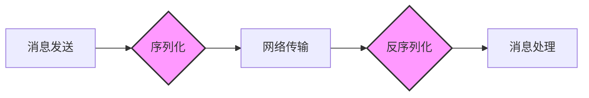

## 前言

在构建分布式系统时，消息队列扮演着至关重要的角色，它就像系统间的"邮政系统"，负责可靠地传递信息。然而，我们常常关注消息队列的可靠性、高可用性、性能等方面，却容易忽略一个同样关键的基础问题：**消息的序列化与数据格式**。

::: tip
序列化是将对象转换为可以存储或传输的格式的过程，而反序列化则是相反的过程。在消息队列中，这决定了消息如何在网络中高效传递，以及如何被不同系统解析。
:::

作为一名在分布式系统领域摸爬滚打多年的工程师，我经历过因序列化选择不当导致的性能瓶颈、兼容性问题，甚至系统崩溃。今天，我想和大家深入探讨消息队列中的序列化与数据格式选择，这可能是你系统中最容易被忽视却影响深远的决策之一。

## 为什么序列化如此重要？

在开始探讨具体技术之前，让我们先理解为什么序列化选择对消息队列如此关键。

### 性能影响

不同的序列化格式在性能上有着天壤之别。我曾在一个项目中，将JSON序列化替换为Protobuf后，消息序列化/反序列化的性能提升了近8倍！这直接影响了系统的吞吐量和响应时间。



如上图所示，序列化和反序列化是消息处理流程中的关键环节，它们的效率直接影响整个系统的性能。

### 兼容性与演化

随着业务的发展，消息结构不可避免地需要演化。一个良好的序列化方案应该能够支持向后和向前兼容，使得新旧系统可以平滑过渡。

我还记得在一个项目中，由于没有考虑消息结构的兼容性，一次简单的字段添加导致了线上大规模的消息解析失败，造成了数小时的业务中断。😱

### 跨语言支持

现代分布式系统往往是多语言技术栈的混合体。序列化方案的选择需要考虑不同语言的生态支持情况，确保各种服务都能方便地处理消息。

## 主流序列化格式对比

让我们来看看当前流行的几种序列化格式及其特点。

### JSON：简单易用但性能欠佳

JSON可能是最广为人知的序列化格式，它具有以下特点：

**优点：**
- 人类可读，调试方便
- 几乎所有编程语言都有成熟的库支持
- 结构简单直观

**缺点：**
- 冗余度高，占用空间大
- 解析性能相对较低
- 缺乏类型系统，运行时才能发现错误

```javascript
// JSON示例
{
  "userId": 12345,
  "userName": "张三",
  "orderItems": [
    {"productId": "A100", "quantity": 2},
    {"productId": "B200", "quantity": 1}
  ],
  "timestamp": "2026-01-28T10:30:00Z"
}
```

### Protobuf：高性能但需要预定义schema

Protocol Buffers（Protobuf）是Google开发的高效序列化格式：

**优点：**
- 序列化后体积小，传输效率高
- 解析速度快
- 支持代码生成，类型安全
- 支持向后和向前兼容

**缺点：**
- 需要预先定义schema
- 二进制格式，不易调试
- 学习曲线相对陡峭

```protobuf
// .proto文件示例
syntax = "proto3";

message Order {
  int64 user_id = 1;
  string user_name = 2;
  repeated OrderItem items = 3;
  int64 timestamp = 4;
}

message OrderItem {
  string product_id = 1;
  int32 quantity = 2;
}
```

### Avro：动态模式与数据绑定

Apache Avro是另一种流行的序列化格式：

**优点：**
- 动态模式，无需代码生成
- 支持模式演化
- 与Hadoop生态系统集成良好

**缺点：**
- 序列化后体积相对较大
- 需要维护模式注册表

### MessagePack：JSON的二进制替代品

MessagePack被称为"二进制JSON"，它保留了JSON的简单性，同时提供了二进制格式的效率：

**优点：**
- JSON兼容，但体积更小
- 解析速度快
- 无需预定义schema

**缺点：**
- 类型系统不如Protobuf强大
- 模式演化支持有限

## 如何选择合适的序列化方案？

面对多种选择，我们该如何决策呢？以下是我的经验总结：

### 考虑因素

1. **性能需求**：对吞吐量和延迟有极高要求的场景，如高频交易系统，应优先考虑Protobuf或Avro。

2. **开发效率**：快速原型开发或小团队项目，JSON或MessagePack可能是更好的选择，因为它们更简单易用。

3. **兼容性要求**：需要长期维护的系统，应选择支持良好模式演化的方案，如Protobuf或Avro。

4. **跨语言需求**：如果系统涉及多种编程语言，应选择各语言生态支持良好的方案。

5. **调试需求**：开发阶段需要频繁调试的场景，JSON等人类可读格式更有优势。

### 实践建议

基于我的经验，以下是一些实用的建议：

1. **性能关键路径使用二进制格式**：在系统的关键路径上，如高吞吐量消息处理，优先使用Protobuf等二进制格式。

2. **采用渐进式策略**：
   - 开发阶段：使用JSON等易于调试的格式
   - 测试阶段：评估不同格式的性能差异
   - 生产环境：切换为高性能格式

3. **建立序列化规范**：
   - 定义团队统一的序列化标准
   - 提供代码生成工具和最佳实践
   - 建立模式版本管理流程

4. **考虑混合使用**：根据不同场景使用不同格式，如控制消息使用JSON，业务数据使用Protobuf。

## 序列化最佳实践

### 模式设计原则

1. **保持模式简洁**：避免过度设计的复杂模式，只包含必要字段。

2. **使用有意义的字段名**：提高可读性和可维护性。

3. **预留字段编号**：为未来扩展预留字段编号（Protobuf中）。

4. **考虑字段类型**：选择合适的字段类型，避免使用过于宽泛的类型。

### 版本兼容策略

1. **向后兼容**：新版本可以读取旧版本数据。
2. **向前兼容**：旧版本可以读取新版本数据（忽略未知字段）。
3. **字段编号管理**：删除字段时保留编号，避免重用。

### 性能优化技巧

1. **避免频繁创建/销毁对象**：重用序列化/反序列化对象。

2. **批量处理**：对于大量小消息，考虑合并处理。

3. **压缩**：对已序列化的数据进一步压缩。

4. **缓存**：缓存频繁使用的模式或已解析的数据。

## 结语

选择合适的消息序列化与数据格式，看似是一个技术细节，实则对系统的性能、可维护性和长期发展有着深远影响。🤔

在分布式系统架构中，每一个看似微小的决策都可能成为系统演进的瓶颈或助力。正如我的一位导师所说："**系统的健壮性不取决于最强的组件，而取决于最弱的环节**。" 序列化选择，往往就是那个容易被忽视的"最弱环节"。

> 正确的序列化选择，不仅关乎当下的性能表现，更决定了系统未来演化的灵活性和可持续性。

希望本文能帮助你更好地理解消息队列中的序列化与数据格式选择，为你的系统构建打下坚实的基础。如果你有任何疑问或经验分享，欢迎在评论区留言交流！😊

记住，在技术选型中没有放之四海而皆准的"最佳"方案，只有最适合你当前业务场景和未来发展需求的决策。