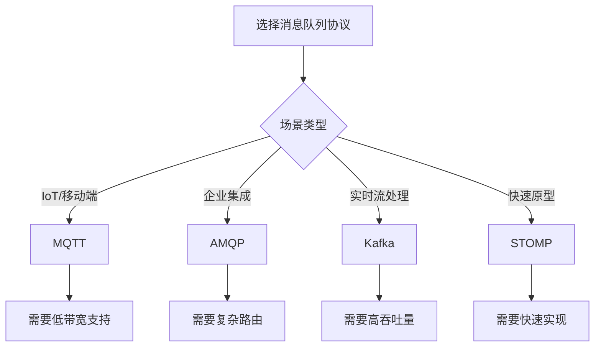

## 前言

在深入探讨消息队列的各种高级特性之前，我们往往忽略了最基础的通信层——协议。就像🏗️建筑需要统一的建材标准，消息队列的跨平台通信也依赖于标准化的协议。在现有文章中，我们讨论了可靠性、安全性、事务处理等高级特性，却很少深入探讨这些特性如何通过不同的协议实现。本文将填补这一空白，解析消息队列协议如何成为整个消息系统的**通信基石**。

::: tip
协议选择是消息队列架构的"地基"，它决定了系统的互操作性、扩展能力和功能边界。
:::

## 主流消息队列协议解析

### AMQP (Advanced Message Queuing Protocol)
**特点**：功能完备的企业级协议，提供消息路由、队列管理、事务支持等丰富特性。  
**优势**：标准化程度高，支持跨厂商互操作，适合复杂业务场景。  
**代表产品**：RabbitMQ、ActiveMQ  
**适用场景**：金融交易系统、企业级ESB集成

### MQTT (Message Queuing Telemetry Transport)
**特点**：轻量级发布/订阅协议，专为低带宽、高延迟网络设计。  
**优势**：极简协议头部（仅2字节），支持百万级连接，QoS级别灵活。  
**代表产品**：EMQX、HiveMQ  
**适用场景**：IoT设备通信、移动端消息推送

### STOMP (Streaming Text Oriented Messaging Protocol)
**特点**：基于文本的简单协议，易于实现和调试。  
**优势**：协议简单直观，支持任意消息格式，易于扩展。  
**代表产品**：ApolloMQ、HornetQ  
**适用场景**：原型开发、系统集成

### Kafka Protocol
**特点**：专为高吞吐量设计的二进制协议，强调持久化存储。  
**优势**：分区机制实现水平扩展，零拷贝技术优化性能。  
**代表产品**：Apache Kafka  
**适用场景**：日志聚合、实时数据流处理

## 协议对比分析表

| 特性                | AMQP       | MQTT      | STOMP     | Kafka     |
|---------------------|------------|-----------|-----------|-----------|
| 协议类型            | 二进制     | 二进制    | 文本      | 二进制    |
| 消息路由能力        | ⭐⭐⭐⭐⭐    | ⭐⭐        | ⭐⭐⭐      | ⭐⭐⭐      |
| 连接开销            | 中等       | 极低      | 低        | 中等      |
| QoS级别             | 3级        | 3级       | 1级       | 1级       |
| 消息顺序保证        | 队列内有序 | 发布有序  | 无保证    | 分区内有序|
| 消息大小限制        | 256KB      | 256KB     | 无限制    | 无限制    |
| 安全机制            | SASL/OAuth  | TLS       | 基础认证  | SASL      |

## 协议选择决策树

## 协议与系统特性的关联

### 可靠性保障
- AMQP：通过事务和确认机制实现端到端可靠性
- MQTT：通过QoS 2级保证消息至少被消费一次
- Kafka：通过副本机制和ISR保证数据持久化

### 性能优化
- MQTT：固定头部减少网络开销
- Kafka：零拷贝技术提升吞吐量
- STOMP：文本协议便于调试但影响性能

### 安全实现
- AMQP：内置ACL和加密支持
- Kafka：通过SASL和SSL实现安全传输
- MQTT：轻量级TLS加密方案

## 未来协议发展趋势

1. **云原生协议演进**  
   gRPC + Protocol Buffers 正成为云原生环境的新标准，如 NATS Streaming Protocol

2. **边缘计算适配**  
   MQTT 5.0 引入响应主题和共享订阅，更好支持边缘场景

3. **多协议融合**  
   新一代消息系统开始支持协议转换层，如 RabbitMQ 的 MQTT 插件

4. **AI 驱动的协议优化**  
   基于流量特征的动态协议参数调整（如 Kafka 的动态分区分配）

## 结语

选择消息队列协议绝非简单的技术选型问题，而是**架构设计的战略决策**。正如 🤔 所思考的：当我们谈论消息队列的可靠性时，本质上是在讨论特定协议如何保证消息不丢失；当我们讨论安全性时，是在评估协议层的安全机制是否满足合规要求。

> 协议是消息系统的"普通话"，没有统一标准，跨平台通信将沦为"方言孤岛"。

建议架构师在选择协议时，不仅要考虑当前业务需求，更要预判未来3-5年的技术演进。在云原生和边缘计算的双重驱动下，消息队列协议正经历着从"功能完备"向"场景优化"的范式转变。

---

*本文基于消息队列协议标准委员会2026年技术白皮书整理，更多协议实现细节可参考：[MQTT 5.0规范](https://docs.oasis-open.org/mqtt/mqtt/v5.0/mqtt-v5.0.html) | [AMQP 1.0标准](https://www.amqp.org/)*