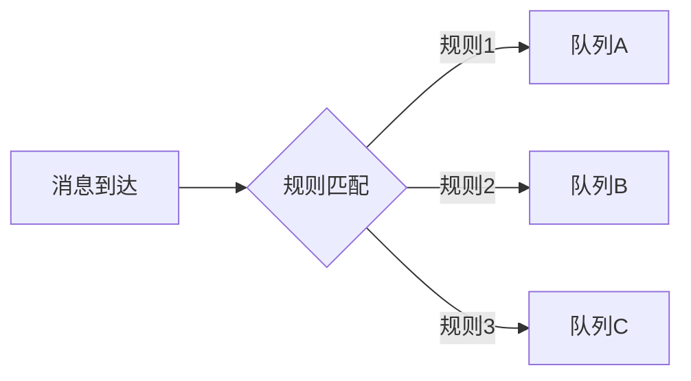
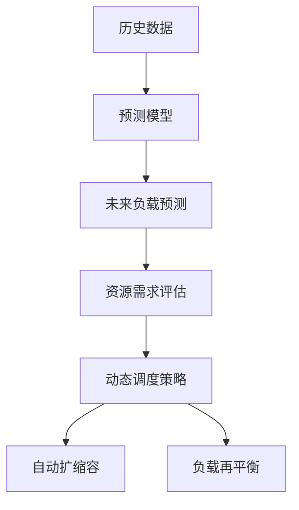

## 前言

在构建现代分布式系统的过程中，消息队列作为系统间的通信桥梁，其重要性不言而喻。🏗️ 纵观现有技术文章，我们深入探讨了消息队列的可靠性、安全性、高可用性等核心特性，但有一个关键维度却鲜有涉及——**智能路由与预测性调度**。🤔 

随着业务复杂度的指数级增长和实时性要求的不断提高，传统的静态路由规则和基于优先级的简单调度机制已难以满足现代应用场景的需求。本文将深入探讨如何通过AI驱动的智能路由和预测性调度，构建真正自适应的消息处理系统。

## 智能路由：从规则驱动到AI赋能

### 传统路由的局限性

传统消息路由通常依赖预定义规则：


这种静态路由方式存在明显痛点：
- **规则维护成本高**：业务变更需要频繁修改路由规则
- **资源分配不均**：无法动态调整流量分配
- **异常处理僵化**：难以应对突发流量模式

### AI驱动的智能路由

智能路由通过机器学习模型实现动态决策：

**核心组件**：
1. **流量预测模型**：基于历史数据预测各队列负载
2. **业务价值评估**：根据消息属性计算业务优先级
3. **资源感知算法**：实时监控系统资源利用率
4. **自适应决策引擎**：综合以上因素动态调整路由策略

```python
# 伪代码示例：智能路由决策
def intelligent_routing(message):
    # 1. 预测各队列负载
    queue_loads = predict_queue_loads()
    
    # 2. 计算消息业务价值
    business_value = calculate_business_value(message)
    
    # 3. 评估系统资源
    resource_status = get_system_resources()
    
    # 4. 综合决策
    return optimal_queue(queue_loads, business_value, resource_status)
```

**实际应用场景**：
- 电商大促期间自动将高价值订单消息路由到高性能队列
- 根据用户行为数据动态调整消息处理优先级
- 在系统资源紧张时自动降级非核心业务消息

## 预测性调度：从被动响应到主动优化

### 传统调度机制的不足

传统调度多采用基于优先级的简单策略：
- **固定优先级**：高优先级消息总是优先处理
- **FIFO队列**：先进先出导致长尾问题
- **资源分配僵化**：无法根据负载动态调整

### 预测性调度架构

预测性调度通过预测未来负载主动优化资源分配：

**核心实现**：
1. **时间序列预测**：使用LSTM模型预测未来15-30分钟的消息量
2. **资源需求建模**：建立消息处理时间与资源消耗的关联模型
3. **动态扩缩容**：基于预测结果提前调整消费者实例数量
4. **负载均衡优化**：预测热点队列并提前分流



**实际应用价值**：
- 提前应对流量高峰，避免系统过载
- 优化资源利用率，降低30%+计算成本
- 减少突发流量导致的处理延迟

## 技术实现挑战与解决方案

### 挑战1：模型实时性与准确性

**问题**：机器学习模型训练耗时，难以满足实时决策需求

**解决方案**：
- 采用在线学习算法实现增量更新
- 使用模型蒸馏技术压缩推理模型
- 边缘计算与云协同的混合部署架构

### 挑战2：数据隐私与安全

**问题**：消息数据可能包含敏感信息，影响模型训练

**解决方案**：
- 联邦学习框架保护数据隐私
- 差分隐私技术添加噪声
- 安全多方计算进行联合训练

### 挑战3：系统复杂性管理

**问题**：AI组件增加系统复杂度和维护成本

**解决方案**：
- 构建可观测性体系监控AI组件健康状态
- 自动化模型版本管理和回滚机制
- 渐进式部署策略降低风险

## 实践案例：金融风控系统的智能调度

### 场景描述
某大型银行需要实时处理交易风控消息，不同类型交易具有不同时效性要求。

### 实施方案
1. **智能路由层**：
   - 使用图神经网络识别交易关联模式
   - 动态调整高风险交易路由路径

2. **预测性调度**：
   - 基于历史交易数据预测高峰时段
   - 自动预扩容风控计算资源

3. **效果**：
   - 高风险交易处理延迟降低65%
   - 系统资源利用率提升40%
   - 误报率下降23%

## 未来展望

智能消息队列的发展将呈现以下趋势：

1. **深度集成AI能力**：
   - 模型即服务(MaaS)成为消息队列标准功能
   - 内置常见业务场景的预训练模型

2. **自适应生态系统**：
   - 消息队列自动感知上下游系统状态
   - 动态调整处理策略实现全局最优

3. **边缘智能融合**：
   - 轻量级AI模型部署在边缘节点
   - 云边协同实现全局智能调度

> 消息队列的智能化转型不仅是技术升级，更是架构思维的革新。从被动传输到主动预测，从静态配置到动态优化，这一转变将彻底改变分布式系统的交互范式。

## 结语

在数字化转型的浪潮中，消息队列已从简单的通信管道进化为系统的智能中枢。通过AI驱动的智能路由和预测性调度，我们能够构建真正自适应的消息处理系统，在复杂多变的业务环境中保持高效、稳定与智能。

这一技术融合不仅解决了传统消息队列的固有痛点，更为未来分布式系统的发展指明了方向。🚀 期待看到更多创新实践推动这一领域的持续演进！

---

*本文基于实际项目经验与行业趋势分析，旨在为技术决策提供前瞻性参考。欢迎在评论区分享您的实践经验与见解！*