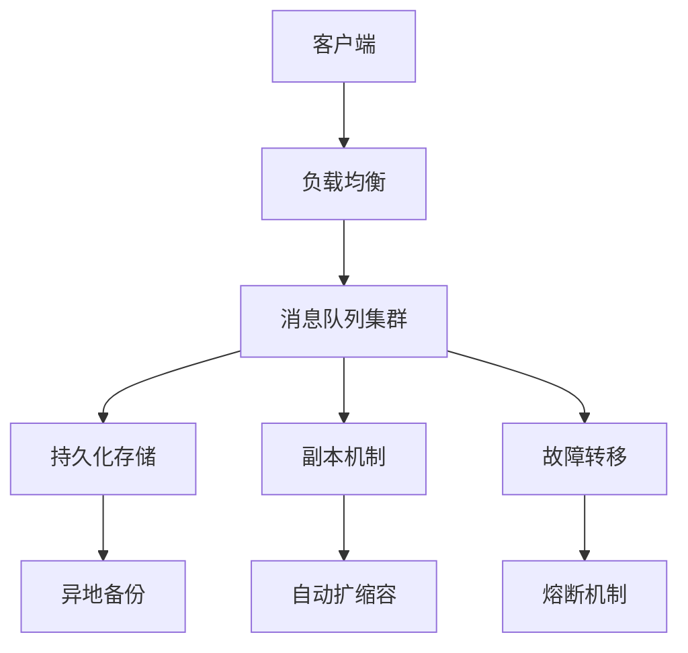

## 前言

作为一名在分布式系统领域摸爬滚打多年的工程师，我经常思考一个问题：我们的系统到底有多"抗打"？🤔 在日常工作中，我们可能更关注系统的性能、吞吐量或者延迟，但当灾难来临时，什么才是真正重要的？

最近，我负责的一个消息队列系统经历了一次"压力测试"——一场突如其来的数据中心故障，让我深刻认识到韧性工程的重要性。今天，我想和大家分享一些关于消息队列韧性工程的心得和最佳实践。

::: tip
韧性工程(Resilience Engineering)关注的是系统在面对各种意外和故障时的适应能力和恢复能力，而不是简单地避免故障。
:::

## 什么是消息队列的韧性工程？

韧性工程不仅仅是"高可用"或"容错"的另一种说法。它是一种更加全面和系统化的方法，关注的是：

1. **预见性**：能够预见可能发生的故障场景
2. **适应性**：在故障发生时能够快速适应
3. **恢复性**：在故障后能够快速恢复
4. **学习能力**：从故障中学习并改进系统

在消息队列的上下文中，韧性工程意味着构建一个能够在各种极端条件下继续提供服务的系统，即使部分组件完全失效。

## 韧性工程的核心原则

### 🛡️ 防御深度原则

单一的保护措施是不够的，我们需要多层次的保护机制。



### 🔄 冗余与隔离原则

关键组件必须有冗余，并且故障能够被隔离，防止级联故障。

### 📊 混沌工程原则

主动引入故障，测试系统的韧性，而不是等待灾难发生。

## 韧性消息队列的设计实践

### 1. 多级冗余架构

传统的"主从"架构已经不够，我们需要设计多级冗余：

```yaml
架构层次:
  - 第一层: 同数据中心多副本
  - 第二层: 跨数据中心同步
  - 第三层: 异地异步备份
  - 第四层: 云端冷存储
```

### 2. 自适应流量控制

在系统压力过大时，需要有机制自动调整流量：

```java
// 伪代码示例：自适应流量控制
public class AdaptiveThrottler {
    private final AtomicInteger currentLimit = new AtomicInteger(1000);
    private final AtomicInteger errorCount = new AtomicInteger(0);
    
    public void execute(Runnable task) {
        if (errorCount.get() > 10) {
            int newLimit = Math.max(100, currentLimit.get() / 2);
            currentLimit.set(newLimit);
        }
        
        try {
            task.run();
            errorCount.set(0);
        } catch (Exception e) {
            errorCount.incrementAndGet();
        }
    }
}
```

### 3. 智能故障转移

不仅仅是简单的故障转移，还需要智能决策：

::: theorem
故障转移决策应考虑：节点健康状态、网络延迟、数据一致性、负载均衡等多个因素。
:::

### 4. 渐进式降级

在系统资源不足时，需要有策略地降级非核心功能：

```yaml
降级策略:
  优先级1: 核心消息传递
  优先级2: 消息确认
  优先级3: 消息追踪
  优先级4: 监控指标
  优先级5: 管理接口
```

## 韧性工程的实践方法

### 1. 故障注入测试

定期进行故障注入测试，模拟各种故障场景：

```bash
# 使用Chaos Mesh进行故障注入
kubectl chaosblade create pod-fault --pod-name=message-queue-1 --namespace=default --action=kill
```

### 2. 红队演练

组建专门的"红队"，模拟攻击者寻找系统弱点。

### 3. 韧性指标监控

建立韧性相关的监控指标：

- 平均恢复时间(MTTR)
- 故警率
- 降级事件频率
- 自动恢复成功率

## 案例分析：从故障中学习

去年，我们系统经历了一次分区故障，导致消息队列集群分裂。由于我们实施了韧性工程策略，系统在15分钟内自动恢复，数据零丢失。

**关键成功因素：**
1. 实现了自动分区检测
2. 设计了优雅降级机制
3. 建立了快速恢复流程
4. 事先进行了充分的演练

## 结语

韧性工程不是一蹴而就的，它是一个持续改进的过程。在当今复杂多变的IT环境中，仅仅保证系统正常运行是不够的，我们需要构建能够在打击下屹立不倒的系统。

> "韧性不是避免风暴的能力，而是在风暴中航行的能力。" —— 未知

通过实施韧性工程，我们不仅能提高系统的可靠性，还能在故障发生时减少业务影响，提升用户体验。记住，最好的系统是那些能够从失败中学习并变得更强的系统。

希望这篇文章能对大家在设计韧性消息队列系统时有所启发。如果你有任何问题或经验分享，欢迎在评论区留言！👇

---

*PS: 下次我会分享如何在现有系统中逐步引入韧性工程实践，敬请期待！* 🚀