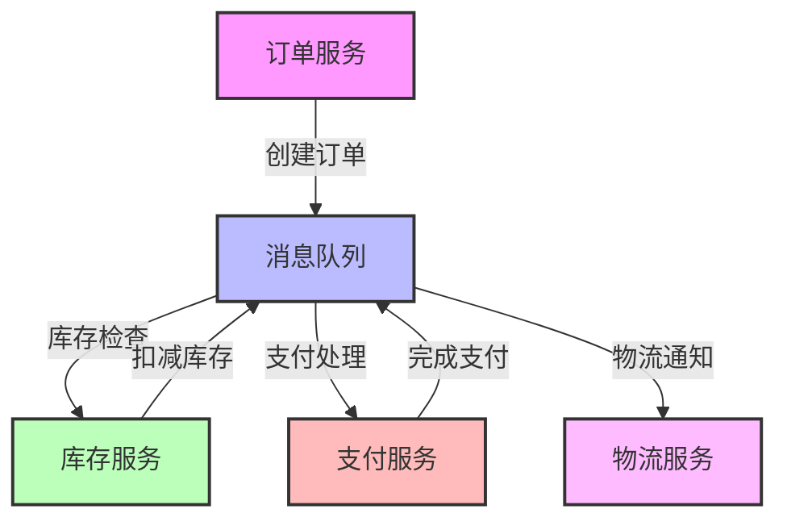

## 前言

作为一名在分布式系统领域摸爬滚打多年的开发者，我经常面临这样的场景：一个消息从生产者发出后，就像进入了一个"黑盒"，我们很难追踪它的完整生命周期。🤔 当系统出现问题时，我们常常只能依靠猜测和日志来定位问题，效率低下且容易出错。

在复杂的微服务架构中，消息的流转路径可能跨越多个服务、多个数据中心，甚至不同的云平台。如果没有有效的元数据管理和消息追踪机制，我们就像在迷雾中航行，难以看清全局。今天，我想和大家分享如何构建强大的消息队列元数据管理与消息追踪系统，让消息流转变得透明可控。

## 为什么元数据管理与消息追踪如此重要？

### 问题的本质

在分布式系统中，消息队列承担着服务间通信的桥梁作用。随着系统复杂度的增加，消息的流转路径变得愈发复杂：

- 一条消息可能经过多个服务处理
- 消息可能被重试、延迟或路由到不同的队列
- 系统可能出现部分失败，导致消息状态不一致

这些问题使得消息的可观测性变得至关重要。没有有效的元数据管理和追踪机制，我们很难回答以下关键问题：

- 消息当前处于什么状态？
- 消息在哪些节点被处理过？
- 消息处理失败的原因是什么？
- 消息的完整流转路径是怎样的？

### 业务价值

良好的元数据管理与消息追踪能力能带来显著的业务价值：

1. **快速故障定位**：当消息处理异常时，能够迅速定位问题节点
2. **性能优化**：通过分析消息流转路径，识别性能瓶颈
3. **合规审计**：满足金融、医疗等行业的审计要求
4. **业务洞察**：了解消息处理的完整流程，优化业务逻辑

## 消息元数据管理的核心要素

### 消息元数据模型设计

构建有效的元数据管理系统，首先需要设计合理的元数据模型。一个完整的消息元数据通常包含以下信息：

```yaml
message_metadata:
  # 基础信息
  message_id: "唯一标识符"
  correlation_id: "关联ID，用于追踪相关消息"
  trace_id: "追踪ID，用于分布式追踪"
  timestamp: "消息创建时间"
  expire_time: "消息过期时间"
  
  # 路由信息
  source_service: "源服务"
  target_service: "目标服务"
  routing_key: "路由键"
  queue_name: "目标队列"
  
  # 状态信息
  status: "状态：待处理/处理中/已完成/失败/重试中"
  retry_count: "重试次数"
  error_message: "错误信息（如果失败）"
  
  # 业务上下文
  business_context: "业务上下文信息"
  user_id: "用户ID"
  transaction_id: "事务ID"
```

### 元数据存储策略

元数据的存储策略需要考虑以下几个关键点：

1. **存储介质选择**：
   - 轻量级元数据可以存储在消息头中
   - 复杂元数据可以存储在外部数据库或专门的元数据服务中
   - 对于需要长期保留的审计信息，可以考虑时序数据库

2. **数据一致性**：
   - 确保元数据更新与消息处理状态保持一致
   - 使用事务机制保证元数据的原子性

3. **性能优化**：
   - 对高频访问的元数据建立索引
   - 考虑使用缓存提高读取性能

## 分布式消息追踪的实现

### 追踪架构设计

分布式消息追踪通常采用以下架构：

```
生产者 → 消息队列 → 消费者
  ↑          ↑          ↑
  |          |          |
追踪上下文  追踪中间件  追踪中间件
```

关键组件包括：

1. **追踪上下文**：在消息中嵌入追踪信息
2. **追踪中间件**：在消息队列客户端中集成追踪逻辑
3. **追踪收集器**：收集各个节点的追踪数据
4. **追踪分析器**：分析追踪数据，生成可视化报告

### 实现技术选型

目前主流的分布式追踪技术包括：

1. **OpenTelemetry**：CNCF托管的开源追踪标准
2. **Jaeger**：Uber开源的分布式追踪系统
3. **Zipkin**：Twitter开源的分布式追踪系统
4. **SkyWalking**：Apache开源的APM工具

以OpenTelemetry为例，实现消息队列追踪的基本流程：

```java
// 生产者端
public void sendMessage(Message message) {
    // 创建追踪span
    Span span = tracer.spanBuilder("send-message")
        .setStartTimestamp(Instant.now())
        .setAttribute("service.name", "order-service")
        .setAttribute("message.type", "order.created")
        .startSpan();
    
    try {
        // 将追踪上下文注入消息头
        TextMapCarrier carrier = new TextMapCarrier();
        propagator.inject(Context.current(), carrier, TextMapSetter.INSTANCE);
        
        message.setHeaders(carrier.getHeaders());
        
        // 发送消息
        messageQueue.send(message);
        
        // 记录发送成功
        span.setAttribute("message.status", "sent");
    } catch (Exception e) {
        // 记录发送失败
        span.recordException(e);
        span.setStatus(StatusCode.ERROR);
        throw e;
    } finally {
        span.end();
    }
}

// 消费者端
public void processMessage(Message message) {
    // 从消息头中提取追踪上下文
    TextMapGetter<Message> getter = new TextMapGetter<>() {
        @Override
        public Iterable<String> keys(Message carrier) {
            return carrier.getHeaders().keySet();
        }
        
        @Override
        public String get(Message carrier, String key) {
            return carrier.getHeaders().get(key);
        }
    };
    
    Context extractedContext = propagator.extract(Context.current(), message, getter);
    
    // 创建子span
    Span span = tracer.spanBuilder("process-message")
        .setParent(extractedContext)
        .setStartTimestamp(Instant.now())
        .setAttribute("service.name", "inventory-service")
        .startSpan();
    
    try {
        // 处理消息
        processBusinessLogic(message);
        
        // 记录处理成功
        span.setAttribute("message.status", "processed");
    } catch (Exception e) {
        // 记录处理失败
        span.recordException(e);
        span.setStatus(StatusCode.ERROR);
        throw e;
    } finally {
        span.end();
    }
}
```

### 追踪数据可视化

追踪数据的价值在于能够直观地展示消息的流转过程。以下是一个典型的消息追踪可视化展示：



通过可视化工具，我们可以清晰地看到：
1. 消息的完整流转路径
2. 每个节点的处理时间
3. 失败节点和错误信息
4. 并发处理情况

## 元数据管理与消息追踪的最佳实践

### 设计原则

1. **最小化侵入**：尽量减少对业务代码的侵入，通过中间件或拦截器实现
2. **性能友好**：追踪元数据的收集不应显著影响系统性能
3. **可扩展性**：设计应能够适应系统规模的增长
4. **安全性**：敏感数据需要加密存储和传输

### 实施步骤

1. **评估需求**：明确业务对元数据管理和追踪的具体需求
2. **技术选型**：根据团队技术栈和需求选择合适的技术方案
3. **架构设计**：设计元数据模型和追踪架构
4. **渐进式实施**：先在核心业务场景中试点，逐步推广到全系统
5. **持续优化**：根据使用反馈不断优化方案

### 常见陷阱与解决方案

1. **元数据过多导致性能问题**：
   - 问题：收集过多元数据会增加系统开销
   - 解决方案：分级收集，核心元数据必须收集，可选元数据按需收集

2. **追踪上下文丢失**：
   - 问题：在异步调用中追踪上下文可能丢失
   - 解决方案：使用上下文传播机制，确保追踪信息在跨服务调用中传递

3. **元数据一致性问题**：
   - 问题：元数据更新与实际消息状态不一致
   - 解决方案：使用事务机制，确保元数据更新与消息处理原子性

4. **追踪数据存储成本高**：
   - 问题：长期存储大量追踪数据成本高昂
   - 解决方案：分级存储，热数据快速查询，冷数据归档

## 未来展望

随着云原生和Serverless架构的普及，消息队列的元数据管理与消息追踪也在不断发展：

1. **AI驱动的异常检测**：利用机器学习自动识别异常消息模式
2. **自适应追踪**：根据系统负载动态调整追踪粒度
3. **跨云追踪**：支持多云环境下的消息追踪
4. **实时分析**：提供实时的消息处理状态分析

> 元数据管理与消息追踪不是一次性的项目，而是一个持续演进的过程。随着系统复杂度的增加，这方面的投入将带来越来越高的回报。在分布式系统中，可观测性已经成为核心竞争力之一，而消息的可观测性则是其中的关键环节。

## 结语

通过构建强大的元数据管理与消息追踪系统，我们可以将消息队列从"黑盒"变为"白盒"，让消息流转过程变得透明可控。这不仅能够提高系统的可维护性，还能为业务优化提供宝贵的数据支持。

作为一名开发者，我们应该将元数据管理与消息追踪视为系统设计的必要组成部分，而不是事后补救的措施。在系统设计之初就考虑这些需求，能够避免后期大量的重构工作。

希望这篇文章能够帮助大家更好地理解和实现消息队列的元数据管理与消息追踪。如果你有任何问题或经验分享，欢迎在评论区交流讨论！🚀