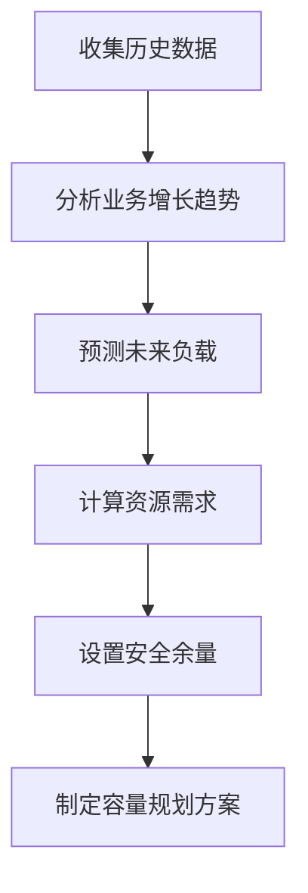

## 前言

在分布式系统架构中，消息队列作为核心组件，承担着系统解耦、异步处理、流量削峰等关键任务。随着业务量的增长和用户规模的扩大，如何合理规划消息队列的容量，并在负载变化时实现弹性伸缩，成为构建高效可扩展消息系统的关键挑战。本文将深入探讨消息队列容量规划与弹性伸缩的策略和实践，帮助读者构建既经济又高效的分布式消息系统。

## 消息队列容量规划的重要性

容量规划是消息队列系统设计的基础环节，直接影响系统的性能、可用性和成本效益。合理的容量规划能够：

1. **避免资源浪费**：避免过度配置导致的资源浪费
2. **保障系统性能**：确保在高负载下系统仍能保持良好性能
3. **提高系统稳定性**：预留足够缓冲应对突发流量
4. **优化成本结构**：在性能和成本之间找到最佳平衡点

## 容量规划的关键指标

在进行消息队列容量规划时，需要关注以下关键指标：

### 1. 吞吐量指标

- **消息生产速率**：单位时间内系统产生的消息数量
- **消息消费速率**：单位时间内系统处理的消息数量
- **峰值吞吐量**：系统需要支持的最大消息处理能力

### 2. 延迟指标

- **端到端延迟**：从消息产生到被处理完成的总时间
- **队列延迟**：消息在队列中等待处理的时间
- **网络延迟**：消息在网络中传输的时间

### 3. 存储指标

- **消息大小分布**：不同大小消息的占比和特征
- **消息保留时间**：消息需要保留在队列中的最长时间
- **存储增长趋势**：存储空间随时间的变化趋势

### 4. 资源指标

- **CPU使用率**：消息队列服务器的CPU占用情况
- **内存使用**：消息队列服务器的内存占用情况
- **磁盘I/O**：磁盘读写操作的频率和数据量

## 容量规划的方法论

### 1. 基于历史数据的容量规划



基于历史数据进行容量规划是常用的方法，主要包括以下步骤：

1. **数据收集**：收集系统运行的历史性能数据
2. **趋势分析**：分析业务增长和负载变化趋势
3. **预测模型**：建立负载预测模型，预测未来系统负载
4. **资源计算**：根据预测负载计算所需资源
5. **安全余量**：考虑突发情况和业务增长，设置适当的安全余量
6. **规划方案**：制定详细的容量规划方案

### 2. 基于SLA的容量规划

服务等级协议(SLA)定义了系统需要满足的性能指标，基于SLA进行容量规划可以确保系统能够满足业务需求。

1. **定义SLA指标**：明确系统需要满足的性能指标，如99.99%的可用性、最大延迟不超过100ms等
2. **性能测试**：在不同负载下测试系统性能，确定系统性能曲线
3. **SLA映射**：将SLA指标映射到具体的资源需求
4. **容量配置**：根据映射结果配置系统容量

### 3. 基于成本优化的容量规划

在满足业务需求的前提下，优化成本是企业关注的重要目标。

1. **成本模型**：建立系统成本模型，包括硬件、软件、人力等成本
2. **资源利用率**：分析当前资源利用率，识别资源浪费
3. **优化策略**：制定资源优化策略，提高资源利用率
4. **成本评估**：评估优化前后的成本差异

## 弹性伸缩的实现策略

弹性伸缩是应对负载变化的关键技术，能够在负载增加时自动扩展资源，在负载减少时自动缩减资源，从而平衡性能和成本。

### 1. 垂直伸缩

垂直伸缩是指增加或减少单个节点的资源（如CPU、内存）。

**优点**：
- 实现简单
- 无需修改应用程序
- 数据迁移成本低

**缺点**：
- 受限于单机最大容量
- 存在单点故障风险
- 扩展性有限

**适用场景**：
- 负载变化相对平稳
- 对单节点性能要求高
- 数据一致性要求严格

### 2. 水平伸缩

水平伸缩是指增加或减少节点数量，通过负载均衡将请求分发到不同节点。

**优点**：
- 扩展性强
- 无单点故障风险
- 成本效益高

**缺点**：
- 实现复杂
- 需要处理数据分片和一致性
- 网络开销增加

**适用场景**：
- 负载变化剧烈
- 对系统可用性要求高
- 数据分片容易实现

### 3. 自动化伸缩策略

自动化伸缩是实现弹性伸缩的关键，包括以下策略：

#### 基于阈值的伸缩

```yaml
# 基于CPU使用率的伸缩策略示例
auto_scaling:
  min_nodes: 2
  max_nodes: 10
  scale_up_threshold: 70%  # CPU使用率超过70%时增加节点
  scale_down_threshold: 30%  # CPU使用率低于30%时减少节点
  cooldown_period: 300  # 伸缩冷却时间(秒)
```

#### 基于预测的伸缩

基于历史数据和机器学习算法预测未来负载变化，提前进行伸缩操作。

```python
# 基于预测的伸缩算法示例
def predictive_scaling(current_load, historical_data, future_prediction):
    if future_prediction > current_load * 1.5:  # 预测负载增加50%以上
        return scale_up(future_prediction / current_load)
    elif future_prediction < current_load * 0.7:  # 预测负载减少30%以上
        return scale_down(current_load / future_prediction)
    else:
        return 1  # 无需伸缩
```

#### 基于时间的伸缩

根据业务周期性变化规律，在特定时间段进行伸缩。

```yaml
# 基于时间的伸缩策略示例
scheduled_scaling:
  - time: "08:00"
    action: scale_up
    node_count: 5
  - time: "20:00"
    action: scale_down
    node_count: 3
```

## 主流消息队列的弹性伸缩实践

### 1. RabbitMQ的弹性伸缩

RabbitMQ支持多种弹性伸缩策略：

- **队列镜像**：通过镜像队列实现高可用，当主节点故障时自动切换到备用节点
- **集群扩展**：动态添加或移除节点，通过rabbitmqctl命令管理
- **插件支持**：使用rabbitmq-autocluster插件实现自动集群管理

```bash
# 添加新节点到RabbitMQ集群
rabbitmqctl -n rabbit@node1 join_cluster rabbit@node2
```

### 2. Kafka的弹性伸缩

Kafka的弹性伸缩主要体现在分区和副本机制上：

- **分区扩展**：增加分区数量可以提高并行处理能力
- **副本重分布**：增加Broker后，可以通过重新分配分区实现负载均衡
- **动态配置**：支持动态调整Broker配置，无需重启服务

```bash
# 增加Kafka分区数
bin/kafka-topics.sh --bootstrap-server localhost:9092 --alter --topic my-topic --partitions 10
```

### 3. RocketMQ的弹性伸缩

RocketMQ提供了丰富的弹性伸缩功能：

- **NameServer集群**：通过NameServer集群实现服务发现和负载均衡
- **Broker集群**：支持动态添加和移除Broker
- **消费者组**：消费者可以动态加入或离开消费者组

```bash
# 添加新的RocketMQ Broker
nohup sh bin/mqbroker -n localhost:9876 -c conf/broker.conf &
```

## 容量规划与弹性伸缩的最佳实践

### 1. 监控与告警

建立完善的监控体系，实时监控系统性能指标，设置合理的告警阈值。

```yaml
# 监控指标示例
monitoring:
  metrics:
    - queue_size
    - message_latency
    - throughput
    - cpu_usage
    - memory_usage
  alerts:
    - metric: queue_size
      threshold: 10000
      condition: ">"
      action: notify
```

### 2. 渐进式部署

采用渐进式部署策略，先在测试环境验证容量规划和伸缩策略，再逐步应用到生产环境。

### 3. 容量测试

定期进行容量测试，验证系统在不同负载下的性能表现，及时调整容量规划。

```java
// 容量测试示例代码
public class CapacityTest {
    public void testThroughput() {
        int messageSize = 1024; // 1KB
        int threadCount = 100;
        int duration = 3600; // 1小时
        
        // 创建生产者和消费者
        Producer producer = new Producer(threadCount, messageSize);
        Consumer consumer = new Consumer(threadCount);
        
        // 运行测试
        producer.start();
        consumer.start();
        
        // 监控性能指标
        Monitor monitor = new Monitor(duration);
        monitor.start();
        
        // 分析结果
        AnalysisResult result = monitor.analyze();
        return result;
    }
}
```

### 4. 文档与知识管理

建立容量规划和弹性伸缩的文档库，记录历史决策、实施经验和最佳实践，形成组织知识资产。

### 5. 跨团队协作

容量规划与弹性伸缩涉及多个团队，需要建立有效的协作机制，确保信息共享和决策一致。

## 未来发展趋势

### 1. AI驱动的智能容量规划

随着人工智能技术的发展，基于机器学习的智能容量规划将成为趋势。通过分析历史数据和实时监控信息，AI可以更准确地预测负载变化，自动生成容量规划方案。

### 2. 多云环境下的弹性伸缩

随着多云和混合云架构的普及，跨云环境的弹性伸缩将成为重要研究方向。如何在多个云服务提供商之间实现无缝的负载迁移和资源调度，是未来需要解决的关键问题。

### 3. 边缘计算的弹性伸缩

随着物联网和边缘计算的发展，消息队列在边缘场景的应用将越来越广泛。边缘环境的资源受限和网络不稳定特性，对弹性伸缩提出了新的挑战。

## 结语

消息队列的容量规划与弹性伸缩是构建高效可扩展分布式系统的关键环节。通过合理的容量规划和智能的弹性伸缩策略，我们可以在保障系统性能的同时，优化资源使用，降低运营成本。随着技术的不断发展，容量规划和弹性伸缩将变得更加智能化和自动化，为企业的数字化转型提供更加强有力的支持。

> "在分布式系统中，容量规划不是一次性的工作，而是一个持续优化的过程。只有不断监控、分析和调整，才能构建真正高效可扩展的消息系统。"