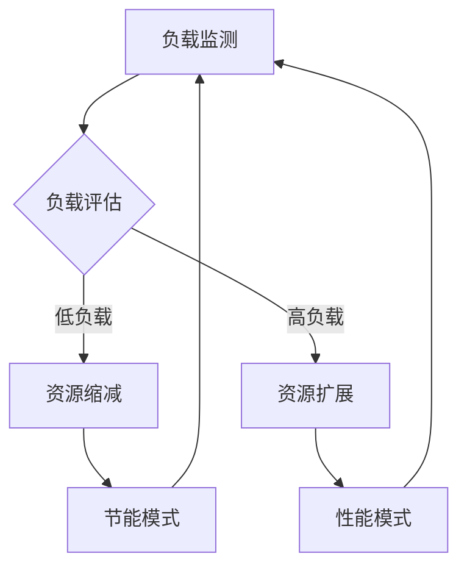

## 前言

随着全球对气候变化和可持续发展的关注日益增加，IT行业的能源消耗和碳足迹问题也逐渐成为焦点。作为现代分布式系统的核心组件，消息队列不仅承担着系统间的通信重任，也在无形中消耗着大量能源。据研究，数据中心已经占全球电力消耗的约2%，并且这一数字仍在快速增长。在这样的大背景下，如何构建绿色、高效、可持续的消息队列系统，已成为每个技术架构师必须思考的问题。

本文将深入探讨消息队列的绿色计算策略，从能源效率优化、碳足迹管理到可持续架构设计，为您提供一套全面的绿色消息系统构建指南。

## 消息队列的能源消耗现状

### 消息队列的能源足迹

消息队列作为系统架构中的关键组件，其能源消耗主要来自以下几个方面：

1. **持续运行的基础设施**：消息队列服务器需要24/7不间断运行，这本身就是巨大的能源消耗。
2. **数据存储与传输**：消息的持久化存储、跨地域传输都需要消耗大量能源。
3. **计算资源消耗**：消息的路由、过滤、转换等处理过程需要CPU资源，直接转化为能源消耗。
4. **网络通信**：消息的发送和接收涉及网络通信，网络设备的能源消耗不容忽视。

研究表明，一个中等规模的企业级消息队列系统，每年可能消耗数万至数十万度电力，相当于数十吨的二氧化碳排放。随着业务规模的扩大，这一数字还会呈指数级增长。

### 行业现状与挑战

当前，大多数企业在构建消息队列系统时，主要关注的是性能、可靠性和可扩展性，而很少考虑能源效率。这导致了许多"绿色盲点"：

- **过度配置**：为了应对峰值负载，往往过度配置资源，导致大量资源在非峰值时段闲置。
- **低效算法**：某些消息处理算法可能不是最优的，导致不必要的计算资源浪费。
- **缺乏监控**：缺乏对能源消耗的有效监控和度量，难以发现和优化能源浪费点。
- **架构设计忽视环保**：架构设计阶段很少考虑能源效率，导致系统整体能效低下。

## 绿色消息队列的设计原则

### 能源效率优先

构建绿色消息队列的首要原则是将能源效率作为核心设计考量，而非事后优化。这需要在系统设计的各个层面都融入绿色思维：

1. **按需分配资源**：根据实际负载动态调整资源分配，避免资源闲置。
2. **算法优化**：选择能源效率更高的算法，如批量处理代替单条处理。
3. **硬件选择**：优先选择能效比高的硬件设备，如低功耗CPU、高效电源等。
4. **冷却优化**：采用先进的冷却技术，如液冷、自然冷却等，降低制冷能耗。

### 生命周期思维

绿色消息队列的设计需要考虑整个系统的生命周期，从硬件采购到系统退役的全过程：

1. **硬件选择**：选择能效高、寿命长的硬件，减少更换频率。
2. **软件优化**：优化软件代码，提高资源利用率。
3. **维护策略**：制定预防性维护策略，延长系统使用寿命。
4. **回收利用**：制定硬件回收和再利用计划，减少电子垃圾。

### 合规与标准遵循

遵循国际和行业的绿色IT标准，确保系统设计符合环保要求：

1. **能效标准**：如欧盟的ERP指令、美国的Energy Star等。
2. **碳足迹标准**：如ISO 14064、GHG Protocol等。
3. **绿色数据中心标准**：如LEED、BREEAM等。
4. **行业最佳实践**：如Green Grid的数据中心基础设施效率(DCIE)等。

## 绿色消息队列的实现策略

### 动态资源调度

动态资源调度是提高消息队列系统能源效率的关键策略之一：

实现动态资源调度的具体方法包括：

1. **基于时间的调度**：根据业务峰谷时段，提前调整资源分配。
2. **基于负载的调度**：实时监控系统负载，动态调整资源。
3. **预测性调度**：利用机器学习预测未来负载趋势，提前调整资源。
4. **多区域调度**：根据不同地区的能源价格和碳排放强度，优化任务分配。

### 消息压缩与序列化优化

消息的传输和存储是能源消耗的主要来源之一，优化消息压缩和序列化可以显著降低能源消耗：

1. **高效压缩算法**：采用如LZ4、Snappy等高压缩比且解压快的算法。
2. **二进制序列化**：使用Protocol Buffers、Avro等二进制序列化格式，减少数据体积。
3. **增量传输**：只传输变化的数据部分，减少网络传输量。
4. **智能压缩**：根据消息类型和内容特点，选择最优的压缩策略。

### 冷热数据分离

通过冷热数据分离策略，可以将不同访问频率的数据存储在不同的介质上，优化能源使用：

1. **热数据SSD存储**：高频访问的热数据存储在低延迟的SSD上，提高处理效率。
2. **冷数据HDD存储**：低频访问的冷数据存储在高容量、低能耗的HDD上。
3. **归档存储**：极低频访问的数据可以归档到能耗更低的存储介质。
4. **智能分层**：根据数据访问模式自动调整数据存储层级。

### 绿色网络架构

网络通信是消息队列系统能源消耗的重要组成部分，优化网络架构可以显著降低能耗：

1. **网络拓扑优化**：设计高效的网络拓扑，减少数据传输距离。
2. **流量工程**：优化数据流路径，避免不必要的网络跳转。
3. **协议优化**：采用如HTTP/2、QUIC等高效网络协议。
4. **边缘计算**：将部分消息处理任务下沉到边缘节点，减少中心网络负载。

## 绿色消息队列的监控与度量

### 能源消耗监控

建立全面的能源消耗监控系统，是实现绿色消息队列的基础：

1. **硬件级监控**：监控服务器、网络设备的能源消耗。
2. **软件级监控**：监控不同服务、进程的能源消耗。
3. **业务级监控**：将能源消耗与业务指标关联，评估能效。
4. **实时仪表盘**：建立能源消耗的实时可视化仪表盘。

### 碳足迹计算

将能源消耗转化为碳足迹，量化系统的环境影响：

1. **能源来源分析**：根据不同地区的能源结构(煤电、水电、风电等)计算碳排放系数。
2. **碳足迹模型**：建立科学的碳足迹计算模型。
3. **减排目标设定**：基于碳足迹设定减排目标和路径。
4. **碳抵消机制**：通过植树造林等方式抵消不可避免的碳排放。

### 能效指标体系

建立科学的能效指标体系，评估和优化系统的绿色程度：

1. **每消息能耗**：处理每条消息所消耗的能源。
2. **每事务能耗**：完成每个事务所消耗的能源。
3. **资源利用率**：CPU、内存、网络等资源的利用率。
4. **PUE(电源使用效率)**：数据中心能源使用效率。

## 绿色消息队列的最佳实践

### Google的绿色实践

Google作为全球最大的技术公司之一，在绿色计算方面有许多值得借鉴的实践：

1. **AI优化数据中心**：利用AI技术优化数据中心冷却和能源使用。
2. **液冷技术**：采用先进的液冷技术，大幅提高散热效率。
3. **可再生能源**：大规模采购可再生能源，降低碳足迹。
4. **全球负载均衡**：根据能源价格和碳排放强度，在全球范围内优化负载分布。

### 阿里云的绿色实践

阿里云在绿色消息队列方面的实践也很有特色：

1. **弹性伸缩**：根据业务负载自动调整资源，避免能源浪费。
2. **多可用区部署**：利用多可用区部署提高资源利用率。
3. **冷热分离存储**：优化数据存储策略，降低能源消耗。
4. **绿色运维**：通过智能化运维减少人为干预，提高系统效率。

### 开源绿色项目

一些开源项目也在推动绿色消息队列的发展：

1. **Apache Kafka的绿色优化**：通过压缩、批处理等技术优化能源使用。
2. **RabbitMQ的能效改进**：优化队列管理和消息处理算法。
3. **绿色消息队列协议**：开发专门针对绿色设计的消息协议。

## 未来展望

### AI驱动的绿色优化

人工智能技术将在绿色消息队列的未来发展中扮演重要角色：

1. **智能资源调度**：利用AI预测负载并优化资源分配。
2. **自适应压缩**：根据数据特性和网络状况自动选择最优压缩策略。
3. **能效预测**：预测系统在不同配置下的能源消耗，辅助决策。
4. **自动优化**：自动发现并修复能源浪费点。

### 新型硬件技术

新型硬件技术将为绿色消息队列带来新的可能：

1. **量子计算**：有望大幅降低某些计算任务的能源消耗。
2. **神经形态计算**：模仿人脑结构的计算方式，能效比更高。
3. **光子计算**：利用光子代替电子进行计算，能效大幅提升。
4. **碳基芯片**：基于碳纳米管的芯片，能效和性能都有显著提升。

### 行业标准与政策

未来，绿色IT标准和政策将更加完善：

1. **强制性能效标准**：可能出台强制性的数据中心能效标准。
2. **碳税政策**：碳税政策将使高能耗系统面临更高的成本。
3. **绿色认证**：绿色IT认证将成为企业竞争力的重要组成部分。
4. **国际合作**：加强国际间在绿色IT领域的合作与标准统一。

## 结语

构建绿色、高效、可持续的消息队列系统，不仅是应对气候变化的责任，也是降低运营成本、提高竞争力的战略选择。通过本文介绍的绿色设计原则、实现策略、监控方法和最佳实践，我们可以显著降低消息队列系统的能源消耗和碳足迹。

随着AI、新型硬件技术和政策标准的不断发展，绿色消息队列将迎来更多创新和突破。作为技术架构师，我们需要将绿色思维融入系统设计的每一个环节，共同构建一个更加可持续的数字未来。

> "我们不是从祖先那里继承了地球，而是向子孙后代借用它。" —— 环保先驱
> 
> 构建绿色消息队列，不仅是对技术的追求，更是对地球的责任。让我们携手前行，用技术创造更美好的未来。