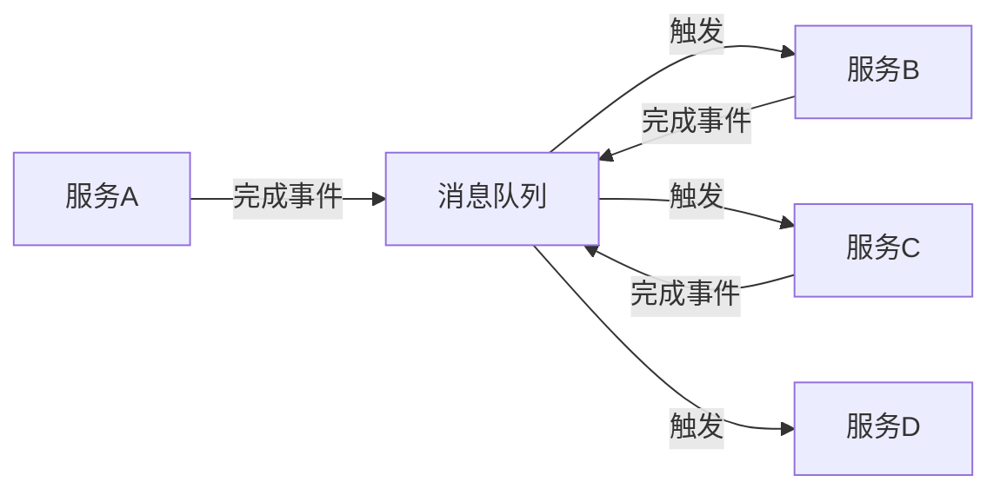

## 前言

在微服务架构的世界里，我们常常面临一个棘手的问题：如何保证跨多个服务的操作要么全部成功，要么全部失败？🤔 这就是分布式事务要解决的核心问题。作为一名在分布式系统摸爬滚打多年的工程师，我亲身经历过因为分布式事务处理不当而导致数据不一致的"惨案"~~(差点被产品经理追杀到天涯海角)~~。

今天，我想和大家深入探讨一种优雅的分布式事务解决方案——Saga模式，以及消息队列如何在这个模式中扮演关键角色。如果你正在构建微服务架构，或者对分布式事务感兴趣，那么这篇文章或许能给你带来一些启发。😉

## 分布式事务的挑战

在单体应用时代，我们可以轻松使用数据库的ACID特性来保证事务的一致性。然而，随着微服务架构的兴起，数据被分散到不同的服务中，传统的ACID事务模型已经无法满足需求。

### 传统ACID事务的局限性

传统ACID事务在分布式环境中面临以下挑战：

1. **性能问题**：分布式事务需要跨网络进行协调，增加了延迟。
2. **可用性降低**：分布式事务需要所有参与方都可用，否则整个事务会失败。
3. **扩展性受限**：随着服务数量的增加，事务协调的复杂度呈指数级增长。
4. **隔离级别难以保证**：在分布式环境中，实现强隔离级别非常困难。

### 分布式事务的CAP理论困境

根据CAP理论，在分布式系统中，我们无法同时满足一致性(Consistency)、可用性(Availability)和分区容错性(Partition tolerance)。这迫使我们做出权衡：

- **CP系统**：优先保证一致性和分区容错性，但可能在网络分区时降低可用性。
- **AP系统**：优先保证可用性和分区容错性，但可能在网络分区时牺牲一致性。

Saga模式提供了一种在AP系统中保证最终一致性的方法，同时通过补偿机制来处理失败情况。

## Saga模式概述

Saga模式是一种长事务的解决方案，它将一个大型事务分解为一系列较小的、独立的子事务。每个子事务都有一个对应的补偿事务，用于在子事务失败时回滚之前已完成的操作。

### Saga模式的基本原理

Saga模式的工作流程如下：

1. 将长事务分解为一系列子事务。
2. 按顺序执行这些子事务。
3. 如果所有子事务都成功，则长事务完成。
4. 如果某个子事务失败，则按相反顺序执行已完成的子事务的补偿事务。

### Saga模式的两种实现方式

Saga模式主要有两种实现方式：

1. **编排式(Choreography)**：每个服务在完成自己的工作后，通过事件触发下一个服务的工作。服务之间松耦合，但协调逻辑分散在各个服务中。
2. **协同式(Orchestration)**：有一个中央协调器负责决定下一步执行哪个服务。协调器集中管理整个事务流程，但可能成为单点故障。

## 消息队列在Saga模式中的作用

消息队列在Saga模式中扮演着至关重要的角色，它为服务间的通信提供了可靠的基础设施。

### 事件驱动架构

消息队列支持事件驱动架构，使得服务间可以通过异步消息进行通信。在Saga模式中，当一个子事务完成时，它会发布一个事件，触发下一个子事务的执行。



### 可靠的事件传递

消息队列提供了可靠的事件传递机制，确保事件不会丢失：

1. **持久化**：消息可以被持久化存储，即使消费者暂时不可用，消息也不会丢失。
2. **重试机制**：消息处理失败时，可以自动重试，直到成功或达到最大重试次数。
3. **死信队列**：对于多次重试仍失败的消息，可以将其转移到死信队列，供后续人工处理。

### 事务性消息

许多消息队列系统提供了事务性消息功能，确保消息的发送和接收是原子性的。这对于保证Saga模式的正确性至关重要。

## 实现一个基于消息队列的Saga模式

让我们通过一个具体的例子来展示如何使用消息队列实现Saga模式。假设我们有一个电商系统，包含订单、库存和支付三个服务。

### 业务场景

用户下单后，需要执行以下操作：
1. 创建订单
2. 扣减库存
3. 处理支付

如果任何一个步骤失败，需要回滚之前已完成的操作。

### 实现步骤

#### 1. 定义事件

首先，我们需要定义一系列事件来表示业务流程中的状态变化：

```java
// 订单相关事件
public class OrderCreatedEvent {
    private String orderId;
    private String userId;
    private List<OrderItem> items;
    // 其他字段和getter/setter
}

public class OrderCancelledEvent {
    private String orderId;
    // 其他字段和getter/setter
}

// 库存相关事件
public class InventoryReservedEvent {
    private String orderId;
    private List<InventoryReservation> reservations;
    // 其他字段和getter/setter
}

public class InventoryReservationFailedEvent {
    private String orderId;
    private String reason;
    // 其他字段和getter/setter
}

// 支付相关事件
public class PaymentProcessedEvent {
    private String orderId;
    private String paymentId;
    // 其他字段和getter/setter
}

public class PaymentFailedEvent {
    private String orderId;
    private String reason;
    // 其他字段和getter/setter
}
```

#### 2. 订单服务实现

订单服务负责创建订单，并在订单创建成功后发布事件：

```java
@Service
public class OrderService {
    
    @Autowired
    private OrderRepository orderRepository;
    
    @Autowired
    private KafkaTemplate<String, Object> kafkaTemplate;
    
    @Transactional
    public Order createOrder(OrderRequest request) {
        // 创建订单
        Order order = new Order();
        // 设置订单属性
        order = orderRepository.save(order);
        
        // 发布订单创建事件
        OrderCreatedEvent event = new OrderCreatedEvent();
        // 设置事件属性
        kafkaTemplate.send("order-events", event);
        
        return order;
    }
    
    @EventListener
    @Transactional
    public void handleOrderCreatedEvent(OrderCreatedEvent event) {
        // 订单已创建，可以执行后续操作
    }
    
    @EventListener
    @Transactional
    public void handlePaymentFailedEvent(PaymentFailedEvent event) {
        // 支付失败，取消订单
        Order order = orderRepository.findById(event.getOrderId()).orElseThrow();
        order.setStatus(OrderStatus.CANCELLED);
        orderRepository.save(order);
        
        // 发布订单取消事件
        OrderCancelledEvent cancelEvent = new OrderCancelledEvent();
        // 设置事件属性
        kafkaTemplate.send("order-events", cancelEvent);
    }
}
```

#### 3. 库存服务实现

库存服务负责处理库存预留和释放：

```java
@Service
public class InventoryService {
    
    @Autowired
    private InventoryRepository inventoryRepository;
    
    @Autowired
    private KafkaTemplate<String, Object> kafkaTemplate;
    
    @EventListener
    @Transactional
    public void handleOrderCreatedEvent(OrderCreatedEvent event) {
        // 尝试预留库存
        try {
            List<InventoryReservation> reservations = reserveInventory(event.getItems());
            
            // 发布库存预留成功事件
            InventoryReservedEvent reserveEvent = new InventoryReservedEvent();
            // 设置事件属性
            kafkaTemplate.send("inventory-events", reserveEvent);
            
        } catch (InventoryException e) {
            // 库存预留失败，发布失败事件
            InventoryReservationFailedEvent failEvent = new InventoryReservationFailedEvent();
            // 设置事件属性
            kafkaTemplate.send("inventory-events", failEvent);
        }
    }
    
    @EventListener
    @Transactional
    public void handleOrderCancelledEvent(OrderCancelledEvent event) {
        // 释放库存
        releaseInventory(event.getOrderId());
    }
    
    private List<InventoryReservation> reserveInventory(List<OrderItem> items) {
        // 实现库存预留逻辑
    }
    
    private void releaseInventory(String orderId) {
        // 实现库存释放逻辑
    }
}
```

#### 4. 支付服务实现

支付服务负责处理支付流程：

```java
@Service
public class PaymentService {
    
    @Autowired
    private PaymentRepository paymentRepository;
    
    @Autowired
    private KafkaTemplate<String, Object> kafkaTemplate;
    
    @EventListener
    @Transactional
    public void handleInventoryReservedEvent(InventoryReservedEvent event) {
        // 库存已预留，开始处理支付
        try {
            Payment payment = processPayment(event.getOrderId());
            
            // 发布支付成功事件
            PaymentProcessedEvent successEvent = new PaymentProcessedEvent();
            // 设置事件属性
            kafkaTemplate.send("payment-events", successEvent);
            
        } catch (PaymentException e) {
            // 支付失败，发布失败事件
            PaymentFailedEvent failEvent = new PaymentFailedEvent();
            // 设置事件属性
            kafkaTemplate.send("payment-events", failEvent);
        }
    }
    
    private Payment processPayment(String orderId) {
        // 实现支付处理逻辑
    }
}
```

### 协调模式的选择

上述示例采用的是编排式(Choreography)Saga模式，每个服务监听其他服务发布的事件并做出相应反应。这种方式的好处是服务间松耦合，但协调逻辑分散在各个服务中。

对于更复杂的业务流程，我们可以考虑采用协同式(Orchestration)Saga模式，引入一个专门的协调服务：

```java
@Service
public class SagaOrchestrator {
    
    @Autowired
    private KafkaTemplate<String, Object> kafkaTemplate;
    
    @Autowired
    private OrderService orderService;
    
    @Autowired
    private InventoryService inventoryService;
    
    @Autowired
    private PaymentService paymentService;
    
    public void startOrderSaga(OrderRequest request) {
        // 创建订单
        Order order = orderService.createOrder(request);
        
        // 等待订单创建完成
        // ...
        
        // 触发库存预留
        kafkaTemplate.send("order-events", new OrderCreatedEvent());
        
        // 等待库存预留完成
        // ...
        
        // 触发支付处理
        kafkaTemplate.send("inventory-events", new InventoryReservedEvent());
        
        // 等待支付处理完成
        // ...
    }
}
```

## Saga模式的最佳实践

在实现Saga模式时，以下最佳实践可以帮助你构建更可靠、更易维护的系统：

### 1. 保持幂等性

由于消息可能会被重试，每个事件处理器应该是幂等的，即多次处理同一事件不会导致副作用。

```java
@EventListener
@Transactional
public void handleOrderCreatedEvent(OrderCreatedEvent event) {
    // 检查订单是否已处理
    if (orderRepository.isOrderProcessed(event.getOrderId())) {
        return;
    }
    
    // 处理订单创建逻辑
    // ...
}
```

### 2. 实现超时和重试机制

为每个子事务设置合理的超时时间，并实现重试机制，以提高系统的可靠性。

```java
@Retryable(value = {Exception.class}, maxAttempts = 3, backoff = @Backoff(delay = 1000))
@EventListener
@Transactional
public void handleOrderCreatedEvent(OrderCreatedEvent event) {
    // 处理订单创建逻辑
    // ...
}
```

### 3. 使用补偿事务

对于每个子事务，实现相应的补偿事务，以便在事务失败时进行回滚。

```java
@EventListener
@Transactional
public void handlePaymentFailedEvent(PaymentFailedEvent event) {
    // 支付失败，取消订单
    Order order = orderRepository.findById(event.getOrderId()).orElseThrow();
    order.setStatus(OrderStatus.CANCELLED);
    orderRepository.save(order);
    
    // 发布订单取消事件
    OrderCancelledEvent cancelEvent = new OrderCancelledEvent();
    kafkaTemplate.send("order-events", cancelEvent);
}
```

### 4. 监控和追踪

实现完善的监控和追踪机制，以便及时发现和解决问题。

```java
@EventListener
@Transactional
public void handleOrderCreatedEvent(OrderCreatedEvent event) {
    // 记录开始处理事件
    metrics.counter("order.created").increment();
    
    try {
        // 处理订单创建逻辑
        // ...
        
        // 记录处理成功
        metrics.counter("order.created.success").increment();
        
    } catch (Exception e) {
        // 记录处理失败
        metrics.counter("order.created.failed").increment();
        throw e;
    }
}
```

## Saga模式的优缺点分析

### 优点

1. **最终一致性**：Saga模式允许系统在最终达到一致状态，而不需要所有操作同时完成。
2. **高可用性**：由于不需要所有参与方同时可用，Saga模式具有更高的可用性。
3. **可扩展性**：Saga模式可以轻松扩展到更多的服务和更复杂的业务流程。
4. **业务友好**：Saga模式与业务流程紧密对应，易于理解和实现。

### 缺点

1. **临时不一致**：在Saga执行过程中，系统可能处于临时不一致的状态。
2. **补偿复杂性**：实现补偿事务可能比较复杂，特别是在有状态变化的情况下。
3. **事务隔离问题**：Saga模式无法提供传统ACID事务的隔离级别。
4. **调试困难**：由于事件驱动的异步特性，调试Saga模式的事务流程可能比较困难。

## 结论

Saga模式为分布式系统提供了一种优雅的解决方案，使得我们可以在保证最终一致性的同时，构建高可用、可扩展的系统。消息队列作为Saga模式的核心组件，通过可靠的事件传递机制，为服务间的通信提供了坚实的基础。

在实际应用中，我们需要根据业务需求和系统特点，选择合适的Saga实现方式（编排式或协同式），并遵循最佳实践来构建可靠的Saga模式实现。

虽然Saga模式不是万能的，它在某些场景下可能不如传统的ACID事务，但它为我们提供了一种在分布式系统中管理复杂业务流程的有效方法。在微服务架构日益普及的今天，掌握Saga模式对于构建可靠的分布式系统至关重要。

> "在分布式系统中，没有银弹。Saga模式为我们提供了一种在一致性、可用性和性能之间取得平衡的优雅方案。"

如果你正在构建微服务架构，或者面临分布式事务的挑战，不妨尝试使用Saga模式，它可能会给你带来意想不到的惊喜。😊

---

**相关阅读：**

- [消息队列的可靠性保证-如何确保消息不丢失-不重复](https://jorgen-zhao.github.io/blog/message_queue/69)
- [消息队列的事务消息与可靠性保证](https://jorgen-zhao.github.io/blog/message_queue/65)
- [消息队列与微服务架构的集成-构建分布式系统的通信基石](https://jorgen-zhao.github.io/blog/message_queue/222)