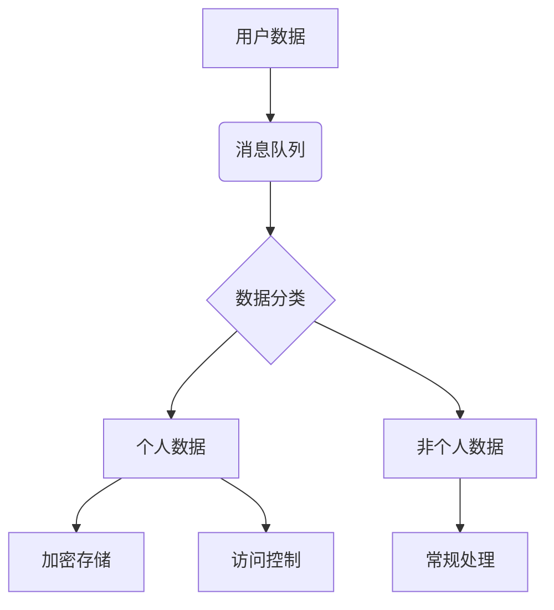

## 前言

在当今全球化的数字环境中，企业构建的消息队列系统不仅要满足技术需求，还必须应对日益复杂的数据保护法规。🌍 作为一名在分布式系统领域摸爬滚打多年的开发者，我亲历了从"先上线后合规"到"合规驱动设计"的转变过程。今天，我想和大家深入探讨消息队列系统在合规性方面的关键考量。

::: tip
合规不是项目的附加功能，而是架构设计的核心要素。在消息队列系统中，合规性应当从设计之初就融入系统DNA。
:::

## 全球数据保护法规对消息队列的影响

### GDPR与消息队列数据治理

欧盟的《通用数据保护条例》(GDPR)对数据处理提出了严格要求，这对消息队列系统产生了深远影响：

1. **数据主体权利支持**：消息系统必须能够响应用户的"被遗忘权"请求，及时删除相关数据。
2. **数据最小化原则**：只收集和传输处理业务所必需的数据。
3. **目的限制**：确保数据仅用于指定目的，不得二次利用。



### CCPA与加州消费者隐私法案

美国加州的《消费者隐私法案》(CCPA)赋予消费者更多控制权，对消息队列的影响包括：

- **数据删除请求**：系统必须能够识别并删除消费者数据
- **数据知情权**：记录数据传输的完整路径
- **禁止销售**：明确标识数据是否会被出售给第三方

## 消息队列合规架构设计

### 数据分类与标记机制

构建合规的消息队列系统，首先需要建立完善的数据分类机制：

| 数据类型 | 处理要求 | 存储期限 | 访问控制 |
|---------|---------|---------|---------|
| 个人身份信息(PII) | 加密传输，最小化收集 | 按需保留，定期审查 | 严格访问控制 |
| 敏感财务数据 | 传输加密，审计日志 | 最短必要期限 | 多因素认证 |
| 一般业务数据 | 标准处理 | 按业务需求 | 常规权限 |
| 公开数据 | 无特殊限制 | 按政策保留 | 基本访问 |

### 合规审计追踪

消息队列系统必须记录完整的审计日志，包括：

- 数据接收时间与来源
- 数据处理操作详情
- 数据接收方信息
- 数据访问尝试记录

```python
# 示例：合规审计日志记录
def log_compliance_event(event_type, data_id, user, action):
    audit_log = {
        "timestamp": datetime.now(),
        "event_type": event_type,
        "data_id": data_id,
        "user": user,
        "action": action,
        "ip_address": request.remote_addr
    }
    compliance_db.insert(audit_log)
```

## 行业特定合规要求

### 医疗行业：HIPAA合规

医疗健康信息必须遵循《健康保险可携性和责任法案》(HIPAA)：

- **数据加密**：传输中和静态数据都必须加密
- **访问控制**：基于角色的细粒度权限控制
- **审计追踪**：记录所有数据访问和修改

### 金融行业：PCI DSS合规

支付卡行业数据安全标准(PCI DSS)对消息队列的要求：

- **卡数据保护**：禁止在消息中传输完整的卡号
- **网络分段**：消息系统与公共网络隔离
- **安全测试**：定期进行渗透测试和漏洞扫描

## 技术实现策略

### 数据脱敏与匿名化

在消息传输过程中实施数据脱敏策略：

```javascript
// 示例：消息数据脱敏函数
function anonymizeMessage(message) {
    const sensitiveFields = ['ssn', 'creditCard', 'email'];
    const anonymized = {...message};
    
    sensitiveFields.forEach(field => {
        if (anonymized[field]) {
            anonymized[field] = maskSensitiveData(anonymized[field]);
        }
    });
    
    return anonymized;
}
```

### 合规性检查点

在消息处理流程中设置合规性检查点：

1. **数据接收检查**：验证数据格式和内容是否符合合规要求
2. **传输过程监控**：确保数据在整个传输过程中保持加密状态
3. **接收端验证**：确认接收方有合法权限处理该数据

## 合规工具与最佳实践

### 合规管理工具

使用专门的工具管理消息队列的合规性：

- **数据发现工具**：自动识别消息中的敏感数据
- **合规性监控平台**：实时监控合规状态
- **自动化报告生成**：生成合规性报告供审计使用

### 最佳实践总结

1. **隐私设计**：将隐私保护作为系统设计的核心要素
2. **数据最小化**：只收集和处理必要的数据
3. **透明度**：向用户清晰说明数据使用方式
4. **持续监控**：建立持续的合规性监控机制
5. **定期审计**：定期进行合规性审计和风险评估

## 结语

构建合规的消息队列系统不仅是法律要求，更是企业建立用户信任的基础。🔒 在我多年的实践中，我发现将合规性融入系统架构而非事后添加，能够显著降低长期合规成本。随着全球数据保护法规的不断演进，消息队列系统的合规性设计将变得越来越重要。

> "合规不是障碍，而是创新的机会。当我们将合规要求转化为系统设计的指导原则时，我们不仅能满足法律要求，还能创造出更加安全、可信的数字生态系统。" —— 数据隐私专家观点

---

通过这篇文章，我们深入探讨了消息队列系统在全球数据保护法规下的合规要求。希望这些内容能够帮助各位开发者和架构师在构建消息队列系统时更好地考虑合规性因素，确保系统既满足技术需求，又符合法律要求。