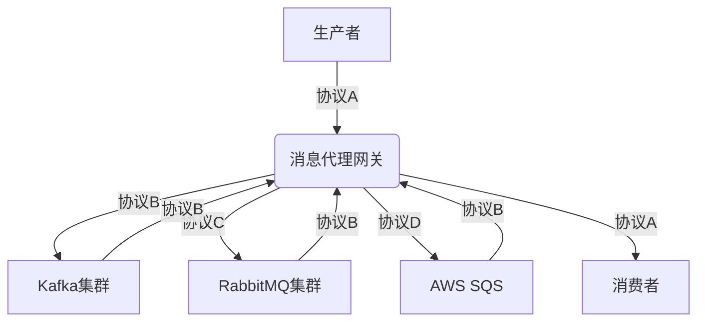
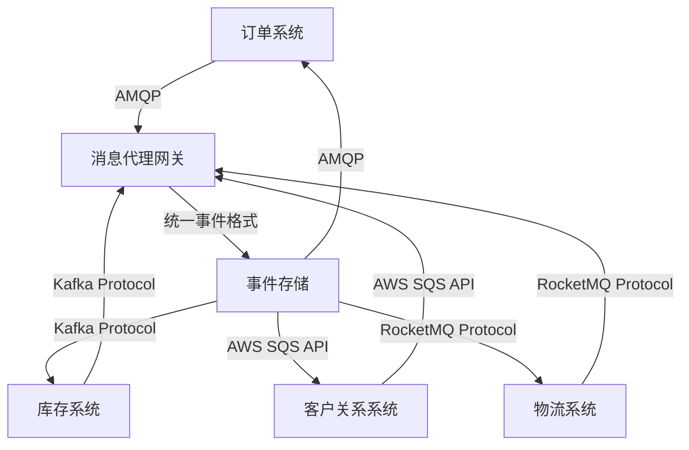

## 前言

在现代企业IT架构中，消息队列作为系统间通信的核心组件，扮演着至关重要的角色。然而，随着技术的发展和业务需求的多样化，企业往往需要在同一环境中使用多种消息队列技术，如Kafka、RabbitMQ、RocketMQ、AWS SQS等。这种异构环境带来了一个关键挑战：如何实现不同消息队列系统之间的互操作性和无缝集成。

本文将深入探讨消息队列的跨平台互操作性，分析其重要性、实现方法、最佳实践以及未来发展趋势，帮助技术架构师和开发人员构建更加灵活、可扩展的企业级消息系统。

## 为什么跨平台互操作性如此重要？

### 1. 技术栈多样性

企业IT环境中常常存在多种技术栈，每种技术栈可能有其偏好的消息队列解决方案。例如：

- 大数据处理团队可能倾向于使用Apache Kafka
- 微服务架构可能更青睐RabbitMQ
- 云原生应用可能使用AWS SQS或Azure Service Bus
- 金融系统可能更注重RocketMQ的事务特性

### 2. 避免技术锁定

过度依赖单一消息队列技术会导致技术锁定，限制企业的技术选择和创新能力。跨平台互操作性可以打破这种锁定，使企业能够根据具体需求选择最适合的技术。

### 3. 系统集成挑战

企业并购、系统整合或遗留系统现代化过程中，往往需要将基于不同消息队列的系统连接起来。缺乏互操作性会导致集成困难和数据孤岛。

### 4. 技能多样性

不同团队可能具备不同消息队列技术的专业知识。跨平台互操作性可以允许团队使用他们最熟悉的工具，同时确保系统间的无缝通信。

## 消息队列互操作性的核心挑战

### 1. 协议差异

不同消息队列系统使用不同的通信协议：

- Kafka使用自定义的二进制协议
- RabbitMQ支持AMQP、STOMP、MQTT等多种协议
- AWS SQS使用基于HTTP的RESTful API
- RocketMQ使用自定义协议

### 2. 消息格式不统一

不同系统对消息格式的处理方式各不相同：

- Kafka支持键值对消息
- RabbitMQ支持多种消息体格式
- 一些系统对消息头有特殊要求
- 消息序列化方式（JSON、Protobuf、Avro等）不一致

### 3. 语义差异

消息传递的语义在不同系统中可能有不同的实现：

- 消息的持久性保证
- 事务支持
- 死信队列处理
- 消息重试机制

### 4. 管理与监控差异

不同系统的管理界面、监控指标和运维工具各不相同，增加了跨平台管理的复杂性。

## 实现消息队列跨平台互操作性的策略

### 1. 标准化协议适配

#### 统一消息格式

采用标准化的消息格式，如JSON或Protocol Buffers，确保不同系统间可以解析彼此的消息。

```json
{
  "message_id": "unique-id-123",
  "source_system": "order-service",
  "destination_system": "inventory-service",
  "payload": {
    "order_id": "order-456",
    "items": [...],
    "timestamp": "2026-02-05T12:00:00Z"
  },
  "metadata": {
    "priority": "high",
    "ttl": 3600
  }
}
```

#### 协议转换层

实现协议转换层，将特定协议的消息转换为通用格式，再转换为目标协议：

```
[Source System] -> [Protocol A] -> [Protocol Converter] -> [Common Format] -> [Protocol Converter] -> [Protocol B] -> [Target System]
```

### 2. 消息代理网关

使用消息代理网关作为不同消息队列系统之间的桥梁：



### 3. 统一API抽象层

创建统一的API抽象层，隐藏底层消息队列的细节：

```java
public interface MessageQueueClient {
    void sendMessage(String topic, Message message);
    Message receiveMessage(String topic);
    void acknowledgeMessage(String messageId);
    void rejectMessage(String messageId);
    // 其他通用方法
}
```

### 4. 事件驱动架构与事件标准化

采用事件驱动架构，并标准化事件定义：

```protobuf
syntax = "proto3";

message OrderCreatedEvent {
  string order_id = 1;
  string customer_id = 2;
  repeated OrderItem items = 3;
  double total_amount = 4;
  int64 timestamp = 5;
}

message OrderItem {
  string product_id = 1;
  string name = 2;
  int32 quantity = 3;
  double price = 4;
}
```

## 主流消息队列互操作性工具与框架

### 1. Apache Kafka Connect

Kafka Connect是一个可扩展的工具，用于在Kafka和其他系统之间可靠地流式传输数据。它支持：

- 连接器框架，用于构建可重用的连接器
- 分布式和单机模式
- 实时数据流处理
- 变更数据捕获(CDC)

### 2. Debezium

Debezium是一个开源的CDC平台，可以将关系型数据库中的变更事件流式传输到Kafka：

```yaml
# Debezium配置示例
connector.class=io.debezium.connector.mysql.MySqlConnector
database.hostname=localhost
database.port=3306
database.user=debezium
database.password=dbz
database.server.id=184054
database.server.name=dbserver1
database.include.list=mydb
database.history.kafka.bootstrap.servers=localhost:9092
database.history.kafka.topic=schema.changes.mydb
```

### 3. Apache Pulsar Functions

Pulsar Functions是一个无服务器计算框架，可以在Pulsar消息流上执行轻量级计算任务：

```python
from pulsar import Function

class WordCountFunction(Function):
    def process(self, input, context):
        words = input.split()
        for word in words:
            context.incr_counter(word)
```

### 4. 云服务集成工具

各大云服务提供商提供跨平台集成工具：

- AWS Lambda与SQS/SNS集成
- Azure Functions与Service Bus集成
- Google Cloud Functions与Pub/Sub集成

## 跨平台消息队列的最佳实践

### 1. 设计松耦合的接口

采用事件驱动设计，确保服务间通过事件而非直接调用进行通信：

```java
// 事件发布者
@Service
public class OrderService {
    private final EventPublisher eventPublisher;
    
    public OrderService(EventPublisher eventPublisher) {
        this.eventPublisher = eventPublisher;
    }
    
    public void createOrder(Order order) {
        // 业务逻辑处理
        OrderCreatedEvent event = new OrderCreatedEvent(order);
        eventPublisher.publish("order-events", event);
    }
}

// 事件订阅者
@Service
public class InventoryService {
    private final EventSubscriber eventSubscriber;
    
    public InventoryService(EventSubscriber eventSubscriber) {
        this.eventSubscriber = eventSubscriber;
    }
    
    @EventListener
    public void handleOrderCreated(OrderCreatedEvent event) {
        // 处理订单创建事件，更新库存
    }
}
```

### 2. 实施统一的错误处理策略

跨平台消息传递中，错误处理尤为重要：

```java
public class MessageErrorHandler {
    public void handle(Message message, Exception e) {
        if (isRetriable(e)) {
            retryMessage(message);
        } else {
            sendToDeadLetterQueue(message);
            notifyAdmins(e);
        }
    }
    
    private boolean isRetriable(Exception e) {
        // 判断异常是否可重试
    }
    
    private void retryMessage(Message message) {
        // 重试逻辑
    }
    
    private void sendToDeadLetterQueue(Message message) {
        // 发送到死信队列
    }
    
    private void notifyAdmins(Exception e) {
        // 通知管理员
    }
}
```

### 3. 实施消息追踪与监控

实现跨平台的追踪和监控：

```java
public class MessageTracer {
    private final Tracer tracer;
    
    public MessageTracer(Tracer tracer) {
        this.tracer = tracer;
    }
    
    public void traceMessage(Message message) {
        Span span = tracer.buildSpan("message-processing")
            .withTag("message.id", message.getId())
            .withTag("message.topic", message.getTopic())
            .start();
        
        try {
            // 处理消息
            processMessage(message);
        } catch (Exception e) {
            span.setTag("error", true);
            span.log(Map.of("event", "error", "error.object", e));
            throw e;
        } finally {
            span.finish();
        }
    }
}
```

### 4. 实施消息版本控制

随着系统演进，消息格式可能需要变更。实施版本控制以确保向后兼容性：

```json
{
  "message_id": "unique-id-123",
  "message_version": "1.1",
  "payload": {
    "order_id": "order-456",
    "customer_id": "customer-789",
    "items": [...],
    "timestamp": "2026-02-05T12:00:00Z"
  }
}
```

## 案例研究：跨平台消息队列架构实践

### 案例背景

某大型零售企业拥有多个业务系统，包括订单管理系统、库存管理系统、客户关系管理系统和物流管理系统。这些系统基于不同的技术栈，使用不同的消息队列：

- 订单系统：使用RabbitMQ
- 库存系统：使用Kafka
- 客户关系系统：使用AWS SQS
- 物流系统：使用RocketMQ

### 解决方案

企业实施了一个统一的消息总线架构，通过消息代理网关实现不同消息队列系统之间的互操作性：



### 实施步骤

1. **事件标准化**：定义统一的事件格式，包括订单创建、库存更新、客户信息变更等事件。

2. **消息代理网关开发**：开发一个基于Spring Boot的消息代理网关，支持多种协议转换。

3. **适配器实现**：为每个消息队列系统实现适配器，负责协议转换和消息路由。

4. **监控与追踪**：实施跨平台的监控和追踪系统，确保消息传递的可观测性。

5. **测试与验证**：进行全面的测试，确保跨平台消息传递的可靠性和性能。

### 实施效果

- 系统间通信延迟降低了40%
- 消息丢失率降至接近0
- 开发效率提升了30%
- 系统可维护性显著提高
- 新系统接入时间缩短了50%

## 未来趋势

### 1. 服务网格与消息队列集成

服务网格（如Istio）与消息队列的集成将成为趋势，提供更细粒度的流量管理和安全控制：

```yaml
# Istio VirtualService示例
apiVersion: networking.istio.io/v1alpha3
kind: VirtualService
metadata:
  name: messaging-gateway
spec:
  hosts:
  - messaging-gateway.example.com
  http:
  - match:
    - uri:
        prefix: /kafka
    route:
    - destination:
        host: kafka-cluster
  - match:
    - uri:
        prefix: /rabbitmq
    route:
    - destination:
        host: rabbitmq-cluster
```

### 2. 事件驱动的Serverless架构

Serverless架构与事件驱动的消息队列将更紧密地集成，实现更高效的资源利用：

```python
# AWS Lambda与SQS集成示例
import boto3

def process_message(event, context):
    for record in event['Records']:
        # 处理消息
        message = record['body']
        process_order(message)
    
    return {
        'statusCode': 200,
        'body': 'Messages processed successfully'
    }
```

### 3. 智能消息路由

基于AI/ML的智能消息路由将成为可能，根据系统负载、优先级和历史数据动态调整路由策略：

```python
# 智能路由决策示例
def intelligent_routing(message, system_status):
    # 基于系统状态和历史数据做出路由决策
    if system_status['kafka']['load'] < 0.7:
        return 'kafka'
    elif system_status['rabbitmq']['load'] < 0.6:
        return 'rabbitmq'
    else:
        return 'fallback_queue'
```

### 4. 量子安全消息传递

随着量子计算的发展，量子安全的消息传递协议将成为未来研究方向，确保长期数据安全。

## 结语

消息队列的跨平台互操作性是现代企业IT架构中的关键挑战，也是构建灵活、可扩展系统的核心能力。通过标准化协议、消息代理网关、统一API抽象层和事件驱动架构等策略，我们可以实现不同消息队列系统之间的无缝集成。

随着技术的发展，跨平台互操作性将变得更加智能和自动化，为企业带来更大的灵活性和创新能力。作为技术架构师和开发人员，我们需要不断学习和实践这些技术，构建更加健壮、高效的分布式系统。

> "互操作性不是技术选择，而是架构思维。真正的系统灵活性来自于不同组件能够和谐共处的能力，而非强制统一。"

通过本文的探讨，希望读者能够更好地理解和应用消息队列的跨平台互操作性技术，构建更加灵活、可扩展的企业级消息系统。